# Figures from the papers behind these notes

Every figure this source's cited papers publish, paired to the notes that cite them. **455 figures across 132 papers**, of which **277 look like plotted results** rather than diagrams or photographs. **392 images (34 MB) from 108 openly licensed papers are stored in [figures/](figures/)**; the rest are listed with a link to the publisher's copy.

**Before you reuse one, read [figures/README.md](figures/README.md).** Stored figures are Creative Commons and need attribution; the linked ones are not ours to redistribute.

Where a figure is stored, the path is relative to this file, so it renders inline in any markdown viewer and can be dropped straight into a page.

---

## Notes with a stored figure

The ones you can actually display. Everything else is further down.

- [10 Fitness Myths Busted (Myth-Busting Season 1 Recap, Part 1)](10-fitness-myths-busted-10-minutes.md) — 4 images
- [Five "Superfoods" Worth Eating, and the Science Behind Each](5-superfoods-recently-added-diet.md) — 3 images
- [7 More Fitness Myths Busted (Myth-Busting Season 1 Recap, Part 2)](7-fitness-myths-completely-busted-science.md) — 11 images
- [8 More Fitness Myths Busted (Myth-Busting Season 1 Recap, Part 3)](8-common-fitness-myths-busted.md) — 44 images
- [Advanced Techniques and Training Volume with Dr. Brad Schoenfeld](advanced-techniques-supersets-dropsets-eccentrics.md) — 3 images
- [Alcohol's Effect on Fat Loss, Muscle Growth and Testosterone](alcohol-impact-fat-loss-muscle-testosterone.md) — 14 images
- [How Alcohol Influences Muscle and Fat Gain (10 Studies)](alcohol-influences-muscle.md) — 7 images
- [Is Obesity a Choice? Genetics, Environment and the Limits of Willpower](being-fat-choice.md) — 1 image
- [Minimalist Full-Body Training Plan: Two Sessions Under 45 Minutes](best-minimalist-workout-plan.md) — 8 images
- [Chest Exercises Ranked: Top 10 Best and 3 Worst](best-worst-chest-exercises-build-muscle.md) — 1 image
- [Biceps Exercises Ranked S–F: What Actually Builds Arms](biceps-exercises-ranked.md) — 3 images
- [Body Recomposition: Building Muscle and Losing Fat at the Same Time](body-recomposition.md) — 13 images
- [Is Breakfast the Most Important Meal of the Day?](breakfast-most-important-meal-day.md) — 6 images
- [Bro Science vs Real Science: Bret Contreras on Mind-Muscle, EMG, Failure and Volume](bro-science-vs-real-science.md) — 3 images
- [Bro Splits vs Higher Frequency: What the Frequency Research Actually Supports](bro-splits-vs-higher-frequency.md) — 5 images
- [Cable Glute Kickback: Technique for Isolated Hip Extension](build-bigger-glutes-perfect-training-technique.md) — 4 images
- [Body Recomposition: Building Muscle While Losing Fat](build-muscle-lose-fat-same-time.md) — 4 images
- [How Muscle Growth Works, From Basics to Molecular Signalling (5 Levels)](build-muscle.md) — 11 images
- [Calf Training: Gastroc vs Soleus, Exercise Choice, and How Much Volume](calf-training.md) — 4 images
- [Cardio for Fat Loss: Five Mistakes, and How Much to Actually Do](cardio-for-fat-loss.md) — 6 images
- [Acute Testosterone Spikes Don't Build Muscle (The Wood-Chopping Study)](chopping-wood-before-training-boosts-testosterone-48.md) — 4 images
- [Creatine: Dosing, Loading, Timing, Non-Responders and the Hair Loss Question](creatine.md) — 19 images
- [100 Days of Low-Volume Training: What Halving Your Sets Actually Does](cut-number-sets-half.md) — 3 images
- [The Health Risks Behind the Decision to Use Steroids](decision-use-steroids.md) — 5 images
- [Do Diet Breaks Improve Fat Loss and Protect Metabolism?](diet-breaks-improve-fat-loss-metabolism.md) — 4 images
- [You Don't Need 8 Glasses of Water a Day (and Coffee Does Count)](don-t-need-8-glasses-water-day.md) — 5 images
- ["Eat Big To Get Big" and Other Bulking Myths, Dismantled](eat-big-get-big.md) — 5 images
- [What Every Body Fat Percentage Actually Looks Like (DEXA-Verified, 50% to 5%)](every-body-fat-looks-like.md) — 5 images
- [Lengthened Partials vs Full Range of Motion in Trained Lifters: Jeff Nippard's Own Study](everyone-thinks-m-wrong-about-training.md) — 4 images
- [How Fast You Lose Muscle When You Stop Training (And How To Avoid It)](fast-lose-muscle-when-stop-working-out.md) — 10 images
- [Does Fasted Cardio Burn More Fat?](fasted-cardio-burn-more-fat.md) — 2 images
- [Fixing Muscle Imbalances and Left-Right Asymmetries: 4 Tips](fix-muscle-imbalances-asymmetries-4-tips.md) — 2 images
- [Does Foam Rolling Actually Aid Recovery?](foam-rolling-work.md) — 2 images
- [Four Behavioural Fat-Loss Strategies That Don't Require Tracking Macros](get-lean-without-tracking-macros-dieting.md) — 5 images
- [Full Body Five Days a Week: The Case for High-Frequency Training](high-frequency-full-body-training.md) — 4 images
- [How Hard To Train: Proximity To Failure, RPE and Rep-Speed](how-hard-to-train-proximity-to-failure.md) — 1 image
- [How to Bulk Properly: Rate of Gain, Calories, Macros and Training](how-to-bulk.md) — 22 images
- [How to Increase Testosterone Naturally](increase-testosterone-naturally.md) — 16 images
- [Post-Contest Recovery and Peri-Workout Protein Timing](increasing-testosterone-after-competing.md) — 1 image
- [Junk Volume: The Three Ways Lifters Waste Sets](junk-volume.md) — 2 images
- [The Ketogenic Diet: What the Science Says About Fat Loss, Muscle and Health](ketogenic-diet-science-behind-low-carb-keto.md) — 7 images
- [Kiwi Fruit and the Superfood Concept](kiwi-fruit-one-true-superfood.md) — 2 images
- [The Leg Workout Behind Nippard's One-Year Transformation](leg-workout-followed-1-year-transformation.md) — 8 images
- [What "Science-Based Lifting" Actually Gets Right (And What Jeff Nippard Retracts)](lifting-over.md) — 20 images
- [The Five Features That Make People Assume You're On Steroids — And How To Build Them Naturally](look-enhanced-without-steroids.md) — 7 images
- [How to Keep Making Gains as a Beginner, Intermediate and Advanced Lifter](make-gains-every-fitness-level.md) — 7 images
- [Overtraining vs Overreaching: How Hard You Can Push Before Progress Stalls](maximize-gains-not-overtrain.md) — 2 images
- [Can You Speed Up Your Metabolism? Ranking Every Popular Strategy](metabolism-and-energy-expenditure.md) — 12 images
- [Science-Based Pull Workout, Day 2 (Back, Biceps, Rear Delts)](most-effective-pull-workout.md) — 5 images
- [Science-Based Push Workout #2: Shoulder-Led Chest, Delts and Triceps](most-effective-push-workout.md) — 3 images
- [How Much Protein Can You Actually Use In One Meal?](much-protein-absorb-one-meal.md) — 7 images
- [Do Muscles Make You More Attractive? Survey Data and the Research](muscles-make-more-attractive.md) — 6 images
- [Nutrient Timing Around Training: Pre-, Intra- and Post-Workout Nutrition](nutrient-timing-around-training.md) — 6 images
- [The 25 Exercises That Build a Complete Physique (Ranked)](only-25-exercises-need.md) — 9 images
- [Is EMG Research Useless? How to Read Muscle "Activation" Studies](our-best-work-yet.md) — 4 images
- [19 Fitness Topics Rated Overrated or Underrated (with Dr Mike Israetel)](overrated-worst-fitness-advice.md) — 4 images
- [Partial vs. Full Range of Motion for Muscle Growth](partial-range-of-motion.md) — 1 image
- [The Perfect Leg Day: Six Movements for Quads, Hamstrings, Glutes and Calves](perfect-leg-day.md) — 2 images
- [The Post-Workout Anabolic Window: How Wide It Really Is](post-workout-anabolic-window.md) — 10 images
- [Protein for Muscle Growth: Daily Targets, Per-Meal Doses, Quality and Timing](protein-for-muscle-growth.md) — 13 images
- [The 6-Day Push/Pull/Legs Routine: Full Week, Exercise by Exercise](push-pull-legs-routine.md) — 8 images
- [Quad Exercises Ranked S–F: Squat Patterns, Machines and the Rectus Femoris Problem](quad-exercises-ranked.md) — 9 images
- [How To Rebuild Muscle And Strength After A Training Layoff](re-build-muscle-after-training-break.md) — 7 images
- [Refeeds and Diet Breaks: What the Evidence Actually Supports](refeeds-and-diet-breaks.md) — 7 images
- [Sam Sulek's Training, Graded Against the Evidence](science-behind-sam-sulek-s-training.md) — 4 images
- [The Science of Milk: Mortality, Cancer, Acne and the Anti-Dairy Arguments](science-milk.md) — 35 images
- [Shoulder Exercises Ranked S to F](shoulder-exercises-ranked.md) — 8 images
- [Steroids: How Well They Work and Everything Else They Do](steroids-awesome.md) — 11 images
- [Sugar Is Not a Unique Cause of Obesity — Energy Balance Is](sugar-making-fat.md) — 9 images
- [The Five Supplements Worth Taking: Doses, Timing and Evidence](supplements-that-work.md) — 10 images
- [Training Arms for Growth: Biceps and Triceps Anatomy, Exercise Selection and Volume](train-arms-growth.md) — 3 images
- [Minimalist Training: The Least You Can Do and Still Grow](train-like-minimalist.md) — 14 images
- [Five Principles for Training Purely for Muscle Growth](train-pure-muscle-growth.md) — 10 images
- [Should You Train When Sick?](train-when-sick.md) — 3 images
- [The Real Cost of Staying Shredded, and Why to Aim for the Bottom of Your Range](ugly-truth-about-getting-shredded.md) — 7 images
- [The Deck Of Cards Home Workout: Randomised 20-Minute No-Equipment Training](ultimate-20-min-home-workout-build-muscle.md) — 1 image
- [Ultimate Science-Based Leg Day (PPL Series): Full Session Breakdown](ultimate-leg-day-muscle-growth.md) — 8 images
- [Ultimate Pull Workout for Back, Biceps and Rear Delts](ultimate-pull-workout-muscle-growth.md) — 1 image
- [Long-Length Partials: The Best-Supported Intensity Technique](world-s-smartest-muscle-building-technique.md) — 12 images
- [The Four Worst Nutrition Mistakes Lifters Make](worst-nutrition-mistakes-every-lifter-makes.md) — 16 images
- [Five Popular Supplements That Don't Work for Muscle Growth](worst-supplements-everyone-takes-muscle-growth.md) — 12 images

---

## [10 Fitness Myths Busted (Myth-Busting Season 1 Recap, Part 1)](10-fitness-myths-busted-10-minutes.md)

**Symons TB, Sheffield-Moore M, Wolfe RR, Paddon-Jones D. 2009. *A moderate serving of high-quality protein maximally stimulates skeletal muscle protein synthesis in young and elderly subjects***  
[PMC3197704](https://pmc.ncbi.nlm.nih.gov/articles/PMC3197704/) · NIH manuscript — text mining/fair use only · link only

- 🗺 **Figure 1** — Data were collected during an 11hr stable isotope infusion protocol. Muscle biopsy and venous blood samples were obtained to calculate post absorptive and postprandial mixed muscle protein synthesis. ([view](https://pmc.ncbi.nlm.nih.gov/articles/PMC3197704/figure/F1/))
- 📊 **Figure 2** — Mean (± SEM) mixed muscle fractional synthesis rate before and after ingestions of 113 g (A), 12 or 340 g (B) of 90% lean ground beef in young and the elderly. * Significant increase from fasting (young and elderly) following 113g and 340g of lean beef. ([view](https://pmc.ncbi.nlm.nih.gov/articles/PMC3197704/figure/F2/))

**Phillips SM. 2014. *A brief review of critical processes in exercise-induced muscular hypertrophy***  
[PMC4008813](https://pmc.ncbi.nlm.nih.gov/articles/PMC4008813/) · CC BY · **stored**

- 🖼 **Fig. 1** — Resistance exercise stimulates a prolonged elevation of MPS that can remain elevated for at least 48 h (dotted line) [1]. Protein ingestion at any point during this enhanced period of ‘anabolic potential’ will have an additive effect to these already elevated exercise mediated rates (solid lines)…
  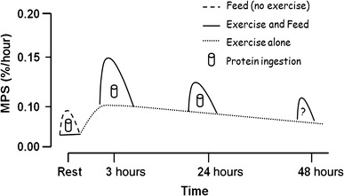
- 📊 **Fig. 2** — a The ‘leucine trigger’ concept, with data adapted from Tang et al. [6], as shown for isolated whey protein, soy protein, and casein proteins as a difference between rested and exercise values for MPS. b The speed of digestion of these proteins would be digested in the following order: whey ≥ soy ≫…
  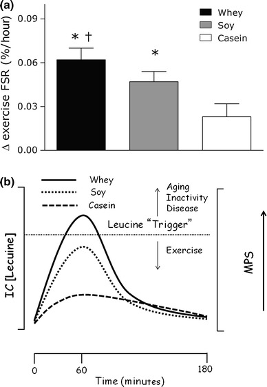

**Vigotsky AD, Lehman GJ, Contreras B, Beardsley C, Chung B, Feser EH. 2015. *Acute effects of anterior thigh foam rolling on hip angle, knee angle, and rectus femoris length in the modified Thomas test***  
[PMC4586805](https://pmc.ncbi.nlm.nih.gov/articles/PMC4586805/) · CC BY · **stored**

- 🗺 **Figure 1** — Starting (A) and ending (B) position of the foam roll protocol.
  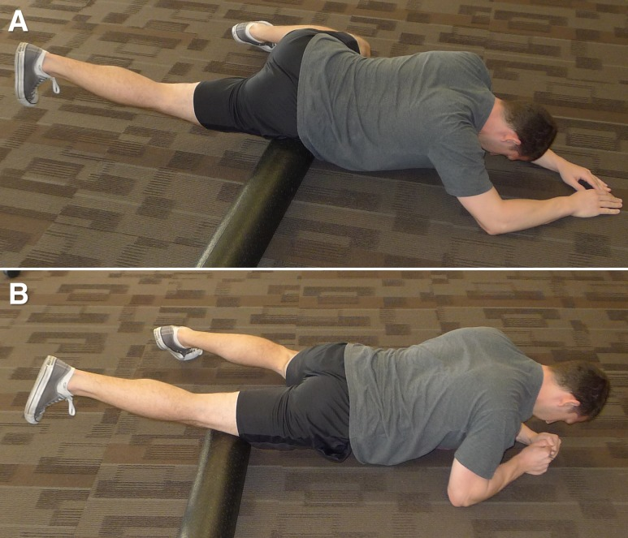
- 🗺 **Figure 2** — Hip and knee joint calculations.The illustrated participant would have a hip extension angle of 8.1° (98.1° − 90°) and a knee flexion angle of 53.2° (180° − 126.8°). Illustration credit: Ji Sung Kim
  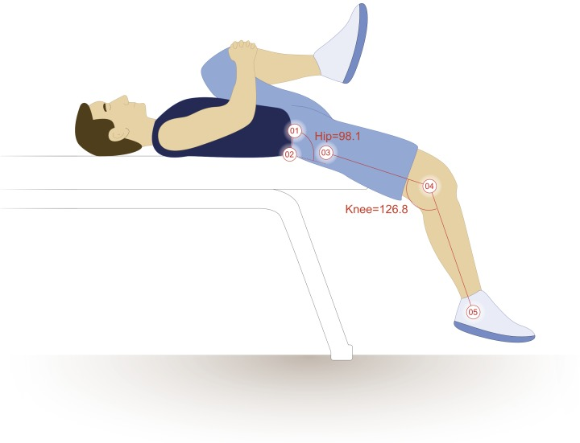

---

## [Five "Superfoods" Worth Eating, and the Science Behind Each](5-superfoods-recently-added-diet.md)

**Krikorian R, Shidler MD, Nash TA, Kalt W, Vinqvist-Tymchuk MR, Shukitt 2010. *Blueberry supplementation improves memory in older adults***  
[PMC2850944](https://pmc.ncbi.nlm.nih.gov/articles/PMC2850944/) · NIH manuscript — text mining/fair use only · link only

- 📊 **Figure 1** — Memory performances for the blueberry juice sample at the 12-week final visit relative to pre-intervention baseline as measured by the Verbal Paired Associate Learning Test (V-PAL) and the California Verbal Learning Test (CVLT) free recall task. Data show significantly improved performances for… ([view](https://pmc.ncbi.nlm.nih.gov/articles/PMC2850944/figure/F1/))
- 📊 **Figure 2** — Post-intervention final visit mean values comparing memory performance for subjects (n = 7) who consumed placebo beverage and subjects who consumed wild blueberry juice (n=9) for 12 weeks. The ANCOVA analyses indicated significantly improved paired associate learning (V-PAL) performance, F(1,13) =… ([view](https://pmc.ncbi.nlm.nih.gov/articles/PMC2850944/figure/F2/))

**Richardson DP, Ansell J, Drummond LN. 2018. *The nutritional and health attributes of kiwifruit: a review***  
[PMC6267416](https://pmc.ncbi.nlm.nih.gov/articles/PMC6267416/) · CC BY · **stored**

- 📊 **Fig. 1** — Graph comparing the vitamin C content of kiwifruit with other commonly consumed fruit
  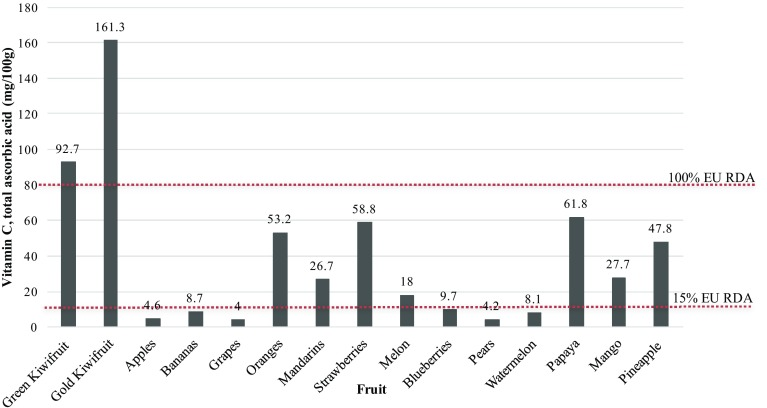
- 📊 **Fig. 2** — Graph comparing the folate content of kiwifruit with other commonly consumed fruit
  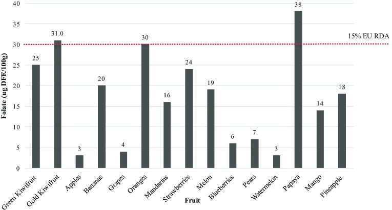
- 📊 **Fig. 3** — Graph comparing the potassium content of kiwifruit with other commonly consumed fruit
  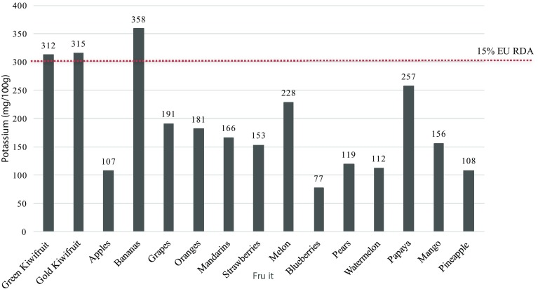

---

## [7 More Fitness Myths Busted (Myth-Busting Season 1 Recap, Part 2)](7-fitness-myths-completely-busted-science.md)

**Parr EB, Camera DM, Areta JL, Burke LM, Phillips SM, Hawley JA, Coffey 2014. *Alcohol ingestion impairs maximal post-exercise rates of myofibrillar protein synthesis following a single bout of concurrent training***  
[PMC3922864](https://pmc.ncbi.nlm.nih.gov/articles/PMC3922864/) · CC BY · **stored**

- 🗺 **Figure 1** — Schematic representation of the experimental trial.Subjects reported to the laboratory after an overnight fast where a constant infusion of L-[ring-13C6] phenylalanine was commenced (3 h in first trial; 1 h in trial 2/3), and subjects completed the concurrent exercise (8×5 repetitions at 80% one…
  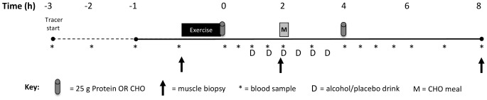
- 📊 **Figure 2** — Blood alcohol levels after alcohol intake during recovery following a single bout of concurrent training.Data were analysed using a 2-way ANOVA with repeated measures and Student-Newman-Keuls post hoc analysis. Values are mean ± SD. Significant effect of treatment (P = 0.02), time (P<0.01) with no…
  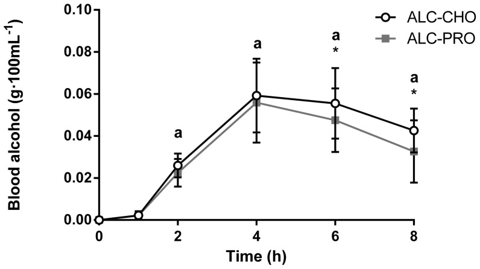
- 📊 **Figure 3** — Blood glucose concentrations before and duringrecovery following a single bout of concurrent training.Drink = 25 g of whey protein (PRO and ALC-PRO) or 25 g maltodextrin (ALC-CHO); Meal = 1.5 g·kg−1 BM. Data were analysed using a 2-way ANOVA with repeated measures and Student-Newman-Keuls post hoc…
  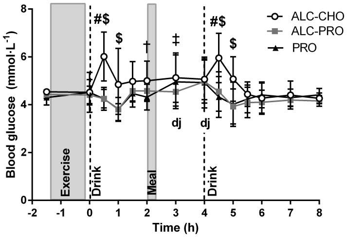
- 📊 **Figure 4** — Plasma EAA (A), BCAA (B), leucine (C) concentration following a single bout of concurrent training.EAA – essential amino acids; BCAA – branched-chain amino acids. Data were analysed using a 2-way ANOVA with repeated measures and Student-Newman-Keuls post hoc analysis. Values are mean ± SD.…
  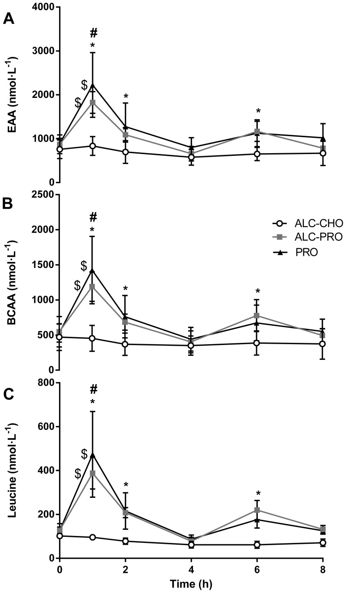
- 📊 **Figure 5** — mTORSer2448 (A), p70S6KThr389 (B), eEF2Thr56 (C), 4E-BP1Thr37/46 (D) phosphorylation at rest and following a single bout of concurrent training.Images are representative blots for each protein from the same subject and values are expressed relative to α-tubulin and presented in arbitary units. Data…
  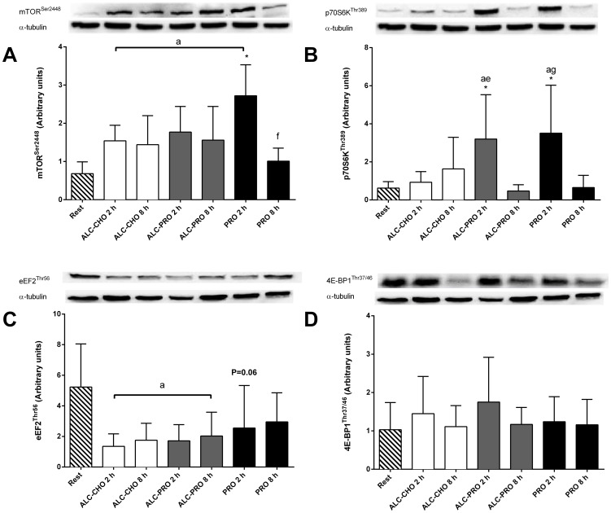
- 📊 **Figure 6** — MuRF-1 (A), Atrogin-1 (B) mRNA abundance at rest and following a single bout of concurrent training.Values are expressed relative to GAPDH and presented in arbitrary units (mean ± SD, n = 7). Data were analysed using a 2-way repeated measures ANOVA with Student-Newman-Keuls post hoc analysis.…
  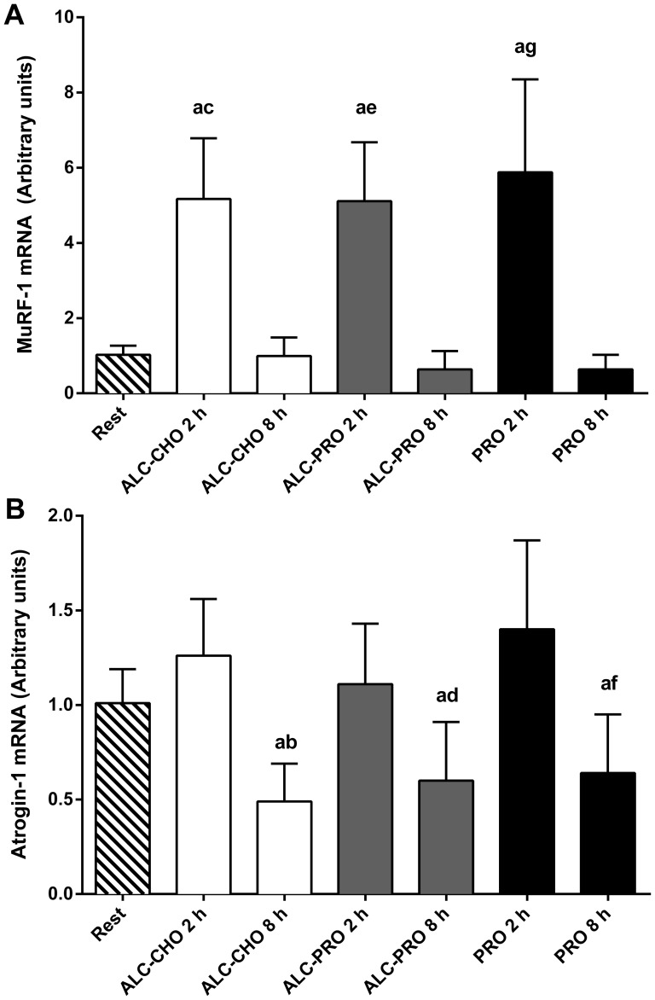
- 📊 **Figure 7** — Myofibrillar fractional synthetic rate (FSR) throughout 2–8 h recovery following a single bout of concurrent training.Data were analysed using a 1-way repeated measures ANOVA with Student-Newman-Keuls post hoc analysis. Values are mean ± SD expressed as % h−1, n = 8. Significantly different…
  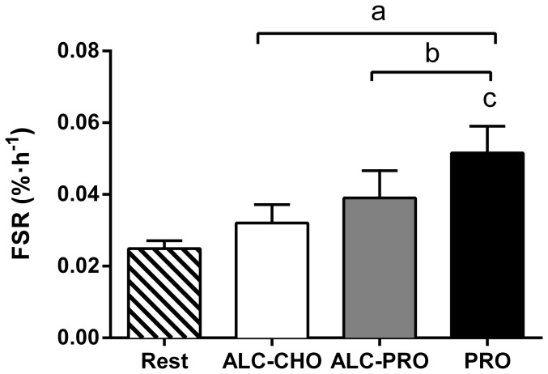

**Burke LM. 2015. *Re-Examining High-Fat Diets for Sports Performance: Did We Call the 'Nail in the Coffin' Too Soon?***  
[PMC4672014](https://pmc.ncbi.nlm.nih.gov/articles/PMC4672014/) · CC BY · **stored**

- 📊 **Fig. 1** — Exercise capacity (time to exhaustion at 62–64 % maximal aerobic capacity, equivalent to ~185 W after 7 days of high-carbohydrate diet followed by 28 days of low-carbohydrate high-fat diet. Data represent mean ± standard error of the mean from five well-trained cyclists (not significantly…
  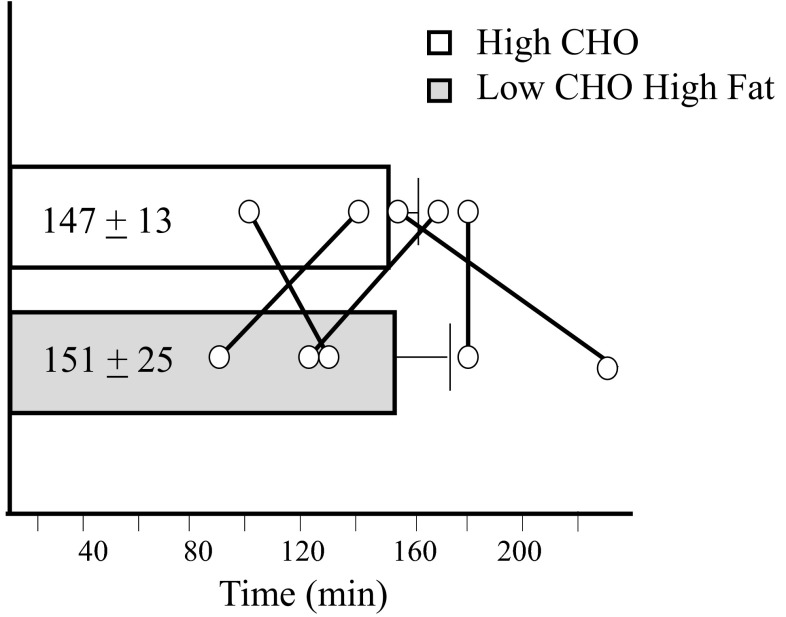
- 📊 **Fig. 2** — Effect of 5 days of adaptation to a low-carbohydrate high-fat diet and 1 day of a high-carbohydrate diet to restore muscle glycogen (FAT-adapt) on rate of carbohydrate oxidation (a) and rate of fat oxidation (b) during cycling at 70 % maximal aerobic capacity compared with control trial (6 days of…
  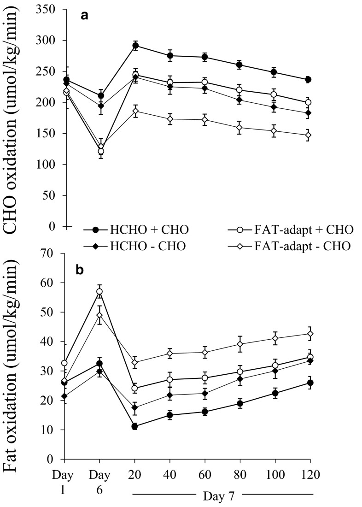
- 📊 **Fig. 3** — Power outputs during 1- and 4-km sprints undertaken within a 100-km self-paced cycling time trial after a 6-day high-carbohydrate diet and 5 days of a low-carbohydrate high-fat diet followed by 1 day of a high-carbohydrate diet (fat-adapt) [1]. 100-km total time: 153:10 vs. 156:54 min for…
  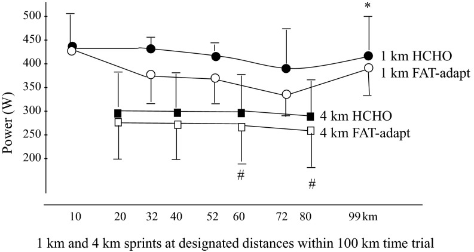
- 📊 **Fig. 4** — Pyruvate dehydrogenase activity in the active form at rest, during 20 min of cycling at ~70 % maximal aerobic capacity followed by a 1-min sprint at 150 % of peak power output after either a 5-day adaptation to a low-carbohydrate high-fat diet followed by a 1-day high-carbohydrate diet (FAT-adapt)…
  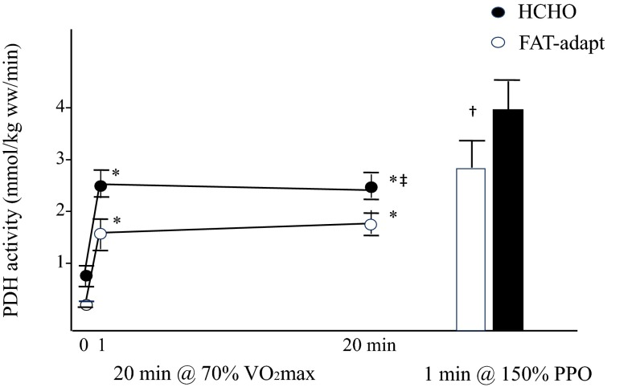

---

## [8 More Fitness Myths Busted (Myth-Busting Season 1 Recap, Part 3)](8-common-fitness-myths-busted.md)

**Popkin BM, D'Anci KE, Rosenberg IH. 2010. *Water, hydration, and health***  
[PMC2908954](https://pmc.ncbi.nlm.nih.gov/articles/PMC2908954/) · NIH manuscript — text mining/fair use only · link only

- 📊 **Figure 1** — Water Consumption Trends from USDA and NHANES Surveys (ml/day/capita), weighted to be nationally representativeNote: this includes water from fluids only, excluding water in foods. Sources for 1965, 77–78, 89- are USDA. Others are NHANES and 2005–6 is joint USDA and NHANES ([view](https://pmc.ncbi.nlm.nih.gov/articles/PMC2908954/figure/F1/))

**Betts JA, Richardson JD, Chowdhury EA, Holman GD, Tsintzas K, Thompson 2014. *The causal role of breakfast in energy balance and health: a randomized controlled trial in lean adults***  
[PMC4095658](https://pmc.ncbi.nlm.nih.gov/articles/PMC4095658/) · CC BY · **stored**

- 📊 **FIGURE 1.** — Components of energy balance under free-living conditions with either ingestion of ≥700 kcal before 1100 daily (breakfast group) or abstinence from all energy-providing nutrients until at least 1200 daily (fasting group). Values are means ± SEs. Estimated energy intake values for comparison of…
  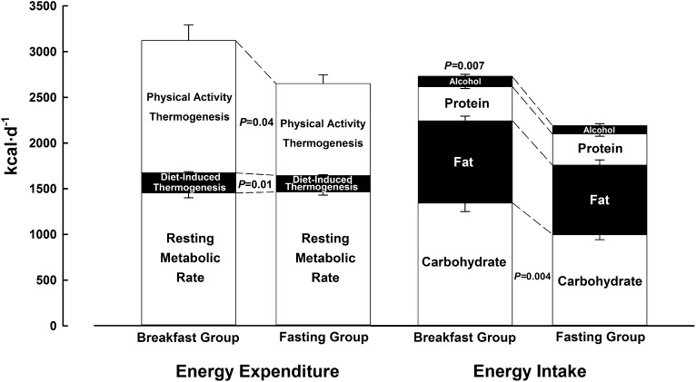
- 📊 **FIGURE 2.** — Physical activity thermogenesis under free-living conditions with either ingestion of ≥700 kcal before 1100 daily (breakfast group, n = 15) or abstinence from all energy-providing nutrients until at least 1200 daily (fasting group, n = 15). Values are means ± SEs partitioned by the time of day and…
  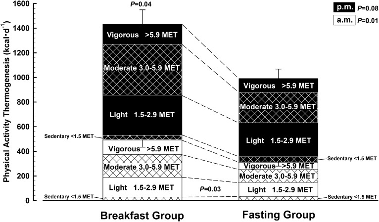
- 📊 **FIGURE 3.** — Rates of [U-14C]-d-glucose uptake in adipocytes under basal, physiologic (50 pmol insulin/L), and supraphysiologic (20 nmol insulin/L) conditions, measured at baseline and after 6-wk ingestion of ≥700 kcal before 1100 daily (breakfast group; n = 13) or abstinence from all energy-providing nutrients…
  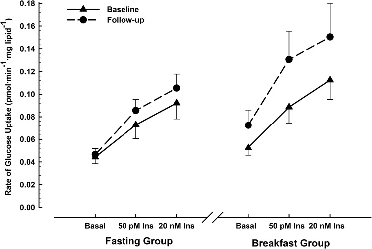
- 📊 **FIGURE 4.** — Glucose variability before and after 1200 (expressed as CVs) derived from subcutaneous glucose concentrations continuously monitored during the first and last week of either ingesting ≥700 kcal before 1100 daily (breakfast group; n = 16) or abstaining from all energy-providing nutrients until at…
  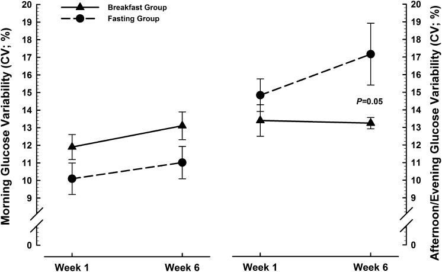

**Cotter JD, Thornton SN, Lee JK, Laursen PB. 2014. *Are we being drowned in hydration advice? Thirsty for more?***  
[PMC4212586](https://pmc.ncbi.nlm.nih.gov/articles/PMC4212586/) · CC BY · **stored**

- 🖼 **Figure 1** — Personal and societal effects of acute/chronic consumption of water above/below that required for fluid homeostasis. The three incrementing font sizes denote outcomes causing a nuisance, morbidity and potential mortality. Outcomes with question marks are those for which we are not aware of any…
  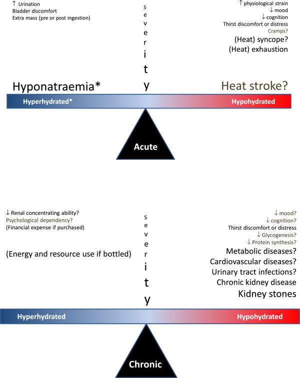
- 🖼 **Figure 2** — Effect of hypohydration on exercise performance before and after familiarisation to the hypohydration. Reprinted from Fleming J, James LJ. Repeated familiarisation with hypohydration attenuates the performance decrement caused by hypohydration during treadmill running. Appl Physiol Nutr Metab., 39:…
  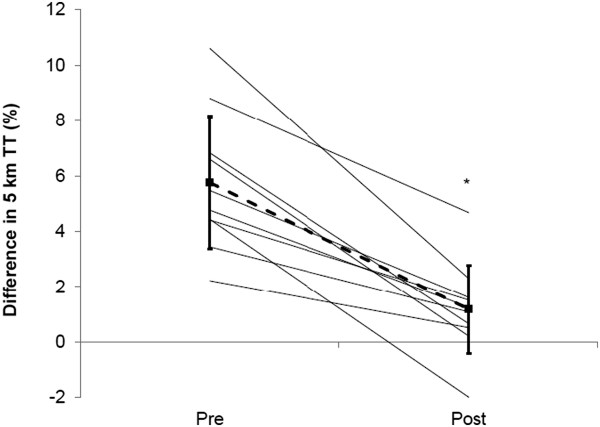
- 🗺 **Figure 3** — Indicative contributions of different sources to changes in body mass for hypohydration induced before or during strenuous exercise.Bar A represents starting exercise euhydrated when rehydrated from an overnight fast (14 h), whereas bars B–D represent starting exercise 2% hypohydrated obtained as…
  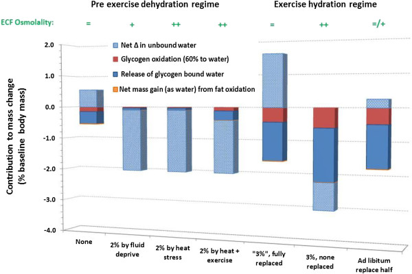

**Larsson SC, Crippa A, Orsini N, Wolk A, Michaëlsson K. 2015. *Milk Consumption and Mortality from All Causes, Cardiovascular Disease, and Cancer: A Systematic Review and Meta-Analysis***  
[PMC4586558](https://pmc.ncbi.nlm.nih.gov/articles/PMC4586558/) · CC BY · **stored**

- 🗺 **Figure 1** — Flow diagram of literature search and study selection. Studies excluded based on title and abstract included experimental studies in animals and in vitro, review articles, and other studies unrelated to milk consumption and mortality. * One article reported results from two separate cohorts and one…
  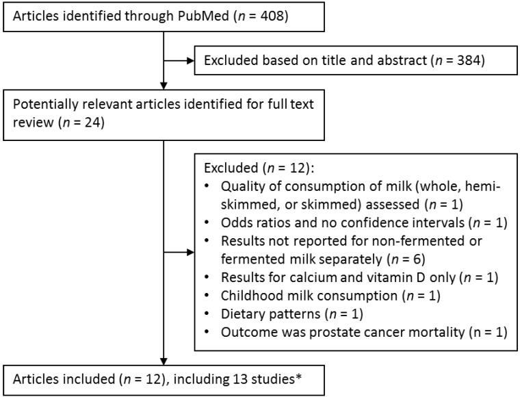
- 📊 **Figure 2** — Dose-response association between non-fermented milk consumption and all-cause mortality in individual studies. The hazard ratios are plotted on a log scale.
  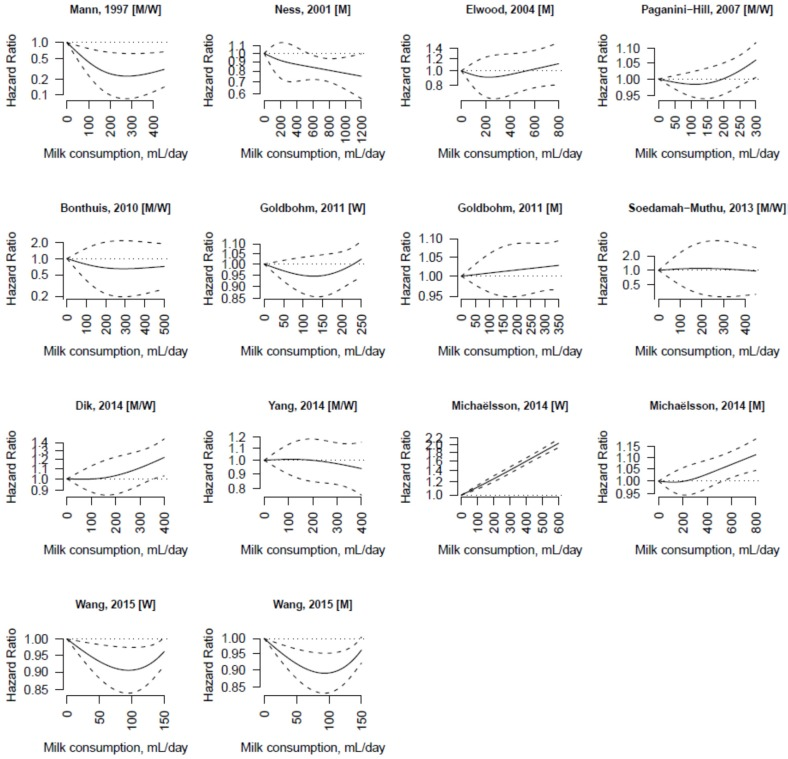
- 📊 **Figure 3** — Dose-response association between non-fermented milk consumption and cardiovascular disease mortality in individual studies. The hazard ratios are plotted on a log scale.
  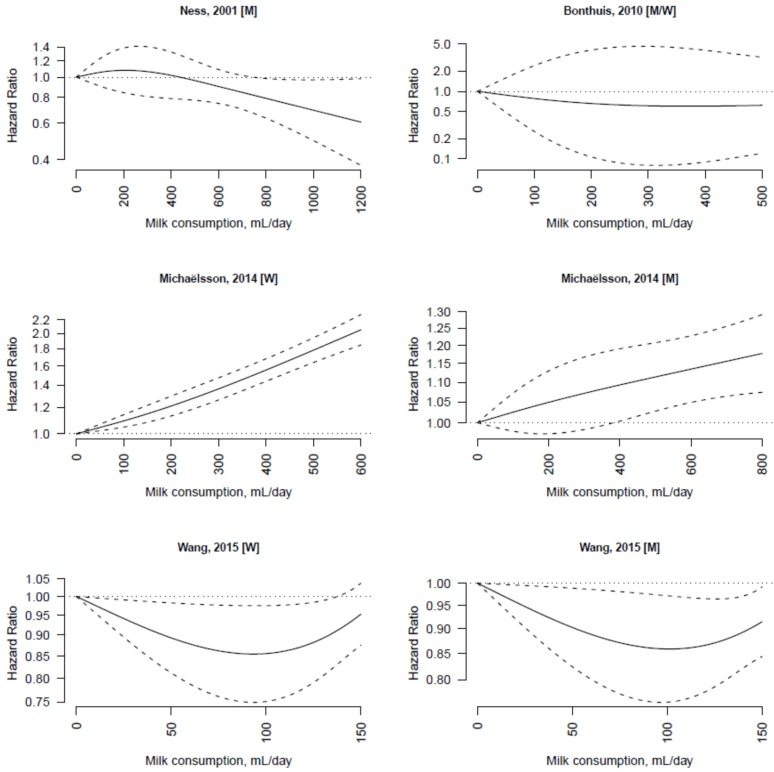
- 📊 **Figure 4** — Dose-response association between non-fermented milk consumption and cancer mortality in individual studies. The hazard ratios are plotted on a log scale.
  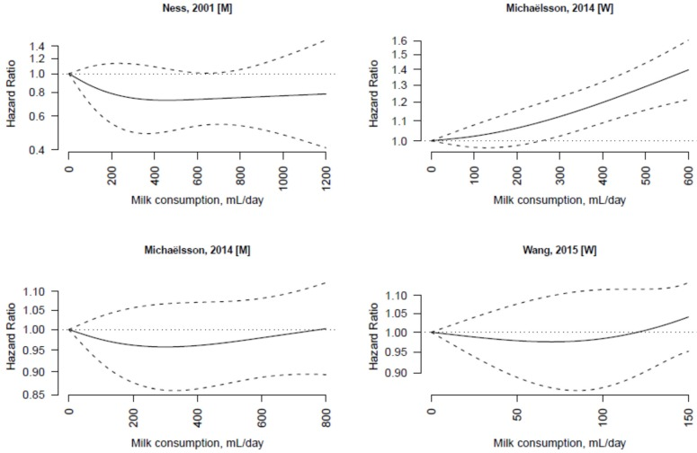

**Charrière N, Miles-Chan JL, Montani JP, Dulloo AG. 2015. *Water-induced thermogenesis and fat oxidation: a reassessment***  
[PMC4735055](https://pmc.ncbi.nlm.nih.gov/articles/PMC4735055/) · CC BY · **stored**

- 📊 **Figure 1** — (a) Time course of changes in REE and RQ after Sham drink or DW in 27 young adults. Repeated-measures analysis of variance assessed statistical differences as follows: effect of time (symbol †) and the drink x time interaction (symbol ‡); one, two and three symbols denoting P<0.05, P<0.01 and…
  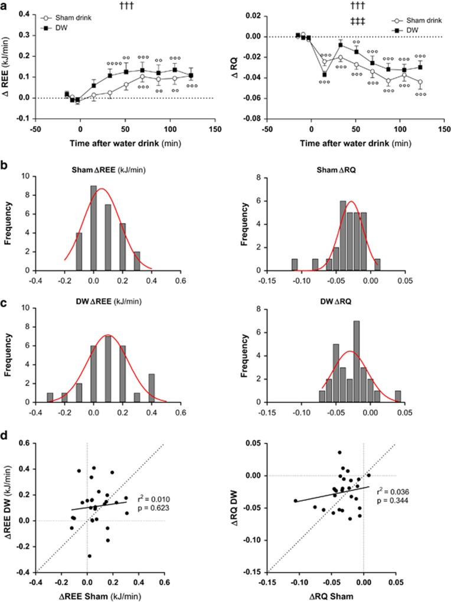
- 📊 **Figure 2** — Interstudy comparisons of ΔREE (kJ over 90 min) after drinking water. Data are for 20 experiments conducted in several laboratories (see Table 1 for references), including the current study (I for data presented in main text, and II for data presented in Supplementary Information, section B).…
  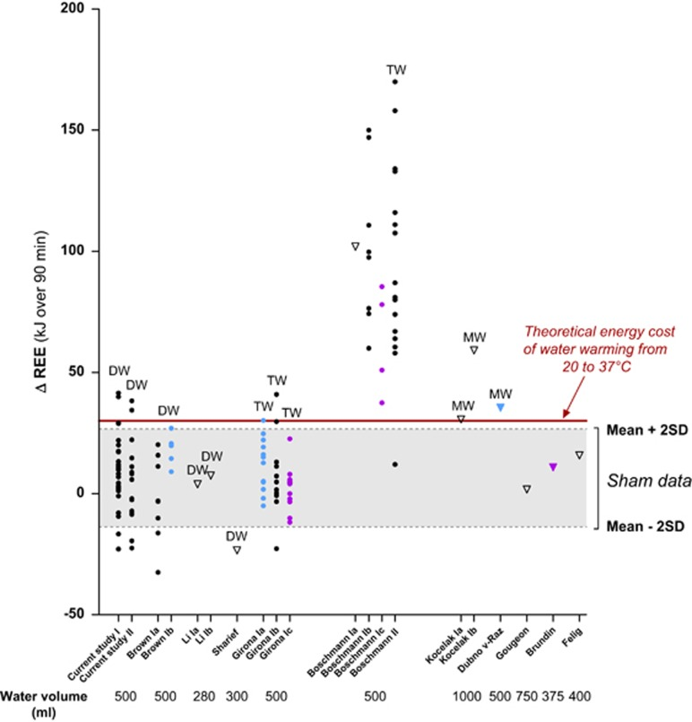

**de Goede J, Soedamah-Muthu SS, Pan A, Gijsbers L, Geleijnse JM. 2016. *Dairy Consumption and Risk of Stroke: A Systematic Review and Updated Dose-Response Meta-Analysis of Prospective Cohort Studies***  
[PMC4889169](https://pmc.ncbi.nlm.nih.gov/articles/PMC4889169/) · CC BY-NC · **stored**

- 🗺 **Figure 1** — Flow chart of literature search for meta‐analysis on dairy intake and incident stroke.
  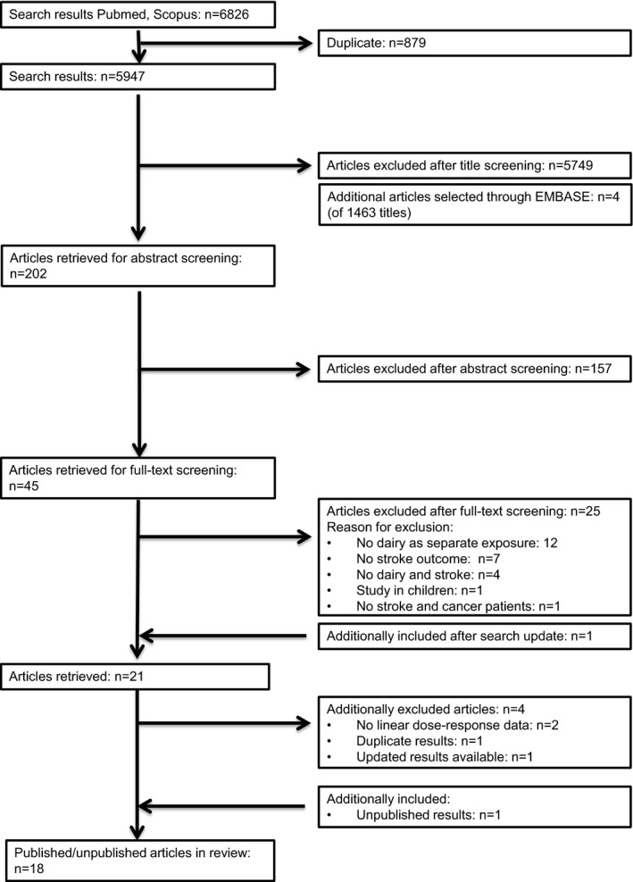
- 🖼 **Figure 2** — Relative risks of total stroke for an increment of 200 g of daily milk intake, by continent. Squares represent relative risks and square sizes study‐specific statistical weight; horizontal lines represent 95% CIs; diamonds represent summary relative risk estimates with 95% CIs.
  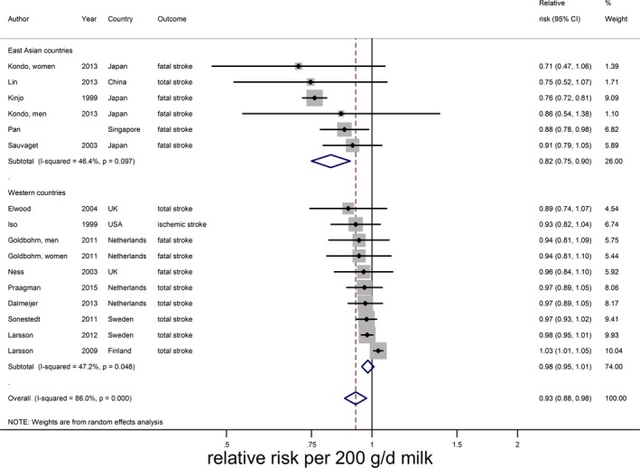
- 📊 **Figure 3** — Ding's spaghetti plot for the nonlinear association between milk intake and total stroke (n=13). Light blue lines represent Western and brown lines East Asian studies. Circles are placed at study‐specific relative risks related to the corresponding quantity of intake. Circle areas are proportional…
  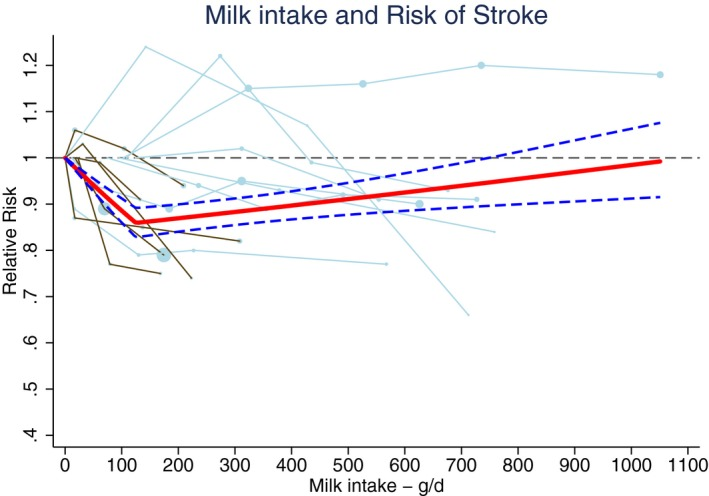
- 📊 **Figure 4** — Funnel plots for studies of the association between milk intake and stroke risk based on dose–response slopes; Egger's test, P=0.06 (A) and funnel plot for studies in Western countries of the association between milk intake and stroke risk (B) based on dose–response slopes; Egger's test, P=0.02.
  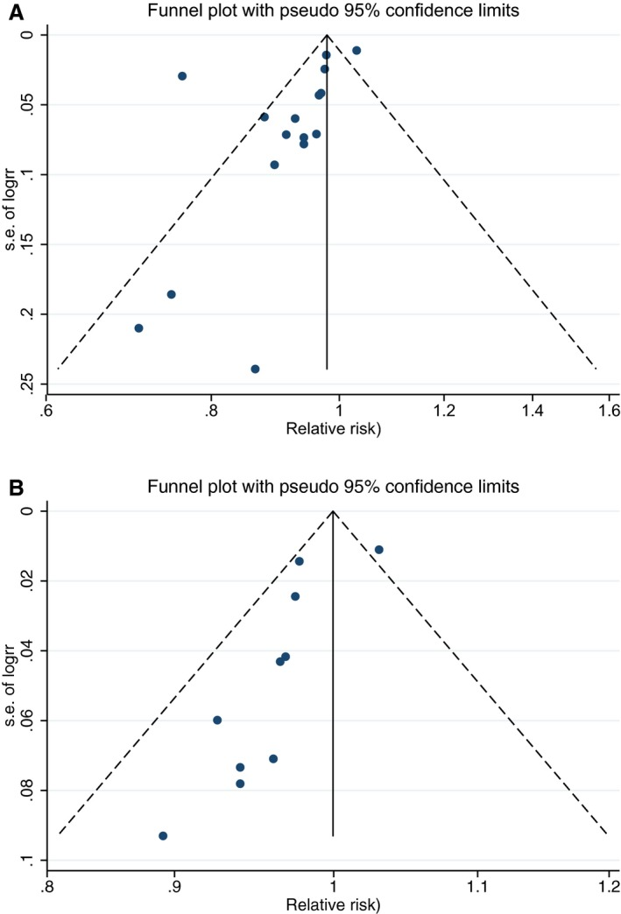
- 🖼 **Figure 5** — Relative risks of ischemic stroke (A), hemorrhagic stroke (B), and fatal stroke stratified by continent (C) for an increment of 200 g/day in milk intake. Squares represent study‐specific relative risk estimates (size of the square reflects the study‐specific statistical weight, ie, the inverse of…
  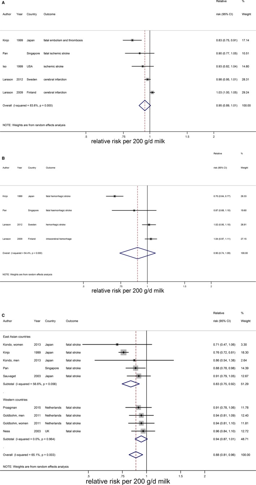
- 📊 **Figure 6** — Ding's spaghetti plots for (A) the nonlinear association (P for nonlinearity=0.01, knot at 165 g/day) between milk intake and total stroke in East Asian countries (n=5). B, For the nonlinear association (P for nonlinearity=0.03; knot at 115 g/day) between milk intake and ischemic stroke (n=5). C,…
  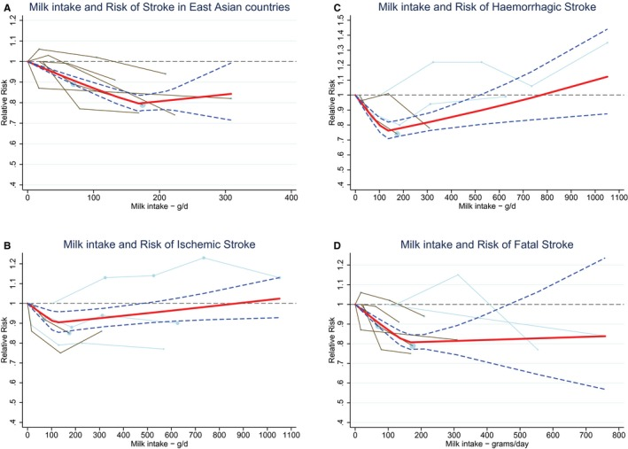
- 🖼 **Figure 7** — Relative risks of total stroke for an increment of 200 g/day in milk intake in Western countries, stratified for sex. Squares represent study‐specific relative risk estimates (size of the square reflects the study‐specific statistical weight, ie, the inverse of the variance); horizontal lines…
  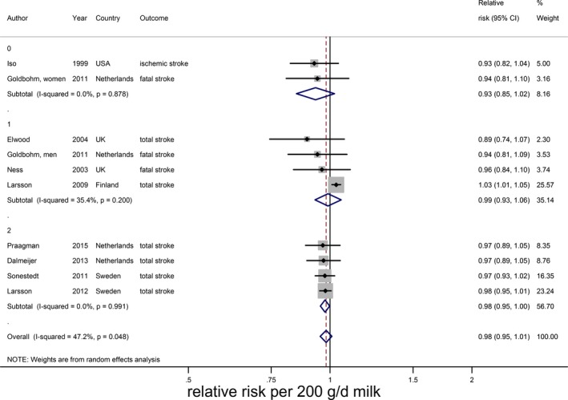
- 🖼 **Figure 8** — Relative risks of total stroke for an increment of 200 g/day in low‐fat milk intake (A) and high‐fat milk intake (B). Squares represent study‐specific relative risk estimates (size of the square reflects the study‐specific statistical weight, ie, the inverse of the variance); horizontal lines…
  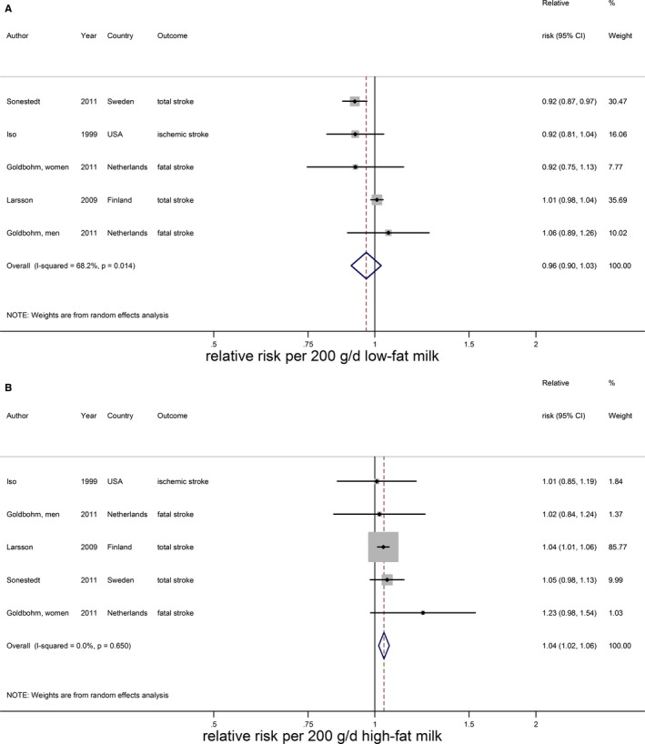
- 🖼 **Figure 9** — Relative risks of total stroke for an increment of 40 g/day in cheese intake. Squares represent study‐specific relative risk estimates (size of the square reflects the study‐specific statistical weight, ie, the inverse of the variance); horizontal lines represent 95% CIs; diamonds represent summary…
  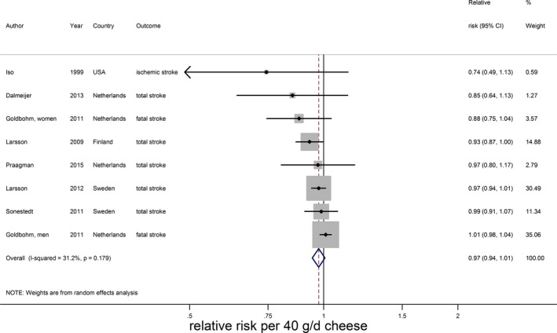
- 📊 **Figure 10** — Ding's spaghetti plot for the nonlinear association between cheese intake and total stroke (n=6). Circles are placed at the study‐specific relative risks related to the corresponding quantity of intake. The area of the circles is proportional to the study‐specific statistical weight. The solid red…
  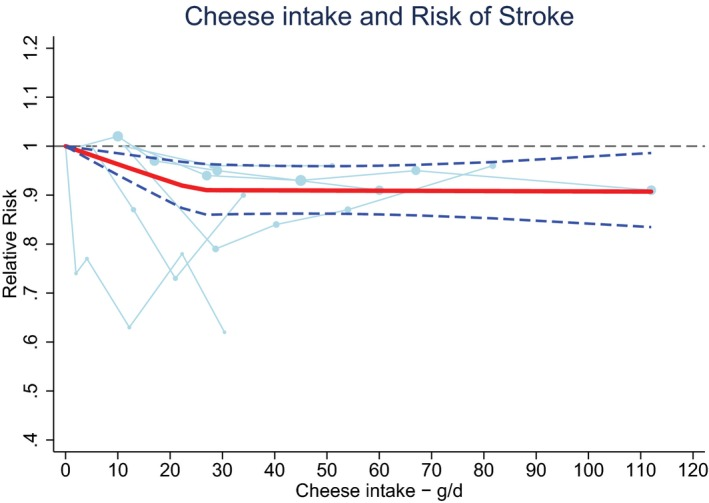
- 🖼 **Figure 11** — Relative risks of total stroke for an increment of 100 g/day in yogurt intake. Squares represent study‐specific relative risk estimates (size of the square reflects the study‐specific statistical weight, ie, the inverse of the variance); horizontal lines represent 95% CIs; diamonds represent…
  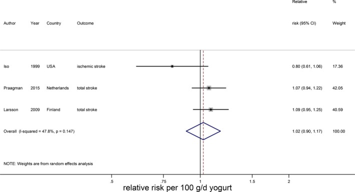
- 🖼 **Figure 12** — Relative risks of total stroke for an increment of 200 g/day in fermented dairy intake (A) and fatal stroke for an increment of 200 g/day in fermented dairy intake (B). Squares represent study‐specific relative risk estimates (size of the square reflects the study‐specific statistical weight, ie,…
  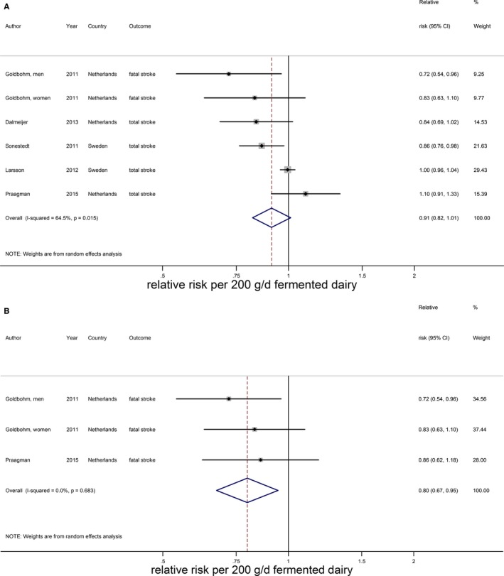
- 🖼 **Figure 13** — Relative risks of total stroke (A), ischemic stroke (B), hemorrhagic stroke (C), and fatal stroke (D) for an increment of 200 g/day in total dairy intake. Squares represent study‐specific relative risk estimates (size of the square reflects the study‐specific statistical weight, ie, the inverse of…
  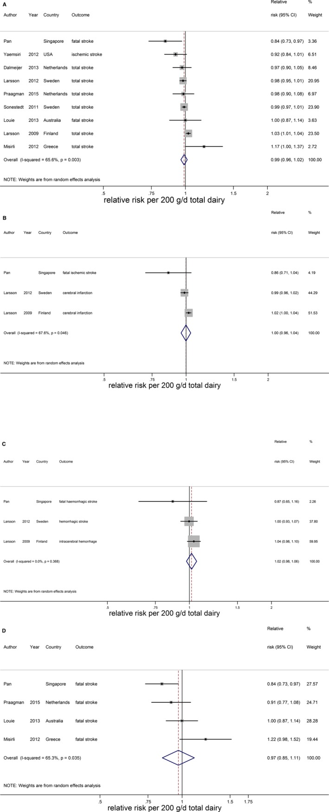
- 🖼 **Figure 14** — Relative risks of total stroke for an increment of 200 g/day in low‐fat dairy (A) and high‐fat dairy (B) intake. Squares represent study‐specific relative risk estimates (size of the square reflects the study‐specific statistical weight, ie, the inverse of the variance); horizontal lines represent…
  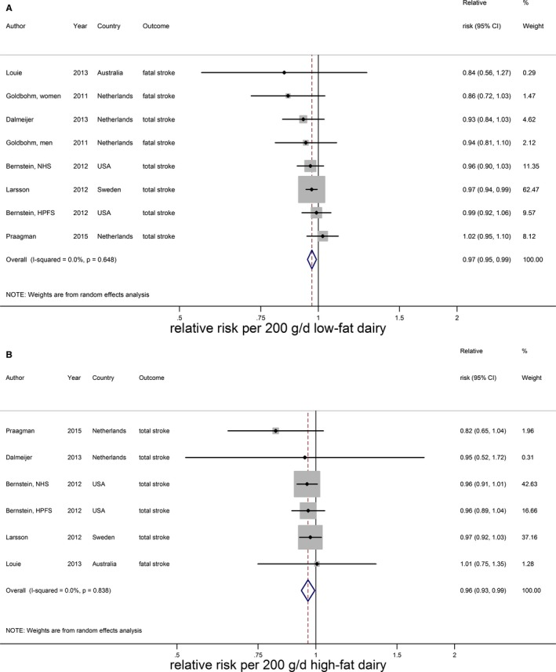
- 📊 **Figure 15** — Ding's spaghetti plots for (A) the nonlinear association (P for nonlinearity=0.01; knot at 75 g/day) between low‐fat dairy intake and total stroke (n=6) and (B) the nonlinear association (P for nonlinearity=0.01; knot: 55 g/day) between high‐fat dairy intake and total stroke (n=6). Light blue lines…
  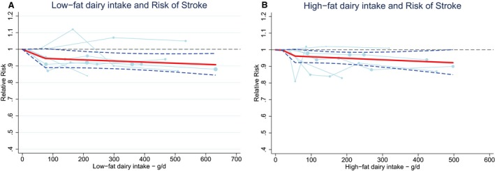
- 🖼 **Figure 16** — Relative risks of total stroke for an increment of 10 g/day in butter intake. Squares represent study‐specific relative risk estimates (size of the square reflects the study‐specific statistical weight, ie, the inverse of the variance); horizontal lines represent 95% CIs; diamond represents summary…
  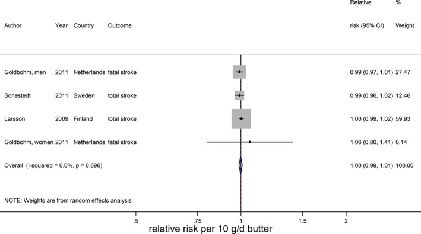

**Thorning TK, Raben A, Tholstrup T, Soedamah-Muthu SS, Givens I, Astrup 2016. *Milk and dairy products: good or bad for human health? An assessment of the totality of scientific evidence***  
[PMC5122229](https://pmc.ncbi.nlm.nih.gov/articles/PMC5122229/) · CC BY · **stored**

- 🖼 **Fig. 1** — Overall effect/association between dairy product intake and health outcomes. ↓ favourable effect/association; ↑adverse effect/association; → no effect/association.
  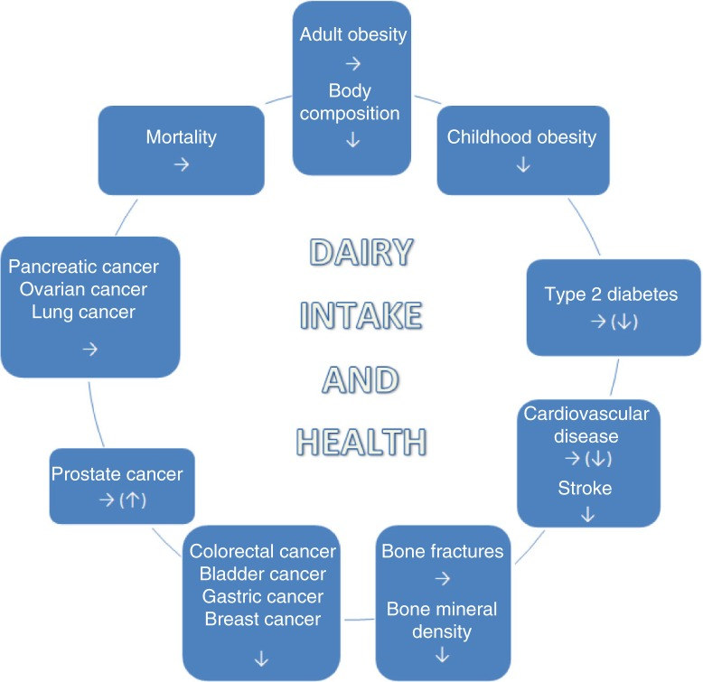

**Mullie P, Pizot C, Autier P. 2016. *Daily milk consumption and all-cause mortality, coronary heart disease and stroke: a systematic review and meta-analysis of observational cohort studies***  
[PMC5143456](https://pmc.ncbi.nlm.nih.gov/articles/PMC5143456/) · CC BY · **stored**

- 🗺 **Fig. 1** — Prisma flow chart of selections of studies included in the meta-analyses relating daily milk consumption to all-cause mortality, coronary heart disease and stroke
  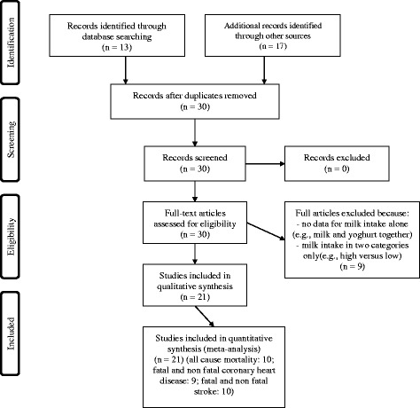
- 📊 **Fig. 2** — Relation between milk (per 200 mL/d) and all-cause mortality: dose-response meta-analyses of eleven prospective cohorts. Author names, year of publication, and the size of the association per study; the horizontal lines indicate 95% confidence intervals. The last two columns contain the actual…
  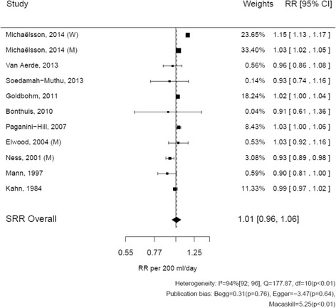
- 📊 **Fig. 3** — Relation between milk (per 200 mL/d) and fatal and non fatal coronary heart disease: dose-response meta-analyses of nine prospective cohorts. Author names, year of publication, and the size of the association per study; the horizontal lines indicate 95% confidence intervals. The last two columns…
  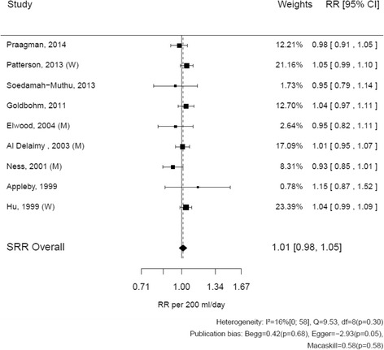
- 📊 **Fig. 4** — Relation between milk (per 200 mL/d) and fatal and non fatal stroke: dose-response meta-analyses of ten prospective cohorts. Author names, year of publication, and the size of the association per study; the horizontal lines indicate 95% confidence intervals. The last two columns contain the actual…
  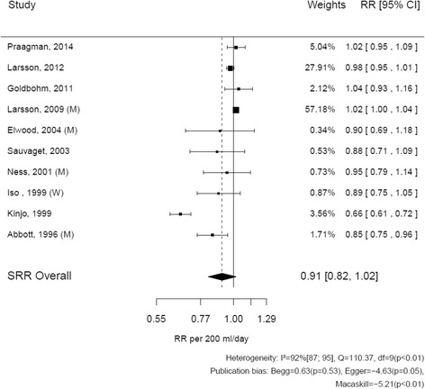

**Drouin-Chartier JP, Brassard D, Tessier-Grenier M, Côté JA, Labonté MÈ 2016. *Systematic Review of the Association between Dairy Product Consumption and Risk of Cardiovascular-Related Clinical Outcomes***  
[PMC5105032](https://pmc.ncbi.nlm.nih.gov/articles/PMC5105032/) · CC BY-NC · **stored**

- 📊 **FIGURE 1** — Forest plot of RRs from meta-analyses of prospective cohort studies on the association between dairy intake and cardiovascular disease risk, with their 95% CIs. Each symbol represents data from an individual meta-analysis.
  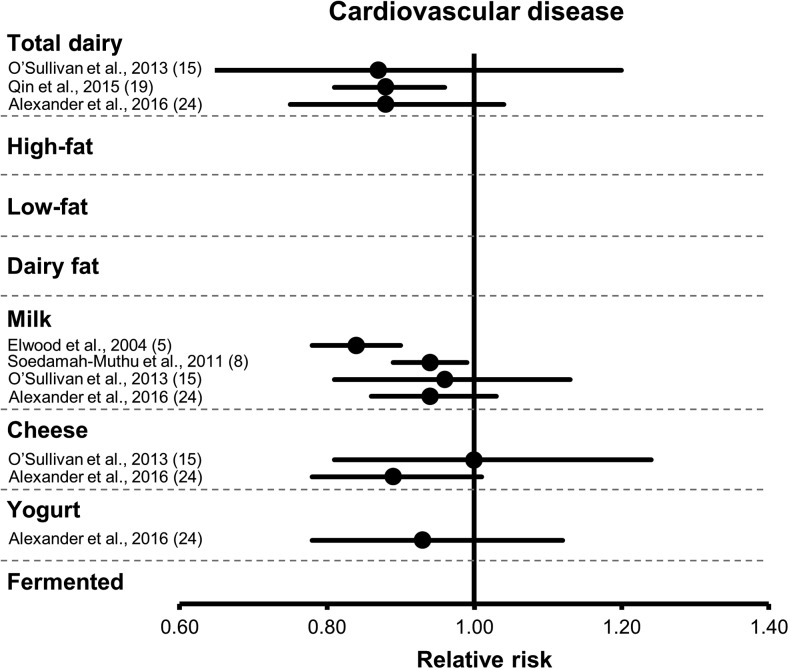
- 📊 **FIGURE 2** — Forest plot of RRs from meta-analyses of prospective cohort studies on the association between dairy intake and coronary artery disease risk, with their 95% CIs. Each symbol represents data from an individual meta-analysis. Arrows indicate that the 95% CIs exceed the figure scale. R-TFA, ruminant…
  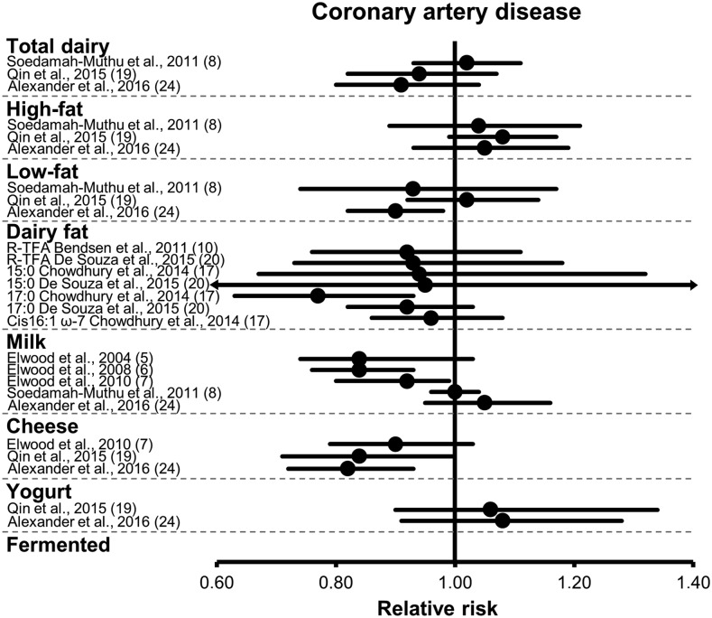
- 📊 **FIGURE 3** — Forest plot of RRs from meta-analyses of prospective cohort studies on the association between dairy intake and the risk of stroke, with their 95% CIs. Each symbol represents data from an individual meta-analysis.
  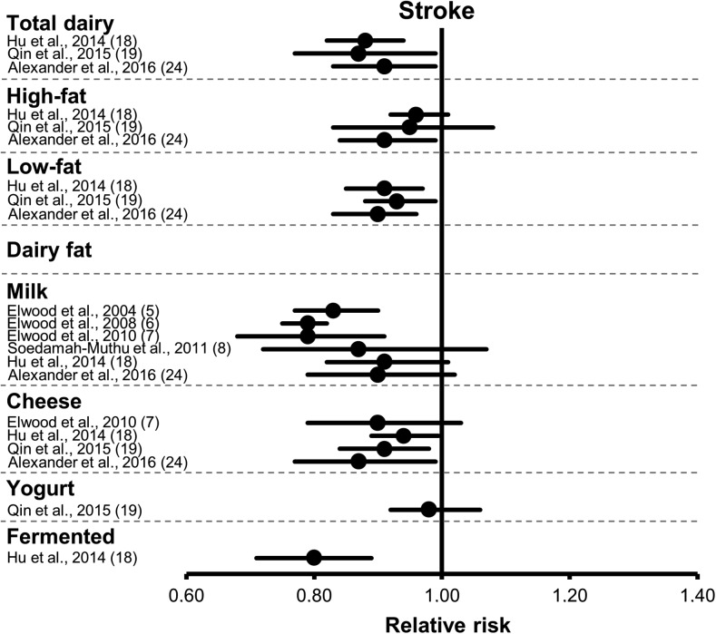
- 📊 **FIGURE 4** — Forest plot of RRs from meta-analyses of prospective cohort studies on the association between dairy intake and the risk of hypertension, with their 95% CIs. Each symbol represents data from an individual meta-analysis.
  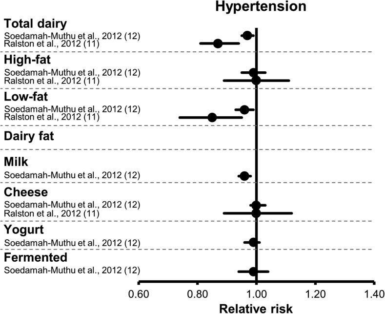
- 📊 **FIGURE 5** — Forest plot of RRs from meta-analyses of prospective cohort studies on the association between dairy intake and the risk of metabolic syndrome, with their 95% CIs. Each symbol represents data from an individual meta-analysis.
  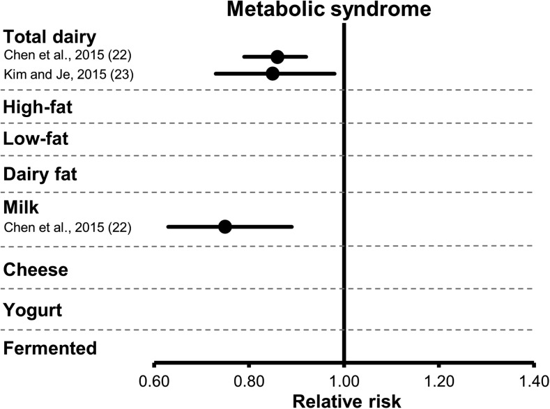
- 📊 **FIGURE 6** — Forest plot of RRs from meta-analyses of prospective cohort studies on the association between dairy intake and the risk of type 2 diabetes, with their 95% CIs. Each symbol represents data from an individual meta-analysis. HF, high-fat; LF, low-fat; R-TFA, ruminant trans fatty acids.
  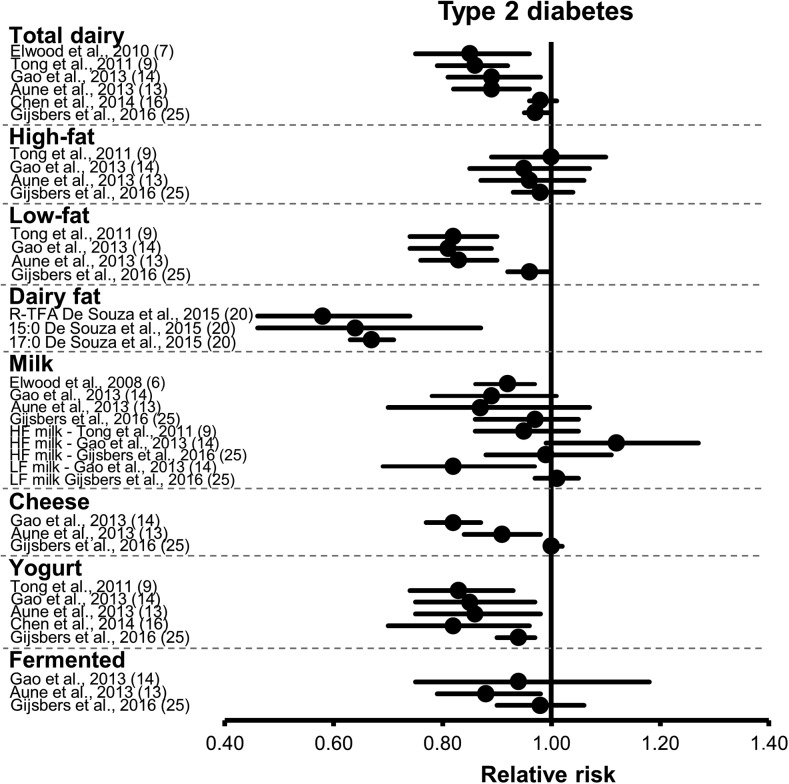

**Guo J, Astrup A, Lovegrove JA, Gijsbers L, Givens DI, Soedamah-Muthu S 2017. *Milk and dairy consumption and risk of cardiovascular diseases and all-cause mortality: dose-response meta-analysis of prospective cohort studies***  
[PMC5437143](https://pmc.ncbi.nlm.nih.gov/articles/PMC5437143/) · CC BY · **stored**

- 🗺 **Fig. 1** — Flowchart of meta-analysis on dairy consumption and incident CVD, CVD mortality and all-cause mortality
  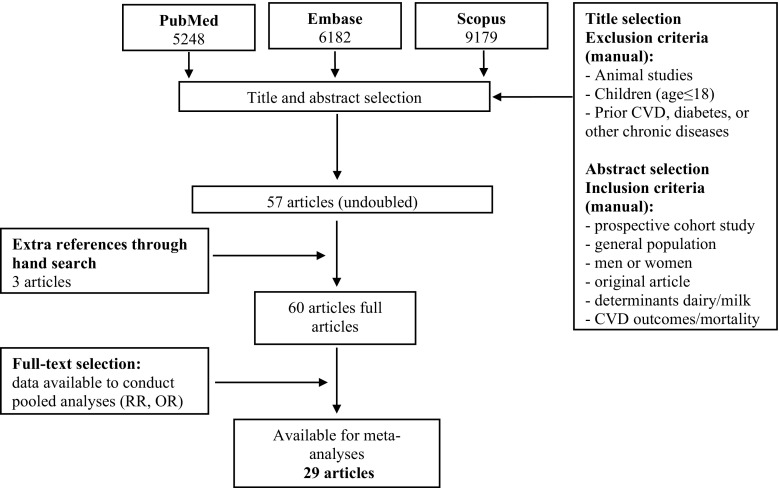
- 📊 **Fig. 2** — Relative risk of all-cause mortality for an increment of 20 g/day of fermented dairy intake. Squares represent study-specific RR. Square areas are proportional to the overall specific-study weight to the overall meta-analysis. Horizontal lines represent 95% CIs. Diamonds represent the pooled…
  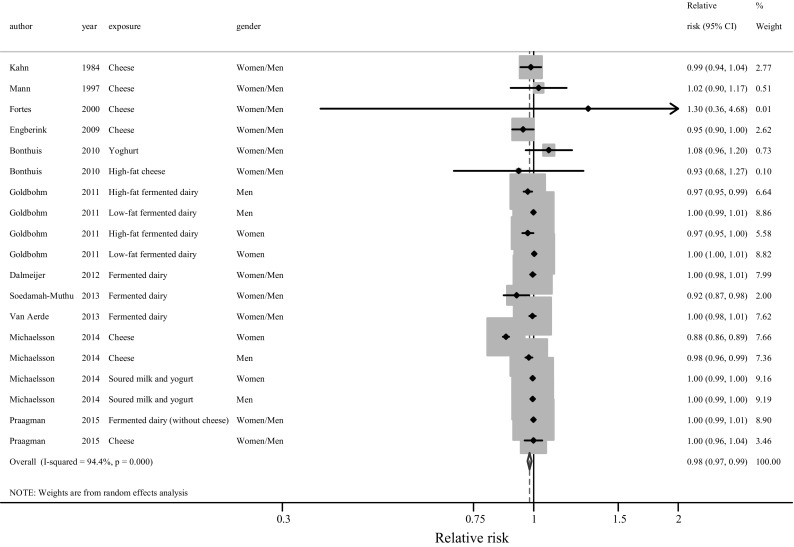
- 📊 **Fig. 3** — Relative risk of CVD for an increment of 20 g/day of fermented dairy intake. Squares represent study-specific RR. Square areas are proportional to the overall specific-study weight to the overall meta-analysis. Horizontal lines represent 95% Cis. Diamonds represent the pooled relative risk and 95%…
  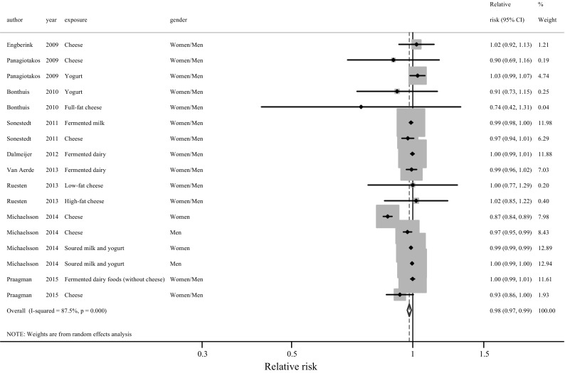
- 📊 **Fig. 4** — Relative risks of CVD for an increment of 10 g/day of cheese. Squares represent study-specific RR. Square areas are proportional to the overall specific-study weight to the overall meta-analysis. Horizontal lines represent 95% CIs. Diamonds represent the pooled relative risk and 95% Cis. By…
  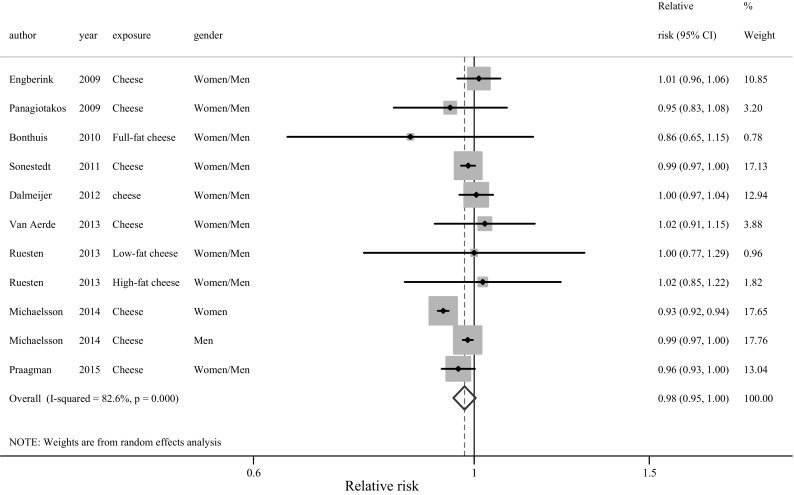

---

## [Advanced Techniques and Training Volume with Dr. Brad Schoenfeld](advanced-techniques-supersets-dropsets-eccentrics.md)

**Schoenfeld BJ, Contreras B, Krieger J, Grgic J, Delcastillo K, Belliar 2019. *Resistance Training Volume Enhances Muscle Hypertrophy but Not Strength in Trained Men***  
[PMC6303131](https://pmc.ncbi.nlm.nih.gov/articles/PMC6303131/) · CC BY-NC-ND · **stored**

- 🗺 **FIGURE 1** — Flowchart of data collection process.
  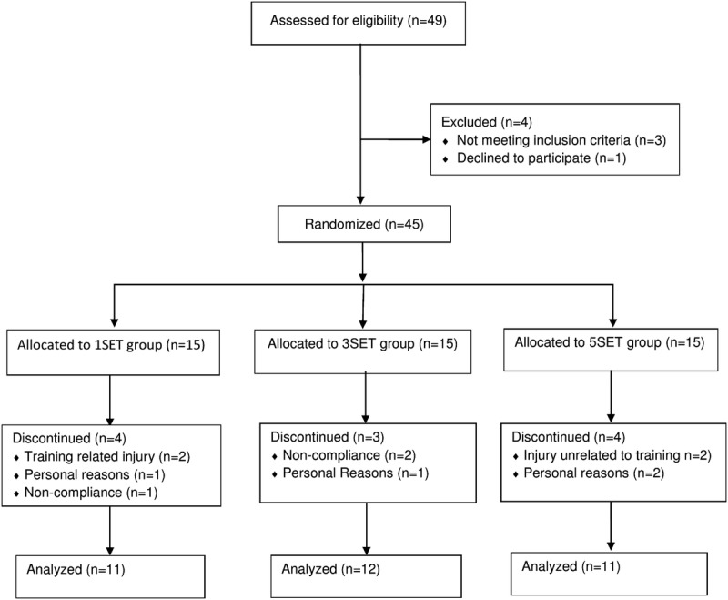
- 🖼 **FIGURE 2** — Prestudy to poststudy changes in muscle strength and endurance for each condition. (A) 1RM bench press; (B) 1RM squat; (C) upper body muscular endurance. Values for 1RMBENCH and RMSQUAT are in kilograms; values for 50%BP are in repetitions.
  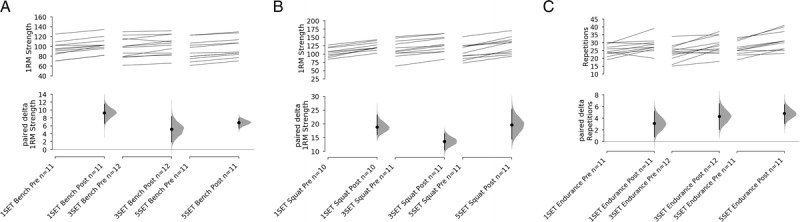
- 🖼 **FIGURE 3** — Prestudy to poststudy changes in MT for each condition. (A) Elbow flexors; (B) elbow extensors; (C) mid-thigh; (D) lateral thigh. All values are in millimeters.
  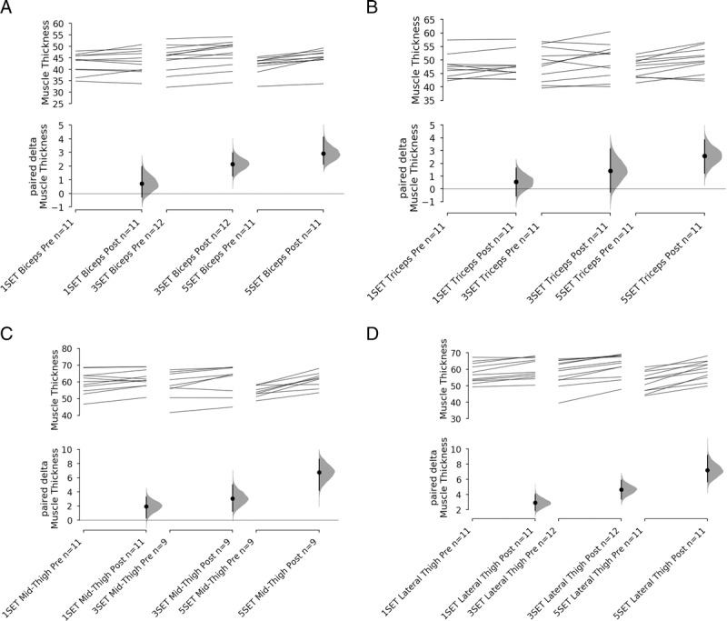

---

## [Alcohol's Effect on Fat Loss, Muscle Growth and Testosterone](alcohol-impact-fat-loss-muscle-testosterone.md)

**Lang CH, Pruznak AM, Nystrom GJ, Vary TC. 2009. *Alcohol-induced decrease in muscle protein synthesis associated with increased binding of mTOR and raptor: Comparable effects in young and mature rats***  
[PMC2651172](https://pmc.ncbi.nlm.nih.gov/articles/PMC2651172/) · CC BY · **stored**

- 📊 **Figure 1** — Effect of acute alcohol intoxication on the in vivo rate of protein synthesis in skeletal muscle from young and mature rats. Rats were injected intraperitoneally with either ethanol or saline (control) and protein synthesis in the fast-twitch gastrocnemius muscle was determined 2.5 h thereafter by…
  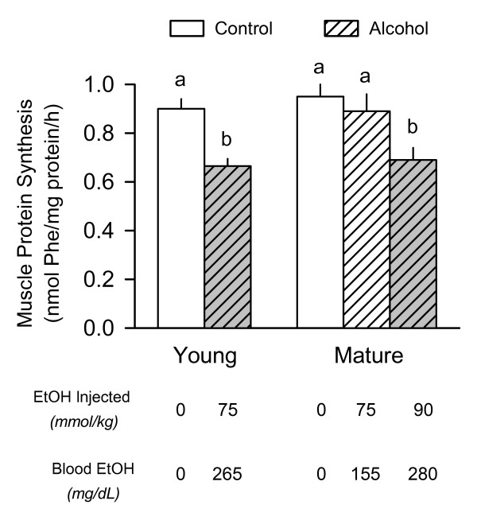
- 📊 **Figure 2** — Effect of acute alcohol intoxication on the total amount and phosphorylation of ribosomal protein S6 in skeletal muscle from young and mature rats. Groups are the same as described in Figure 1. Gastrocnemius was collected 2.5 h after administration of alcohol or saline (control). Insert at top:…
  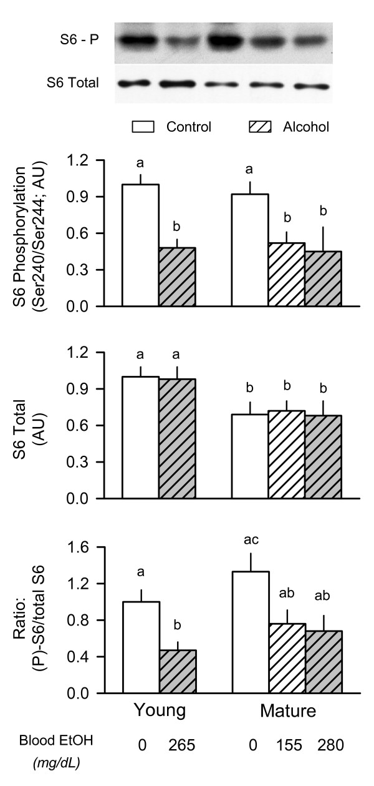
- 📊 **Figure 3** — Effect of acute alcohol intoxication on 4E-BP1 phosphorylation and the formation of the active eIF4F complex in skeletal muscle from young and mature rats. Groups are the same as described in Figure 1. Gastrocnemius was collected 2.5 h after administration of alcohol or saline (control). Insert…
  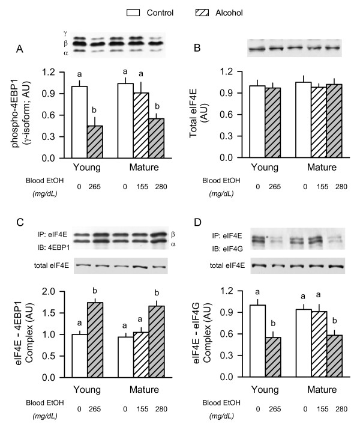
- 📊 **Figure 4** — Effect of acute alcohol intoxication on the total amount and phosphorylation of eIF4G in skeletal muscle from young and mature rats. Groups are the same as described in Figure 1. Gastrocnemius was collected 2.5 h after administration of alcohol or saline (control). Inset at top: representative…
  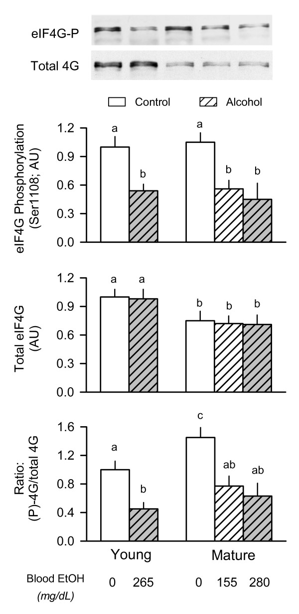
- 📊 **Figure 5** — Effect of acute alcohol intoxication on the binding of mTOR with raptor in skeletal muscle from young and mature rats. Groups are the same as described in Figure 1. Gastrocnemius was collected 2.5 h after administration of alcohol or saline (control). Inset at top: raptor was immunoprecipitated…
  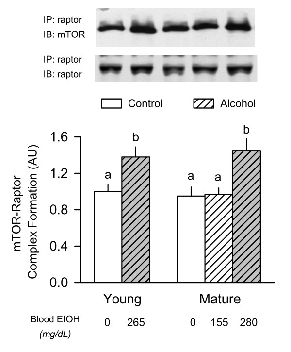
- 📊 **Figure 6** — Effect of acute alcohol intoxication on IGF-I concentration and mRNA content in young and mature rats. Inset: representative autoradiographs from a nuclease protection assay (RPA) for IGF-I in liver and gastrocnemius. Graphs A and B: densitometric analysis of RPAs performed on liver and muscle,…
  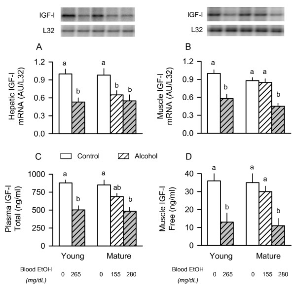
- 🗺 **Figure 7** — Schematic of possible site for alcohol-induced inhibition of muscle protein synthesis. This paradigm illustrates the central role served by mTOR (mammalian target of rapamycin) at integrating the independent anabolic signals generated by IGF (insulin-like growth factor-I and the amino acid leucine.…
  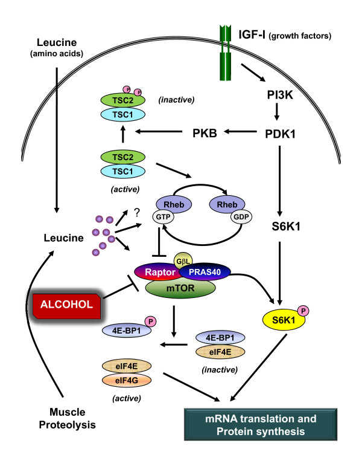

**Parr EB, Camera DM, Areta JL, Burke LM, Phillips SM, Hawley JA, Coffey 2014. *Alcohol ingestion impairs maximal post-exercise rates of myofibrillar protein synthesis following a single bout of concurrent training***  
[PMC3922864](https://pmc.ncbi.nlm.nih.gov/articles/PMC3922864/) · CC BY · **stored**

- 🗺 **Figure 1** — Schematic representation of the experimental trial.Subjects reported to the laboratory after an overnight fast where a constant infusion of L-[ring-13C6] phenylalanine was commenced (3 h in first trial; 1 h in trial 2/3), and subjects completed the concurrent exercise (8×5 repetitions at 80% one…
  
- 📊 **Figure 2** — Blood alcohol levels after alcohol intake during recovery following a single bout of concurrent training.Data were analysed using a 2-way ANOVA with repeated measures and Student-Newman-Keuls post hoc analysis. Values are mean ± SD. Significant effect of treatment (P = 0.02), time (P<0.01) with no…
  
- 📊 **Figure 3** — Blood glucose concentrations before and duringrecovery following a single bout of concurrent training.Drink = 25 g of whey protein (PRO and ALC-PRO) or 25 g maltodextrin (ALC-CHO); Meal = 1.5 g·kg−1 BM. Data were analysed using a 2-way ANOVA with repeated measures and Student-Newman-Keuls post hoc…
  
- 📊 **Figure 4** — Plasma EAA (A), BCAA (B), leucine (C) concentration following a single bout of concurrent training.EAA – essential amino acids; BCAA – branched-chain amino acids. Data were analysed using a 2-way ANOVA with repeated measures and Student-Newman-Keuls post hoc analysis. Values are mean ± SD.…
  
- 📊 **Figure 5** — mTORSer2448 (A), p70S6KThr389 (B), eEF2Thr56 (C), 4E-BP1Thr37/46 (D) phosphorylation at rest and following a single bout of concurrent training.Images are representative blots for each protein from the same subject and values are expressed relative to α-tubulin and presented in arbitary units. Data…
  
- 📊 **Figure 6** — MuRF-1 (A), Atrogin-1 (B) mRNA abundance at rest and following a single bout of concurrent training.Values are expressed relative to GAPDH and presented in arbitrary units (mean ± SD, n = 7). Data were analysed using a 2-way repeated measures ANOVA with Student-Newman-Keuls post hoc analysis.…
  
- 📊 **Figure 7** — Myofibrillar fractional synthetic rate (FSR) throughout 2–8 h recovery following a single bout of concurrent training.Data were analysed using a 1-way repeated measures ANOVA with Student-Newman-Keuls post hoc analysis. Values are mean ± SD expressed as % h−1, n = 8. Significantly different…
  

---

## [How Alcohol Influences Muscle and Fat Gain (10 Studies)](alcohol-influences-muscle.md)

**Lang CH, Pruznak AM, Nystrom GJ, Vary TC. 2009. *Alcohol-induced decrease in muscle protein synthesis associated with increased binding of mTOR and raptor: Comparable effects in young and mature rats***  
[PMC2651172](https://pmc.ncbi.nlm.nih.gov/articles/PMC2651172/) · CC BY · **stored**

- 📊 **Figure 1** — Effect of acute alcohol intoxication on the in vivo rate of protein synthesis in skeletal muscle from young and mature rats. Rats were injected intraperitoneally with either ethanol or saline (control) and protein synthesis in the fast-twitch gastrocnemius muscle was determined 2.5 h thereafter by…
  
- 📊 **Figure 2** — Effect of acute alcohol intoxication on the total amount and phosphorylation of ribosomal protein S6 in skeletal muscle from young and mature rats. Groups are the same as described in Figure 1. Gastrocnemius was collected 2.5 h after administration of alcohol or saline (control). Insert at top:…
  
- 📊 **Figure 3** — Effect of acute alcohol intoxication on 4E-BP1 phosphorylation and the formation of the active eIF4F complex in skeletal muscle from young and mature rats. Groups are the same as described in Figure 1. Gastrocnemius was collected 2.5 h after administration of alcohol or saline (control). Insert…
  
- 📊 **Figure 4** — Effect of acute alcohol intoxication on the total amount and phosphorylation of eIF4G in skeletal muscle from young and mature rats. Groups are the same as described in Figure 1. Gastrocnemius was collected 2.5 h after administration of alcohol or saline (control). Inset at top: representative…
  
- 📊 **Figure 5** — Effect of acute alcohol intoxication on the binding of mTOR with raptor in skeletal muscle from young and mature rats. Groups are the same as described in Figure 1. Gastrocnemius was collected 2.5 h after administration of alcohol or saline (control). Inset at top: raptor was immunoprecipitated…
  
- 📊 **Figure 6** — Effect of acute alcohol intoxication on IGF-I concentration and mRNA content in young and mature rats. Inset: representative autoradiographs from a nuclease protection assay (RPA) for IGF-I in liver and gastrocnemius. Graphs A and B: densitometric analysis of RPAs performed on liver and muscle,…
  
- 🗺 **Figure 7** — Schematic of possible site for alcohol-induced inhibition of muscle protein synthesis. This paradigm illustrates the central role served by mTOR (mammalian target of rapamycin) at integrating the independent anabolic signals generated by IGF (insulin-like growth factor-I and the amino acid leucine.…
  

---

## [Is Obesity a Choice? Genetics, Environment and the Limits of Willpower](being-fat-choice.md)

**Hall KD, Bemis T, Brychta R, Chen KY, Courville A, Crayner EJ, Goodwin 2015. *Calorie for Calorie, Dietary Fat Restriction Results in More Body Fat Loss than Carbohydrate Restriction in People with Obesity***  
[PMC4603544](https://pmc.ncbi.nlm.nih.gov/articles/PMC4603544/) · NIH manuscript — text mining/fair use only · link only

- 🗺 **Fig. 1** — Overview of the study design. Adults with obesity were admitted to the metabolic unit at the NIH Clinical Center where they received a eucaloric baseline diet for 5 days followed by a 30% energy restricted diet achieved either through selective reduction of fat (RF) or carbohydrate (RC) for a… ([view](https://pmc.ncbi.nlm.nih.gov/articles/PMC4603544/figure/F1/))
- 📊 **Fig. 2** — Changes in daily diet, insulin secretion, and energy metabolism. (A) The reduced carbohydrate (RC) diet achieved 30% energy restriction via selective reduction in carbohydrate intake (CI) whereas the isocaloric reduced fat (RF) diet resulted from selective reduction of fat intake (FI). Protein… ([view](https://pmc.ncbi.nlm.nih.gov/articles/PMC4603544/figure/F2/))
- 📊 **Fig. 3** — Macronutrient balance and body composition changes. (A) Daily fat balance was negative for both the RF and RC diets indicating loss of body fat. The RF diet led to consistently greater fat imbalance compared with the RC diet. (B) Net carbohydrate balance was more negative for the RC diet compared… ([view](https://pmc.ncbi.nlm.nih.gov/articles/PMC4603544/figure/F3/))

**Gibbons C, Hopkins M, Beaulieu K, Oustric P, Blundell JE. 2019. *Issues in Measuring and Interpreting Human Appetite (Satiety/Satiation) and Its Contribution to Obesity***  
[PMC6517339](https://pmc.ncbi.nlm.nih.gov/articles/PMC6517339/) · CC BY · **stored**

- 🖼 **Fig. 1** — Panel a shows the average hunger suppression after high-fat and low-fat meals. Panels b and c show the individual profiles of hunger for each participant after both high- and low-fat meals. Panel d shows the average ghrelin suppression after high-fat and low-fat meals. Panels e and f show the…
  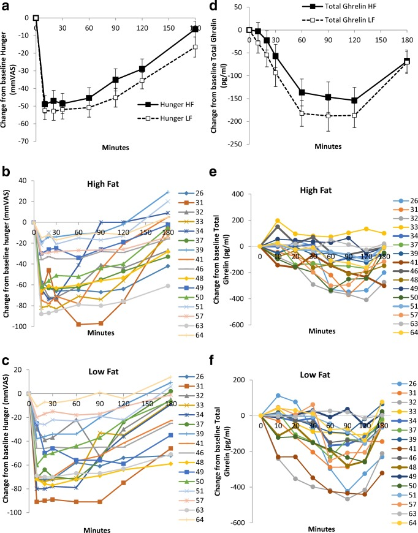

---

## [Minimalist Full-Body Training Plan: Two Sessions Under 45 Minutes](best-minimalist-workout-plan.md)

**Maeo S, Huang M, Wu Y, Sakurai H, Kusagawa Y, Sugiyama T, Kanehisa H, 2021. *Greater Hamstrings Muscle Hypertrophy but Similar Damage Protection after Training at Long versus Short Muscle Lengths***  
[PMC7969179](https://pmc.ncbi.nlm.nih.gov/articles/PMC7969179/) · CC BY-NC-ND · **stored**

- 📊 **FIGURE 1** — Operating ranges of each hamstring muscle on the normalized force–length curve during the seated and prone knee flexion (leg curl) exercise. These were calculated using the OpenSim Lower Limb model (8,9), with the hip joint angle at 90° and 30° for the seated and prone conditions, respectively, and…
  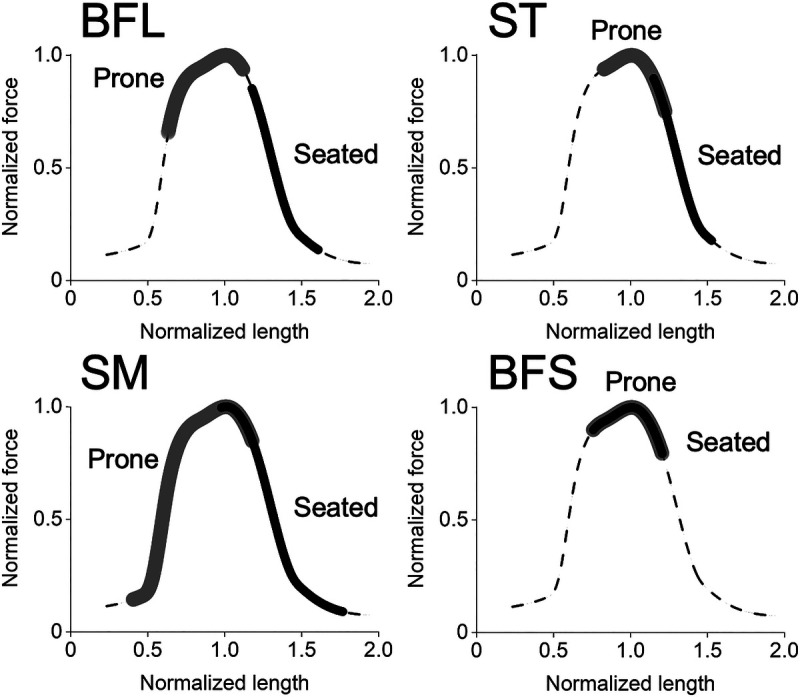
- 🗺 **FIGURE 2** — Flow diagram and demographic information of participants.
  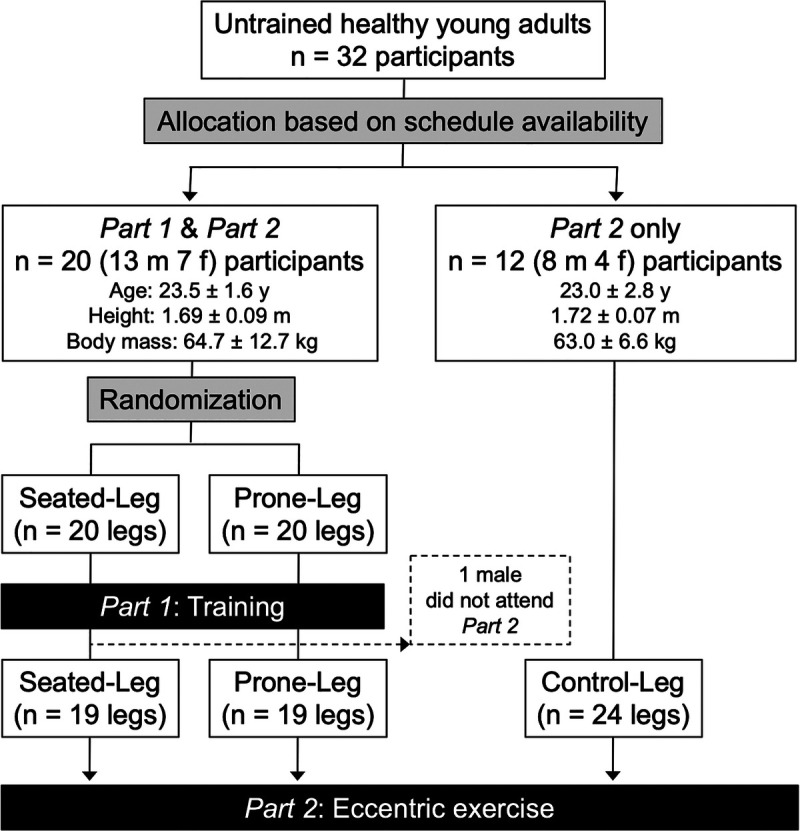
- 🖼 **FIGURE 3** — Example images for the T1-weighted MRI scans (for Seated-Leg in part 1) and T2-weighted MRI scans (for Control-Leg in part 2) at 50% of the thigh length, and a coronal localizer image. The images shown here are all for the right leg, but both legs were scanned in both part 1 and part 2.
  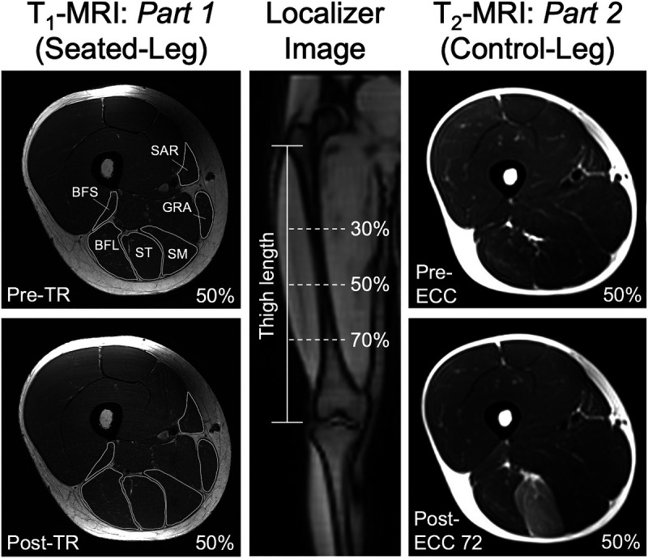
- 📊 **FIGURE 4** — Changes in muscle volume for Seated-Leg and Prone-Leg after training. Data are plotted as individual raw change (Δ) values from baseline (small dots), with a group mean (larger dots) and its 95% CI (indicated by the ends of the vertical error bars) shown together. The CI and the bootstrap sampling…
  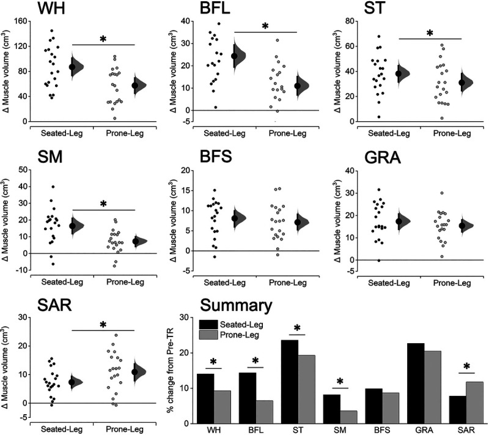
- 📊 **FIGURE 5** — Changes in ACSA of the BFL and ST at 30% (BFLProximal, STProximal) and 70% (BFLDistal, STDistal) of the thigh length for Seated-Leg and Prone-Leg after training. Data are plotted as individual raw change (Δ) values from baseline (small dots), with a group mean (larger dots) and its 95% CI…
  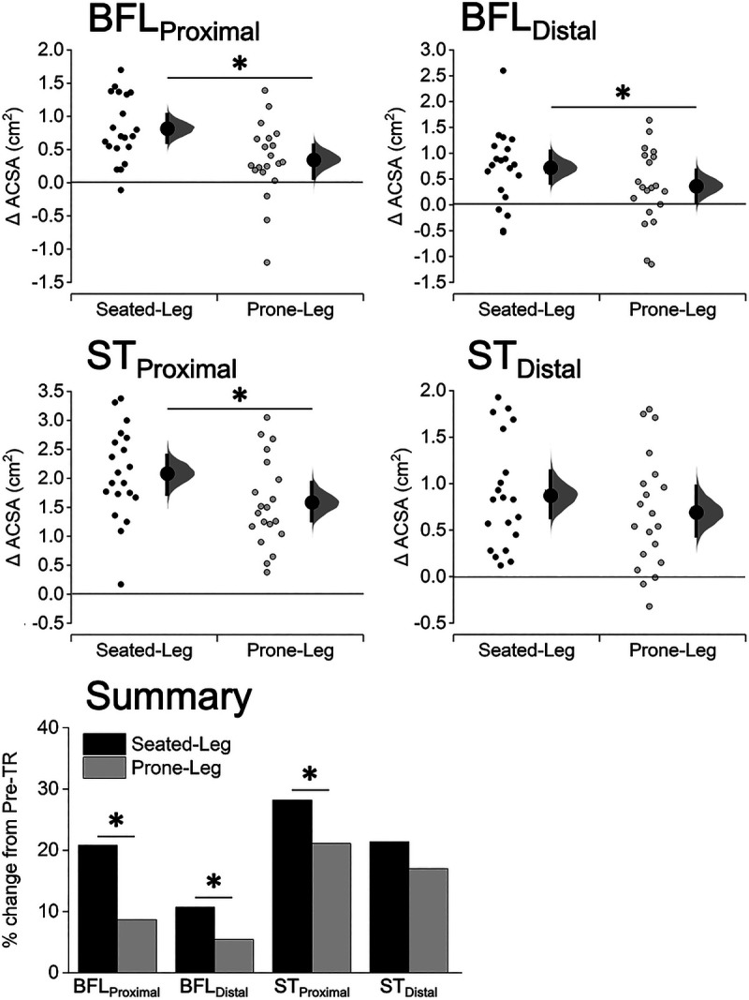
- 📊 **FIGURE 6** — Changes in T2 of each hamstring muscle at 50% of the thigh length (BFLMiddle, STMiddle, SMMiddle, BFSMiddle) at 72 h after eccentric exercise for Seated-Leg, Prone-Leg, and Control-Leg. Data are plotted as individual raw change (Δ) values from baseline (small dots), with a group mean (larger dots)…
  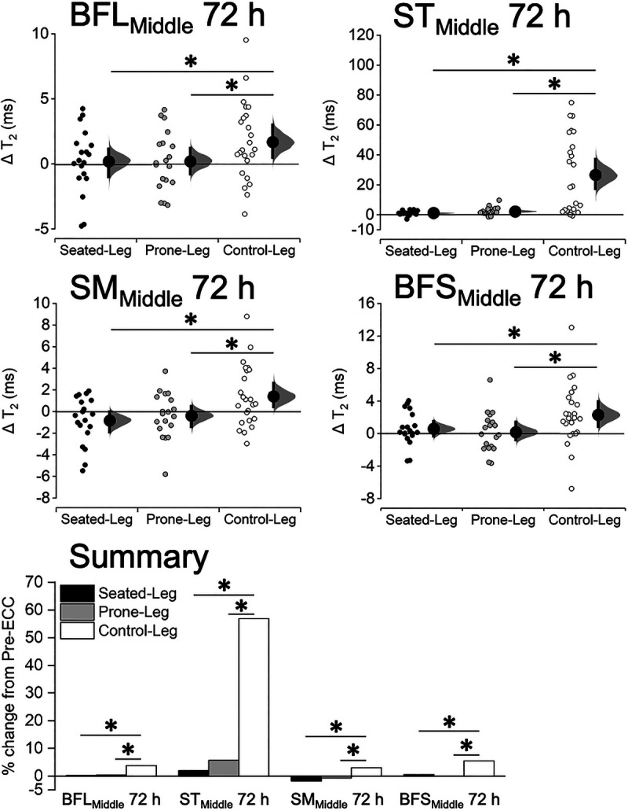
- 📊 **FIGURE 7** — Changes in T2 of the BFL and ST at 30% (BFLProximal, STProximal) and 70% (BFLDistal, STDistal) of the thigh length at 72 h after eccentric exercise for Seated-Leg, Prone-Leg, and Control-Leg. Data are plotted as individual raw change (Δ) values from baseline (small dots), with a group mean (larger…
  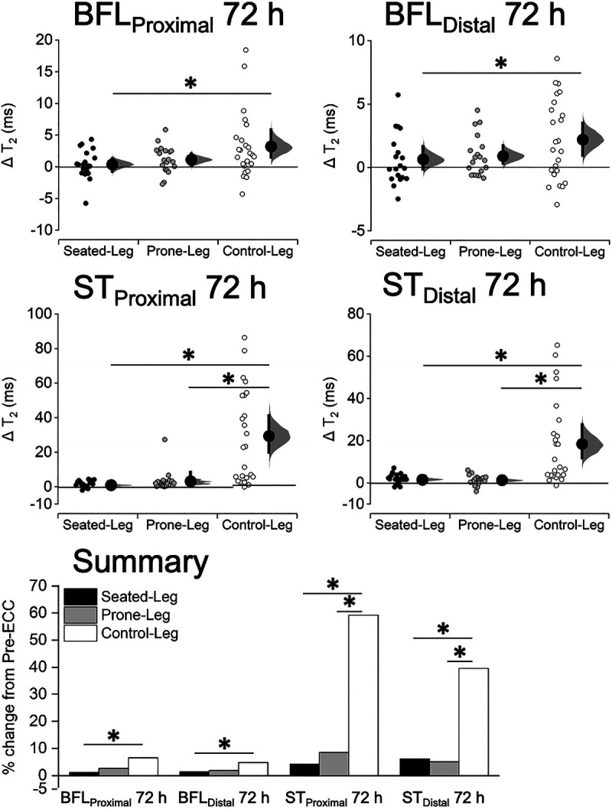
- 📊 **FIGURE 8** — Changes in the seated and prone leg curl 1RM at 24, 48, and 72 h after eccentric exercise for Seated-Leg, Prone-Leg, and Control-Leg. Data are plotted as individual raw change (Δ) values from baseline (small dots), with a group mean (larger dots) and its 95% CI (indicated by the ends of the…
  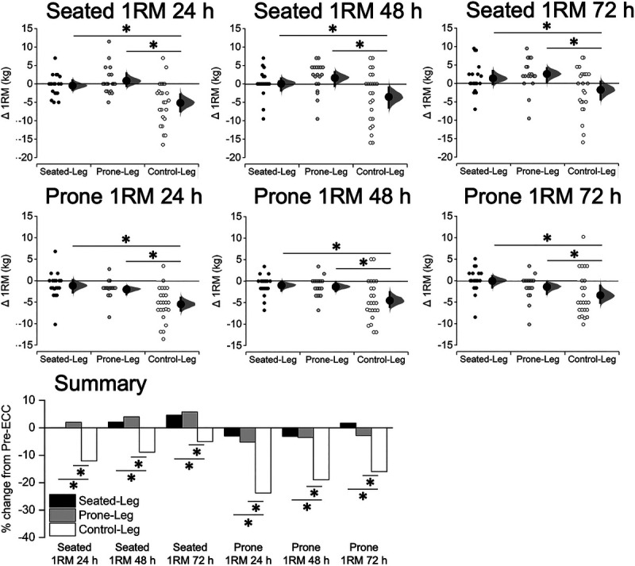

---

## [Chest Exercises Ranked: Top 10 Best and 3 Worst](best-worst-chest-exercises-build-muscle.md)

**Schoenfeld BJ, Grgic J. 2020. *Effects of range of motion on muscle development during resistance training interventions: A systematic review***  
[PMC6977096](https://pmc.ncbi.nlm.nih.gov/articles/PMC6977096/) · CC BY-NC · **stored**

- 🗺 **Figure 1.** — PRISMA flowchart.
  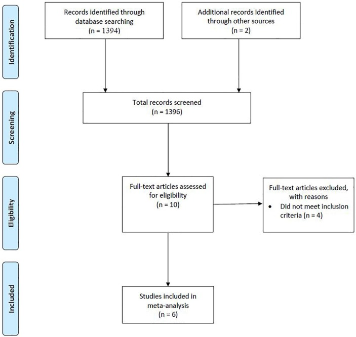

---

## [Biceps Exercises Ranked S–F: What Actually Builds Arms](biceps-exercises-ranked.md)

**Zabaleta-Korta A, Fernández-Peña E, Torres-Unda J, Francés M, Zubillag 2023. *Regional Hypertrophy: The Effect of Exercises at Long and Short Muscle Lengths in Recreationally Trained Women***  
[PMC10407320](https://pmc.ncbi.nlm.nih.gov/articles/PMC10407320/) · CC BY · **stored**

- 🖼 **Figure 1** — A representative measurement of MT of a subject from an Ultrasound Scan.
  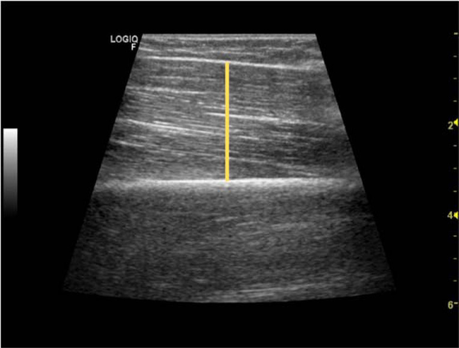
- 🖼 **Figure 2** — Incline press (INC) and preacher curls (PREA) exercises and their resistance profiles (Loss and Candotti, 2008). A. Initial position; B. Final position; C. Resistance torque during elbow flexion.
  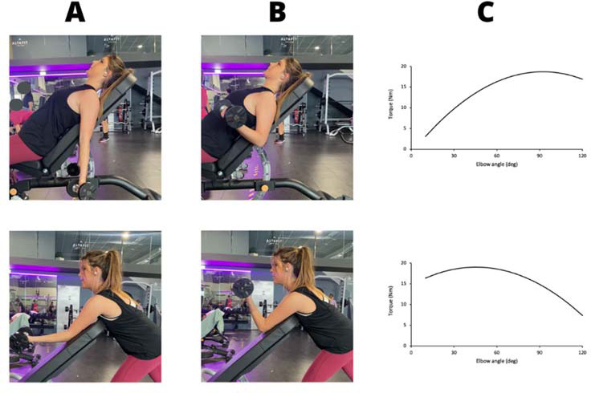
- 📊 **Figure 3** — Muscle growth per region (in percentages). * significantly different from pre
  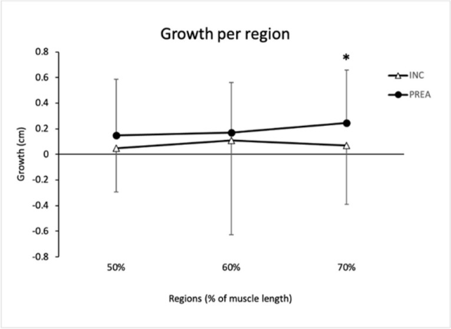

---

## [Body Recomposition: Building Muscle and Losing Fat at the Same Time](body-recomposition.md)

**Jäger R, Purpura M, Shao A, Inoue T, Kreider RB. 2011. *Analysis of the efficacy, safety, and regulatory status of novel forms of creatine***  
[PMC3080578](https://pmc.ncbi.nlm.nih.gov/articles/PMC3080578/) · CC BY-NC · **stored**

- 🖼 **Fig. 1** — Creatine salts
  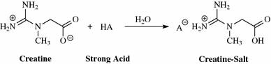
- 🖼 **Fig. 2** — Chemical structure of creatine and creatine derivatives
  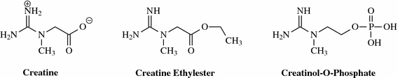
- 🖼 **Fig. 3** — Stability of creatine monohydrate powder. Adapted from Jäger (2003)
  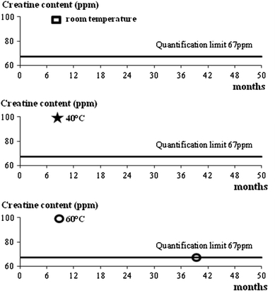
- 🖼 **Fig. 4** — Degradation of creatine to creatinine
  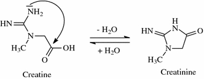
- 🖼 **Fig. 5** — Effect of pH on creatine stability in solution. Adapted from Howard and Harris (1999)
  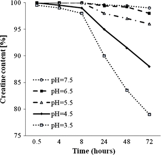
- 🖼 **Fig. 6** — Very low pH prevents creatine degradation
  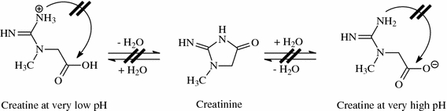
- 🖼 **Fig. 7** — Degradation of creatine and creatine ester
  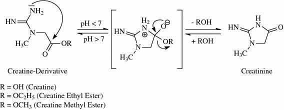
- 📊 **Fig. 8** — Comparison of blood plasma levels of different forms of creatine. Adapted from Jäger et al. (2007)
  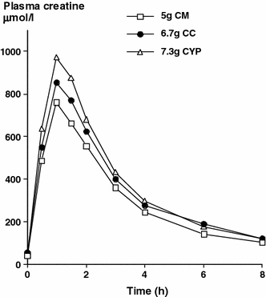
- 🖼 **Fig. 9** — Percentage of creatine retained during a 3-day loading period (20 g/day). Adapted from Greenwood et al. (2003)
  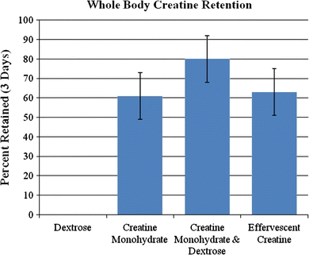
- 🖼 **Fig. 10** — Change in muscle-free creatine content in response to 5 days of low or high-dose creatine serum and placebo ingestion compared to CM. Adapted from Kreider et al. (2003b)
  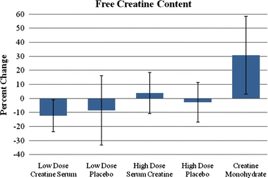
- 📊 **Fig. 11** — Changes in total muscle creatine content in response to placebo (PLA), creatine monohydrate (CRT), and creatine ethyl ester (CEE) supplementation (Spillane et al. 2009). †Significantly different from PLA group. *Significant difference from baseline. Reprinted with permission
  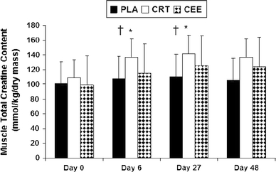
- 🖼 **Fig. 12** — Change in whole body creatine retention in response to 5 days of placebo, creatine monohydrate (CM), low-dose d-pinitol (P) and CM, and high-dose P and CM supplementation. Adapted from Kerksick et al. (2007)
  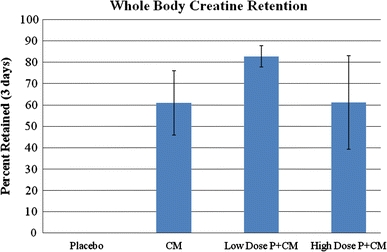
- 🖼 **Fig. 13** — Influence of Russian tarragon on creatine absorption. Adapted from Jäger et al. (2008a)
  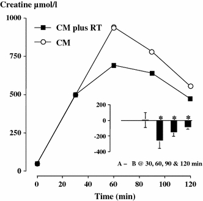

---

## [Is Breakfast the Most Important Meal of the Day?](breakfast-most-important-meal-day.md)

**Betts JA, Thompson D, Richardson JD, Chowdhury EA, Jeans M, Holman GD, 2011. *Bath Breakfast Project (BBP)--examining the role of extended daily fasting in human energy balance and associated health outcomes: study protocol for a randomised controlled trial [ISRCTN31521726]***  
[PMC3146843](https://pmc.ncbi.nlm.nih.gov/articles/PMC3146843/) · CC BY · **stored**

- 🖼 **Figure 1** — Proposed mechanistic pathway underlying the relationships between extended daily fasting, energy balance and health outcomes.
  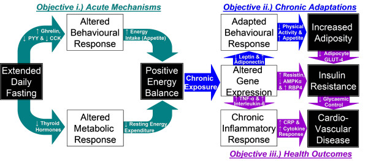
- 🗺 **Figure 2** — Flow diagram illustrating progress through each phase of the trial [adapted from current CONSORT guidelines; [63]].
  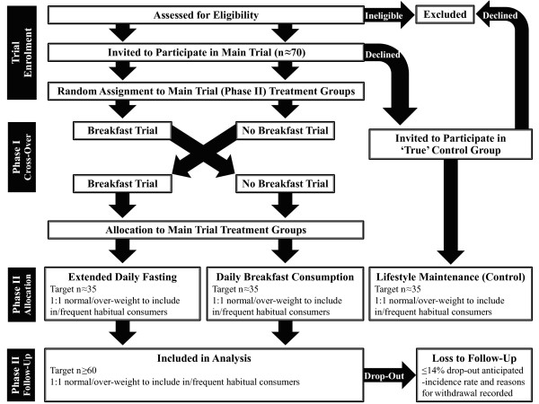

**Chowdhury EA, Richardson JD, Holman GD, Tsintzas K, Thompson D, Betts 2016. *The causal role of breakfast in energy balance and health: a randomized controlled trial in obese adults***  
[PMC4763497](https://pmc.ncbi.nlm.nih.gov/articles/PMC4763497/) · CC BY · **stored**

- 📊 **FIGURE 1** — Components of energy balance under free-living conditions with either the ingestion of ≥700 kcal before 1100 daily (breakfast group) or abstinence from all energy-providing nutrients until at least 1200 daily (fasting group). Data are means with SE bars compared with use of independent t tests.…
  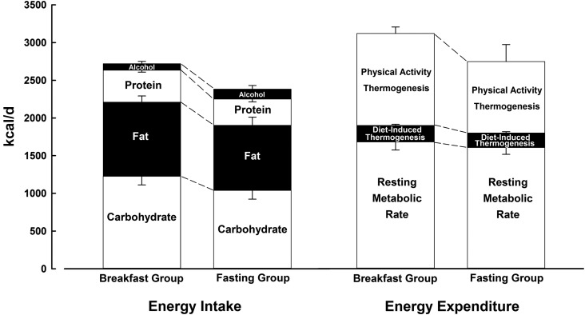
- 📊 **FIGURE 2** — Physical activity thermogenesis under free-living conditions with either the ingestion of ≥700 kcal before 1100 daily (breakfast group, n = 9) or abstinence from all energy-providing nutrients until at least 1200 daily (fasting group, n = 10). Data are means with SE bars. P values represent the…
  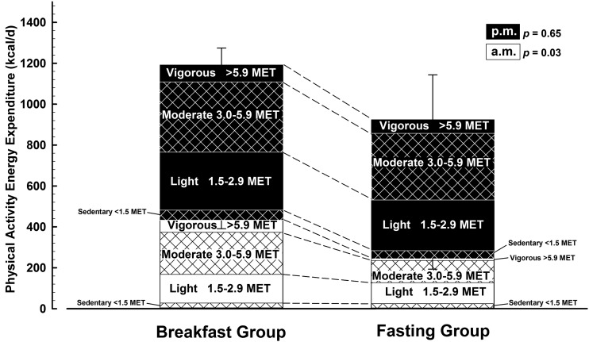
- 📊 **FIGURE 3** — Insulinemic responses to the oral-glucose-tolerance test measured at baseline and after 6 wk (follow-up) of ingestion of ≥700 kcal before 1100 daily (breakfast group, n = 9) or abstinence from all energy-providing nutrients until at least 1200 daily (fasting group, n = 9), for which missing data…
  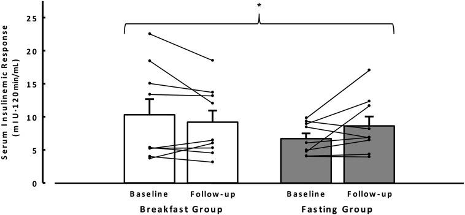
- 📊 **FIGURE 4** — Rates of [U-14C]d-glucose uptake in adipocytes under basal, physiologic (50 pmol/L insulin) and supraphysiologic (20 nmol/L insulin) conditions, measured at baseline and after 6 wk of ingestion of ≥700 kcal before 1100 daily (breakfast group, n = 9) or abstinence from all energy-providing nutrients…
  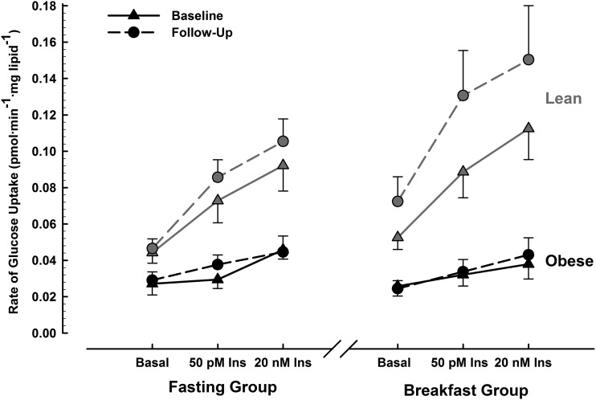

---

## [Bro Science vs Real Science: Bret Contreras on Mind-Muscle, EMG, Failure and Volume](bro-science-vs-real-science.md)

**Schoenfeld BJ, Contreras B, Krieger J, Grgic J, Delcastillo K, Belliar 2019. *Resistance Training Volume Enhances Muscle Hypertrophy but Not Strength in Trained Men***  
[PMC6303131](https://pmc.ncbi.nlm.nih.gov/articles/PMC6303131/) · CC BY-NC-ND · **stored**

- 🗺 **FIGURE 1** — Flowchart of data collection process.
  
- 🖼 **FIGURE 2** — Prestudy to poststudy changes in muscle strength and endurance for each condition. (A) 1RM bench press; (B) 1RM squat; (C) upper body muscular endurance. Values for 1RMBENCH and RMSQUAT are in kilograms; values for 50%BP are in repetitions.
  
- 🖼 **FIGURE 3** — Prestudy to poststudy changes in MT for each condition. (A) Elbow flexors; (B) elbow extensors; (C) mid-thigh; (D) lateral thigh. All values are in millimeters.
  

---

## [Bro Splits vs Higher Frequency: What the Frequency Research Actually Supports](bro-splits-vs-higher-frequency.md)

**Burd NA, West DW, Staples AW, Atherton PJ, Baker JM, Moore DR, Holwerd 2010. *Low-load high volume resistance exercise stimulates muscle protein synthesis more than high-load low volume resistance exercise in young men***  
[PMC2918506](https://pmc.ncbi.nlm.nih.gov/articles/PMC2918506/) · CC BY · **stored**

- 📊 **Figure 1** — Fasted-state mixed (A), myofibrillar (B), and sarcoplasmic (C) protein synthesis (FSR) at rest and following resistance exercise.Capital letter indicates a mean that is significantly different from rest, P<0.05. *Significantly different from 30WM within that time point, P<0.05. †Significantly…
  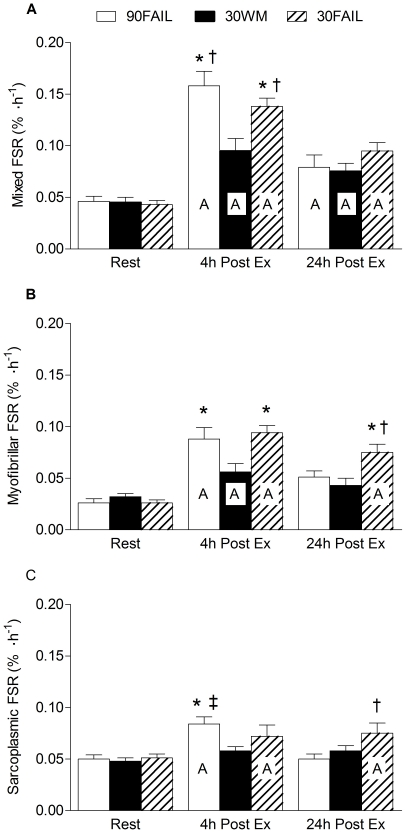
- 📊 **Figure 2** — Akt (A), Erk1/2 (B), mTOR (C) following resistance exercise.Capital letter indicates a mean that is significantly different from rest, P<0.05. *Significantly different from 30WM within that time point, P<0.05. †Significantly different from 90FAIL within that time point. #Significant main effect for…
  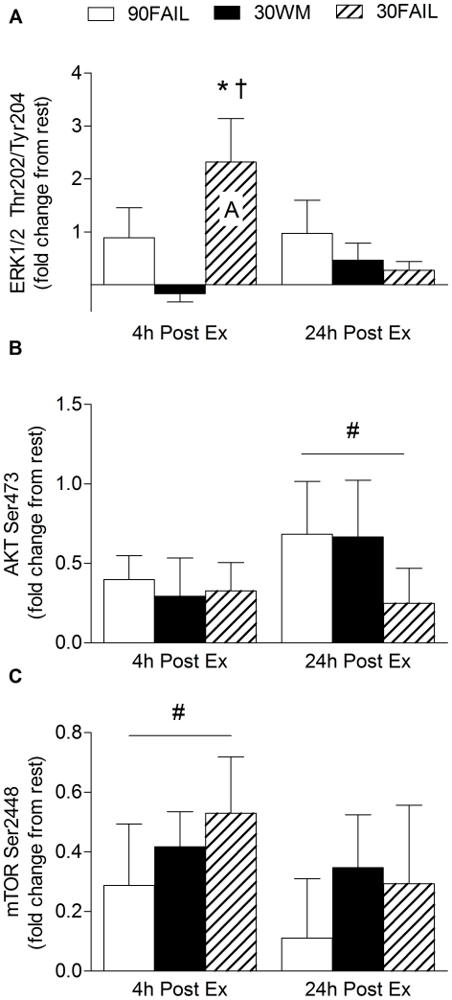
- 📊 **Figure 3** — p70S6K (A), 4E-BP1 (B), and eEF2 (C) following resistance exercise.Capital letter indicates a mean that is significantly different from rest, P<0.05. *Significantly different from 30WM within that time point, P<0.05. †Significantly different from 90FAIL within that time point, P<0.05. #Significant…
  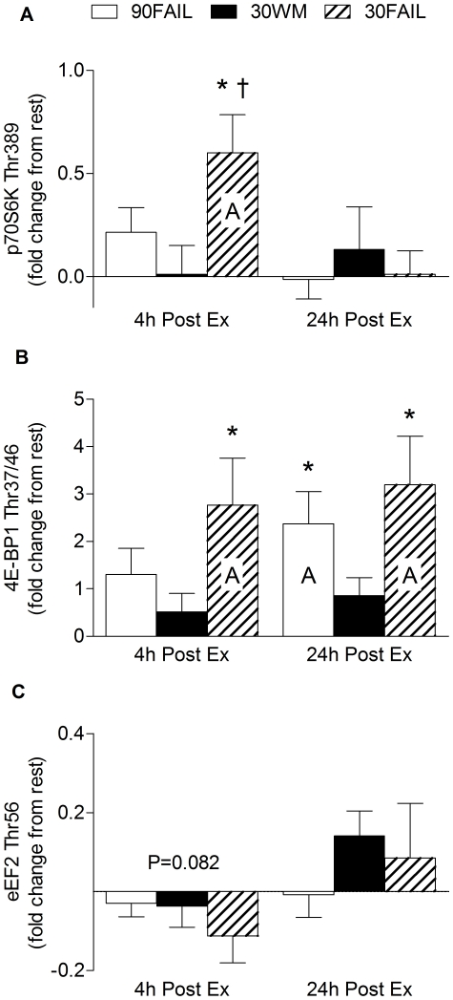
- 📊 **Figure 4** — Relationship between myofibrillar protein synthesis and the extent of phosphorylation of 4E-BP1 (Thr 37/46) at 24 hours following resistance exercise.There was a significant correlation (P = 0.049) between the degree of phosphorylation (fold-change from basal) and myofibrillar protein synthesis…
  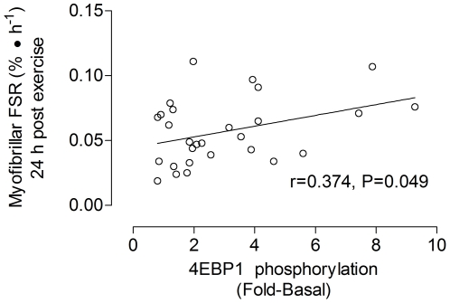
- 📊 **Figure 5** — Pax7 (A), MyoD (B), myogenin (C) mRNA expression in skeletal muscle 24 hours following resistance exercise.Data are expressed as fold change from rest. Data are normalized to GAPDH and reported as mean ± SEM. *Significantly different from rest, P<0.05. †Significantly different from 30WM.
  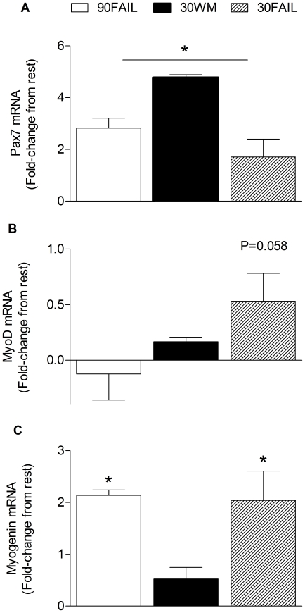

---

## [Cable Glute Kickback: Technique for Isolated Hip Extension](build-bigger-glutes-perfect-training-technique.md)

**Vigotsky AD, Halperin I, Lehman GJ, Trajano GS, Vieira TM. 2017. *Interpreting Signal Amplitudes in Surface Electromyography Studies in Sport and Rehabilitation Sciences***  
[PMC5758546](https://pmc.ncbi.nlm.nih.gov/articles/PMC5758546/) · CC BY · **stored**

- 🖼 **Figure 1** — Production of muscle force from neural input. Excitation is the electrochemical input from the central nervous system into the muscle. This signal triggers excitation-contract coupling, which leads to an active muscle state (activation). Finally, muscle force is produced after cross-bridges are…
  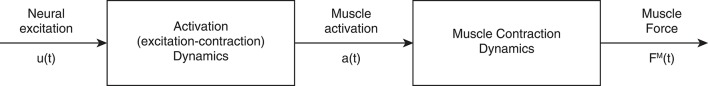
- 🖼 **Figure 2** — Recruitment methods and their effects on sEMG amplitude. Case 1: If a muscle recruits motor units from superficial to deep, then this will result in sEMG amplitude rising at a faster rate than force; that is, sEMG amplitude (% MVIC) ≥ Force (% MVIC). Case 2: If a muscle recruits motor units from…
  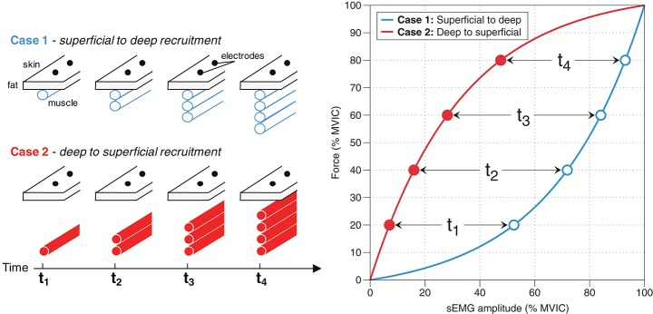
- 📊 **Figure 3** — The isometric relationships between muscle force, activation, excitation, and fiber length. (A) Only the active curve is affected by activation, and any activation can occur regardless of the muscle's normalized force output. That is, activation is independent of fiber length; normalized force is a…
  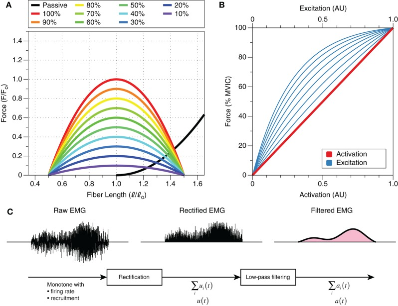
- 📊 **Figure 4** — Under-representative sampling of motor units with sEMG. (A) Unlike observed for skin parallel-fibered muscles, the same action potentials propagating along the fibers of pennated muscles are not sampled by a single pair of surface electrodes positioned anywhere on the muscle. As exemplified above,…
  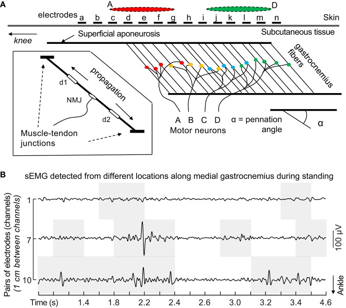

---

## [Building Muscle At Home With No Equipment: Principles And Exercise Menu](build-muscle-home-workouts.md)

**Goldberg EL, Molony RD, Kudo E, Sidorov S, Kong Y, Dixit VD, Iwasaki A 2019. *Ketogenic diet activates protective γδ T cell responses against influenza virus infection***  
[PMC7189564](https://pmc.ncbi.nlm.nih.gov/articles/PMC7189564/) · NIH manuscript — text mining/fair use only · link only

- 📊 **Figure 1.** — γδ T cells are required for improved survival of KD-fed mice during IAV infection(A) Body weight change (pooled from 5 independent experiments for a total of n=25 chow and n=33 KD mice analyzed) and (B) survival after infection with 108 PFU A/PR8 IAV in chow (n=7) vs KD (n=10). Survival differences… ([view](https://pmc.ncbi.nlm.nih.gov/articles/PMC7189564/figure/F1/))
- 📊 **Figure 2.** — High-fat content of KD is not sufficient to induce protective γδ T cells.(A) Body weight change of chow (n=5), KD (n=7), and HFD-fed (n=9) mice after infection with 108 pfu IAV. (B) Lung γδ T cell abundance 3 days post-IAV infection in chow (n=3), KD (n=5), and HFD-fed (n=5) mice. (C) Frequency of… ([view](https://pmc.ncbi.nlm.nih.gov/articles/PMC7189564/figure/F2/))
- 📊 **Figure 3.** — Protective γδ T cell expansion requires metabolic adaptation to KD.(A) Blood BHB and lung γδ T cells on day 3 post-IAV in mice fed chow (n=5) vs. KD (n=5) vs. 1,3-Butanediol (BD, n=5) beginning 1 week prior to infection. Statistical differences were calculated by 1-way ANOVA with Tukey’s correction… ([view](https://pmc.ncbi.nlm.nih.gov/articles/PMC7189564/figure/F3/))
- 📊 **Figure 4.** — KD-induced protective γδ T cells enhance lung barrier function(A) Heat map of significantly regulated genes (based on adjusted p-value p<0.05) in both comparisons of Mx1 chow vs. Mx1 KD, and Mx1 KD vs. Mx1 Tcrd−/− KD. Genes are ranked from highest to lowest expression. (B-F) Representative images… ([view](https://pmc.ncbi.nlm.nih.gov/articles/PMC7189564/figure/F4/))

---

## [Body Recomposition: Building Muscle While Losing Fat](build-muscle-lose-fat-same-time.md)

**Antonio J, Ellerbroek A, Silver T, Orris S, Scheiner M, Gonzalez A, Pe 2015. *A high protein diet (3.4 g/kg/d) combined with a heavy resistance training program improves body composition in healthy trained men and women--a follow-up investigation***  
[PMC4617900](https://pmc.ncbi.nlm.nih.gov/articles/PMC4617900/) · CC BY · **stored**

- 📊 **Fig. 1** — Each data point represents the change for an individual. The horizontal lines represent the mean ± SD. Legend: HP – high protein; NP – normal protein
  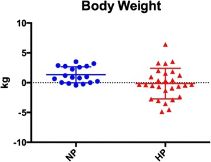
- 📊 **Fig. 2** — Each data point represents the change for an individual. The horizontal lines represent the mean ± SD. Legend: HP – high protein; NP – normal protein
  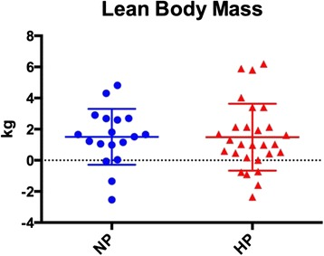
- 📊 **Fig. 3** — Each data point represents the change for an individual. The horizontal lines represent the mean ± SD. Legend: HP – high protein; NP – normal protein
  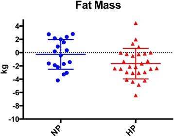
- 📊 **Fig. 4** — Each data point represents the change for an individual. The horizontal lines represent the mean ± SD. Legend: HP – high protein; NP – normal protein
  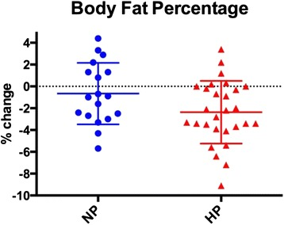

---

## [How Muscle Growth Works, From Basics to Molecular Signalling (5 Levels)](build-muscle.md)

**Morton RW, Murphy KT, McKellar SR, Schoenfeld BJ, Henselmans M, Helms 2018. *A systematic review, meta-analysis and meta-regression of the effect of protein supplementation on resistance training-induced gains in muscle mass and strength in healthy adults***  
[PMC5867436](https://pmc.ncbi.nlm.nih.gov/articles/PMC5867436/) · CC BY-NC · **stored**

- 🗺 **Figure 1** — PRISMA flow chart.
  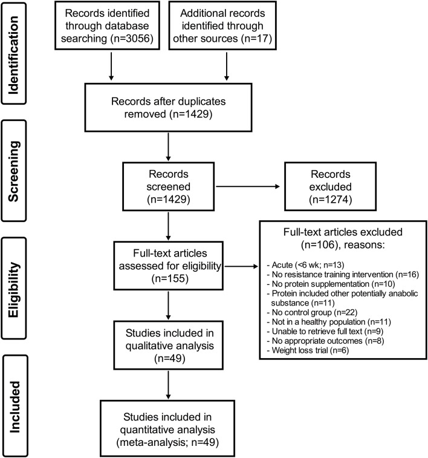
- 📊 **Figure 2** — Forest plot of the results from a random-effects meta-analysis shown as mean difference with 95% CIs on one-repetition-maximum (1 RM; kg) in untrained and trained participants. For each study, the circle represents the mean difference of the intervention effect with the horizontal line intersecting…
  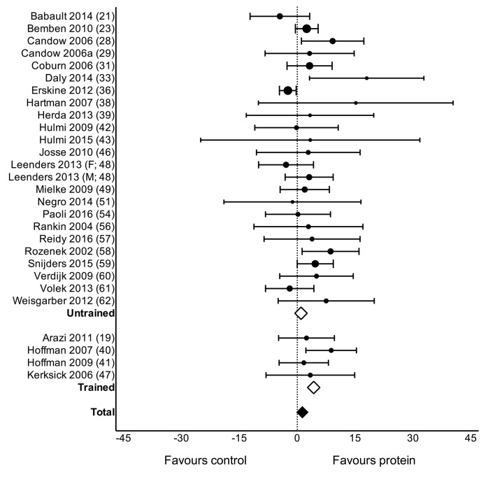
- 📊 **Figure 3** — Forest plot of the results from a random-effects meta-analysis shown as mean difference with 95% CIs on lean or fat-free mass (FFM; kg) in untrained and trained participants. For each study, the circle represents the mean difference of the intervention effect with the horizontal line intersecting…
  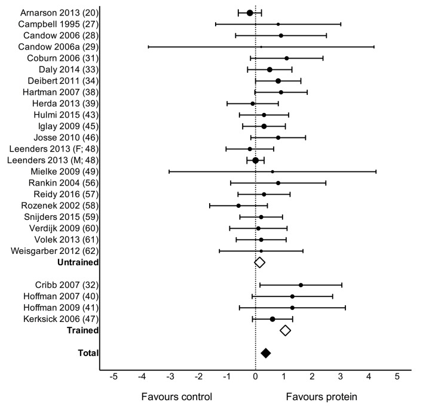
- 📊 **Figure 4** — Random-effects univariate meta-regression between age and the mean difference in fat-free mass (FFM) between groups. Each circle represents a study and the size of the circle reflects the influence of that study on the model (inversely proportionate to the SE of that study). The regression…
  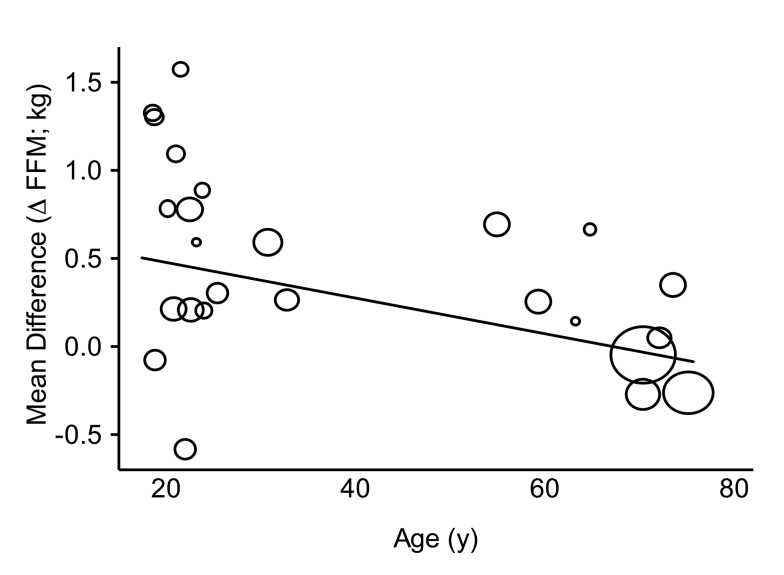
- 📊 **Figure 5** — Segmental linear regression between relative total protein intake (g/kg body mass/day) and the change in fat-free mass (ΔFFM) measured by dual energy X-ray absorptiometry. Each circle represents a single group from a study. Dashed arrow indicates the break point=1.62 g protein/kg/day, p=0.079.…
  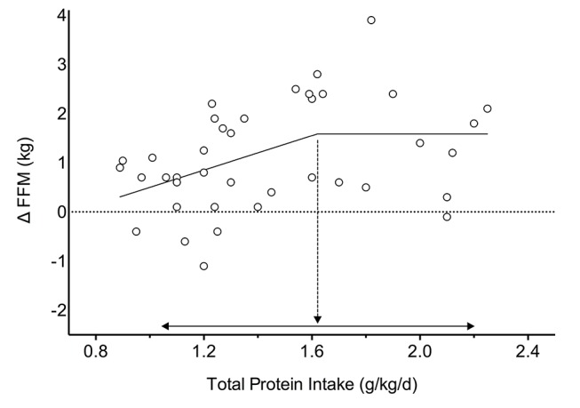

**Nyakayiru J, Fuchs CJ, Trommelen J, Smeets JSJ, Senden JM, Gijsen AP, 2019. *Blood Flow Restriction Only Increases Myofibrillar Protein Synthesis with Exercise***  
[PMC6553970](https://pmc.ncbi.nlm.nih.gov/articles/PMC6553970/) · CC BY-NC-ND · **stored**

- 🗺 **FIGURE 1** — Schematic representation of the experimental protocol. The exercise group performed LLRE (LLRE leg vs LLRE + BFR leg; n = 10) and the REST group remained in resting conditions (REST leg vs REST + BFR leg; n = 10).
  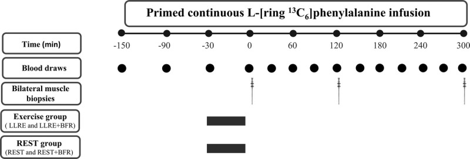
- 📊 **FIGURE 2** — Mean ± SEM (A; n = 10) and individual (B) myofibrillar protein fractional synthetic rates (FSR) measured over a 0- to 5-h period after LLRE combined with (LLRE + BFR leg) and without (LLRE leg) BFR. Data were analyzed using a paired samples t-test (control leg vs BFR leg, within groups). *Indicates…
  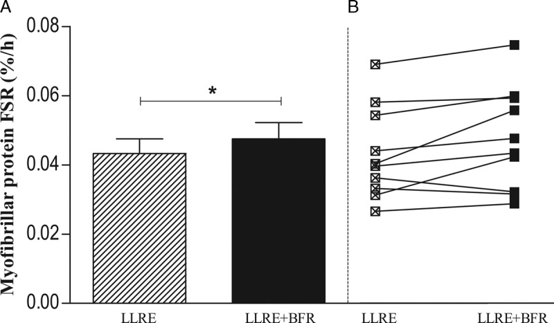
- 📊 **FIGURE 3** — Mean ± SEM (panel A; n = 10) and individual (panel B) myofibrillar protein fractional synthetic rates (FSR) measured over a 0- to 5-h period during resting conditions with (REST + BFR leg) and without (REST leg) BFR. Data were analyzed with paired samples t-test (control vs BFR leg, within groups).…
  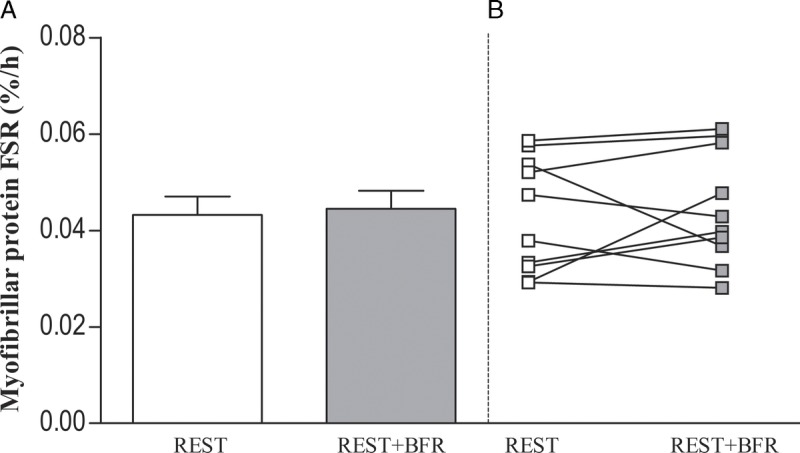
- 📊 **FIGURE 4** — Mean ± SEM skeletal muscle phosphorylation status of ACC, after LLRE (A) with (LLRE + BFR; n = 10) and without (LLRE; n = 10) BFR. Mean ± SEM skeletal muscle phosphorylation status of ACC, during resting conditions (B) with (REST + BFR) and without (REST) BFR. Data were analyzed with a two-way…
  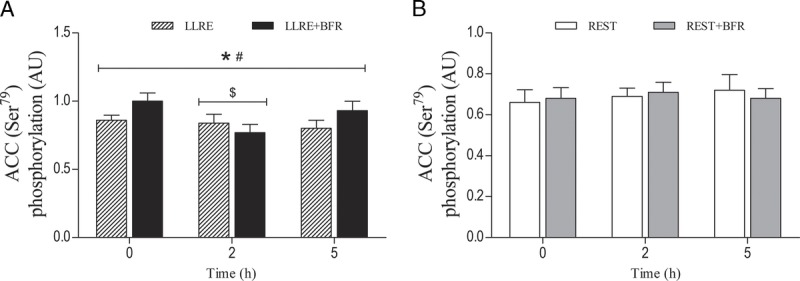
- 📊 **FIGURE 5** — Mean ± SEM skeletal muscle phosphorylation status of selected anabolic signaling proteins, after LLRE (A–D; n = 10) and during resting conditions (E–H; n = 10). Data were analyzed with a two-way repeated-measures ANOVA (time–treatment leg) within groups. Differences were only observed within the…
  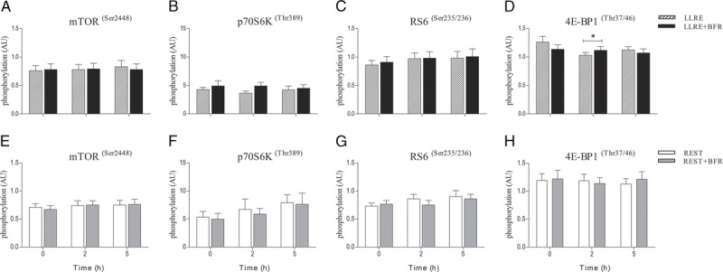
- 📊 **FIGURE 6** — Mean ± SEM skeletal muscle mRNA expression of selected genes, after LLRE (A–D; n = 10) and during resting conditions (E–H; n = 9). Data were analyzed with a two-way repeated-measures ANOVA (time–treatment leg) within groups. Exercise group: MuRF1 time–treatment leg interaction, P = 0.002.…
  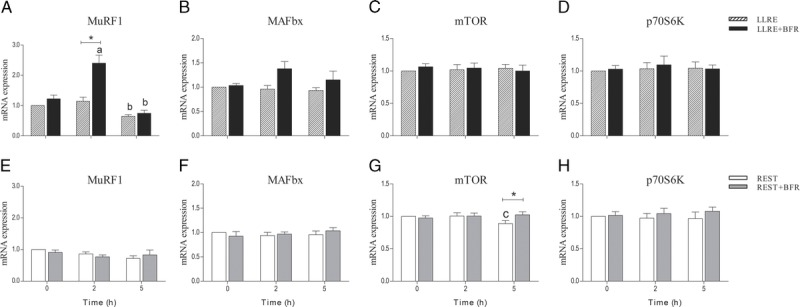

---

## [Calf Training: Gastroc vs Soleus, Exercise Choice, and How Much Volume](calf-training.md)

**Vigotsky AD, Halperin I, Lehman GJ, Trajano GS, Vieira TM. 2017. *Interpreting Signal Amplitudes in Surface Electromyography Studies in Sport and Rehabilitation Sciences***  
[PMC5758546](https://pmc.ncbi.nlm.nih.gov/articles/PMC5758546/) · CC BY · **stored**

- 🖼 **Figure 1** — Production of muscle force from neural input. Excitation is the electrochemical input from the central nervous system into the muscle. This signal triggers excitation-contract coupling, which leads to an active muscle state (activation). Finally, muscle force is produced after cross-bridges are…
  
- 🖼 **Figure 2** — Recruitment methods and their effects on sEMG amplitude. Case 1: If a muscle recruits motor units from superficial to deep, then this will result in sEMG amplitude rising at a faster rate than force; that is, sEMG amplitude (% MVIC) ≥ Force (% MVIC). Case 2: If a muscle recruits motor units from…
  
- 📊 **Figure 3** — The isometric relationships between muscle force, activation, excitation, and fiber length. (A) Only the active curve is affected by activation, and any activation can occur regardless of the muscle's normalized force output. That is, activation is independent of fiber length; normalized force is a…
  
- 📊 **Figure 4** — Under-representative sampling of motor units with sEMG. (A) Unlike observed for skin parallel-fibered muscles, the same action potentials propagating along the fibers of pennated muscles are not sampled by a single pair of surface electrodes positioned anywhere on the muscle. As exemplified above,…
  

---

## [Cardio for Fat Loss: Five Mistakes, and How Much to Actually Do](cardio-for-fat-loss.md)

**Schoenfeld BJ, Aragon AA, Wilborn CD, Krieger JW, Sonmez GT. 2014. *Body composition changes associated with fasted versus non-fasted aerobic exercise***  
[PMC4242477](https://pmc.ncbi.nlm.nih.gov/articles/PMC4242477/) · CC BY · **stored**

- 🖼 **Figure 1** — Percent macronutrient intake for FASTED.
  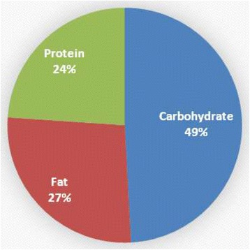
- 🖼 **Figure 2** — Percent macronutrient intake for FED.
  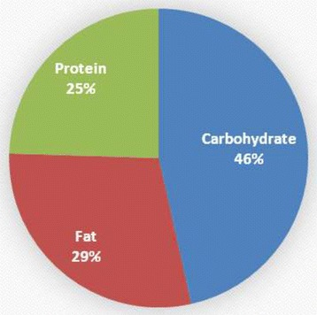

**Petré H, Hemmingsson E, Rosdahl H, Psilander N. 2021. *Development of Maximal Dynamic Strength During Concurrent Resistance and Endurance Training in Untrained, Moderately Trained, and Trained Individuals: A Systematic Review and Meta-analysis***  
[PMC8053170](https://pmc.ncbi.nlm.nih.gov/articles/PMC8053170/) · CC BY · **stored**

- 🗺 **Fig.1** — Flowchart diagram of the study screening process. RT resistance training, CT concurrent training, n number of studies
  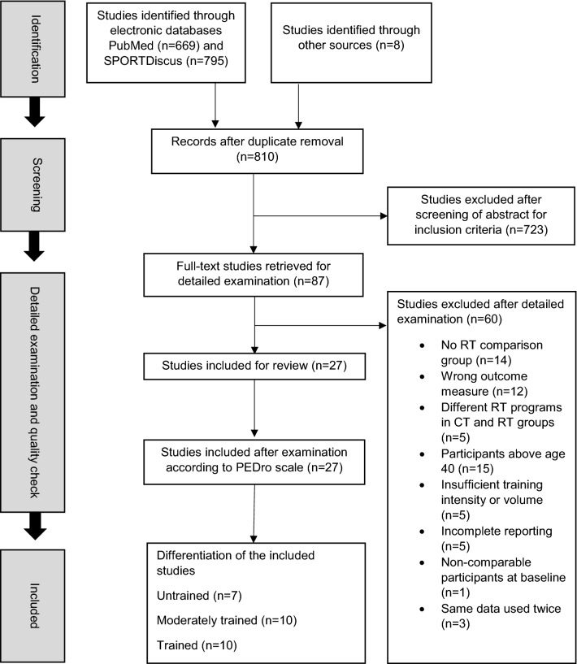
- 📊 **Fig. 2** — Effect on maximal strength of concurrent resistance and endurance training compared with resistance training only. CT concurrent training, CT1 concurrent training group 1, CT2 concurrent training group 2, CT3 concurrent training group 3, RT resistance training, N/A not applicable (only one…
  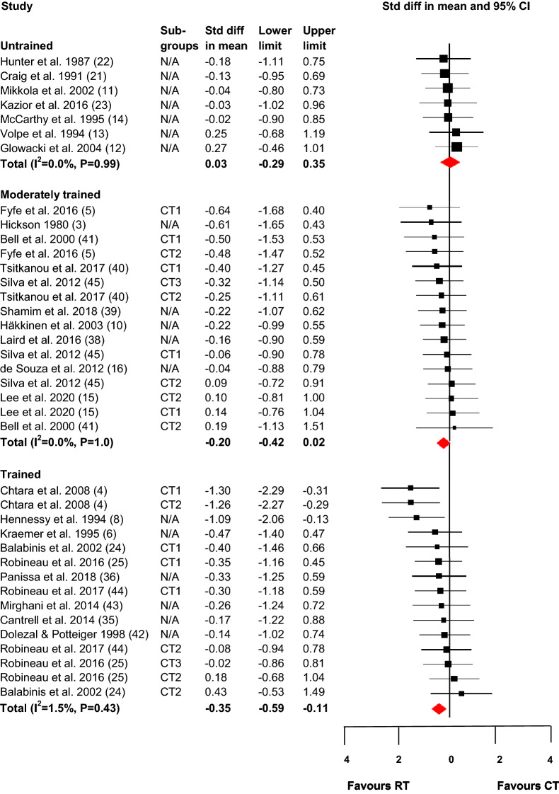
- 📊 **Fig. 3** — Effect on maximal strength of same session concurrent resistance and endurance training compared with resistance training only. CT concurrent training, CT1 concurrent training group 1, CT2 concurrent training group 2, CT3 concurrent training group 3, RT resistance training, N/A not applicable (only…
  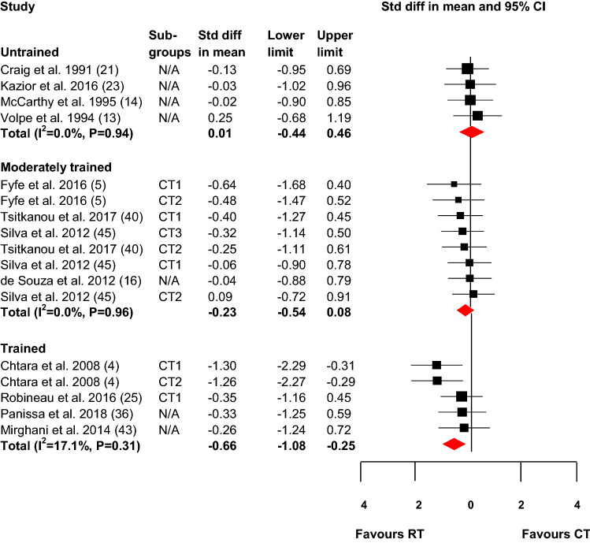
- 📊 **Fig. 4** — Effect on maximal strength of different session concurrent resistance and endurance training compared with resistance training only. CT concurrent training, CT1 concurrent training group 1, CT2 concurrent training group 2, CT3 concurrent training group 3, RT resistance training, N/A not applicable…
  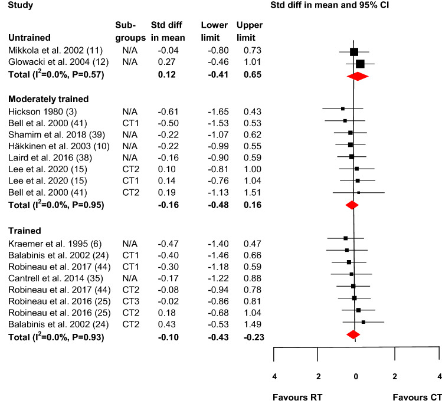

---

## [Acute Testosterone Spikes Don't Build Muscle (The Wood-Chopping Study)](chopping-wood-before-training-boosts-testosterone-48.md)

**Trumble BC, Cummings DK, O'Connor KA, Holman DJ, Smith EA, Kaplan HS, 2013. *Age-independent increases in male salivary testosterone during horticultural activity among Tsimane forager-farmers***  
[PMC3810999](https://pmc.ncbi.nlm.nih.gov/articles/PMC3810999/) · NIH manuscript — text mining/fair use only · link only

- 📊 **Figure 1** — presents the distributions of percent change in testosterone after one hour of tree chopping (n=51) and one hour of soccer (n=82). ([view](https://pmc.ncbi.nlm.nih.gov/articles/PMC3810999/figure/F1/))
- 📊 **Figure 2** — Salivary testosterone before and after one hour of tree-choppingFigure 2A represents the individual changes (n=49) in log testosterone before and after intense physical activity. Figure 2B is the predicted change in testosterone controlling for BMI, and time of day. ([view](https://pmc.ncbi.nlm.nih.gov/articles/PMC3810999/figure/F2/))
- 📊 **Figure 3** — Individual change in testosterone by age for (A) tree chopping and (B) restingEach line segment represents the individual change in testosterone from before to after one hour of (A) tree chopping (n=49) or (B) resting (n=20) centered on the age of the individual. The left end-point of each line is… ([view](https://pmc.ncbi.nlm.nih.gov/articles/PMC3810999/figure/F3/))

**Morton RW, Sato K, Gallaugher MPB, Oikawa SY, McNicholas PD, Fujita S, 2018. *Muscle Androgen Receptor Content but Not Systemic Hormones Is Associated With Resistance Training-Induced Skeletal Muscle Hypertrophy in Healthy, Young Men***  
[PMC6189473](https://pmc.ncbi.nlm.nih.gov/articles/PMC6189473/) · CC BY · **stored**

- 📊 **FIGURE 1** — The change in muscle mass in all participants (top) and HIR and LOR (bottom). Top panels: The change in (A) type 1 CSA, (B) type 2 CSA, and (C) LBM from all 49 participants. Bottom panels: The change in (D) type 1 CSA, (E) type 2 CSA, and (F) LBM categorized into HIR and LOR. Values are presented…
  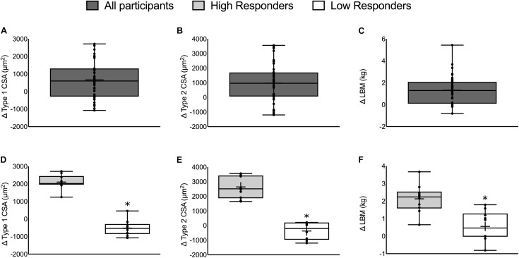
- 📊 **FIGURE 2** — Scree plots illustrating the proportion of variance in the original hormones explained by each principal component. The panels include the principal components derived from systemic hormones measured: (A) pre-intervention post-exercise, (B) post-intervention post-exercise, (C) pre-intervention…
  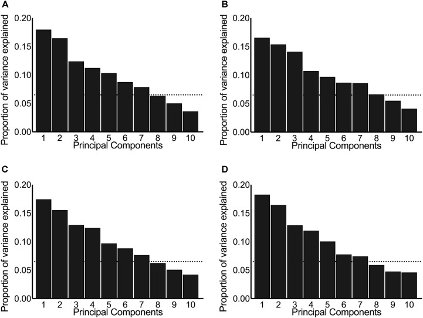
- 📊 **FIGURE 3** — Intramuscular (A) free testosterone concentration, (B) dihydrotestosterone concentration, (C) 5α-reductase expression, and (D) androgen receptor content presented pre- and post-intervention in both high- and low-responders. Representative immunoblots for 5α-reductase expression (C) and androgen…
  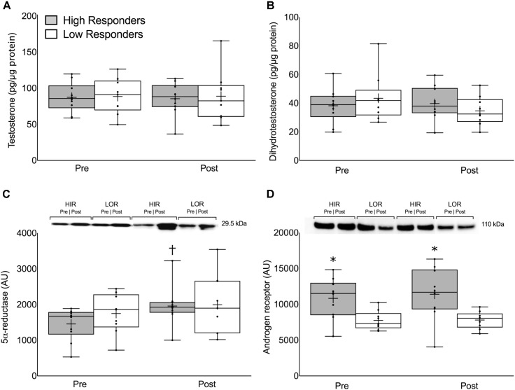
- 📊 **FIGURE 4** — Correlations between the pre-intervention intramuscular androgen receptor content and changes in muscle mass. Correlations are presented in panels for: (A) type 1 CSA (r = 0.51, P = 0.03), (B) type 2 CSA (r = 0.61, P < 0.01), and (C) LBM (r = 0.76, P < 0.01). In (C), the outlier that was removed…
  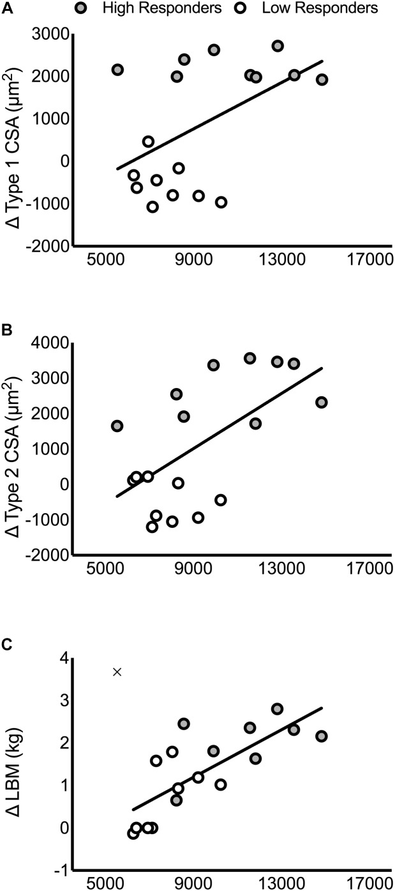

---

## [Creatine: Dosing, Loading, Timing, Non-Responders and the Hair Loss Question](creatine.md)

**Jäger R, Purpura M, Shao A, Inoue T, Kreider RB. 2011. *Analysis of the efficacy, safety, and regulatory status of novel forms of creatine***  
[PMC3080578](https://pmc.ncbi.nlm.nih.gov/articles/PMC3080578/) · CC BY-NC · **stored**

- 🖼 **Fig. 1** — Creatine salts
  
- 🖼 **Fig. 2** — Chemical structure of creatine and creatine derivatives
  
- 🖼 **Fig. 3** — Stability of creatine monohydrate powder. Adapted from Jäger (2003)
  
- 🖼 **Fig. 4** — Degradation of creatine to creatinine
  
- 🖼 **Fig. 5** — Effect of pH on creatine stability in solution. Adapted from Howard and Harris (1999)
  
- 🖼 **Fig. 6** — Very low pH prevents creatine degradation
  
- 🖼 **Fig. 7** — Degradation of creatine and creatine ester
  
- 📊 **Fig. 8** — Comparison of blood plasma levels of different forms of creatine. Adapted from Jäger et al. (2007)
  
- 🖼 **Fig. 9** — Percentage of creatine retained during a 3-day loading period (20 g/day). Adapted from Greenwood et al. (2003)
  
- 🖼 **Fig. 10** — Change in muscle-free creatine content in response to 5 days of low or high-dose creatine serum and placebo ingestion compared to CM. Adapted from Kreider et al. (2003b)
  
- 📊 **Fig. 11** — Changes in total muscle creatine content in response to placebo (PLA), creatine monohydrate (CRT), and creatine ethyl ester (CEE) supplementation (Spillane et al. 2009). †Significantly different from PLA group. *Significant difference from baseline. Reprinted with permission
  
- 🖼 **Fig. 12** — Change in whole body creatine retention in response to 5 days of placebo, creatine monohydrate (CM), low-dose d-pinitol (P) and CM, and high-dose P and CM supplementation. Adapted from Kerksick et al. (2007)
  
- 🖼 **Fig. 13** — Influence of Russian tarragon on creatine absorption. Adapted from Jäger et al. (2008a)
  

**Antonio J, Ciccone V. 2013. *The effects of pre versus post workout supplementation of creatine monohydrate on body composition and strength***  
[PMC3750511](https://pmc.ncbi.nlm.nih.gov/articles/PMC3750511/) · CC BY · **stored**

- 🖼 **Figure 1** — Individual data for FFM in the POST-SUPP group.
  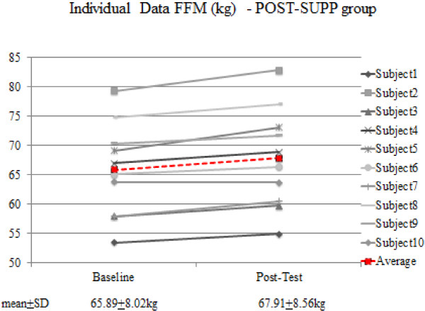
- 🖼 **Figure 2** — Individual data for FFM in the PRE-SUPP group.
  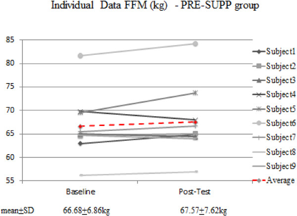

**Kreider RB, Kalman DS, Antonio J, Ziegenfuss TN, Wildman R, Collins R, 2017. *International Society of Sports Nutrition position stand: safety and efficacy of creatine supplementation in exercise, sport, and medicine***  
[PMC5469049](https://pmc.ncbi.nlm.nih.gov/articles/PMC5469049/) · CC BY · **stored**

- 🖼 **Fig. 1** — Chemical structure and biochemical pathway for creatine synthesis. From Kreider and Jung [6]
  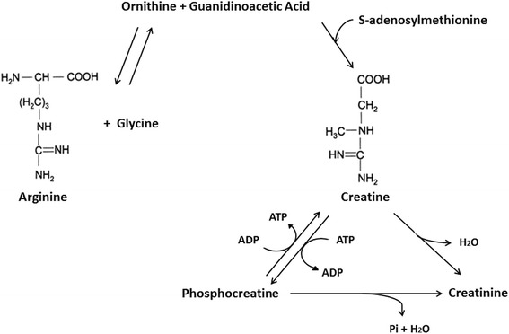
- 🖼 **Fig. 2** — Proposed creatine kinase/phosphocreatine (CK/PCr) energy shuttle. CRT = creatine transporter; ANT = adenine nucleotide translocator; ATP = adenine triphosphate; ADP = adenine diphosphate; OP = oxidative phosphorylation; mtCK = mitochondrial creatine kinase; G = glycolysis; CK-g = creatine kinase…
  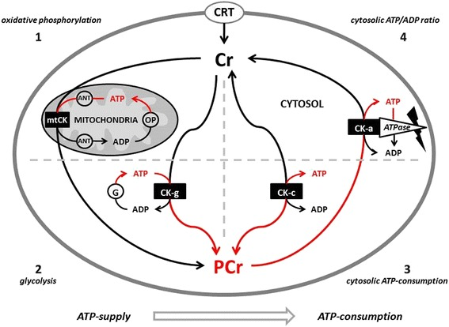
- 🖼 **Fig. 3** — Role of mitochondrial creatine kinase (mtCK) in high energy metabolite transport and cellular respiration. VDAC = voltage-dependent anion channel; ROS = reactive oxygen species; RNS = reactive nitrogen species; ANT = adenine nucleotide translocator; ATP = adenine triphosphate; ADP = adenine…
  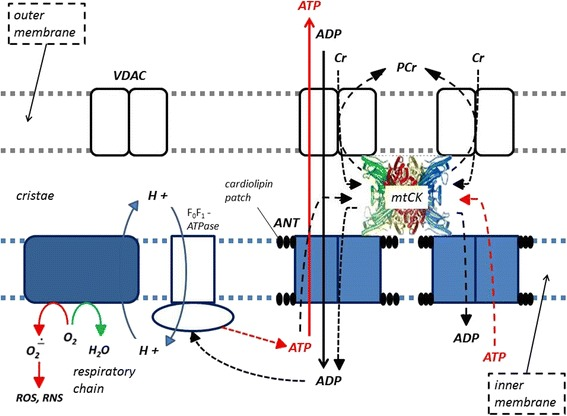
- 🖼 **Fig. 4** — Approximate muscle total creatine levels in mmol/kg dry weight muscle reported in the literature for vegetarians, individuals following a normal diet, and in response to creatine loading with or without carbohydrate (CHO) or CHO and protein (PRO). From Kreider and Jung [6]
  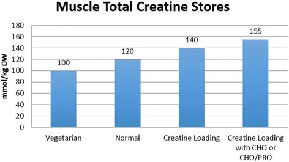

---

## [100 Days of Low-Volume Training: What Halving Your Sets Actually Does](cut-number-sets-half.md)

**Schoenfeld BJ, Contreras B, Krieger J, Grgic J, Delcastillo K, Belliar 2019. *Resistance Training Volume Enhances Muscle Hypertrophy but Not Strength in Trained Men***  
[PMC6303131](https://pmc.ncbi.nlm.nih.gov/articles/PMC6303131/) · CC BY-NC-ND · **stored**

- 🗺 **FIGURE 1** — Flowchart of data collection process.
  
- 🖼 **FIGURE 2** — Prestudy to poststudy changes in muscle strength and endurance for each condition. (A) 1RM bench press; (B) 1RM squat; (C) upper body muscular endurance. Values for 1RMBENCH and RMSQUAT are in kilograms; values for 50%BP are in repetitions.
  
- 🖼 **FIGURE 3** — Prestudy to poststudy changes in MT for each condition. (A) Elbow flexors; (B) elbow extensors; (C) mid-thigh; (D) lateral thigh. All values are in millimeters.
  

---

## [The Health Risks Behind the Decision to Use Steroids](decision-use-steroids.md)

**Kanayama G, Hudson JI, Pope HG. 2008. *Long-term psychiatric and medical consequences of anabolic-androgenic steroid abuse: a looming public health concern?***  
[PMC2646607](https://pmc.ncbi.nlm.nih.gov/articles/PMC2646607/) · NIH manuscript — text mining/fair use only · link only

- 🖼 **Figure 1** — Time points in the evolution of anabolic-androgenic steroid abuse. See text for further discussion and references. ([view](https://pmc.ncbi.nlm.nih.gov/articles/PMC2646607/figure/F1/))

**Bassil N, Alkaade S, Morley JE. 2009. *The benefits and risks of testosterone replacement therapy: a review***  
[PMC2701485](https://pmc.ncbi.nlm.nih.gov/articles/PMC2701485/) · CC BY-NC · **stored**

- 🖼 **Figure 1** — Approach to the diagnosis and treatment of late onset hypogonadism (ADAM = St. Louis University Androgen Deficiency in Aging Males Questionnaire).
  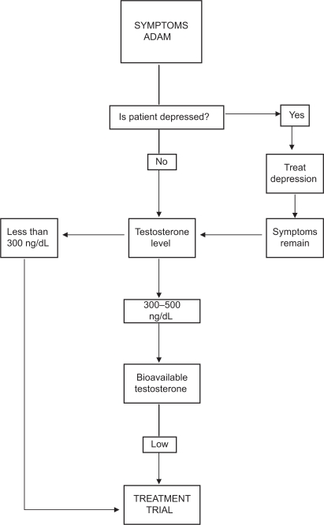

**Baggish AL, Weiner RB, Kanayama G, Hudson JI, Picard MH, Hutter AM, Po 2010. *Long-term anabolic-androgenic steroid use is associated with left ventricular dysfunction***  
[PMC2909423](https://pmc.ncbi.nlm.nih.gov/articles/PMC2909423/) · NIH manuscript — text mining/fair use only · link only

- 🖼 **Figure 1** — Left ventricular ejection fraction in AAS users and AAS non-users – Circles represent AAS users and triangles represent AAS non-users.Abbreviations: AAS = anabolic-androgenic steroids ([view](https://pmc.ncbi.nlm.nih.gov/articles/PMC2909423/figure/F1/))
- 🖼 **Figure 2** — Representative tissue Doppler velocity tracings - Normal diastolic profile in a non-AAS user (A) and an abnormal functional profile in a long-term AAS user (B).Abbreviations: AAS = anabolic-androgenic steroids ([view](https://pmc.ncbi.nlm.nih.gov/articles/PMC2909423/figure/F2/))

**Solbach P, Potthoff A, Raatschen HJ, Soudah B, Lehmann U, Schneider A, 2015. *Testosterone-receptor positive hepatocellular carcinoma in a 29-year old bodybuilder with a history of anabolic androgenic steroid abuse: a case report***  
[PMC4461943](https://pmc.ncbi.nlm.nih.gov/articles/PMC4461943/) · CC BY · **stored**

- 🖼 **Fig. 1** — Clinical examination showed a muscular body, height 186 cm, weight 120 kg. The lung showed a sonorous percussion, vesicular breath sounds, no noise. Heart: regular rhythm, 55 bpm, RR 134/67 mmHg, first heart sound and second heart sound not flashy, no heart murmurs. No pathological examination…
  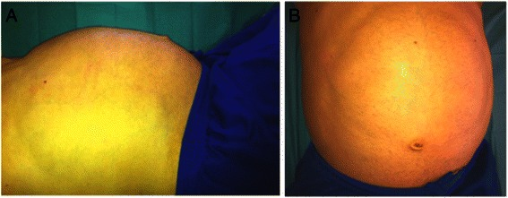
- 🖼 **Fig. 2** — a B-mode ultrasonography: The hepatic tumors were polycyclic, isoechoic and inhomogeneous. Doppler sonography showed a compression in the IVC hepatic segment by the liver tumors with consecutive development of partial Budd Chiari syndrome diagnosed by the retrograde flow pattern in the right…
  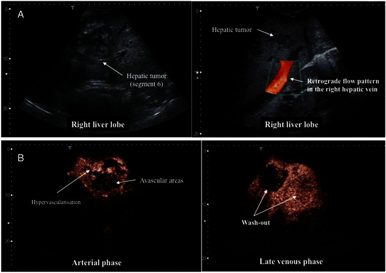
- 📊 **Fig. 3** — Contrast enhanced computed tomography in arterial (a,c) and portalvenous phase (b,d): Highly enlarged liver with curved borders secondary to multiple parenchymatous lesions throughout all liver segments, with arterial enhancement and no substantial wash-out during portalvenous phase. The large…
  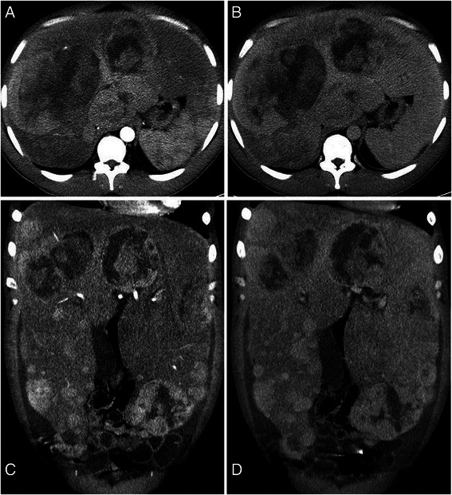
- 🖼 **Fig. 4** — Liver biopsy: Small solid and glandular associations of hepatocytes without bile duct epithelia. Reticulin fiber network focally obtained. The hepatocytes had markedly enlarged nuclei with large nucleoli with coarse structure of chromatin. Iron and rhodanine negative. Immunohistochemistry:…
  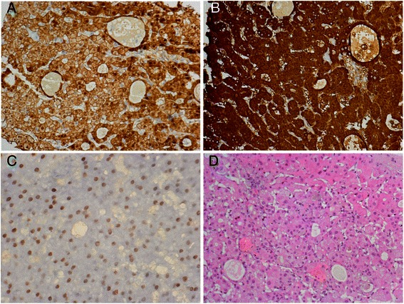

---

## [Do Diet Breaks Improve Fat Loss and Protect Metabolism?](diet-breaks-improve-fat-loss-metabolism.md)

**Byrne NM, Sainsbury A, King NA, Hills AP, Wood RE, Wood RE. 2018. *Intermittent energy restriction improves weight loss efficiency in obese men: the MATADOR study***  
[PMC5803575](https://pmc.ncbi.nlm.nih.gov/articles/PMC5803575/) · CC BY-NC-ND · **stored**

- 📊 **Figure 1** — Changes in body weight (kg; mean±s.e.m.) during baseline and 16 weeks of energy restriction (ER) in the continuous (CON; N=19) and intermittent (INT; N=17) groups. (a) Cumulative weight change (kg) over baseline (−4, −2, 0 weeks) and after 4, 8, 12 and 16 weeks of ER for the CON and INT groups.…
  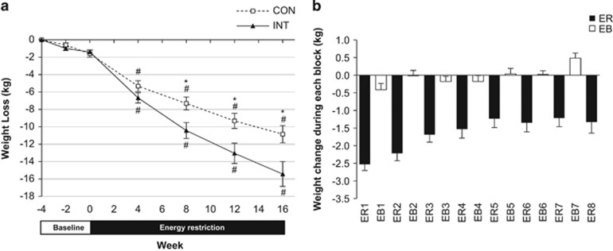
- 📊 **Figure 2** — Fat-free mass (FFM) and fat mass (FM) at baseline and during 16 weeks of energy restriction (ER) for the continuous (CON; N=19) and intermittent (INT; N=17) groups. (a) Fat-free mass (kg; mean±s.d.). * Differs significantly (P<0.05) from all other time points for the same intervention group. (b)…
  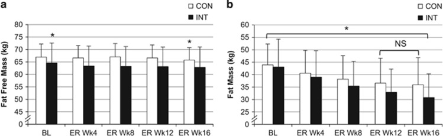
- 📊 **Figure 3** — Change from baseline in resting energy expenditure (REE; kJ d−1) for the continuous (CON; N=19) and intermittent (INT; N=17) groups. Data are mean±s.e.m. (a) Change in absolute (unadjusted) REE after each 4 weeks of ER for the CON and INT groups. *Significant difference between groups; P<0.05. (b)…
  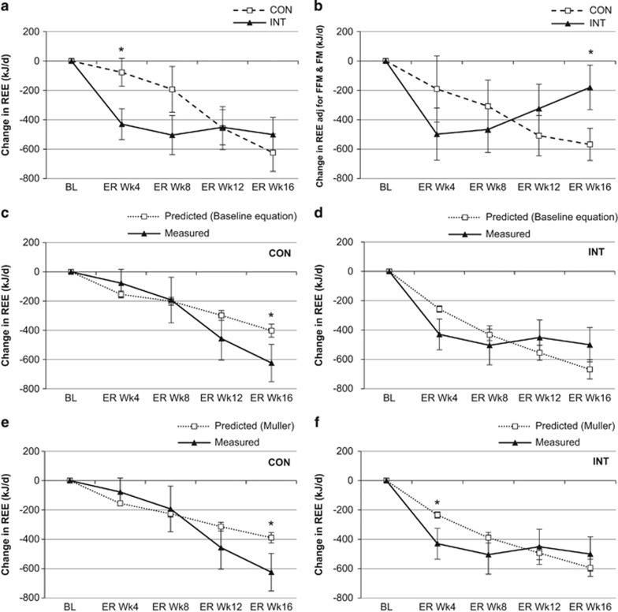
- 📊 **Figure 4** — Weight and body composition in the subsample (CON: N=13, INT: N=15) of participants with data at all the following time points: baseline, during and end of energy restriction (ER), during and after 8 weeks of energy balance immediately post-ER-intervention, and follow-up 6 months later. (a) Weight…
  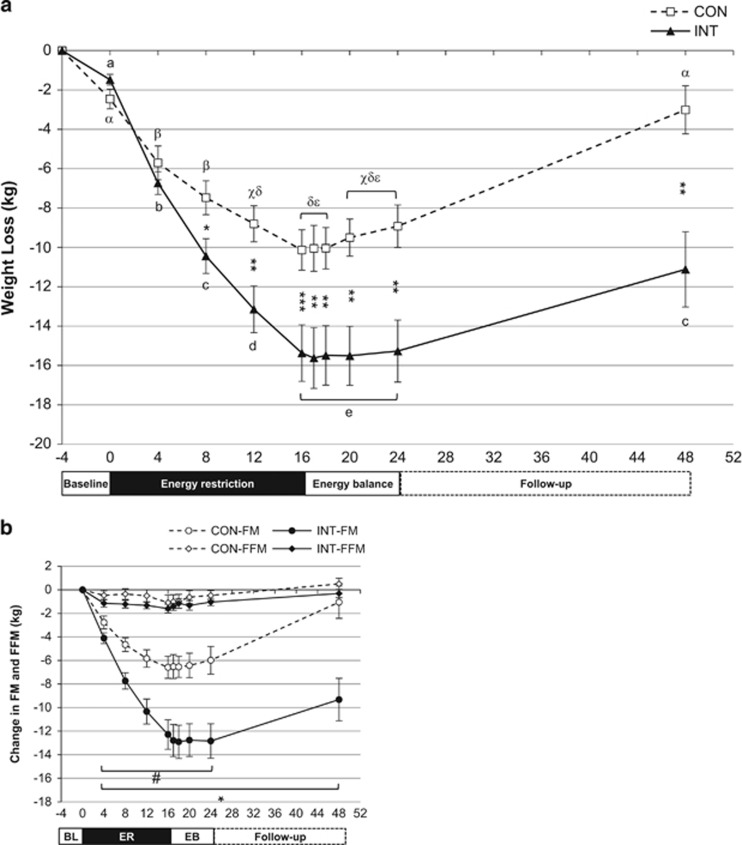

---

## [You Don't Need 8 Glasses of Water a Day (and Coffee Does Count)](don-t-need-8-glasses-water-day.md)

**Popkin BM, D'Anci KE, Rosenberg IH. 2010. *Water, hydration, and health***  
[PMC2908954](https://pmc.ncbi.nlm.nih.gov/articles/PMC2908954/) · NIH manuscript — text mining/fair use only · link only

- 📊 **Figure 1** — Water Consumption Trends from USDA and NHANES Surveys (ml/day/capita), weighted to be nationally representativeNote: this includes water from fluids only, excluding water in foods. Sources for 1965, 77–78, 89- are USDA. Others are NHANES and 2005–6 is joint USDA and NHANES ([view](https://pmc.ncbi.nlm.nih.gov/articles/PMC2908954/figure/F1/))

**Cotter JD, Thornton SN, Lee JK, Laursen PB. 2014. *Are we being drowned in hydration advice? Thirsty for more?***  
[PMC4212586](https://pmc.ncbi.nlm.nih.gov/articles/PMC4212586/) · CC BY · **stored**

- 🖼 **Figure 1** — Personal and societal effects of acute/chronic consumption of water above/below that required for fluid homeostasis. The three incrementing font sizes denote outcomes causing a nuisance, morbidity and potential mortality. Outcomes with question marks are those for which we are not aware of any…
  
- 🖼 **Figure 2** — Effect of hypohydration on exercise performance before and after familiarisation to the hypohydration. Reprinted from Fleming J, James LJ. Repeated familiarisation with hypohydration attenuates the performance decrement caused by hypohydration during treadmill running. Appl Physiol Nutr Metab., 39:…
  
- 🗺 **Figure 3** — Indicative contributions of different sources to changes in body mass for hypohydration induced before or during strenuous exercise.Bar A represents starting exercise euhydrated when rehydrated from an overnight fast (14 h), whereas bars B–D represent starting exercise 2% hypohydrated obtained as…
  

**Charrière N, Miles-Chan JL, Montani JP, Dulloo AG. 2015. *Water-induced thermogenesis and fat oxidation: a reassessment***  
[PMC4735055](https://pmc.ncbi.nlm.nih.gov/articles/PMC4735055/) · CC BY · **stored**

- 📊 **Figure 1** — (a) Time course of changes in REE and RQ after Sham drink or DW in 27 young adults. Repeated-measures analysis of variance assessed statistical differences as follows: effect of time (symbol †) and the drink x time interaction (symbol ‡); one, two and three symbols denoting P<0.05, P<0.01 and…
  
- 📊 **Figure 2** — Interstudy comparisons of ΔREE (kJ over 90 min) after drinking water. Data are for 20 experiments conducted in several laboratories (see Table 1 for references), including the current study (I for data presented in main text, and II for data presented in Supplementary Information, section B).…
  

---

## ["Eat Big To Get Big" and Other Bulking Myths, Dismantled](eat-big-get-big.md)

**Morton RW, Murphy KT, McKellar SR, Schoenfeld BJ, Henselmans M, Helms 2018. *A systematic review, meta-analysis and meta-regression of the effect of protein supplementation on resistance training-induced gains in muscle mass and strength in healthy adults***  
[PMC5867436](https://pmc.ncbi.nlm.nih.gov/articles/PMC5867436/) · CC BY-NC · **stored**

- 🗺 **Figure 1** — PRISMA flow chart.
  
- 📊 **Figure 2** — Forest plot of the results from a random-effects meta-analysis shown as mean difference with 95% CIs on one-repetition-maximum (1 RM; kg) in untrained and trained participants. For each study, the circle represents the mean difference of the intervention effect with the horizontal line intersecting…
  
- 📊 **Figure 3** — Forest plot of the results from a random-effects meta-analysis shown as mean difference with 95% CIs on lean or fat-free mass (FFM; kg) in untrained and trained participants. For each study, the circle represents the mean difference of the intervention effect with the horizontal line intersecting…
  
- 📊 **Figure 4** — Random-effects univariate meta-regression between age and the mean difference in fat-free mass (FFM) between groups. Each circle represents a study and the size of the circle reflects the influence of that study on the model (inversely proportionate to the SE of that study). The regression…
  
- 📊 **Figure 5** — Segmental linear regression between relative total protein intake (g/kg body mass/day) and the change in fat-free mass (ΔFFM) measured by dual energy X-ray absorptiometry. Each circle represents a single group from a study. Dashed arrow indicates the break point=1.62 g protein/kg/day, p=0.079.…
  

---

## [What Every Body Fat Percentage Actually Looks Like (DEXA-Verified, 50% to 5%)](every-body-fat-looks-like.md)

**Borga M, West J, Bell JD, Harvey NC, Romu T, Heymsfield SB, Dahlqvist 2018. *Advanced body composition assessment: from body mass index to body composition profiling***  
[PMC5992366](https://pmc.ncbi.nlm.nih.gov/articles/PMC5992366/) · CC BY · **stored**

- 🖼 **Figure 1** — Example of segmentation of abdominal subcutaneous AT (ASAT), visceral AT (VAT) and 10 muscle groups from fat water separated MRI using fat-referenced MRI and multi-atlas image segmentation. To the left is the fat image with ASAT (blue) and VAT (red), and to the right is the water image with the…
  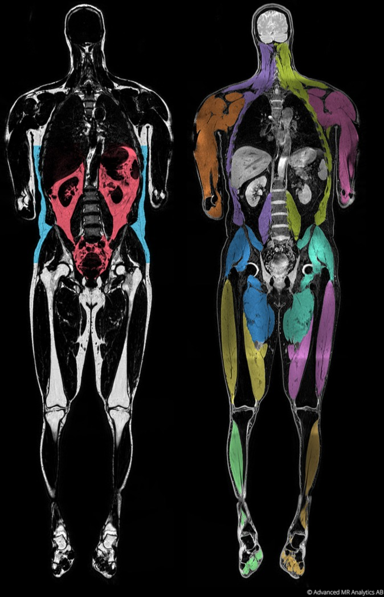
- 🖼 **Figure 2** — (A) The definition of lean and adipose tissue measured by MRI from the bottom of the thigh muscles to top of vertebrae T9 marked in blue color in the water (left) and fat (right) image. (B) An example of a dual-energy X-ray absorptiometry (DXA) image from the study cohort. DXA image copyright UK…
  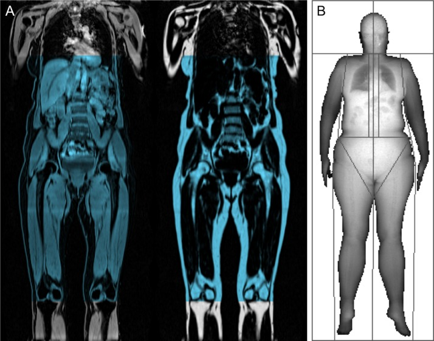
- 📊 **Figure 3** — Correlation plots (upper row) between dual-energy X-ray absorptiometry (DXA) and corresponding measurement predicted from MRI using a linear transformation for body fat (left) and body lean tissue (right). The bottom row shows Bland-Altman plots of the agreement between DXA and corresponding…
  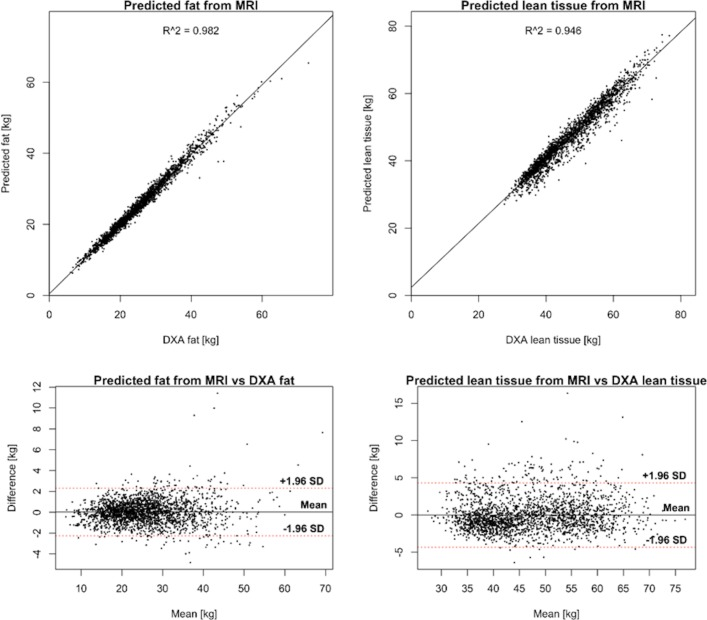
- 📊 **Figure 4** — Correlation between visceral adipose tissue (VAT) predicted by dual-energy X-ray absorptiometry (DXA) and VAT measured by MRI (left) and Bland-Altman plot showing the agreement (liters) between the methods (right).
  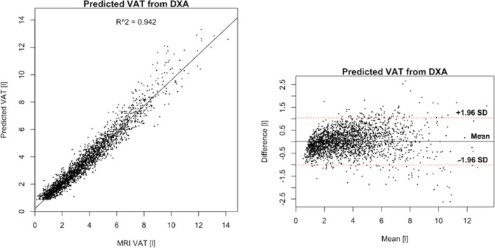

**Liu B, Du Y, Wu Y, Snetselaar LG, Wallace RB, Bao W. 2021. *Trends in obesity and adiposity measures by race or ethnicity among adults in the United States 2011-18: population based study***  
[PMC7961695](https://pmc.ncbi.nlm.nih.gov/articles/PMC7961695/) · CC BY-NC · **stored**

- 📊 **Fig 1** — Trends in obesity and adiposity measures by race or ethnicity among adults in the United States, 2011-18
  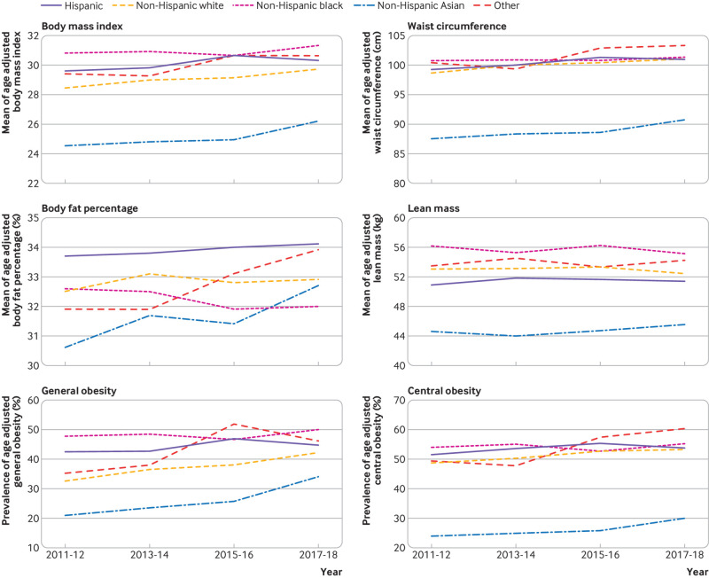

---

## [Lengthened Partials vs Full Range of Motion in Trained Lifters: Jeff Nippard's Own Study](everyone-thinks-m-wrong-about-training.md)

**Sato S, Yoshida R, Kiyono R, Yahata K, Yasaka K, Nunes JP, Nosaka K, N 2021. *Elbow Joint Angles in Elbow Flexor Unilateral Resistance Exercise Training Determine Its Effects on Muscle Strength and Thickness of Trained and Non-trained Arms***  
[PMC8489980](https://pmc.ncbi.nlm.nih.gov/articles/PMC8489980/) · CC BY · **stored**

- 📊 **FIGURE 1** — Changes (mean ± SD, individuals) in average maximum voluntary isometric contraction torque of four different angles (MVC-ISOave), concentric contraction torque at two different velocities (MVC-CONave), eccentric contraction (MVC-ECC) torque, and muscle thickness at three positions (MTave) before…
  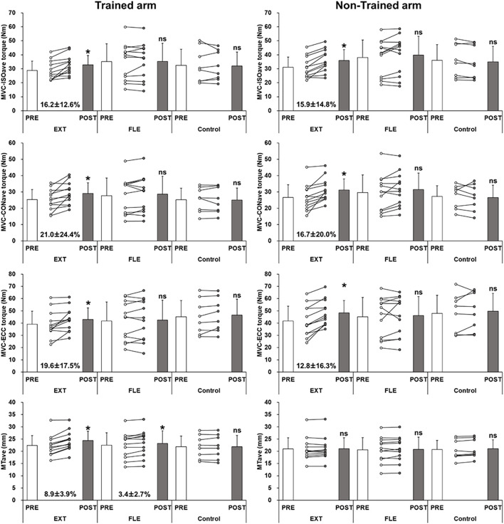

**Pedrosa GF, Simões MG, Figueiredo MOC, Lacerda LT, Schoenfeld BJ, Lima 2023. *Training in the Initial Range of Motion Promotes Greater Muscle Adaptations Than at Final in the Arm Curl***  
[PMC9960616](https://pmc.ncbi.nlm.nih.gov/articles/PMC9960616/) · CC BY · **stored**

- 🗺 **Figure 1** — Training protocols range of motion. (A1,A2) = starting and finishing the concentric action of INITIALROM protocol (0°–68° of elbow flexion), respectively. (B1,B2) = starting and finishing the concentric action of FINALROM protocol (68°–135° of elbow flexion), respectively.
  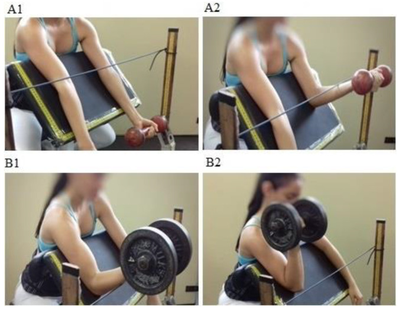
- 🗺 **Figure 2** — The paired mean difference for cross-sectional area in INITIALROM and FINALROM at (a) 50% humeral length; (b) 70% humeral length; and (c) summed values of 50% and 70% humeral length [30]. The raw data are plotted on the upper axes; each paired set of observations is connected by a line. On the…
  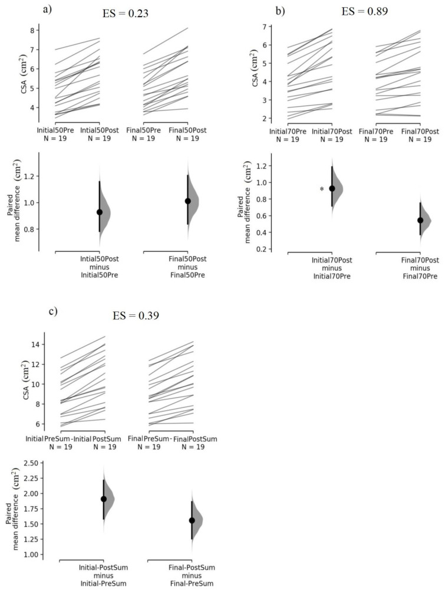
- 🗺 **Figure 3** — The paired mean difference for 1 repetition maximum in INITIALROM and FINALROM [30]. The raw data are plotted on the upper axes; each paired set of observations is connected by a line. On the lower axes, each paired mean difference is plotted as a bootstrap sampling distribution. Mean differences…
  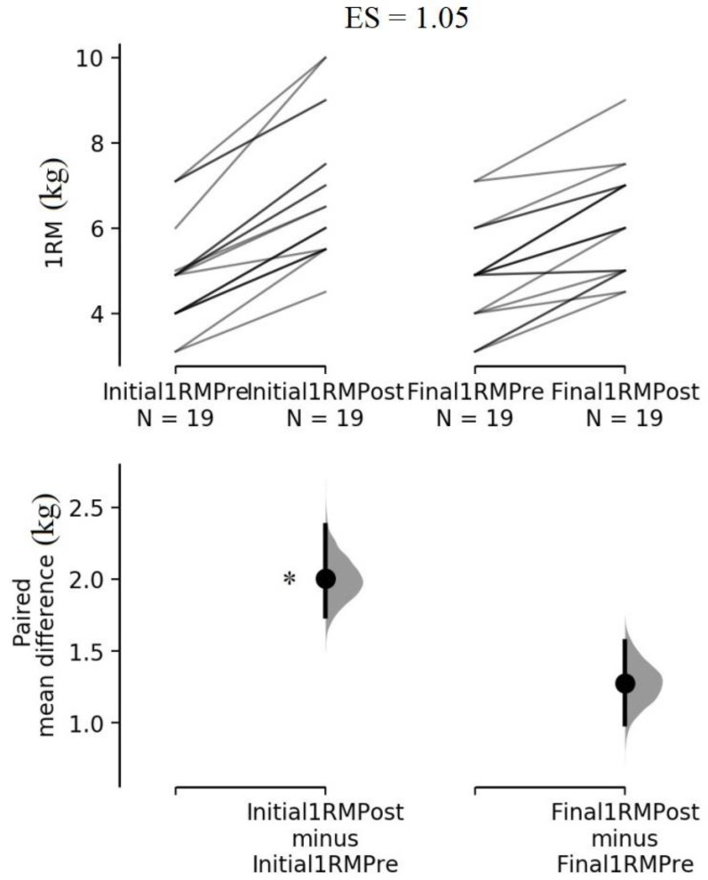

---

## [How Fast You Lose Muscle When You Stop Training (And How To Avoid It)](fast-lose-muscle-when-stop-working-out.md)

**Beaudart C, Dawson A, Shaw SC, Harvey NC, Kanis JA, Binkley N, Reginst 2017. *Nutrition and physical activity in the prevention and treatment of sarcopenia: systematic review***  
[PMC5457808](https://pmc.ncbi.nlm.nih.gov/articles/PMC5457808/) · CC BY-NC · **stored**

- 🗺 **Fig. 1** — Flow chart of literature search
  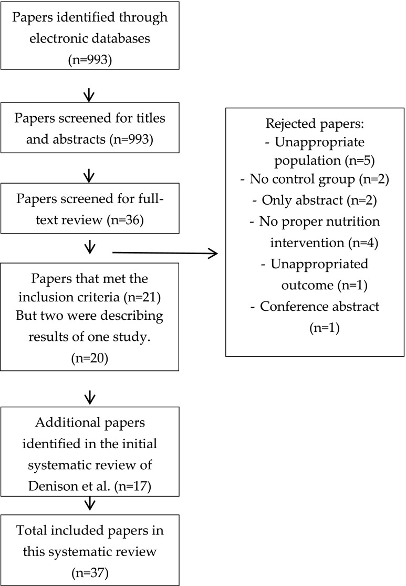

**Seaborne RA, Strauss J, Cocks M, Shepherd S, O'Brien TD, van Someren K 2018. *Human Skeletal Muscle Possesses an Epigenetic Memory of Hypertrophy***  
[PMC5789890](https://pmc.ncbi.nlm.nih.gov/articles/PMC5789890/) · CC BY · **stored**

- 🗺 **Figure 1** — (A) Schematic representation of experimental conditions and types of analysis undertaken across the time-course. The image of a muscle represents the time point for analysis of muscle mass via (i) DEXA and strength via (ii) isometric quadriceps muscle torque using an isokinetic dynamometer. The…
  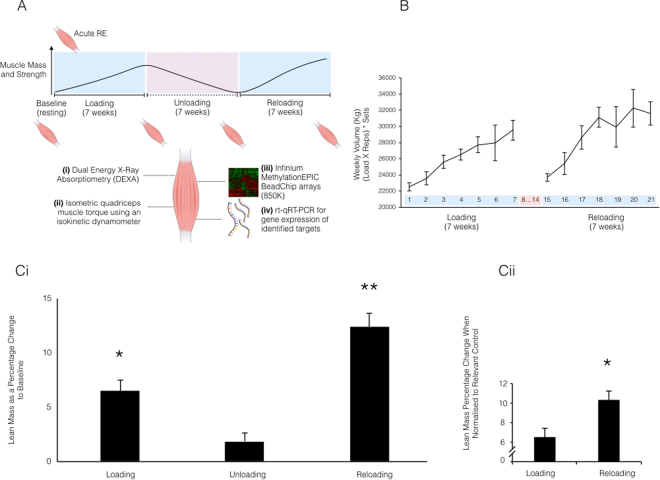
- 📊 **Figure 2** — (A) Infinium MethylationEPIC BeadChip arrays (850 K CpG sites) identified an enhanced frequency of hypomethylated CpG sites upon reloading (n = 7). (B) Gene ontology analysis using forest plot schematics confirmed an enhanced hypomethylated profile after reloading across various (i) molecular…
  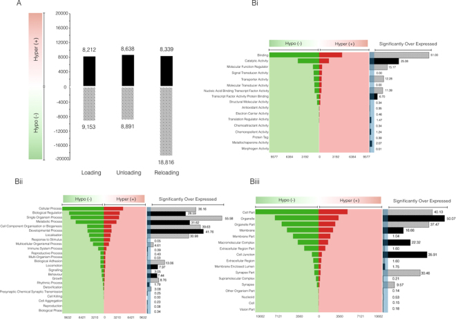
- 🖼 **Figure 3** — (A) Representation of the DNA methylation modifications that occurred within the PI3K/AKT KEGG pathway following 7 weeks of reloading in human subjects. Signalling analysis performed on statistically differentially regulated CpG sites compared to baseline, with green indicating a hypomethylated…
  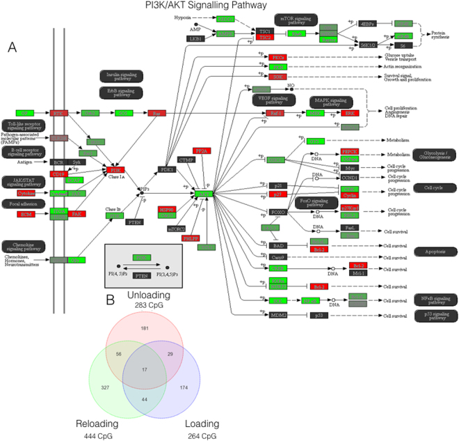
- 🗺 **Figure 4** — (A) Heat map depicting unsupervised hierarchical clustering of the top 500 statistically differentially regulated CpG loci (columns) and conditions (baseline, loading, unloading and reloading) in previously untrained male participants (n = 8). The heat-map colours correspond to standardised…
  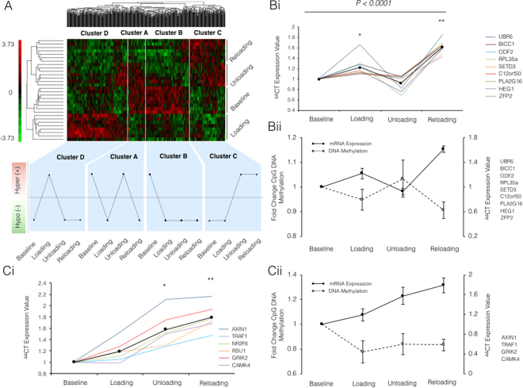
- 🗺 **Figure 5** — Relative fold changes in: (A) gene expression; (B) correlation between gene expression and lower limb lean mass across experimental conditions, and; (C) schematic representation of relationship between fold changes in CpG DNA methylation (dashed black line; left y axis) and fold change in gene/mRNA…
  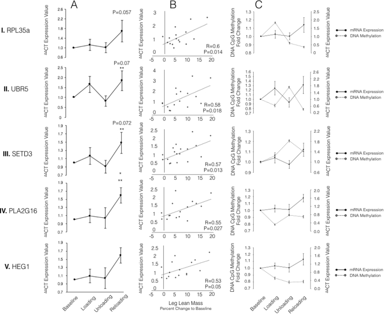
- 📊 **Figure 6** — Representation and characterisation of the DNA methylation modifications that occurred within the ubiquitin mediated proteolysis pathway across all conditions of loading, unloading and reloading compared to baseline (ANOVA). Signalling analysis performed on statistically differentially regulated…
  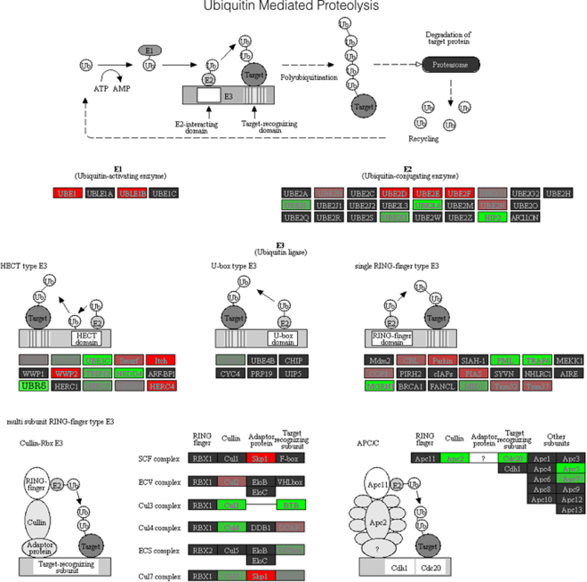
- 🗺 **Figure 7** — Response of the methylome after acute resistance loading stimulus compared to baseline, 7 weeks loading and 7 weeks reloading: (A) Heat map depicting unsupervised hierarchical clustering of statistically differentially regulated (P = 0.05) CpG loci following exposure to acute RE compared to…
  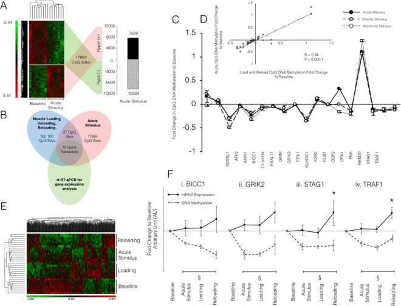

**Ochi E, Maruo M, Tsuchiya Y, Ishii N, Miura K, Sasaki K. 2018. *Higher Training Frequency Is Important for Gaining Muscular Strength Under Volume-Matched Training***  
[PMC6036131](https://pmc.ncbi.nlm.nih.gov/articles/PMC6036131/) · CC BY · **stored**

- 📊 **FIGURE 1** — Changes in ratings of perceived exertion (RPE) at 2, 4, 6, 8, 10, and 11 weeks of low (T1) and high (T3) frequency training. Data are expressed as mean ± SD (n = 10 in each group). ##p < 0.01 for the difference between T1 and T3.
  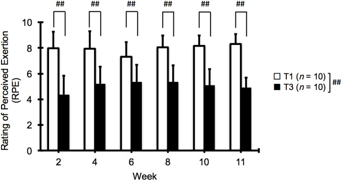
- 📊 **FIGURE 2** — Relative changes in maximum voluntary contraction torque (MVC) from baseline (pre) after 11 weeks of low (T1) and high (T3) frequency training and subsequent 6 weeks of detraining. Data are expressed as mean ± SD (n = 10 in each group). ∗∗p < 0.01 compared with the pre-training value for T3. †p <…
  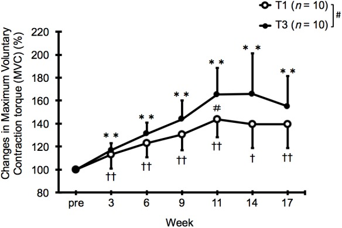

---

## [Does Fasted Cardio Burn More Fat?](fasted-cardio-burn-more-fat.md)

**Schoenfeld BJ, Aragon AA, Wilborn CD, Krieger JW, Sonmez GT. 2014. *Body composition changes associated with fasted versus non-fasted aerobic exercise***  
[PMC4242477](https://pmc.ncbi.nlm.nih.gov/articles/PMC4242477/) · CC BY · **stored**

- 🖼 **Figure 1** — Percent macronutrient intake for FASTED.
  
- 🖼 **Figure 2** — Percent macronutrient intake for FED.
  

---

## [Fixing Muscle Imbalances and Left-Right Asymmetries: 4 Tips](fix-muscle-imbalances-asymmetries-4-tips.md)

**Antonio J, Ciccone V. 2013. *The effects of pre versus post workout supplementation of creatine monohydrate on body composition and strength***  
[PMC3750511](https://pmc.ncbi.nlm.nih.gov/articles/PMC3750511/) · CC BY · **stored**

- 🖼 **Figure 1** — Individual data for FFM in the POST-SUPP group.
  
- 🖼 **Figure 2** — Individual data for FFM in the PRE-SUPP group.
  

---

## [Does Foam Rolling Actually Aid Recovery?](foam-rolling-work.md)

**Vigotsky AD, Lehman GJ, Contreras B, Beardsley C, Chung B, Feser EH. 2015. *Acute effects of anterior thigh foam rolling on hip angle, knee angle, and rectus femoris length in the modified Thomas test***  
[PMC4586805](https://pmc.ncbi.nlm.nih.gov/articles/PMC4586805/) · CC BY · **stored**

- 🗺 **Figure 1** — Starting (A) and ending (B) position of the foam roll protocol.
  
- 🗺 **Figure 2** — Hip and knee joint calculations.The illustrated participant would have a hip extension angle of 8.1° (98.1° − 90°) and a knee flexion angle of 53.2° (180° − 126.8°). Illustration credit: Ji Sung Kim
  

---

## [Getting Lean and Actually Keeping It Off](get-lean-stay-lean-forever.md)

**Fothergill E, Guo J, Howard L, Kerns JC, Knuth ND, Brychta R, Chen KY, 2016. *Persistent metabolic adaptation 6 years after "The Biggest Loser" competition***  
[PMC4989512](https://pmc.ncbi.nlm.nih.gov/articles/PMC4989512/) · NIH manuscript — text mining/fair use only · link only

- 📊 **Figure 1** — Daily body weight changes in the individual subjects (thin lines) and the mean weight change (thick line) over the 2 weeks prior to the follow-up measurements 6 years after the Biggest Loser competition. ([view](https://pmc.ncbi.nlm.nih.gov/articles/PMC4989512/figure/F1/))
- 📊 **Figure 2** — Individual (●) and mean (gray rectangles) changes in body weight (A), fat-free mass (B), and fat mass (C) at the end of the 30 week Biggest Loser weight loss competition and after 6 years. Horizontal bars and corresponding p values indicate comparisons between 30 weeks and 6 years. * indicates… ([view](https://pmc.ncbi.nlm.nih.gov/articles/PMC4989512/figure/F2/))
- 📊 **Figure 3** — Body fat mass changes accounted for the vast majority of weight loss at both the end of the 30 week competition (●) and 6 years later (○). All data points fell on the same curve indicating that there was no evidence for preferential body fat regain. ([view](https://pmc.ncbi.nlm.nih.gov/articles/PMC4989512/figure/F3/))
- 📊 **Figure 4** — Individual (●) and mean (gray rectangles) changes in resting metabolic rate (A), and metabolic adaptation (B) at the end of the 30 week Biggest Loser weight loss competition and after 6 years. Horizontal bars and corresponding p values indicate comparisons between 30 weeks and 6 years. * indicates… ([view](https://pmc.ncbi.nlm.nih.gov/articles/PMC4989512/figure/F4/))
- 📊 **Figure 5** — No significant associations were detected between metabolic adaptation at the end of the 30 week competition with percent weight gained since 30 weeks (A) or percent weight change versus baseline (B) at 6 years. Metabolic adaptation at 6 years was significantly associated with the percent weight… ([view](https://pmc.ncbi.nlm.nih.gov/articles/PMC4989512/figure/F5/))

---

## [Four Behavioural Fat-Loss Strategies That Don't Require Tracking Macros](get-lean-without-tracking-macros-dieting.md)

**Block JP, Condon SK, Kleinman K, Mullen J, Linakis S, Rifas-Shiman S, 2013. *Consumers' estimation of calorie content at fast food restaurants: cross sectional observational study***  
[PMC3662831](https://pmc.ncbi.nlm.nih.gov/articles/PMC3662831/) · CC BY-NC · **stored**

- 📊 **fig1** — Fig 1 Mean difference between estimated and actual calorie content of purchased meals, by restaurant chain, at fast-food restaurants in four cities in New England, 2010 and 2011
  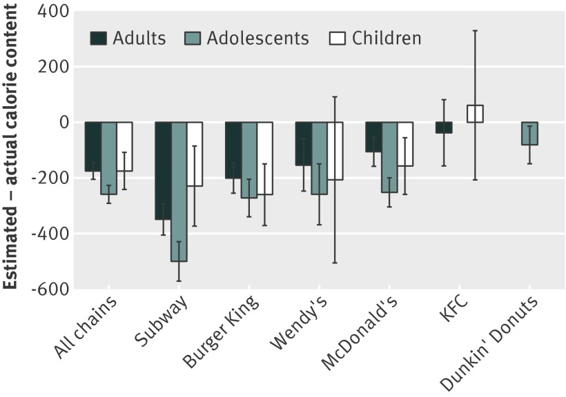
- 📊 **fig2** — Fig 2 Estimated calorie content versus actual calorie content of meals among adults, adolescents, and school age children in fast food restaurants in four cities in New England, 2010 and 2011. Figure shows predicted estimated calorie content, calculated from fully adjusted models for participants…
  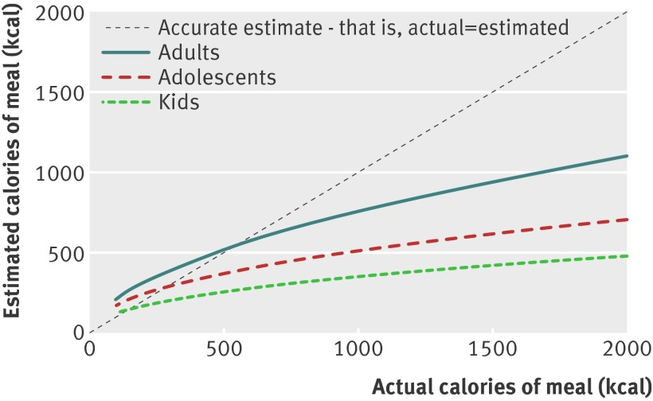

**Urban LE, Weber JL, Heyman MB, Schichtl RL, Verstraete S, Lowery NS, D 2016. *Energy Contents of Frequently Ordered Restaurant Meals and Comparison with Human Energy Requirements and U.S. Department of Agriculture Database Information: A Multisite Randomized Study***  
[PMC5746190](https://pmc.ncbi.nlm.nih.gov/articles/PMC5746190/) · NIH manuscript — text mining/fair use only · link only

- 📊 **Figure 1** — Boxplot of gross meal energy, portion size, and meal energy density by cuisine and by region in non–chain restaurants. Cuisines are in order of lowest to highest mean meal energy, and regions are ordered by lowest to highest prevalence of overweight and obesity by state: San Francisco, CA=55.1%,… ([view](https://pmc.ncbi.nlm.nih.gov/articles/PMC5746190/figure/F1/))
- 🖼 **Figure 2** — Relationships between meal portion weight, meal energy density, and meal energy content. Partial R2 values were calculated from a mixed model with restaurant nested within region×cuisine type as the random factor and only covariate. ([view](https://pmc.ncbi.nlm.nih.gov/articles/PMC5746190/figure/F2/))

**Gabel K, Hoddy KK, Haggerty N, Song J, Kroeger CM, Trepanowski JF, Pan 2018. *Effects of 8-hour time restricted feeding on body weight and metabolic disease risk factors in obese adults: A pilot study***  
[PMC6004924](https://pmc.ncbi.nlm.nih.gov/articles/PMC6004924/) · CC BY-NC · **stored**

- 🗺 **Fig.1** — Study flow chart.
  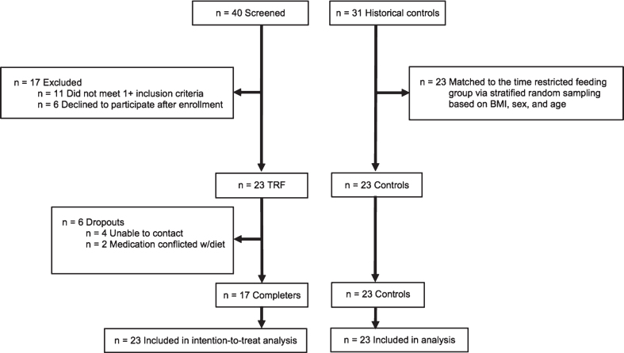
- 📊 **Fig.2** — Weekly adherence to the 8-hour feeding window by the time restricted feeding group. All values reported as mean ± SEM. Each bar indicates the mean number of days per week that the time restricted feeding subjects were compliant with the 8-hour feeding window. On average, the time restricted feeding…
  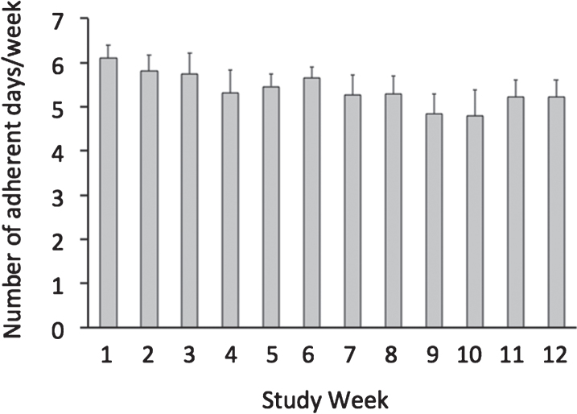
- 📊 **Fig.3** — Weight loss by the time restricted feeding group versus controls 1. 1All values reported as mean ± SEM. Data were included for 46 participants; means were estimated using an intention-to-treat analysis using last observation carried forward. Body weight remained stable during the 2-week baseline…
  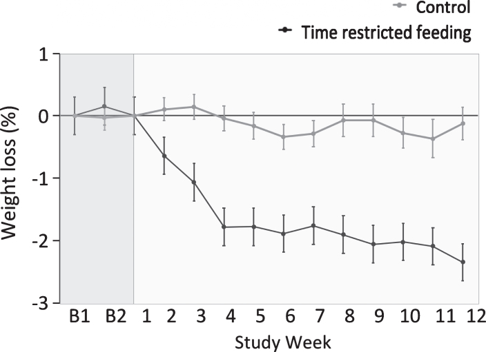

---

## [Full Body Five Days a Week: The Case for High-Frequency Training](high-frequency-full-body-training.md)

**Mitchell CJ, Churchward-Venne TA, Parise G, Bellamy L, Baker SK, Smith 2014. *Acute post-exercise myofibrillar protein synthesis is not correlated with resistance training-induced muscle hypertrophy in young men***  
[PMC3933567](https://pmc.ncbi.nlm.nih.gov/articles/PMC3933567/) · CC BY · **stored**

- 📊 **Figure 1** — Muscle volume, muscle mass, and strength changes following resistance training.The absolute increase in A) Quadriceps muscle volume determined by MRI, B) Fat free bone free mass determined by DXA, C) Leg press 1RM and D) Chest press 1RM. Each dot represents a single subject, the lines show the…
  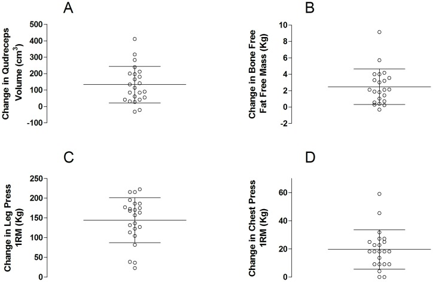
- 📊 **Figure 2** — Phosphorylation of anabolic signalizing proteins.The results are expressed as fold changes from rest at 1, 3 and 6) mTOR phosphorylation at Ser2448, B) Akt phosphorylation at Ser473, C) 4E-BP1 phosphorylation at Thr37/46 and D) rpS6 phosphorylation at Ser240/244. * Significantly different from rest…
  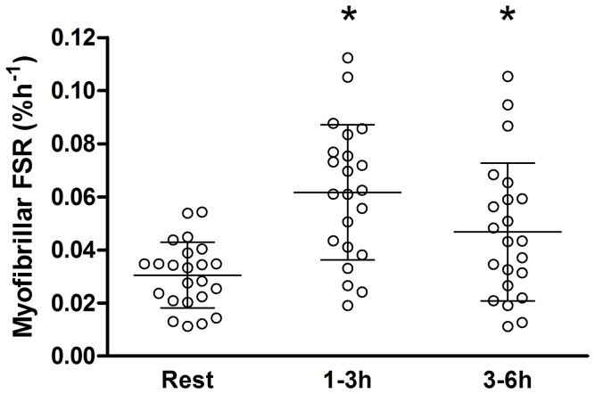
- 📊 **Figure 3** — Relationship between muscle hypertrophy and potential correlates.A) The relationship between changes in muscle volume as measured by MRI and the Myofibrillar fractional synthetic rate (FSR) measured from 1 to 6 hours after an acute bout of resistance exercise and nutrition before the start of the…
  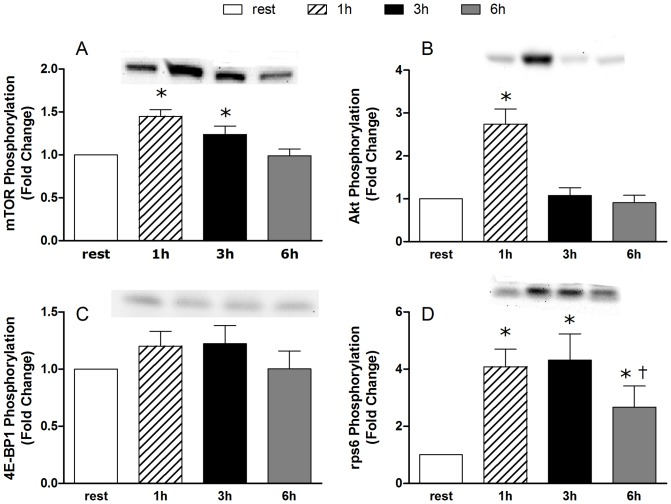
- 📊 **Figure 4** — Myofibrillar Protein synthesis.FSR is calculated at rest and after an acute bout of resistance exercise and protein ingestion prior to the start of the resistance training period. The other rates were calculated from 1 to 3–6 hours after the resistance exercises. Each circle, square, and triangle…
  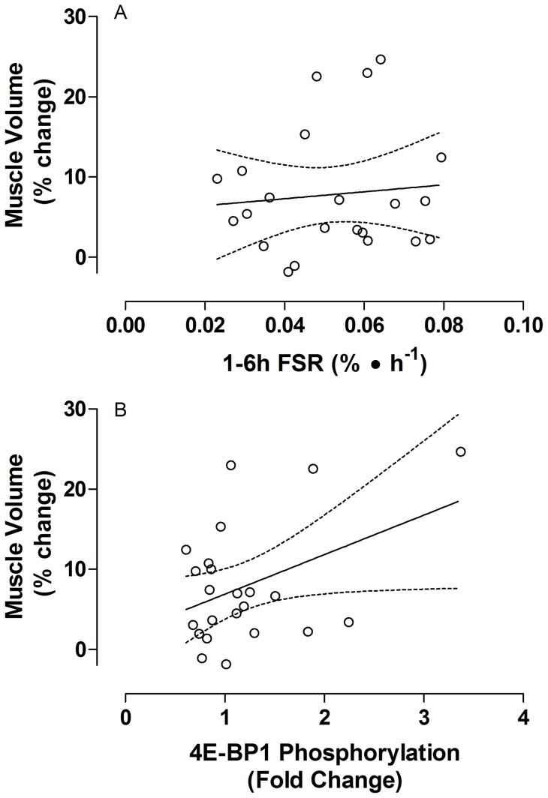

---

## [How Hard To Train: Proximity To Failure, RPE and Rep-Speed](how-hard-to-train-proximity-to-failure.md)

**Ramos-Campo DJ, Martínez-Aranda LM, AndreuCaravaca L, Ávila-Gandía V, 2021. *Effects of resistance training intensity on sleep quality and strength recovery in trained men: a randomized cross-over study***  
[PMC7996385](https://pmc.ncbi.nlm.nih.gov/articles/PMC7996385/) · CC BY-NC-SA · **stored**

- 🖼 **FIG. 1** — Experimental design and testing procedures.
  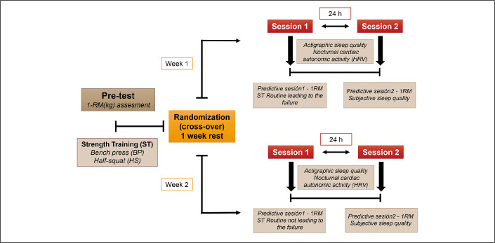

---

## [How to Bulk Properly: Rate of Gain, Calories, Macros and Training](how-to-bulk.md)

**Morton RW, Murphy KT, McKellar SR, Schoenfeld BJ, Henselmans M, Helms 2018. *A systematic review, meta-analysis and meta-regression of the effect of protein supplementation on resistance training-induced gains in muscle mass and strength in healthy adults***  
[PMC5867436](https://pmc.ncbi.nlm.nih.gov/articles/PMC5867436/) · CC BY-NC · **stored**

- 🗺 **Figure 1** — PRISMA flow chart.
  
- 📊 **Figure 2** — Forest plot of the results from a random-effects meta-analysis shown as mean difference with 95% CIs on one-repetition-maximum (1 RM; kg) in untrained and trained participants. For each study, the circle represents the mean difference of the intervention effect with the horizontal line intersecting…
  
- 📊 **Figure 3** — Forest plot of the results from a random-effects meta-analysis shown as mean difference with 95% CIs on lean or fat-free mass (FFM; kg) in untrained and trained participants. For each study, the circle represents the mean difference of the intervention effect with the horizontal line intersecting…
  
- 📊 **Figure 4** — Random-effects univariate meta-regression between age and the mean difference in fat-free mass (FFM) between groups. Each circle represents a study and the size of the circle reflects the influence of that study on the model (inversely proportionate to the SE of that study). The regression…
  
- 📊 **Figure 5** — Segmental linear regression between relative total protein intake (g/kg body mass/day) and the change in fat-free mass (ΔFFM) measured by dual energy X-ray absorptiometry. Each circle represents a single group from a study. Dashed arrow indicates the break point=1.62 g protein/kg/day, p=0.079.…
  

**Poole R, Kennedy OJ, Roderick P, Fallowfield JA, Hayes PC, Parkes J. 2017. *Coffee consumption and health: umbrella review of meta-analyses of multiple health outcomes***  
[PMC5696634](https://pmc.ncbi.nlm.nih.gov/articles/PMC5696634/) · CC BY-NC · **stored**

- 🗺 **f1** — Fig 1 Flowchart of selection of studies for inclusion in umbrella review on coffee consumption and health
  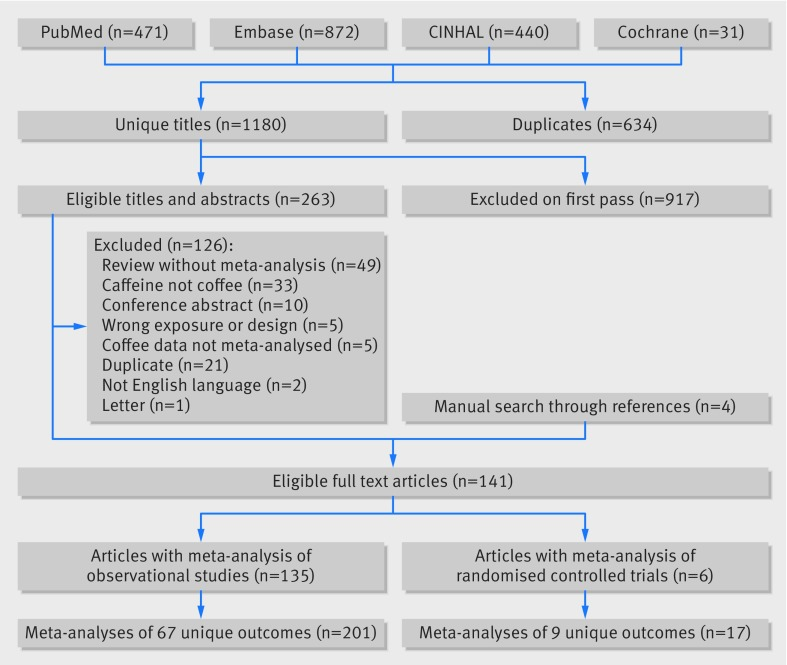
- 📊 **f2** — Fig 2 High versus low coffee consumption and associations with multiple health outcomes. Estimates are relative risks and effect models are random unless noted otherwise. For type 2 diabetes, P value was significant for non-linearity. No of events/total for leukaemia could not be split from other…
  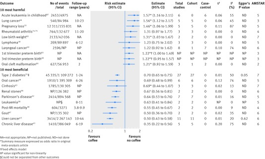
- 📊 **f3** — Fig 3 Any versus no coffee consumption and associations with multiple health outcomes. Estimates are relative risks and effect models are random unless noted otherwise. All estimates were from our own reanalysis apart from acute leukaemia, urinary tract cancer, and colorectal cancer
  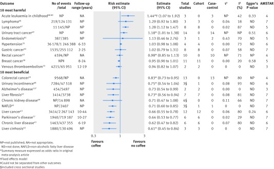
- 📊 **f4** — Fig 4 Consumption of one extra cup of coffee a day and associations with multiple health outcomes. Estimates are relative risks and effect models are random unless noted otherwise. No dose response analyses were re-analysed
  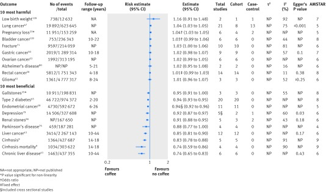
- 🖼 **f5** — Fig 5 Consumption of decaffeinated coffee and associations with multiple health outcomes. Estimates are relative risks and effect models are random unless noted otherwise
  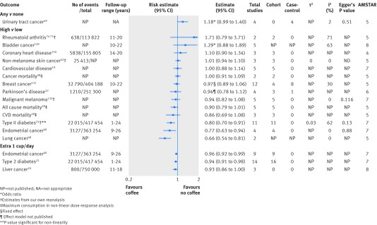
- 📊 **f6** — Fig 6 Coffee consumption in randomised controlled trials35 and change (mean difference) in blood pressure in random effects model. Estimates are from our own analysis
  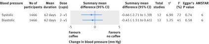
- 📊 **f7** — Fig 7 Coffee consumption in randomised controlled trials36 and change (mean difference) in cholesterol concentration. Effects are random unless noted otherwise
  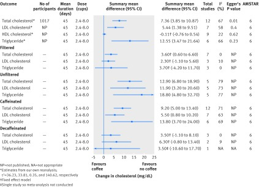
- 🖼 **f8** — Fig 8 Coffee consumption in randomised controlled trials86 and effects (relative risk) on birth outcomes
  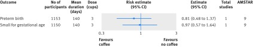
- 📊 **f9** — Fig 9 Coffee consumption in randomised controlled trials86 and change (mean difference) in birth weight
  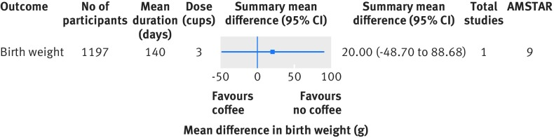

**Su KP, Tseng PT, Lin PY, Okubo R, Chen TY, Chen YW, Matsuoka YJ. 2018. *Association of Use of Omega-3 Polyunsaturated Fatty Acids With Changes in Severity of Anxiety Symptoms: A Systematic Review and Meta-analysis***  
[PMC6324500](https://pmc.ncbi.nlm.nih.gov/articles/PMC6324500/) · CC BY · **stored**

- 🗺 **Figure 1.** — Flowchart of the Selection Strategy and Inclusion and Exclusion Criteria for This Meta-analysisPUFAs indicates polyunsaturated fatty acids.
  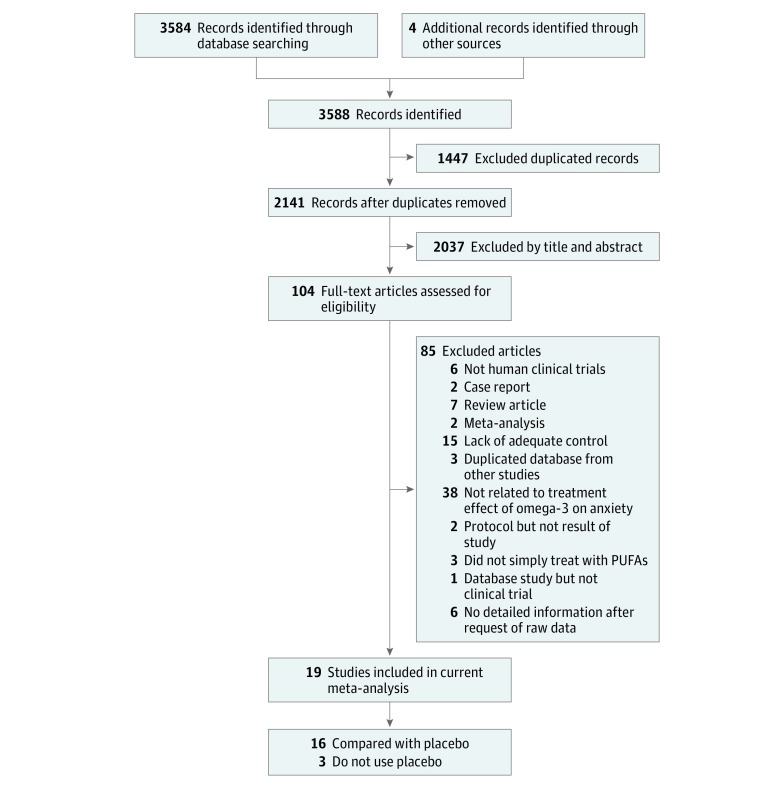
- 📊 **Figure 2.** — Meta-Analysis Forest Plot of the Association of Treatment With Reduced Anxiety Symptoms in Patients Receiving and Not Receiving omega-3 PUFAsThere was a significant improvement in anxiety symptoms in patients receiving omega-3 PUFAs than in those not receiving omega-3 PUFAs (k, 19; Hedges g, 0.374;…
  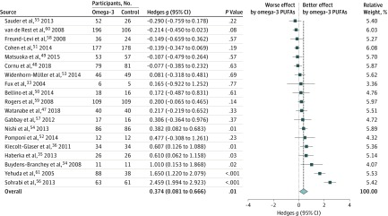
- 📊 **Figure 3.** — Forest Plot of Subgroup Meta-analysisA, Subgroup meta-analysis of the anxiolytic effect of omega-3 polyunsaturated fatty acids (PUFAs) based on an underlying specific clinical diagnosis or not. The anxiolytic effect of omega-3 PUFAs was not significant in the subgroup of participants without…
  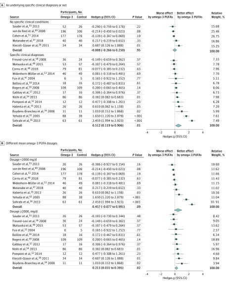
- 📊 **Figure 4.** — Subgroup Meta-analysis With Different Eicosapentaenoic Acid (EPA) PercentagesSubgroup meta-analysis of the anxiolytic effects of omega-3 polyunsaturated fatty acids (PUFAs) based on different EPA percentages. The anxiolytic effects of omega-3 PUFAs were significant in the subgroup with an EPA…
  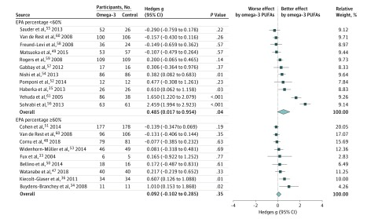

**Khan SU, Lone AN, Khan MS, Virani SS, Blumenthal RS, Nasir K, Miller M 2021. *Effect of omega-3 fatty acids on cardiovascular outcomes: A systematic review and meta-analysis***  
[PMC8413259](https://pmc.ncbi.nlm.nih.gov/articles/PMC8413259/) · CC BY · **stored**

- 🗺 **Fig. 1** — Flow chart showing study selection process.
  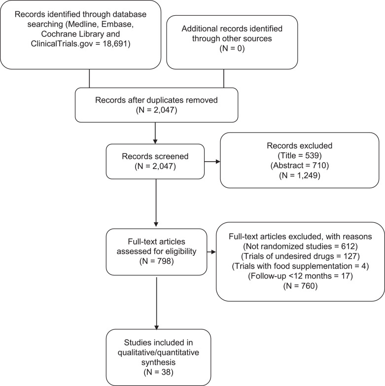
- 📊 **Fig. 2** — Effect of omega-3 fatty acid on cardiovascular mortality.AREDS2: Age-Related Eye Disease Study 2; ASCEND: A Study of Cardiovascular Events in Diabetes; CI: confidence interval; DHA: Docosahexaenoic acid; DO IT: The Diet and Omega-3 Intervention Trial; EPA: Eicosapentaenoic acid; FA: fatty acid;…
  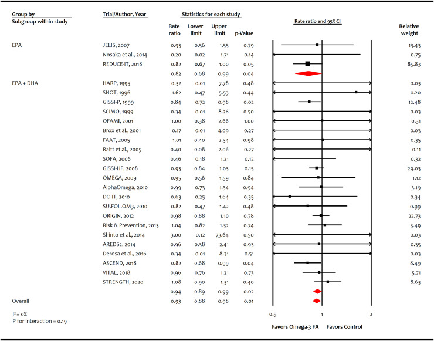
- 📊 **Fig. 3** — Effect of omega-3 fatty acid on non-fatal myocardial infarction.AREDS2: Age-Related Eye Disease Study 2; ASCEND: A Study of Cardiovascular Events in Diabetes; CI: confidence interval; DHA: Docosahexaenoic acid; EPA: Eicosapentaenoic acid; FA: fatty acid; FORWARD: Randomized Trial to Assess Efficacy…
  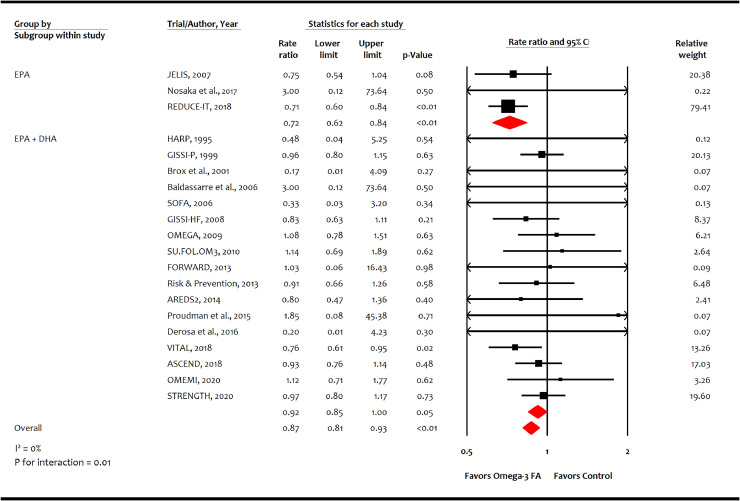
- 📊 **Fig. 4** — Effect of omega-3 fatty acid on coronary heart disease events.AREDS2: Age-Related Eye Disease Study 2; ASCEND: A Study of Cardiovascular Events in Diabetes; CI: confidence interval; DHA: Docosahexaenoic acid; DO IT: The Diet and Omega-3 Intervention Trial; EPE-A: Ethyl-eicosapentanoic Acid; EPA:…
  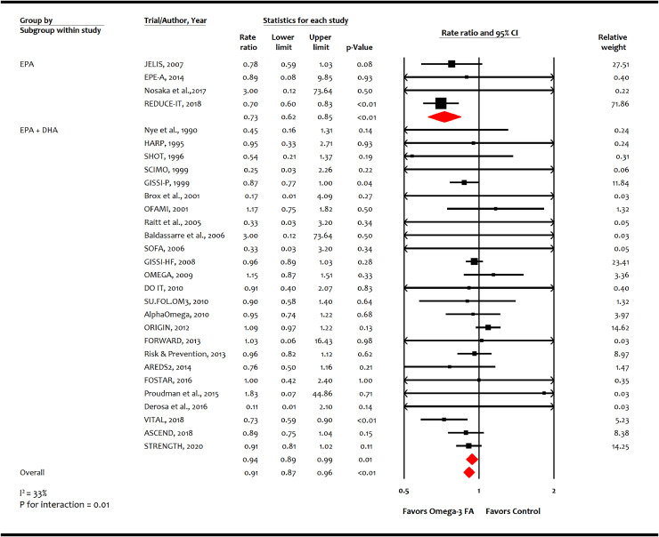

---

## [How to Increase Testosterone Naturally](increase-testosterone-naturally.md)

**Leproult R, Van Cauter E. 2011. *Effect of 1 week of sleep restriction on testosterone levels in young healthy men***  
[PMC4445839](https://pmc.ncbi.nlm.nih.gov/articles/PMC4445839/) · NIH manuscript — text mining/fair use only · link only

- 🖼 **Figure** — 24-Hour Profiles of Serum Testosterone and Serum Cortisol According to Bedtime Condition ([view](https://pmc.ncbi.nlm.nih.gov/articles/PMC4445839/figure/F1/))

**West DW, Phillips SM. 2012. *Associations of exercise-induced hormone profiles and gains in strength and hypertrophy in a large cohort after weight training***  
[PMC3371329](https://pmc.ncbi.nlm.nih.gov/articles/PMC3371329/) · CC BY-NC · **stored**

- 📊 **Fig. 1** — Correlations between acute GH, free testosterone, IGF-1 and cortisol responses (area under the curve—AUC) and gains in lean body mass (n = 56). Cortisol AUC was correlated with LBM (r = 0.29, P = 0.03)
  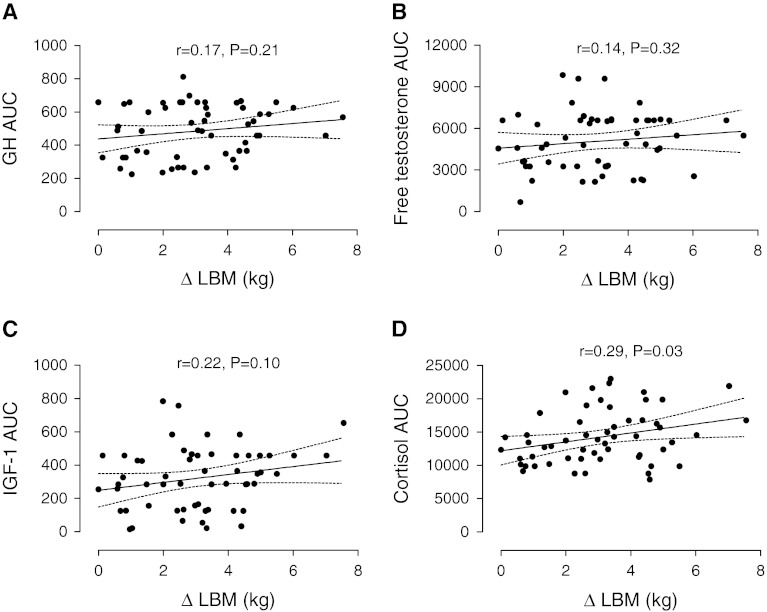
- 📊 **Fig. 2** — Correlations between acute GH, free testosterone, IGF-1 and cortisol responses (area under the curve—AUC) and gains in leg press strength (n = 56). No correlations were significant (all P > 0.05)
  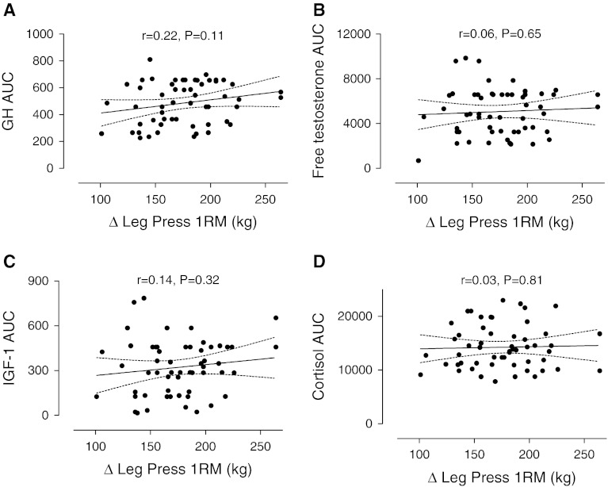
- 📊 **Fig. 3** — Correlations between acute GH, free testosterone, IGF-1 and cortisol responses (area under the curve—AUC) and gains in type I fibre CSA (n = 56). GH AUC was correlated with and gains in type I fibre CSA (r = 0.36, P = 0.006)
  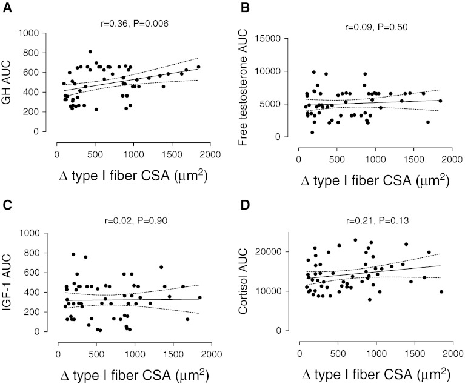
- 📊 **Fig. 4** — Correlations between acute GH, free testosterone, IGF-1 and cortisol responses (area under the curve—AUC) and gains in type II fibre CSA (n = 56). GH and cortisol AUC were significantly correlated to gains in type II fibre CSA r = 0.28, P = 0.04; r = 0.35, P = 0.008, respectively)
  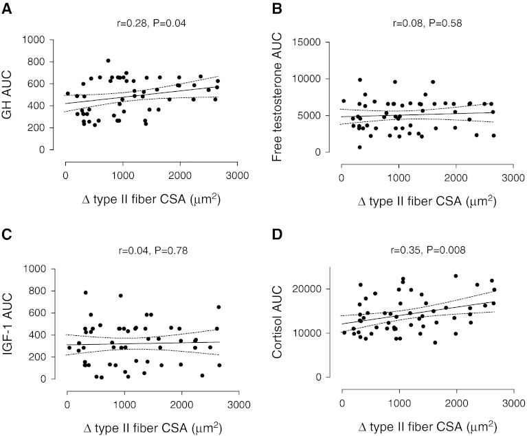
- 📊 **Fig. 5** — Standardized Z scores were calculated using nutritional group (Milk, Soy, Control) means and standard deviations (SD). The GH, free testosterone and IGF-1 response (area under the curve) of individuals with Z scores greater than +1 (i.e., ‘responders’) was compared to the response of individuals…
  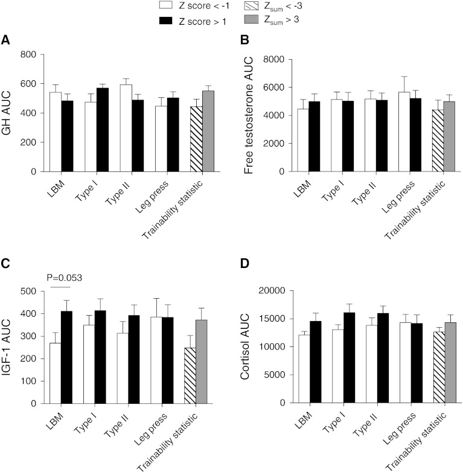

**Reynolds AC, Dorrian J, Liu PY, Van Dongen HP, Wittert GA, Harmer LJ, 2012. *Impact of five nights of sleep restriction on glucose metabolism, leptin and testosterone in young adult men***  
[PMC3402517](https://pmc.ncbi.nlm.nih.gov/articles/PMC3402517/) · CC BY · **stored**

- 📊 **Figure 1** — Metabolic and hormonal outcomes on baseline day 1 (B1) and after 5 nights of sleep restriction (SR5).Mean levels of: A–ACTH, B–cortisol, C–glucose, D–insulin, E–triglycerides, F–leptin, G–total testosterone, and H–sex hormone binding globulin. Bars represent SE. All subjects experienced two…
  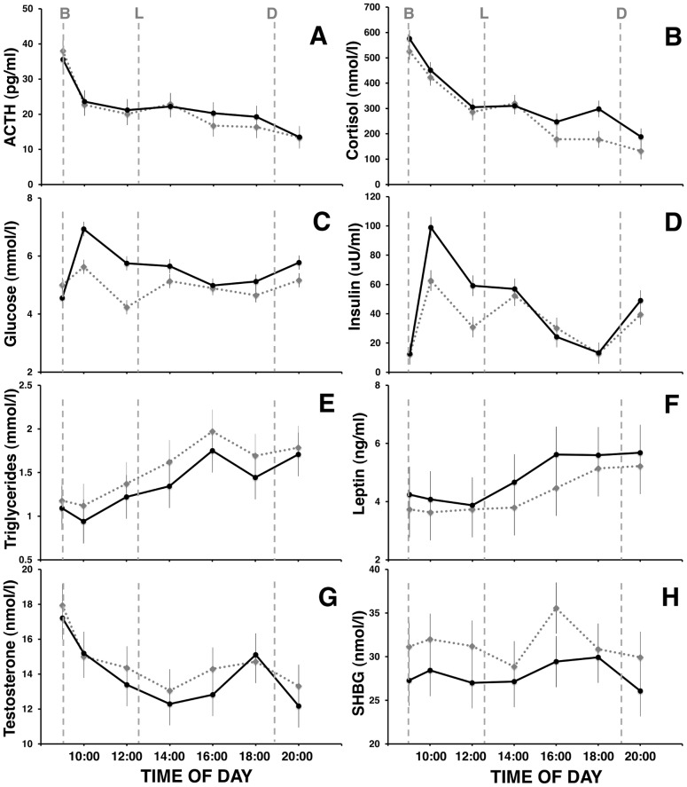
- 📊 **Figure 2** — Blood glucose levels before and after breakfast on baseline day 1 (B1) and after 5 nights of sleep restriction (SR5).Mean pre-prandial (dark grey) and post- prandial (light grey) blood glucose (mmol/l) at baseline (B1) and following sleep restriction (SR5) (*, p = .002, **, p<.001) (bars = SE).
  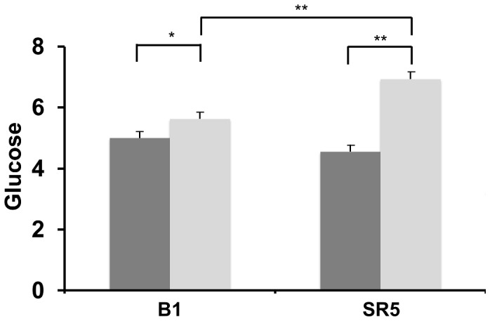
- 🖼 **Figure 3** — 24 h interstitial glucose (mmol/l) on baseline day 1 (B1) and after 5 nights of sleep restriction (SR5).Readings were taken at 5 min intervals starting at 20:00 using the Guardian® REAL-Time Continuous Glucose Monitoring System. Meal times are marked with arrows, left to right: breakfast (B)…
  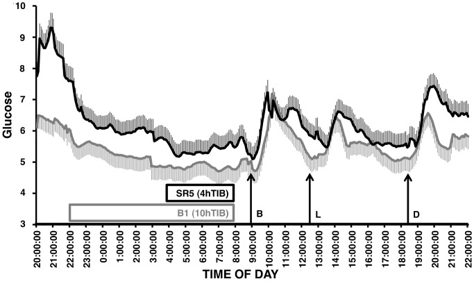

**Killick R, Hoyos CM, Melehan KL, Dungan GC, Poh J, Liu PY. 2015. *Metabolic and hormonal effects of 'catch-up' sleep in men with chronic, repetitive, lifestyle-driven sleep restriction***  
[PMC4858168](https://pmc.ncbi.nlm.nih.gov/articles/PMC4858168/) · CC BY · **stored**

- 🗺 **Figure 1** — Study design. Subjects were randomized to undergo two of three (young men) or two (older men) conditions in random order: that is, AB, BA, AC, CA, BC or CB in young men; AB or BA in older men. There were 3 weeks washout between conditions.
  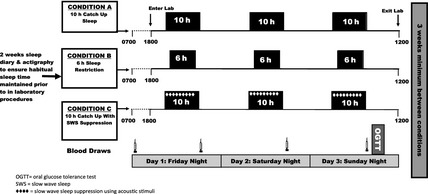
- 📊 **Figure 2** — Polysomnographic sleep parameters between pairs of conditions averaged over three experimental nights. (a) TST (mins), (b) sleep efficiency (%TST), (c) arousal index (events/h), (d) SWS proportion (%TST) 10 h/6 h n = 8, 10 h/10 h↓SWS n = 6, 6 h/10 h↓SWS n = 5. Error bars are SEM. * represents…
  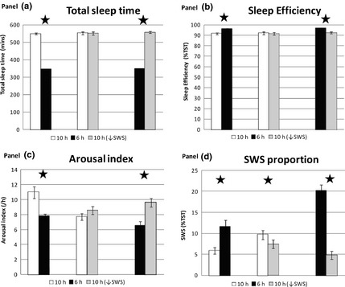
- 📊 **Figure 3** — Metabolic outcomes between pairs of conditions from minimal model of an oral glucose tolerance test performed on Monday after three nights of each condition. (a) insulin sensitivity (/min/(μU/ml)), (b) disposition index, (c) glucose area under the curve (AUC‐ mmol/l. min), (d) insulin AUC (iu/ml.…
  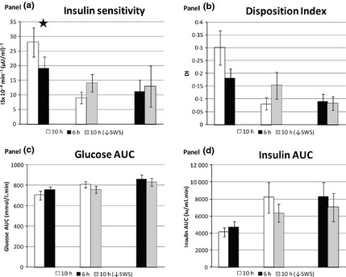
- 📊 **Figure 4** — Metabolic outcomes between pairs of conditions from daily fasting blood samples showing mean values across Sat/Sun/Mon. (a) glucose (mmol/l), (b) insulin (iu/ml), (c) c‐peptide (pmol/l), (d) HOMA‐β, (e) HOMA‐IR, (f) QUICKI. 10 h/6 h n = 8, 10 h/10 h↓SWS n = 6, 6 h/10 h↓SWS n = 5. Error bars are…
  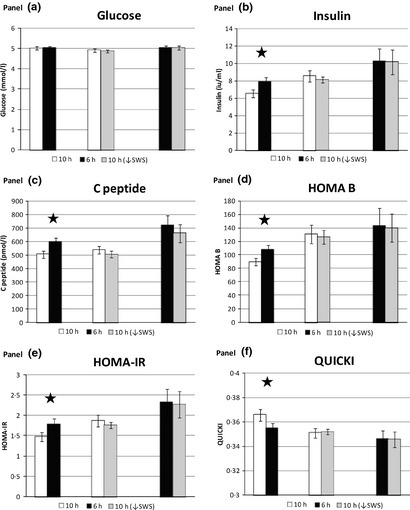
- 📊 **Figure 5** — Metabolic outcomes between pairs of conditions from daily fasting blood samples showing mean values across Sat/Sun/Mon. (a) leptin (ng/ml), (b) PYY (pg/ml), (c) ghrelin (pmol/l), (d) cortisol (nmol/l), (e) testosterone (nm), (f) lutenizing hormone (LH‐iU/l). 10 h/6 h n = 8, 10 h/10 h↓SWS n = 6, 6…
  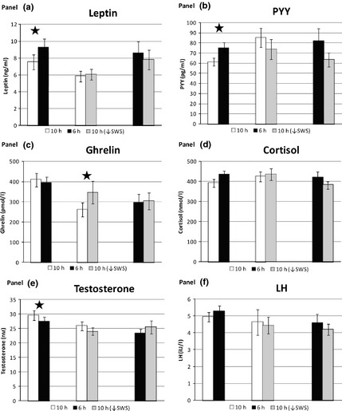

**Wankhede S, Langade D, Joshi K, Sinha SR, Bhattacharyya S. 2015. *Examining the effect of Withania somnifera supplementation on muscle strength and recovery: a randomized controlled trial***  
[PMC4658772](https://pmc.ncbi.nlm.nih.gov/articles/PMC4658772/) · CC BY · **stored**

- 🗺 **Fig. 1** — CONSORT schematic diagram
  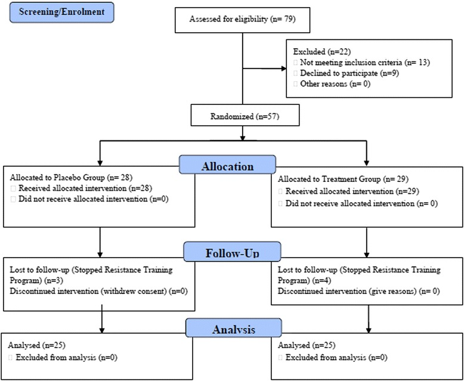
- 🖼 **Fig. 2** — The effect of Ashwagandha treatment in muscle strength [a bench press 1 RM, b leg extension 1RM] and muscle size in c thigh, d arm and e Chest
  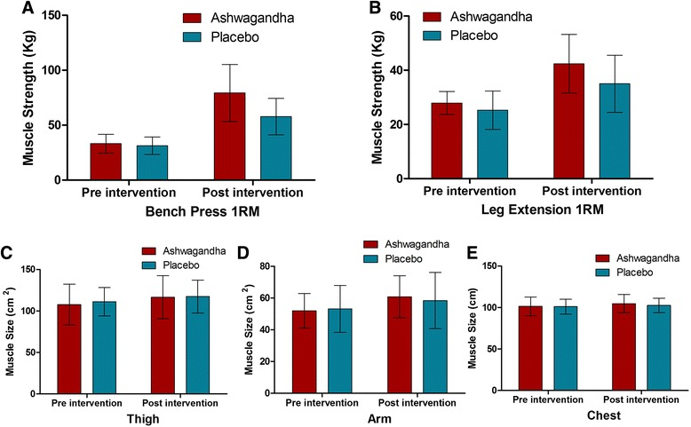
- 🖼 **Fig. 3** — The effect of Ashwagandha treatment in a serum testosterone and b serum creatine kinase level
  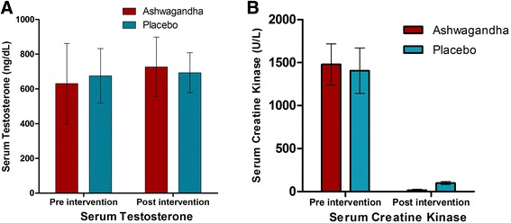

**Lawrence KL, Stewart F, Larson BM. 2017. *Approaches to male hypogonadism in primary care***  
[PMC5278890](https://pmc.ncbi.nlm.nih.gov/articles/PMC5278890/) · no licence stated · link only

- 🖼 **Figure** — No caption available. ([view](https://pmc.ncbi.nlm.nih.gov/articles/PMC5278890/figure/FU1-8/))

---

## [Post-Contest Recovery and Peri-Workout Protein Timing](increasing-testosterone-after-competing.md)

**Mori H. 2014. *Effect of timing of protein and carbohydrate intake after resistance exercise on nitrogen balance in trained and untrained young men***  
[PMC4155766](https://pmc.ncbi.nlm.nih.gov/articles/PMC4155766/) · CC BY · **stored**

- 🖼 **Figure 1** — Experimental schedule. Subjects were intake of protein (0.3 g/kg body weight) and carbohydrate (0.8 g/kg body weight) immediately after (P0 experimental period) or 6 h (P6 experimental period) after resistance exercise session. PRO, Protein; CHO, carbohydrate.
  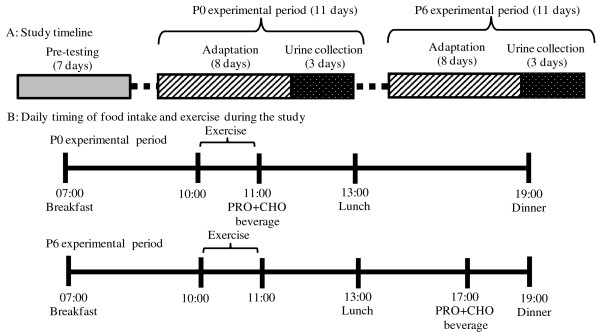

---

## [Junk Volume: The Three Ways Lifters Waste Sets](junk-volume.md)

**Hamarsland H, Moen H, Skaar OJ, Jorang PW, Rødahl HS, Rønnestad BR. 2021. *Equal-Volume Strength Training With Different Training Frequencies Induces Similar Muscle Hypertrophy and Strength Improvement in Trained Participants***  
[PMC8766679](https://pmc.ncbi.nlm.nih.gov/articles/PMC8766679/) · CC BY · **stored**

- 🖼 **FIGURE 1** — Weekly training volume (A) and average load (B) with 2 (LF) and 4 (HF) weekly sessions during a 9-week resistance training intervention.
  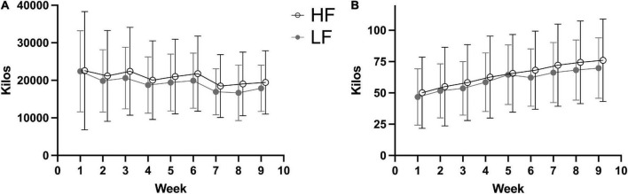
- 📊 **FIGURE 2** — Percent changes in one repetition maximum for squat, hack squat, bench press, and chest press. Horizontal lines are averages with error bars representing SD. #Difference between simple and complex exercises, p < 0.05.
  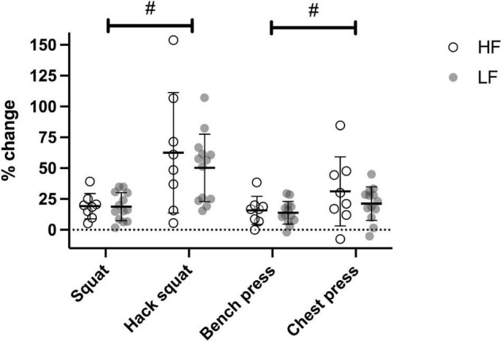

---

## [The Ketogenic Diet: What the Science Says About Fat Loss, Muscle and Health](ketogenic-diet-science-behind-low-carb-keto.md)

**Paoli A, Rubini A, Volek JS, Grimaldi KA. 2013. *Beyond weight loss: a review of the therapeutic uses of very-low-carbohydrate (ketogenic) diets***  
[PMC3826507](https://pmc.ncbi.nlm.nih.gov/articles/PMC3826507/) · CC BY · **stored**

- 🖼 **Figure 1** — Suggested mechanisms for the therapeutic action of ketogenic diets in pathologies for which there exists strong (a) and emerging (b) evidence.
  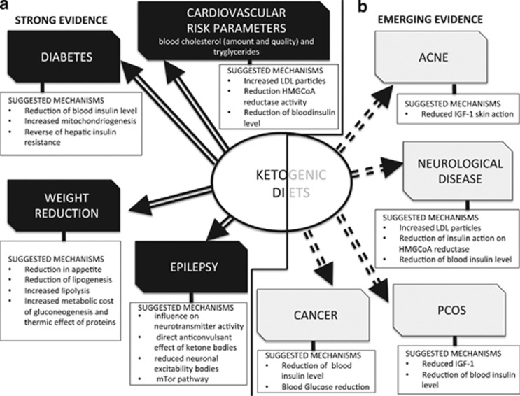

**Naude CE, Schoonees A, Senekal M, Young T, Garner P, Volmink J. 2014. *Low carbohydrate versus isoenergetic balanced diets for reducing weight and cardiovascular risk: a systematic review and meta-analysis***  
[PMC4090010](https://pmc.ncbi.nlm.nih.gov/articles/PMC4090010/) · CC BY · **stored**

- 🗺 **Figure 1** — Flow diagram illustrating the search results and selection process, as well as the variants of the low carbohydrate diets used as treatments in the included trials.The high fat variant of low carbohydrate diets is low in carbohydrates (<45% of total energy), high in fat (>35% of total energy) and…
  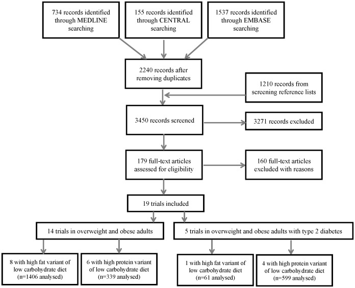
- 📊 **Figure 2** — Risk of bias: systematic review authors' judgements about each risk of bias item presented as percentages across all included trials using the Cochrane risk of bias tool (n = 19).
  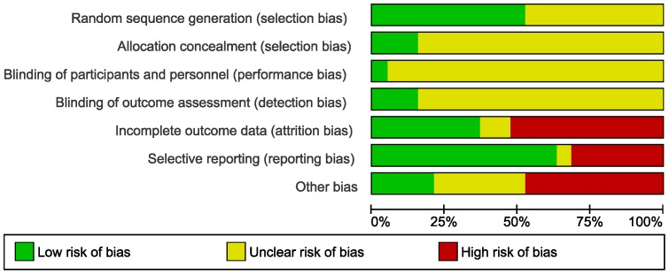
- 📊 **Figure 3** — Forest plot of low carbohydrate versus balanced diets in overweight and obese adults for weight loss (kg) at 3–6 months.
  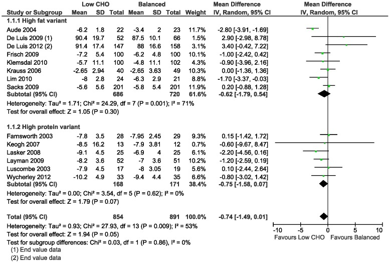
- 📊 **Figure 4** — Forest plot of low carbohydrate versus balanced diets in overweight and obese adults for weight loss (kg) at 1–2 years.
  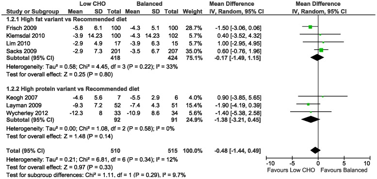
- 📊 **Figure 5** — Forest plot of low carbohydrate versus balanced diets in overweight and obese adults with type 2 diabetes for weight loss (kg) at 3–6 months.
  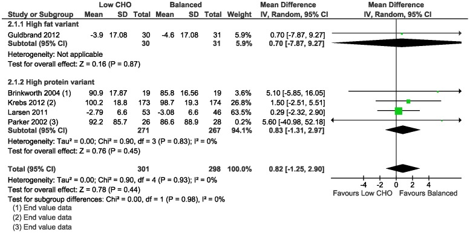
- 📊 **Figure 6** — Forest plot of low carbohydrate versus balanced diets in overweight and obese adults with type 2 diabetes for weight loss (kg) at 1–2 years.
  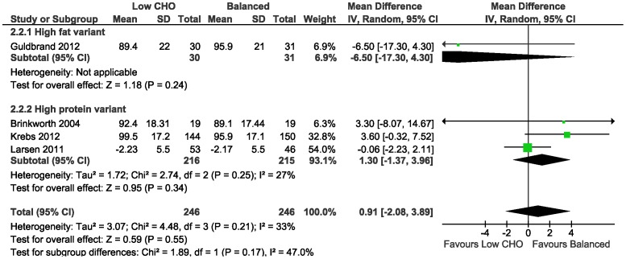

---

## [Kiwi Fruit and the Superfood Concept](kiwi-fruit-one-true-superfood.md)

**Carr AC, Bozonet SM, Pullar JM, Vissers MC. 2013. *Mood improvement in young adult males following supplementation with gold kiwifruit, a high-vitamin C food***  
[PMC4153016](https://pmc.ncbi.nlm.nih.gov/articles/PMC4153016/) · CC BY-NC-SA · **stored**

- 🖼 **Fig. 1.** — Individual mood scores and total mood disturbance (TMD) score at baseline (■) and following 6 weeks' intervention () with (a) half a kiwifruit/d or (b) two kiwifruit/d. Data are means, with standard errors represented by vertical bars.
  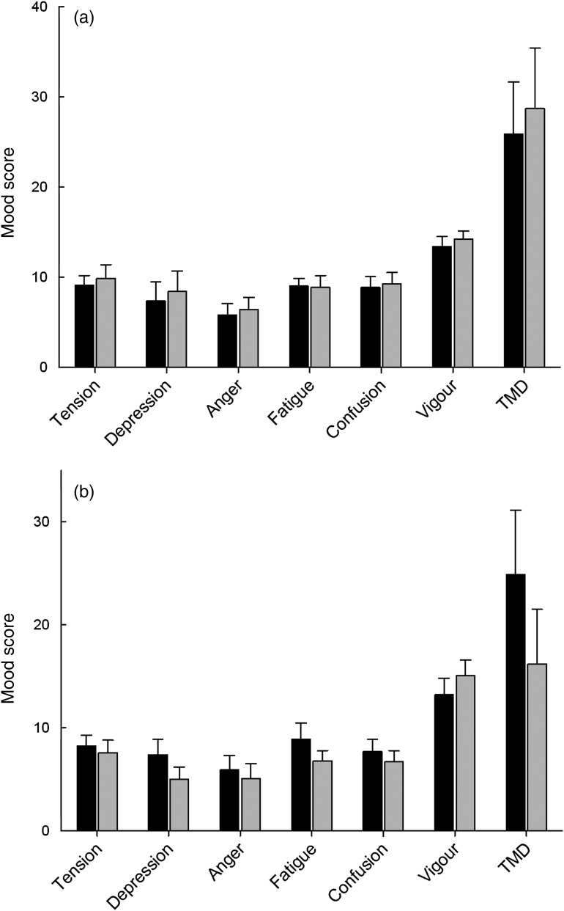
- 📊 **Fig. 2.** — Effect of two kiwifruit/d intervention on individual mood scores and total mood disturbance (TMD) score in (a) the high-TMD subgroup (n 8) and (b) the low-TMD subgroup (n 9). ■, Baseline; , intervention. Data are means, with standard errors represented by vertical bars. * Mean value was…
  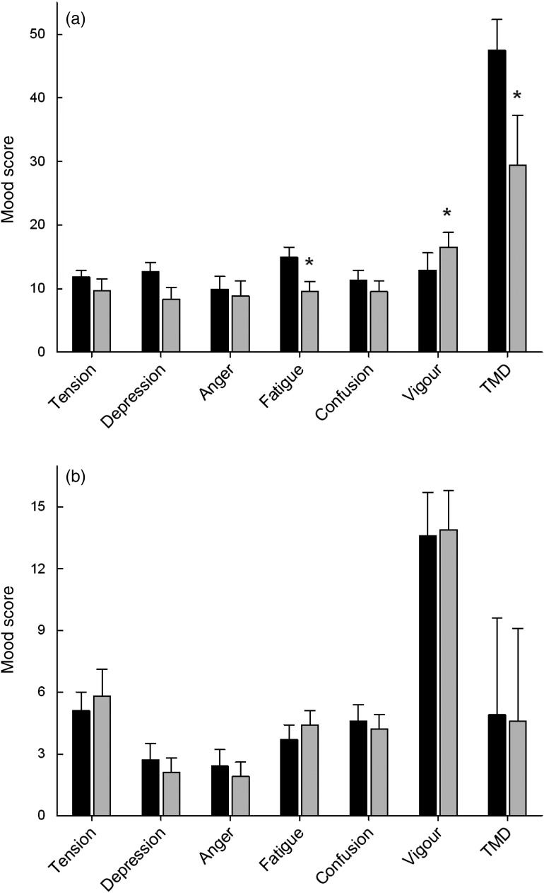

---

## [The Leg Workout Behind Nippard's One-Year Transformation](leg-workout-followed-1-year-transformation.md)

**Maeo S, Huang M, Wu Y, Sakurai H, Kusagawa Y, Sugiyama T, Kanehisa H, 2021. *Greater Hamstrings Muscle Hypertrophy but Similar Damage Protection after Training at Long versus Short Muscle Lengths***  
[PMC7969179](https://pmc.ncbi.nlm.nih.gov/articles/PMC7969179/) · CC BY-NC-ND · **stored**

- 📊 **FIGURE 1** — Operating ranges of each hamstring muscle on the normalized force–length curve during the seated and prone knee flexion (leg curl) exercise. These were calculated using the OpenSim Lower Limb model (8,9), with the hip joint angle at 90° and 30° for the seated and prone conditions, respectively, and…
  
- 🗺 **FIGURE 2** — Flow diagram and demographic information of participants.
  
- 🖼 **FIGURE 3** — Example images for the T1-weighted MRI scans (for Seated-Leg in part 1) and T2-weighted MRI scans (for Control-Leg in part 2) at 50% of the thigh length, and a coronal localizer image. The images shown here are all for the right leg, but both legs were scanned in both part 1 and part 2.
  
- 📊 **FIGURE 4** — Changes in muscle volume for Seated-Leg and Prone-Leg after training. Data are plotted as individual raw change (Δ) values from baseline (small dots), with a group mean (larger dots) and its 95% CI (indicated by the ends of the vertical error bars) shown together. The CI and the bootstrap sampling…
  
- 📊 **FIGURE 5** — Changes in ACSA of the BFL and ST at 30% (BFLProximal, STProximal) and 70% (BFLDistal, STDistal) of the thigh length for Seated-Leg and Prone-Leg after training. Data are plotted as individual raw change (Δ) values from baseline (small dots), with a group mean (larger dots) and its 95% CI…
  
- 📊 **FIGURE 6** — Changes in T2 of each hamstring muscle at 50% of the thigh length (BFLMiddle, STMiddle, SMMiddle, BFSMiddle) at 72 h after eccentric exercise for Seated-Leg, Prone-Leg, and Control-Leg. Data are plotted as individual raw change (Δ) values from baseline (small dots), with a group mean (larger dots)…
  
- 📊 **FIGURE 7** — Changes in T2 of the BFL and ST at 30% (BFLProximal, STProximal) and 70% (BFLDistal, STDistal) of the thigh length at 72 h after eccentric exercise for Seated-Leg, Prone-Leg, and Control-Leg. Data are plotted as individual raw change (Δ) values from baseline (small dots), with a group mean (larger…
  
- 📊 **FIGURE 8** — Changes in the seated and prone leg curl 1RM at 24, 48, and 72 h after eccentric exercise for Seated-Leg, Prone-Leg, and Control-Leg. Data are plotted as individual raw change (Δ) values from baseline (small dots), with a group mean (larger dots) and its 95% CI (indicated by the ends of the…
  

---

## [What "Science-Based Lifting" Actually Gets Right (And What Jeff Nippard Retracts)](lifting-over.md)

**Schoenfeld BJ, Contreras B, Krieger J, Grgic J, Delcastillo K, Belliar 2019. *Resistance Training Volume Enhances Muscle Hypertrophy but Not Strength in Trained Men***  
[PMC6303131](https://pmc.ncbi.nlm.nih.gov/articles/PMC6303131/) · CC BY-NC-ND · **stored**

- 🗺 **FIGURE 1** — Flowchart of data collection process.
  
- 🖼 **FIGURE 2** — Prestudy to poststudy changes in muscle strength and endurance for each condition. (A) 1RM bench press; (B) 1RM squat; (C) upper body muscular endurance. Values for 1RMBENCH and RMSQUAT are in kilograms; values for 50%BP are in repetitions.
  
- 🖼 **FIGURE 3** — Prestudy to poststudy changes in MT for each condition. (A) Elbow flexors; (B) elbow extensors; (C) mid-thigh; (D) lateral thigh. All values are in millimeters.
  

**Maeo S, Huang M, Wu Y, Sakurai H, Kusagawa Y, Sugiyama T, Kanehisa H, 2021. *Greater Hamstrings Muscle Hypertrophy but Similar Damage Protection after Training at Long versus Short Muscle Lengths***  
[PMC7969179](https://pmc.ncbi.nlm.nih.gov/articles/PMC7969179/) · CC BY-NC-ND · **stored**

- 📊 **FIGURE 1** — Operating ranges of each hamstring muscle on the normalized force–length curve during the seated and prone knee flexion (leg curl) exercise. These were calculated using the OpenSim Lower Limb model (8,9), with the hip joint angle at 90° and 30° for the seated and prone conditions, respectively, and…
  
- 🗺 **FIGURE 2** — Flow diagram and demographic information of participants.
  
- 🖼 **FIGURE 3** — Example images for the T1-weighted MRI scans (for Seated-Leg in part 1) and T2-weighted MRI scans (for Control-Leg in part 2) at 50% of the thigh length, and a coronal localizer image. The images shown here are all for the right leg, but both legs were scanned in both part 1 and part 2.
  
- 📊 **FIGURE 4** — Changes in muscle volume for Seated-Leg and Prone-Leg after training. Data are plotted as individual raw change (Δ) values from baseline (small dots), with a group mean (larger dots) and its 95% CI (indicated by the ends of the vertical error bars) shown together. The CI and the bootstrap sampling…
  
- 📊 **FIGURE 5** — Changes in ACSA of the BFL and ST at 30% (BFLProximal, STProximal) and 70% (BFLDistal, STDistal) of the thigh length for Seated-Leg and Prone-Leg after training. Data are plotted as individual raw change (Δ) values from baseline (small dots), with a group mean (larger dots) and its 95% CI…
  
- 📊 **FIGURE 6** — Changes in T2 of each hamstring muscle at 50% of the thigh length (BFLMiddle, STMiddle, SMMiddle, BFSMiddle) at 72 h after eccentric exercise for Seated-Leg, Prone-Leg, and Control-Leg. Data are plotted as individual raw change (Δ) values from baseline (small dots), with a group mean (larger dots)…
  
- 📊 **FIGURE 7** — Changes in T2 of the BFL and ST at 30% (BFLProximal, STProximal) and 70% (BFLDistal, STDistal) of the thigh length at 72 h after eccentric exercise for Seated-Leg, Prone-Leg, and Control-Leg. Data are plotted as individual raw change (Δ) values from baseline (small dots), with a group mean (larger…
  
- 📊 **FIGURE 8** — Changes in the seated and prone leg curl 1RM at 24, 48, and 72 h after eccentric exercise for Seated-Leg, Prone-Leg, and Control-Leg. Data are plotted as individual raw change (Δ) values from baseline (small dots), with a group mean (larger dots) and its 95% CI (indicated by the ends of the…
  

**Saeterbakken AH, Stien N, Pedersen H, Solstad TEJ, Cumming KT, Anderse 2021. *The Effect of Grip Width on Muscle Strength and Electromyographic Activity in Bench Press among Novice- and Resistance-Trained Men***  
[PMC8296276](https://pmc.ncbi.nlm.nih.gov/articles/PMC8296276/) · CC BY · **stored**

- 📊 **Figure 1** — (a,b). The mean 6-RM loads (95% CI) in narrow, medium, and wide grip widths for the RT group (a) and novice group (b). * Significant difference compared to the other grip widths.
  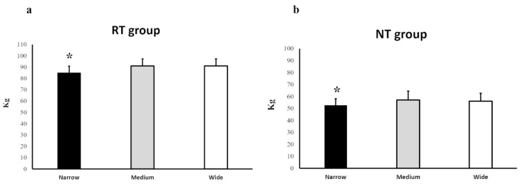
- 📊 **Figure 2** — The normalized EMG activity (i.e., % of MVIC) for the RT group and NT group as mean (95% CI). * Significant difference between the grip widths.
  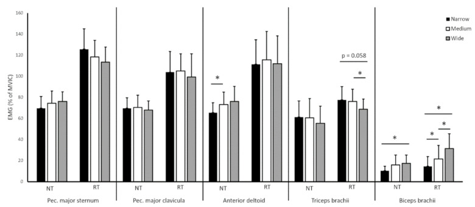

**Pedrosa GF, Simões MG, Figueiredo MOC, Lacerda LT, Schoenfeld BJ, Lima 2023. *Training in the Initial Range of Motion Promotes Greater Muscle Adaptations Than at Final in the Arm Curl***  
[PMC9960616](https://pmc.ncbi.nlm.nih.gov/articles/PMC9960616/) · CC BY · **stored**

- 🗺 **Figure 1** — Training protocols range of motion. (A1,A2) = starting and finishing the concentric action of INITIALROM protocol (0°–68° of elbow flexion), respectively. (B1,B2) = starting and finishing the concentric action of FINALROM protocol (68°–135° of elbow flexion), respectively.
  
- 🗺 **Figure 2** — The paired mean difference for cross-sectional area in INITIALROM and FINALROM at (a) 50% humeral length; (b) 70% humeral length; and (c) summed values of 50% and 70% humeral length [30]. The raw data are plotted on the upper axes; each paired set of observations is connected by a line. On the…
  
- 🗺 **Figure 3** — The paired mean difference for 1 repetition maximum in INITIALROM and FINALROM [30]. The raw data are plotted on the upper axes; each paired set of observations is connected by a line. On the lower axes, each paired mean difference is plotted as a bootstrap sampling distribution. Mean differences…
  

**Kinoshita M, Maeo S, Kobayashi Y, Eihara Y, Ono M, Sato M, Sugiyama T, 2023. *Triceps surae muscle hypertrophy is greater after standing <i>versus</i> seated calf-raise training***  
[PMC10753835](https://pmc.ncbi.nlm.nih.gov/articles/PMC10753835/) · CC BY · **stored**

- 📊 **FIGURE 1** — Postures of the standing and seated calf-raise exercises and operating ranges of each triceps surae muscle on the normalized force–length curve during the exercises. These were obtained using the OpenSim Gait 2392 model (Delp et al., 2007), with the knee joint 0° and 90° for the standing and seated…
  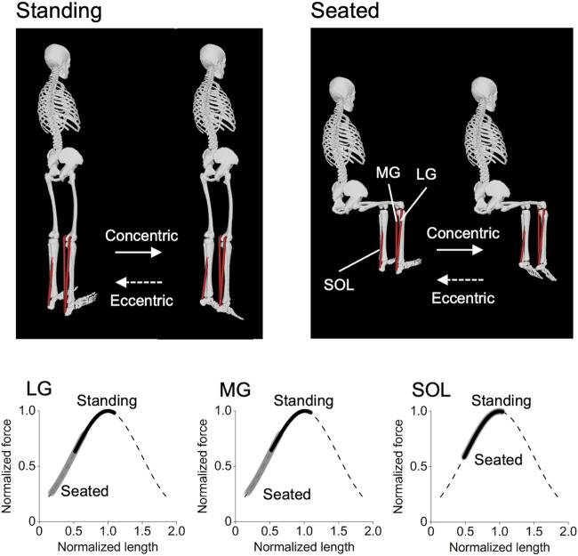
- 🖼 **FIGURE 2** — Pictures of standing (A) and seated (B) calf-raise training, targeting the left and right leg, respectively.
  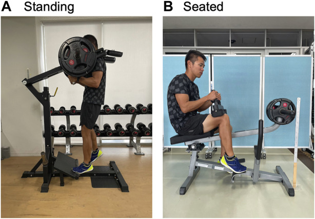
- 📊 **FIGURE 3** — Muscle volume before and after the training and its change. In each subfigure/muscle(s), the raw data is plotted on the upper axes for the standing (A) and seated (B) conditions; each paired set of observations at Pre and Post is connected by a line. On the lower axes, each paired mean difference…
  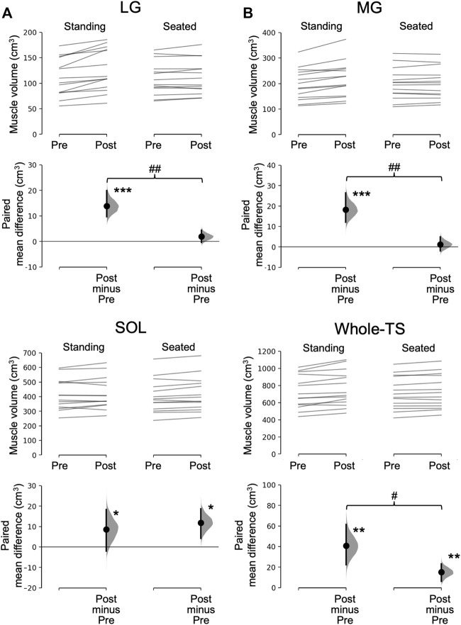
- 📊 **FIGURE 4** — The summary in percentage change based on the mean changes for each muscle and the whole triceps surae. ***p < 0.001, **p < 0.01 and *p < 0.05 difference between times (pre vs. post). ##p < 0.01 and #p < 0.05 difference between conditions (legs). LG, lateral gastrocnemius; MG, medial gastrocnemius;…
  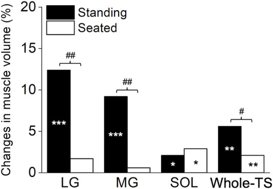

---

## [The Five Features That Make People Assume You're On Steroids — And How To Build Them Naturally](look-enhanced-without-steroids.md)

**Morton RW, Sato K, Gallaugher MPB, Oikawa SY, McNicholas PD, Fujita S, 2018. *Muscle Androgen Receptor Content but Not Systemic Hormones Is Associated With Resistance Training-Induced Skeletal Muscle Hypertrophy in Healthy, Young Men***  
[PMC6189473](https://pmc.ncbi.nlm.nih.gov/articles/PMC6189473/) · CC BY · **stored**

- 📊 **FIGURE 1** — The change in muscle mass in all participants (top) and HIR and LOR (bottom). Top panels: The change in (A) type 1 CSA, (B) type 2 CSA, and (C) LBM from all 49 participants. Bottom panels: The change in (D) type 1 CSA, (E) type 2 CSA, and (F) LBM categorized into HIR and LOR. Values are presented…
  
- 📊 **FIGURE 2** — Scree plots illustrating the proportion of variance in the original hormones explained by each principal component. The panels include the principal components derived from systemic hormones measured: (A) pre-intervention post-exercise, (B) post-intervention post-exercise, (C) pre-intervention…
  
- 📊 **FIGURE 3** — Intramuscular (A) free testosterone concentration, (B) dihydrotestosterone concentration, (C) 5α-reductase expression, and (D) androgen receptor content presented pre- and post-intervention in both high- and low-responders. Representative immunoblots for 5α-reductase expression (C) and androgen…
  
- 📊 **FIGURE 4** — Correlations between the pre-intervention intramuscular androgen receptor content and changes in muscle mass. Correlations are presented in panels for: (A) type 1 CSA (r = 0.51, P = 0.03), (B) type 2 CSA (r = 0.61, P < 0.01), and (C) LBM (r = 0.76, P < 0.01). In (C), the outlier that was removed…
  

**Ma H, Sun J, Wu X, Mao J, Han Q. 2024. *Percent body fat was negatively correlated with Testosterone levels in male***  
[PMC10763932](https://pmc.ncbi.nlm.nih.gov/articles/PMC10763932/) · CC BY · **stored**

- 🗺 **Fig 1** — Flow chart of sample selection from the NHANES 2011–2016.
  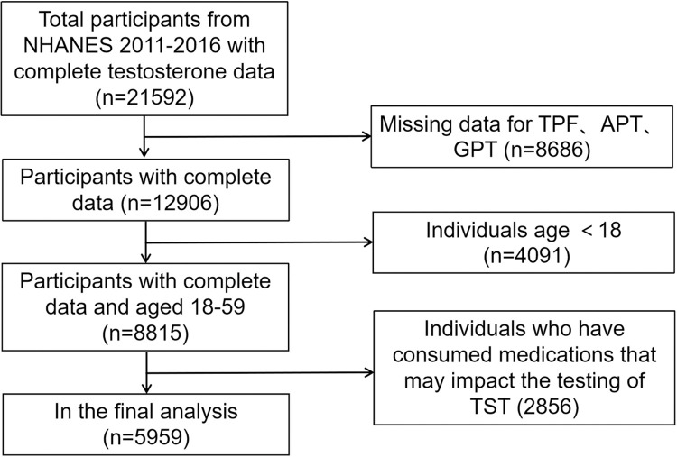
- 📊 **Fig 2** — The association between total percent fat (%) and testosterone (ng/dL).(a) Each black point represents a sample. (b) Solid red line represents the smooth curve fit between variables. Blue bands represent the 95% confidence bands derived from the fit. (c) Stratified by sex. Age, sex, race,…
  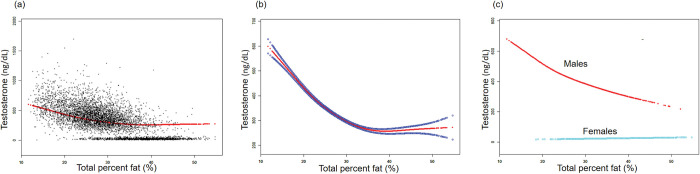
- 📊 **Fig 3** — The association between lean mass percent (%) and testosterone (ng/dL).(a) Each black point represents a sample. (b) Solid red line represents the smooth curve fit between variables. Blue bands represent the 95% confidence bands derived from the fit. (c) Stratified by sex. Age, sex, race,…
  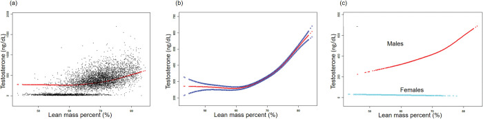

---

## [How to Keep Making Gains as a Beginner, Intermediate and Advanced Lifter](make-gains-every-fitness-level.md)

**Morton RW, Murphy KT, McKellar SR, Schoenfeld BJ, Henselmans M, Helms 2018. *A systematic review, meta-analysis and meta-regression of the effect of protein supplementation on resistance training-induced gains in muscle mass and strength in healthy adults***  
[PMC5867436](https://pmc.ncbi.nlm.nih.gov/articles/PMC5867436/) · CC BY-NC · **stored**

- 🗺 **Figure 1** — PRISMA flow chart.
  
- 📊 **Figure 2** — Forest plot of the results from a random-effects meta-analysis shown as mean difference with 95% CIs on one-repetition-maximum (1 RM; kg) in untrained and trained participants. For each study, the circle represents the mean difference of the intervention effect with the horizontal line intersecting…
  
- 📊 **Figure 3** — Forest plot of the results from a random-effects meta-analysis shown as mean difference with 95% CIs on lean or fat-free mass (FFM; kg) in untrained and trained participants. For each study, the circle represents the mean difference of the intervention effect with the horizontal line intersecting…
  
- 📊 **Figure 4** — Random-effects univariate meta-regression between age and the mean difference in fat-free mass (FFM) between groups. Each circle represents a study and the size of the circle reflects the influence of that study on the model (inversely proportionate to the SE of that study). The regression…
  
- 📊 **Figure 5** — Segmental linear regression between relative total protein intake (g/kg body mass/day) and the change in fat-free mass (ΔFFM) measured by dual energy X-ray absorptiometry. Each circle represents a single group from a study. Dashed arrow indicates the break point=1.62 g protein/kg/day, p=0.079.…
  

**Varović D, Žganjer K, Vuk S, Schoenfeld BJ. 2021. *Drop-Set Training Elicits Differential Increases in Non-Uniform Hypertrophy of the Quadriceps in Leg Extension Exercise***  
[PMC8473065](https://pmc.ncbi.nlm.nih.gov/articles/PMC8473065/) · CC BY · **stored**

- 🗺 **Figure 1** — CONSORT flow diagram showing progress of participants through all phases of the study.
  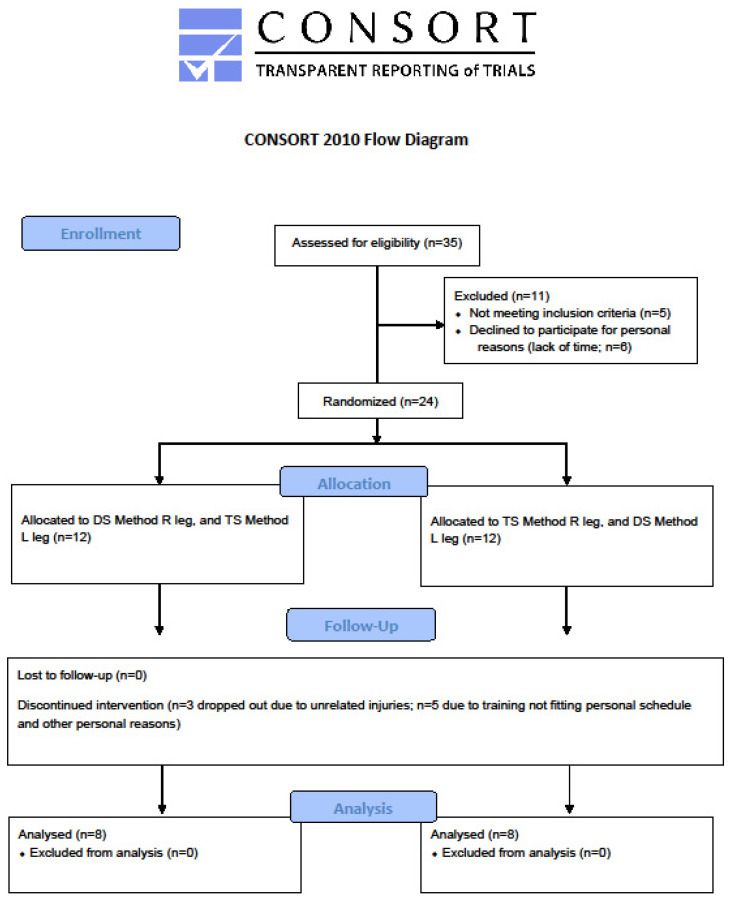
- 📊 **Figure 2** — Estimation plot of the paired mean difference for hypertrophic responses for RF proximal (30%-A), RF middle (50%-B), RF distal (70%-C), VL proximal (30%-D), VL middle (50%-E), VL distal (70%-F) portions of the thigh at within-subjects (top) and between-groups (bottom) conditions. The raw data are…
  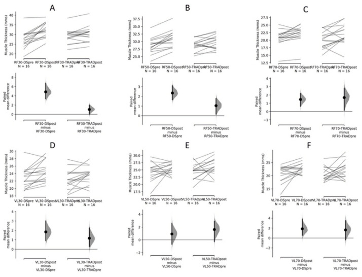

---

## [Overtraining vs Overreaching: How Hard You Can Push Before Progress Stalls](maximize-gains-not-overtrain.md)

**Kreher JB, Schwartz JB. 2012. *Overtraining syndrome: a practical guide***  
[PMC3435910](https://pmc.ncbi.nlm.nih.gov/articles/PMC3435910/) · no licence stated · link only

- 📊 **Figure 1.** — Proposed etiology of OTS through exercise and resultant inflammation. There is a time-dependant sensitization with amplification at each step to repeated intermittent stimuli over time.44,45 ([view](https://pmc.ncbi.nlm.nih.gov/articles/PMC3435910/figure/fig1-1941738111434406/))

**Saw AE, Main LC, Gastin PB. 2016. *Monitoring the athlete training response: subjective self-reported measures trump commonly used objective measures: a systematic review***  
[PMC4789708](https://pmc.ncbi.nlm.nih.gov/articles/PMC4789708/) · CC BY-NC · **stored**

- 🗺 **Figure 1** — Selection of studies flow chart. Studies excluded for not meeting the following criteria: (A) original research; (B) study population of athlete(s); (C) no non-training intervention; (D) include a subjective measure; (E) include an objective measure; and (F) appropriate timing of measures.
  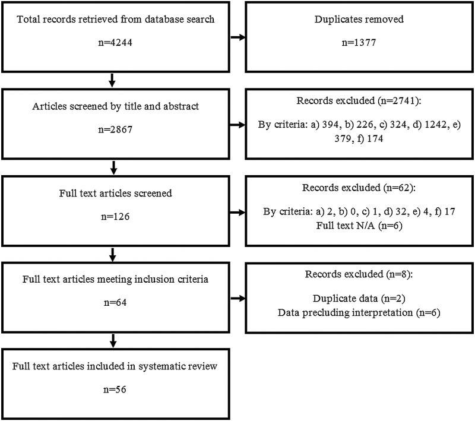

**Dong JG. 2016. *The role of heart rate variability in sports physiology***  
[PMC4840584](https://pmc.ncbi.nlm.nih.gov/articles/PMC4840584/) · CC BY-NC-ND · **stored**

- 📊 **Figure 1.** — Electrocardiogram (ECG) as the basis of measuring heart rate variability (HRV). (A) The electrical activity of the heart is detected by ECG. The waveform components indicate an electrical event during one heart beat. The waveforms are labeled P (first short upward movement of the ECG tracing), the…
  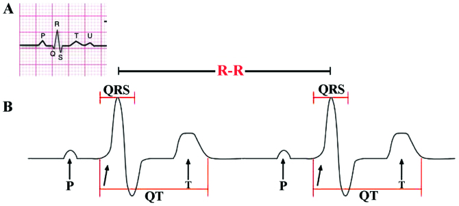

---

## [Can You Speed Up Your Metabolism? Ranking Every Popular Strategy](metabolism-and-energy-expenditure.md)

**Munsters MJ, Saris WH. 2012. *Effects of meal frequency on metabolic profiles and substrate partitioning in lean healthy males***  
[PMC3374835](https://pmc.ncbi.nlm.nih.gov/articles/PMC3374835/) · CC BY · **stored**

- 📊 **Figure 1** — Glucose (A), insulin (B), FFA (C) and TG (D) levels for 24 h and the AUCs of the LFr (dense black circle) and HFr (open gray circle) diet.*P<0.05 LFr vs. HFr diet. P-values were derived by analysis of mixed models for the 24h profiles and by a paired t-test for the AUCs. aValues are expressed as…
  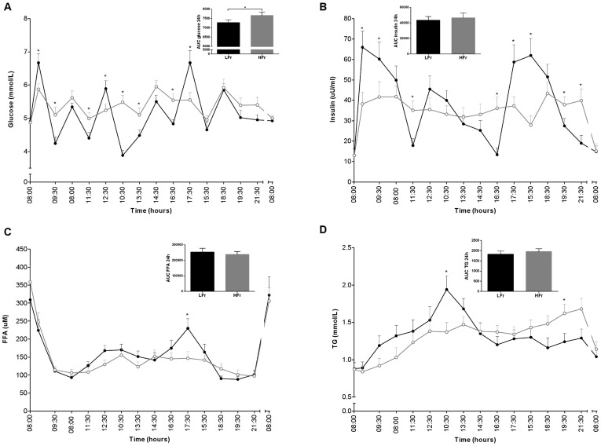
- 📊 **Figure 2** — GLP-1 active (A), ghrelin-active (B) and adiponectin (C) levels for 24 h and the AUCs of the LFr (dense black circle ) and HFr (open gray circle ) diet.*P<0.05 LFr vs. HFr diet. P-values were derived by analysis of mixed models for the 24 h profiles and by a paired t-test for the AUCs. aValues are…
  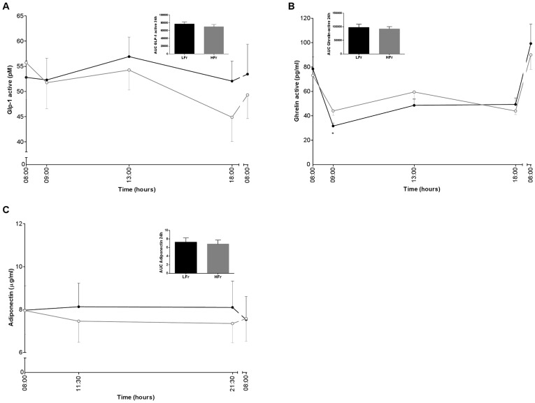
- 📊 **Figure 3** — CGMS glucose levels for 24 h in the LFr and HFr diet. aValues are expressed as mean.
  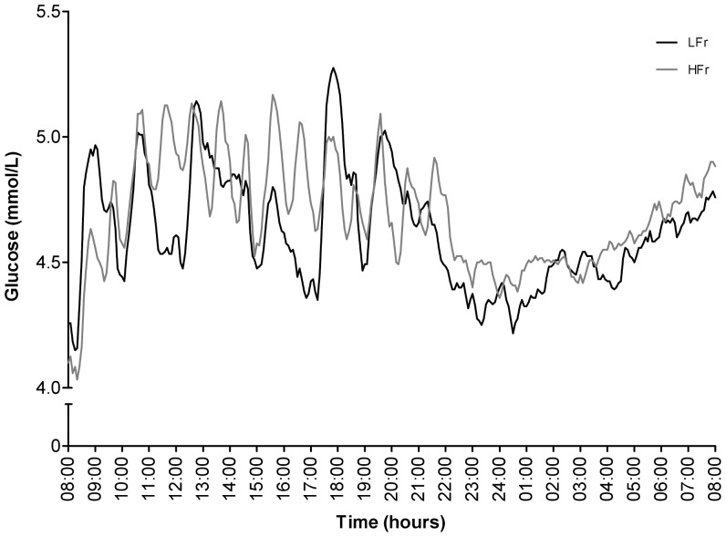
- 📊 **Figure 4** — Hunger (A), and satiety (B) levels for 24 h and the AUCs of the LFr (dense black circle ) and HFr (open gray circle ) diet.*P<0.05 LFr vs. HFr diet. P-values were derived by analysis of mixed models for the 24 h profiles and by a paired t-test for the AUCs. aValues are expressed as mean±SEM.
  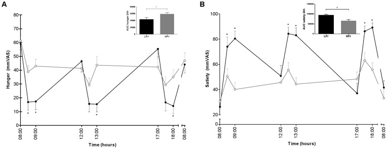

**Jansson JO, Palsdottir V, Hägg DA, Schéle E, Dickson SL, Anesten F, Ba 2018. *Body weight homeostat that regulates fat mass independently of leptin in rats and mice***  
[PMC5777058](https://pmc.ncbi.nlm.nih.gov/articles/PMC5777058/) · CC BY-NC-ND · **stored**

- 📊 **Fig. 1.** — Body weight sensing for fat mass homeostasis in rats and mice with diet-induced obesity. (A) Effect of loading on change in biological body weight (= total body weight − capsule weight) in rats (n = 8) and (B) mice (n = 10) implanted with capsules weighing 15% of the body weight (load) or empty…
  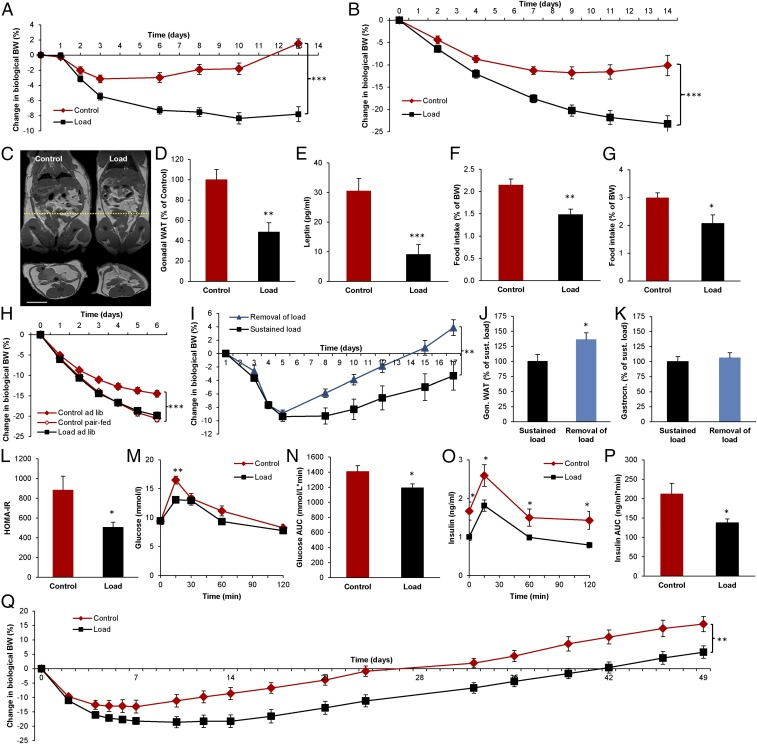
- 📊 **Fig. 2.** — Leptin-independent body weight sensing for fat mass homeostasis. (A) The effect of increased loading on the change in body weight in leptin deficient Ob/Ob mice (control n = 7 and load n = 10). The effect of combined loading and leptin treatment (1.5 µg/g BW twice daily) on (B) changes in…
  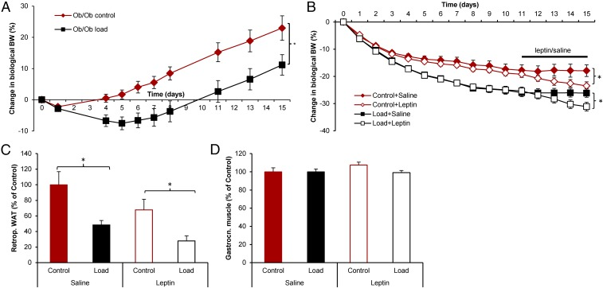
- 📊 **Fig. 3.** — The suppression of body weight and fat mass by loading is dependent on osteocytes. Effect of increased loading on change in biological body weight in (A) control female mice with intact osteocytes (control n = 11 and load n = 12) and in (B) osteocyte-depleted (OCyD) female mice (n = 9). The effect…
  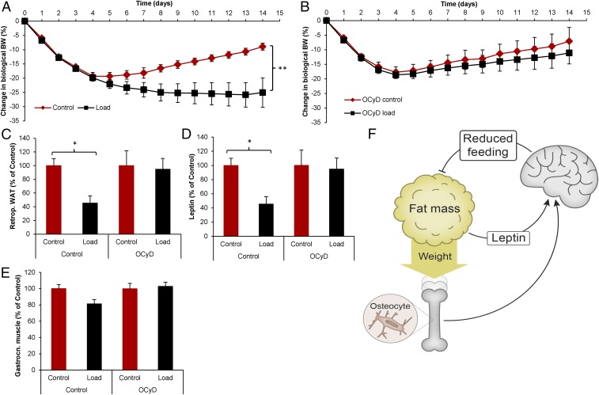

**Rondanelli M, Riva A, Petrangolini G, Allegrini P, Perna S, Faliva MA, 2021. *Effect of Acute and Chronic Dietary Supplementation with Green Tea Catechins on Resting Metabolic Rate, Energy Expenditure and Respiratory Quotient: A Systematic Review***  
[PMC7922336](https://pmc.ncbi.nlm.nih.gov/articles/PMC7922336/) · CC BY · **stored**

- 🗺 **Figure 1** — Flow diagram.
  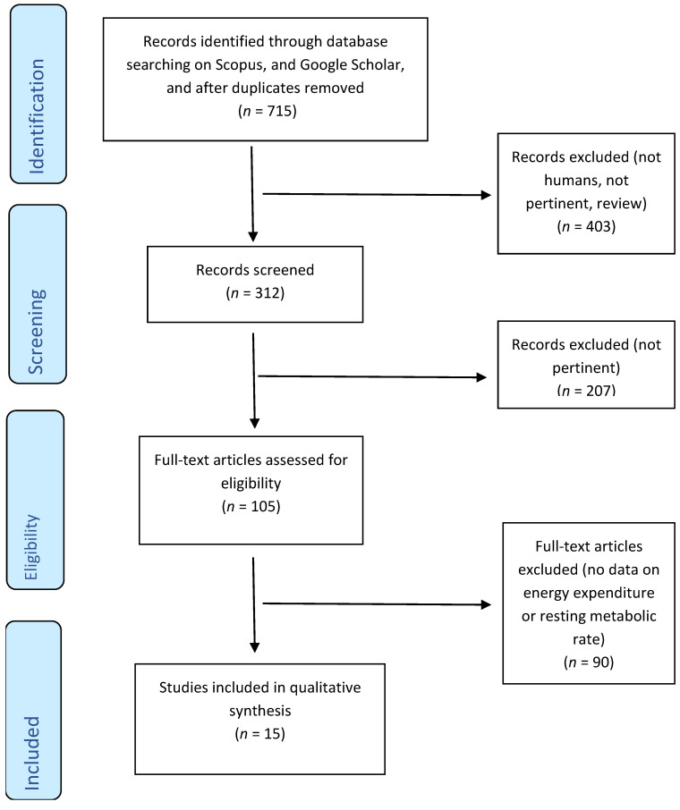
- 🖼 **Figure 2** — (a) Dose–response of acute and chronic green tea catechin intake on RMR. (b) Dose–response of green tea catechin intake on RMR.
  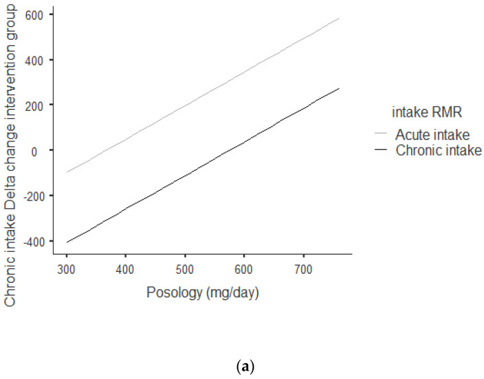
- 🖼 **Figure 3** — (a) Dose–response of green tea catechin intake on RQ. (b) Dose–response of green tea catechin intake on RQ.
  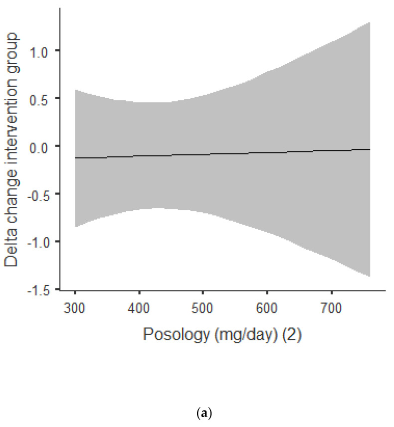

**Pontzer H, Yamada Y, Sagayama H, Ainslie PN, Andersen LF, Anderson LJ, 2021. *Daily energy expenditure through the human life course***  
[PMC8370708](https://pmc.ncbi.nlm.nih.gov/articles/PMC8370708/) · NIH manuscript — text mining/fair use only · link only

- 📊 **Figure 1.** — A. Total expenditure (TEE) increases with fat free mass in a power-law manner, but age groups cluster about the trend line differently. B. Total expenditure rises in childhood, is stable through adulthood, and declines in older adults. Means±sd for age-sex cohorts are shown. C. Age-sex cohort means… ([view](https://pmc.ncbi.nlm.nih.gov/articles/PMC8370708/figure/F1/))
- 📊 **Figure 2.** — Fat free mass- and fat mass-adjusted expenditures over the life course. Individual subjects and age-sex cohort mean ± SD are shown. For both total (Adj. TEE) (A) and basal (Adj. BEE) expenditure (B), adjusted expenditures begin near adult levels (~100%) but quickly climb to ~150% in the first year.… ([view](https://pmc.ncbi.nlm.nih.gov/articles/PMC8370708/figure/F2/))
- 🖼 **Figure 3.** — Modeling the contribution of physical activity and tissue-specific metabolism to daily expenditures. A. Observed total (TEE, red), basal (BEE, black), and activity (AEE, gray) expenditures (Table S1) show age-related variation with respect to fat free mass (see Figure 1C) that is also evident in… ([view](https://pmc.ncbi.nlm.nih.gov/articles/PMC8370708/figure/F3/))

**Rimbach R, Yamada Y, Sagayama H, Ainslie PN, Anderson LF, Anderson LJ, 2022. *Total energy expenditure is repeatable in adults but not associated with short-term changes in body composition***  
[PMC8748652](https://pmc.ncbi.nlm.nih.gov/articles/PMC8748652/) · CC BY · **stored**

- 📊 **Fig. 1** — Repeatability estimates of total energy expenditure (TEE) and body mass.Repeatability estimates of a–c TEE and d–f body mass at the individual level. Shown are distributions of the parametric bootstrap samples along with the point estimate of the repeatability estimate R (blue point) and the limits…
  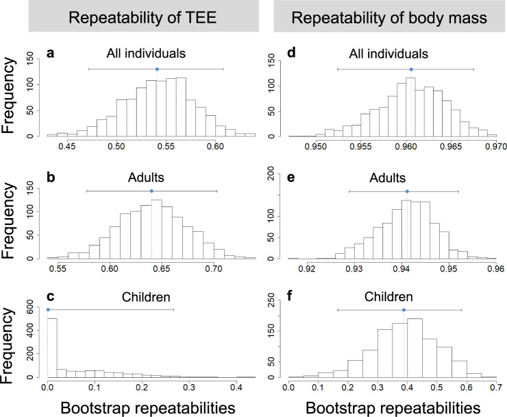
- 📊 **Fig. 2** — Relationship between adjusted total energy expenditure (TEE), the difference in adjusted TEE between measurements and changes in body weight and body fat percentage.Relationship between adjusted TEE (MJ/d; adjusted for FFM, FM, age, and sex) at the first measurement and a changes in body weight and…
  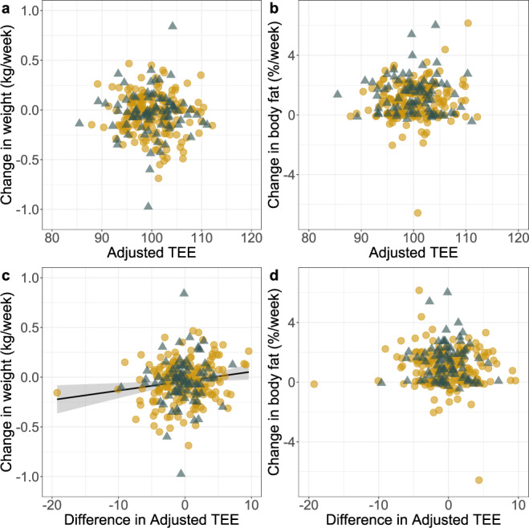

---

## [Science-Based Pull Workout, Day 2 (Back, Biceps, Rear Delts)](most-effective-pull-workout.md)

**Walker S, Blazevich AJ, Haff GG, Tufano JJ, Newton RU, Häkkinen K. 2016. *Greater Strength Gains after Training with Accentuated Eccentric than Traditional Isoinertial Loads in Already Strength-Trained Men***  
[PMC4847223](https://pmc.ncbi.nlm.nih.gov/articles/PMC4847223/) · CC BY · **stored**

- 🗺 **Figure 1** — Overall study design including all measurement points.
  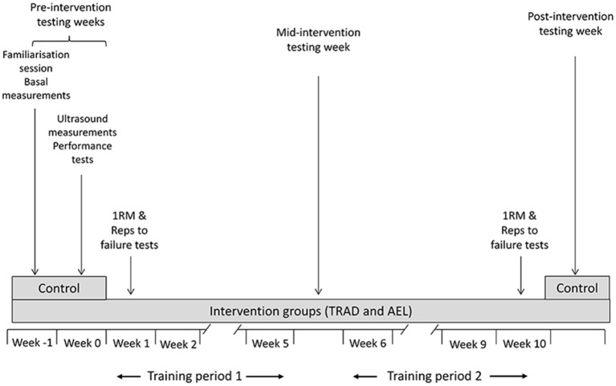
- 🖼 **Figure 2** — Training equipment to allow accentuated eccentric loading. Inclined leg press with weight-releasers (A) and manually loaded/unloaded weight plates on the knee extension device (B).
  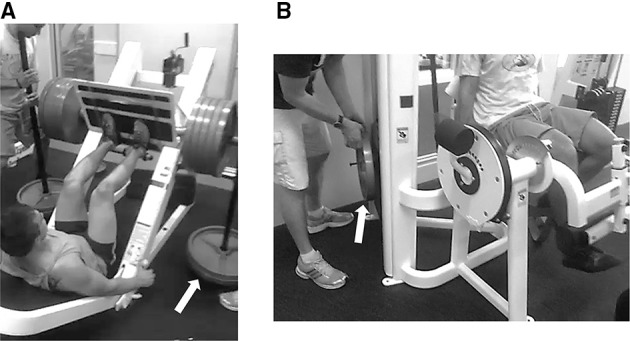
- 📊 **Figure 3** — Absolute and relative changes (mean ± SD) in maximum unilateral isokinetic concentric (A—top panel), eccentric (B—middle panel), and isometric (C—bottom panel) torque production. *p < 0.05.
  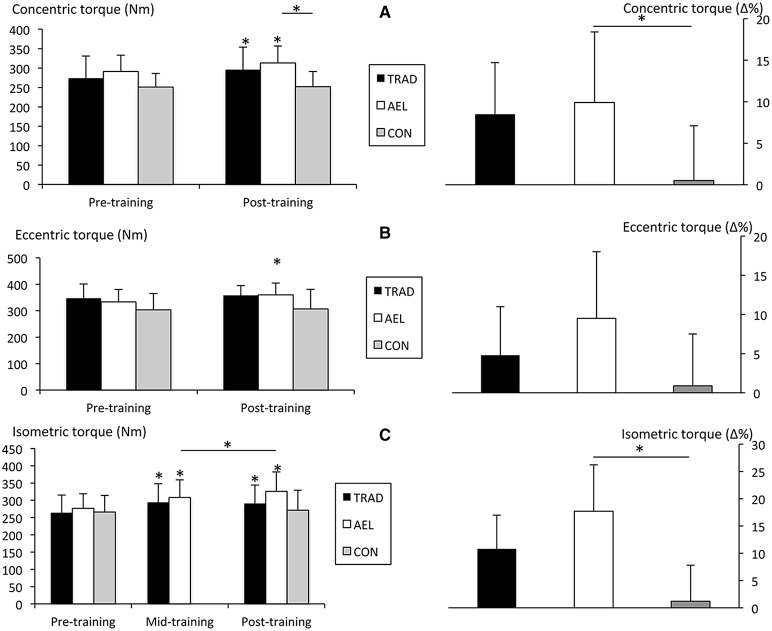
- 📊 **Figure 4** — Relative changes (mean ± SD) in vastus medialis, vastus lateralis and vastus lateralis+intermedius cross-sectional area at 33, 50 and 67% femur length, respectively. *p < 0.05 between intervention and control groups. ‡p < 0.1 between intervention and control groups.
  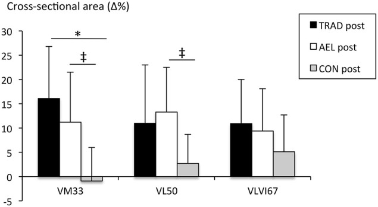
- 📊 **Figure 5** — Voluntary activation level (mean ± SD) during unilateral isometric knee extension. *p < 0.05 vs. pre-training.
  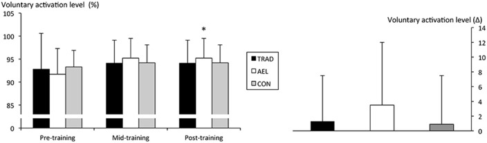

---

## [Science-Based Push Workout #2: Shoulder-Led Chest, Delts and Triceps](most-effective-push-workout.md)

**Lehman GJ, MacMillan B, MacIntyre I, Chivers M, Fluter M. 2006. *Shoulder muscle EMG activity during push up variations on and off a Swiss ball***  
[PMC1508143](https://pmc.ncbi.nlm.nih.gov/articles/PMC1508143/) · CC BY · **stored**

- 🖼 **Figure 1** — EMG linear envelopes during a push ups with the hands on an exercise bench and a Swiss ball. EMG activity is non-normalized and is therefore in arbitrary EMG units. A bias was added to the activity of the pectoralis major, rectus abdominis and external oblique for ease of viewing to prevent overlap…
  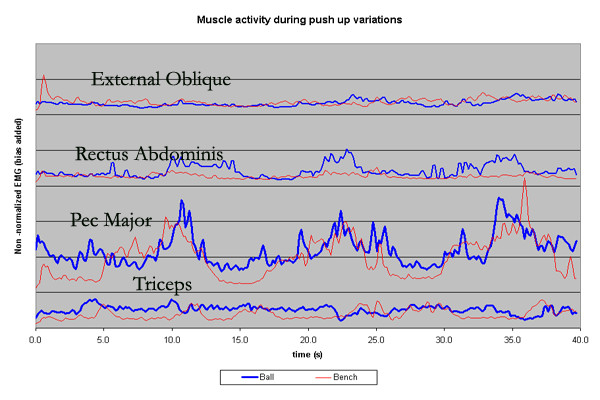
- 🖼 **Figure 2** — Raw EMG during three push ups with the hands on an exercise bench or a swiss ball for the triceps and pectoralis major muscle. PMBench = Pectoralis Major EMG on bench, PMBall = Pectoralis Major EMG on ball. Bias added to triceps activity for ease of viewing. Trial was 30 seconds in length.
  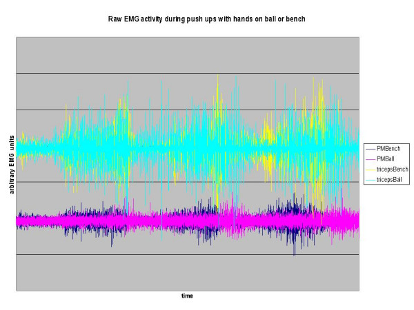
- 🖼 **Figure 3** — Raw EMG for Rectus Abdominis and External Oblique muscles during three push ups with the hands on or off a Swiss ball. EO = External Oblique, RA = Rectus Abdominis.
  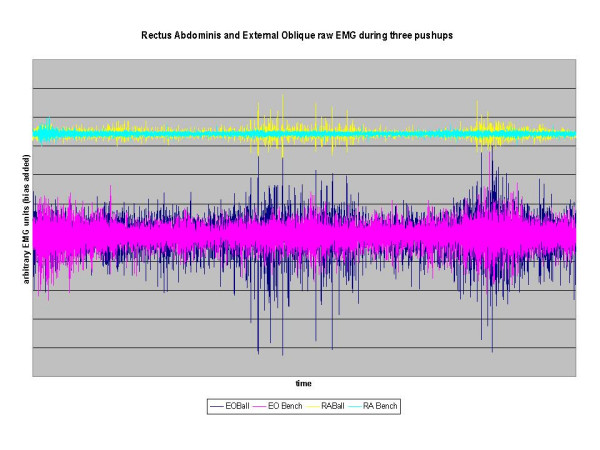

---

## [How Much Protein Can You Actually Use In One Meal?](much-protein-absorb-one-meal.md)

**Symons TB, Sheffield-Moore M, Wolfe RR, Paddon-Jones D. 2009. *A moderate serving of high-quality protein maximally stimulates skeletal muscle protein synthesis in young and elderly subjects***  
[PMC3197704](https://pmc.ncbi.nlm.nih.gov/articles/PMC3197704/) · NIH manuscript — text mining/fair use only · link only

- 🗺 **Figure 1** — Data were collected during an 11hr stable isotope infusion protocol. Muscle biopsy and venous blood samples were obtained to calculate post absorptive and postprandial mixed muscle protein synthesis. ([view](https://pmc.ncbi.nlm.nih.gov/articles/PMC3197704/figure/F1/))
- 📊 **Figure 2** — Mean (± SEM) mixed muscle fractional synthesis rate before and after ingestions of 113 g (A), 12 or 340 g (B) of 90% lean ground beef in young and the elderly. * Significant increase from fasting (young and elderly) following 113g and 340g of lean beef. ([view](https://pmc.ncbi.nlm.nih.gov/articles/PMC3197704/figure/F2/))

**Morton RW, McGlory C, Phillips SM. 2015. *Nutritional interventions to augment resistance training-induced skeletal muscle hypertrophy***  
[PMC4558471](https://pmc.ncbi.nlm.nih.gov/articles/PMC4558471/) · CC BY · **stored**

- 🗺 **Figure 1** — Schematic showing how resistance exercise variables and protein ingestion can impact muscle protein turnover. MPS, muscle protein synthesis; MPB, muscle protein breakdown; PRO, protein.
  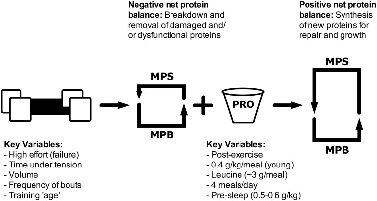

**Macnaughton LS, Wardle SL, Witard OC, McGlory C, Hamilton DL, Jeromson 2016. *The response of muscle protein synthesis following whole-body resistance exercise is greater following 40 g than 20 g of ingested whey protein***  
[PMC4985555](https://pmc.ncbi.nlm.nih.gov/articles/PMC4985555/) · CC BY · **stored**

- 🗺 **Figure 1** — Schematic diagram of infusion trial protocol.
  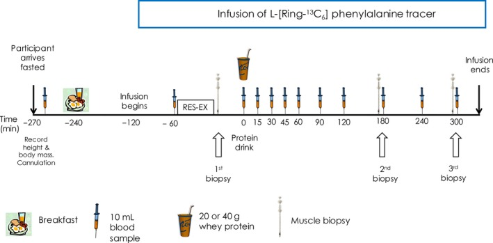
- 📊 **Figure 2** — Plasma leucine (A), phenylalanine (B) and threonine (C) concentrations following ingestion of either 20 or 40 g of whey protein isolate in both the lower lean body mass (LLBM) and higher lean body mass (HLBM) groups. Data presented as means with 95% confidence intervals. *Significant difference…
  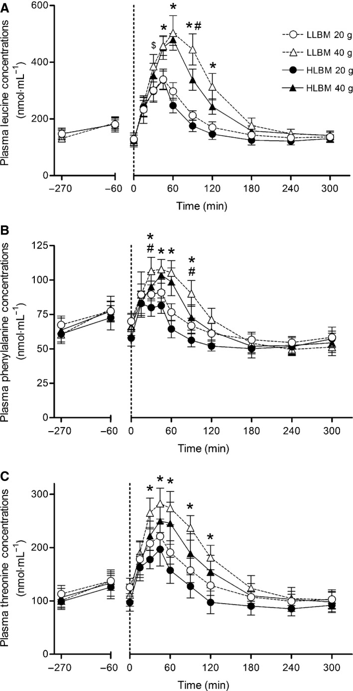
- 📊 **Figure 3** — Muscle intracellular (A) and plasma (B) phenylalanine enrichments expressed over time during L‐ [ring‐13C6] phenylalanine infusion in both the lower lean body mass (LLBM) and higher lean body mass (HLBM) groups. Data presented as means with 95% confidence intervals. Data expressed as tracer to…
  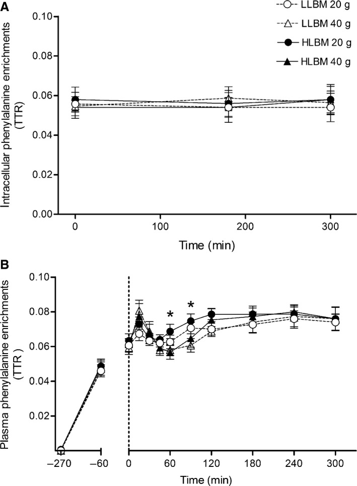
- 📊 **Figure 4** — Rate of phenylalanine oxidation (A) and plasma urea concentrations (B) following ingestion of either 20 or 40 g of whey protein isolate in both the lower lean body mass (LLBM) and higher lean body mass (HLBM) groups. Data presented as means with 95% confidence intervals. *Significant difference…
  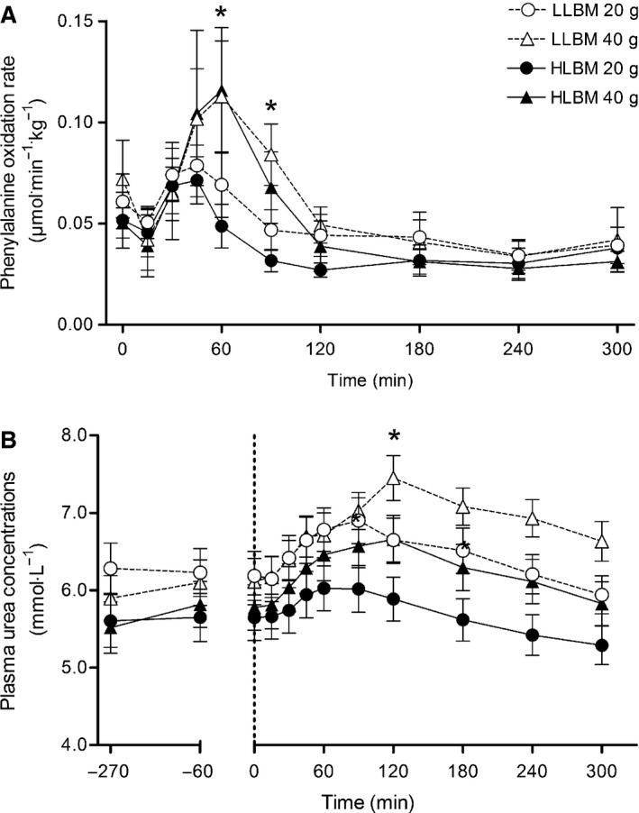
- 📊 **Figure 5** — Myofibrillar fractional synthesis rate (FSR) presented for each individual participant following ingestion of either 20 or 40 g whey protein isolate in lower lean body mass (LLBM) and higher lean body mass (HLBM) groups (A). Line represents the mean for each condition. Mean ± SD of myofibrillar FSR…
  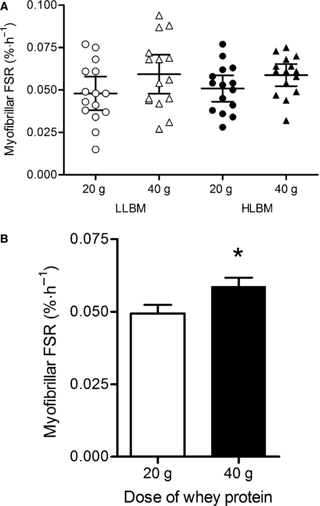
- 📊 **Figure 6** — P70S6K1 activity following whey protein isolate ingestion (whey protein doses combined) in both the lower lean body mass (LLBM) and higher lean body mass (HLBM) groups. Data presented as means with 95% confidence intervals. *Significant difference from 0 min; #main effect of group (P = 0.002) and…
  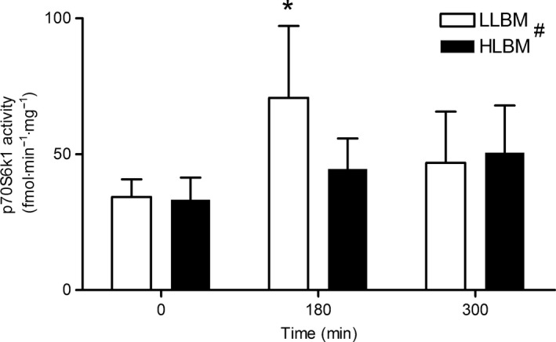

---

## [Do Muscles Make You More Attractive? Survey Data and the Research](muscles-make-more-attractive.md)

**Lidborg LH, Cross CP, Boothroyd LG. 2022. *A meta-analysis of the association between male dimorphism and fitness outcomes in humans***  
[PMC9106334](https://pmc.ncbi.nlm.nih.gov/articles/PMC9106334/) · CC BY · **stored**

- 🖼 **Figure 1.** — Overall analysis structure.
  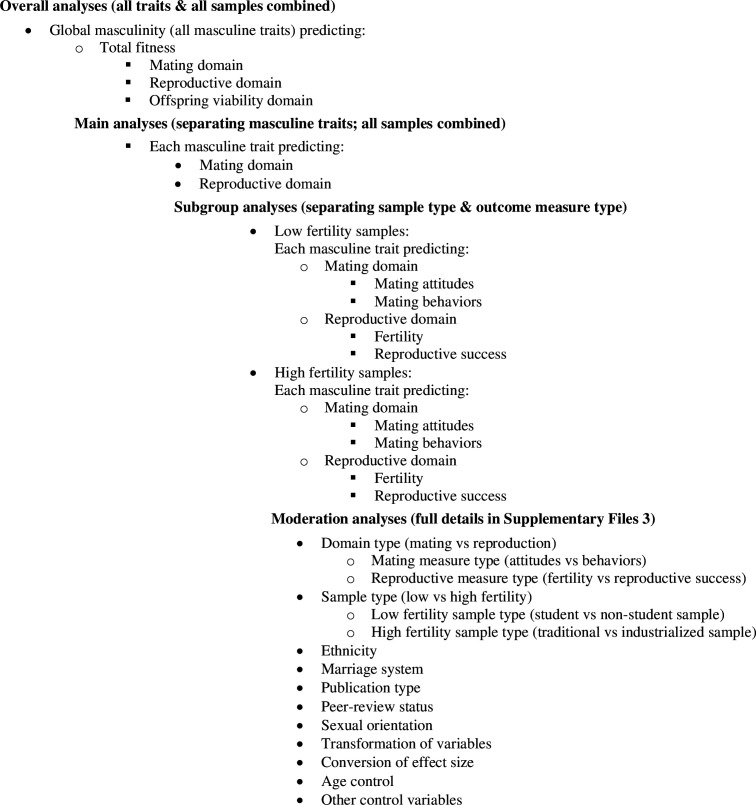
- 📊 **Figure 2.** — Forest plot of the association between body masculinity and the mating domain.Effect sizes are shown as Z-transformed r, with 95% confidence intervals in brackets. The width of the diamond corresponds to the confidence interval for the overall effect.
  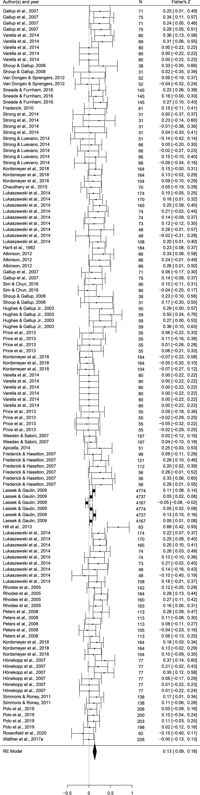
- 📊 **Figure 3.** — Forest plot of the association between voice pitch and the mating domain.Effect sizes are shown as Z-transformed r, with 95% confidence intervals in brackets. The width of the diamond corresponds to the confidence interval for the overall effect.
  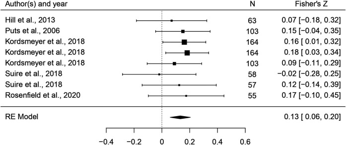
- 📊 **Figure 4.** — Forest plot of the association between testosterone levels and the mating domain.Effect sizes are shown as Z-transformed r, with 95% confidence intervals in brackets. The width of the diamond corresponds to the confidence interval for the overall effect.
  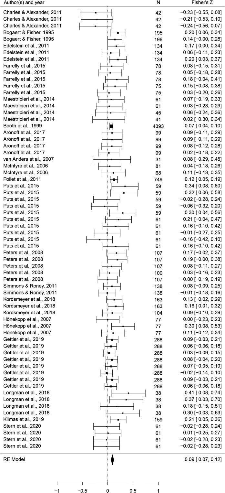
- 📊 **Figure 5.** — Forest plot of the association between height and the mating domain.Effect sizes are shown as Z-transformed r, with 95% confidence intervals in brackets. The width of the diamond corresponds to the confidence interval for the overall effect.
  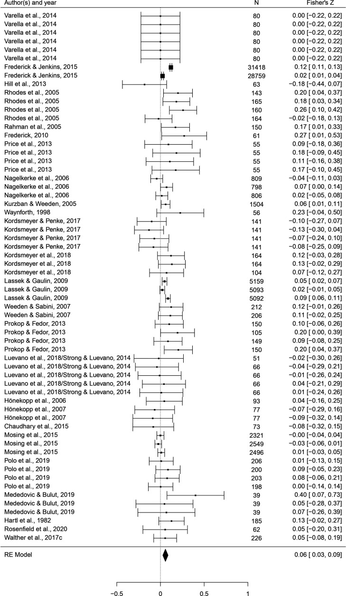
- 📊 **Figure 6.** — Forest plot of the association between body masculinity and the reproductive domain.Effect sizes are shown as Z-transformed r, with 95% confidence intervals in brackets. The width of the diamond corresponds to the confidence interval for the overall effect.
  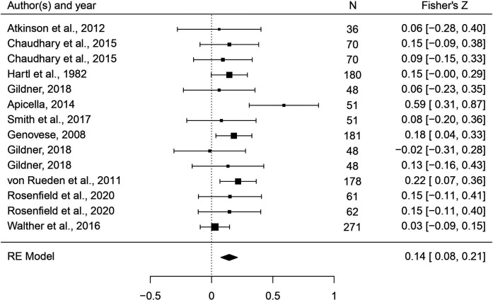

---

## [Nutrient Timing Around Training: Pre-, Intra- and Post-Workout Nutrition](nutrient-timing-around-training.md)

**Schoenfeld BJ, Aragon AA, Krieger JW. 2013. *The effect of protein timing on muscle strength and hypertrophy: a meta-analysis***  
[PMC3879660](https://pmc.ncbi.nlm.nih.gov/articles/PMC3879660/) · CC BY · **stored**

- 🖼 **Figure 1** — Impact of protein timing on strength by study.
  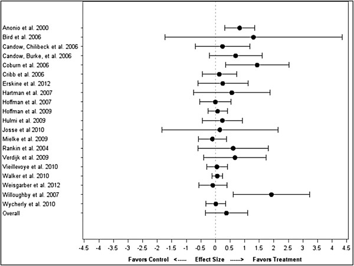
- 🖼 **Figure 2** — Impact of protein timing on hypertrophy by study.
  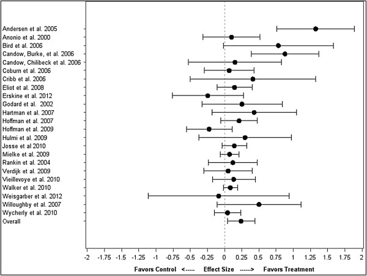
- 🖼 **Figure 3** — Impact of protein timing on hypertrophy by study, adjusted for total protein intake.
  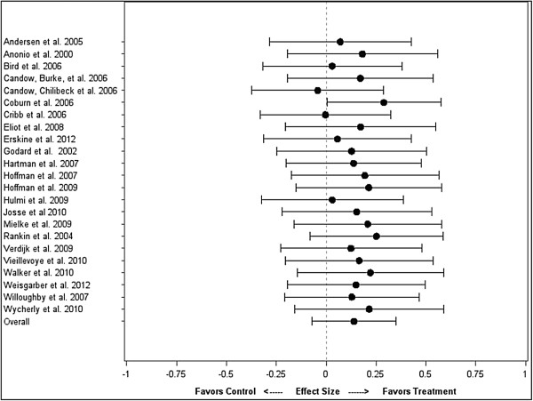

**Knuiman P, Hopman MT, Mensink M. 2015. *Glycogen availability and skeletal muscle adaptations with endurance and resistance exercise***  
[PMC4687103](https://pmc.ncbi.nlm.nih.gov/articles/PMC4687103/) · CC BY · **stored**

- 🗺 **Fig. 1** — Schematic figure representing the regulation of mitochondrial biogenesis by endurance exercise (). Endurance exercise acutely increases Ca2+, ADP, AMP and epinephrine. In addition exercise reduces skeletal muscle glycogen () in the contracting muscles which in turn activates the sensing proteins…
  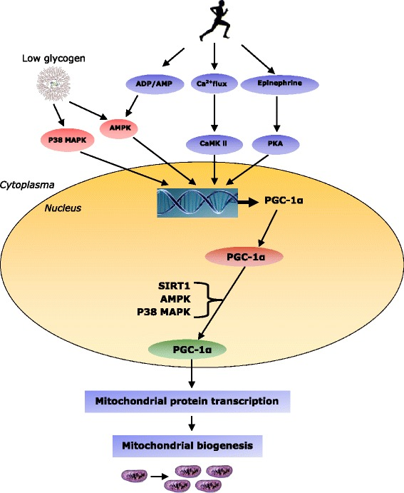

**Stokes T, Hector AJ, Morton RW, McGlory C, Phillips SM. 2018. *Recent Perspectives Regarding the Role of Dietary Protein for the Promotion of Muscle Hypertrophy with Resistance Exercise Training***  
[PMC5852756](https://pmc.ncbi.nlm.nih.gov/articles/PMC5852756/) · CC BY · **stored**

- 🖼 **Figure 1** — Simplified overview of whole body oral protein utilization at rest. Of the protein ingested, approximately 50% is extracted by splanchnic tissues before entering peripheral circulation. Interestingly, only ~10% of the ingested protein is utilized for skeletal muscle protein synthesis while the rest…
  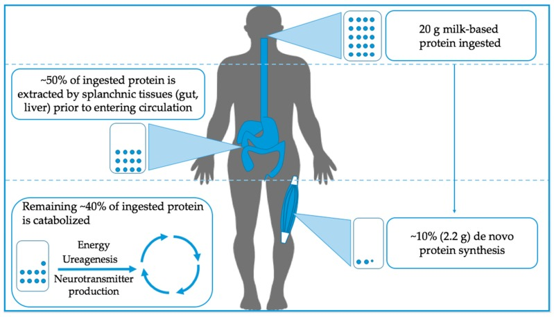
- 📊 **Figure 2** — Whey protein ingestion-induced increase in MPS in young men, percent change from 0 g. (A) At rest, consumption of 10 g or 20 g of protein results in a rise of 19% and 52% respectively from 0g. Consumption of 40 g of whey protein does not result in superior stimulation of MPS beyond consumption of…
  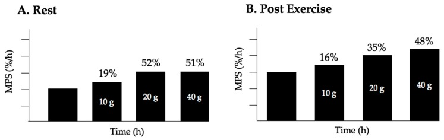

---

## [The 25 Exercises That Build a Complete Physique (Ranked)](only-25-exercises-need.md)

**Kinoshita M, Maeo S, Kobayashi Y, Eihara Y, Ono M, Sato M, Sugiyama T, 2023. *Triceps surae muscle hypertrophy is greater after standing <i>versus</i> seated calf-raise training***  
[PMC10753835](https://pmc.ncbi.nlm.nih.gov/articles/PMC10753835/) · CC BY · **stored**

- 📊 **FIGURE 1** — Postures of the standing and seated calf-raise exercises and operating ranges of each triceps surae muscle on the normalized force–length curve during the exercises. These were obtained using the OpenSim Gait 2392 model (Delp et al., 2007), with the knee joint 0° and 90° for the standing and seated…
  
- 🖼 **FIGURE 2** — Pictures of standing (A) and seated (B) calf-raise training, targeting the left and right leg, respectively.
  
- 📊 **FIGURE 3** — Muscle volume before and after the training and its change. In each subfigure/muscle(s), the raw data is plotted on the upper axes for the standing (A) and seated (B) conditions; each paired set of observations at Pre and Post is connected by a line. On the lower axes, each paired mean difference…
  
- 📊 **FIGURE 4** — The summary in percentage change based on the mean changes for each muscle and the whole triceps surae. ***p < 0.001, **p < 0.01 and *p < 0.05 difference between times (pre vs. post). ##p < 0.01 and #p < 0.05 difference between conditions (legs). LG, lateral gastrocnemius; MG, medial gastrocnemius;…
  

**Larsen S, Wolf M, Schoenfeld BJ, Sandberg NØ, Fredriksen AB, Kristians 2025. *Dumbbell versus cable lateral raises for lateral deltoid hypertrophy: an experimental study***  
[PMC12277279](https://pmc.ncbi.nlm.nih.gov/articles/PMC12277279/) · CC BY · **stored**

- 🗺 **FIGURE 1** — CONSORT diagram that shows the data collection process.
  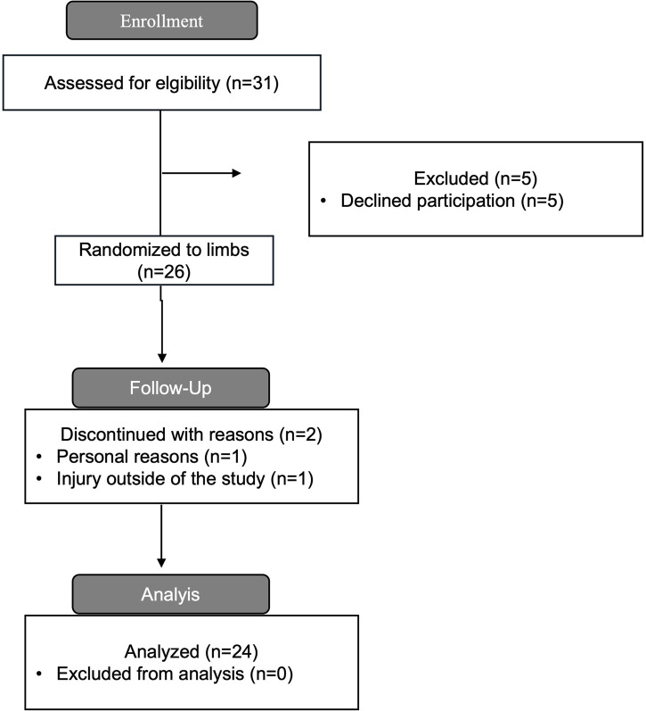
- 🗺 **FIGURE 2** — Illustration of the two lateral raises conditions trained with.
  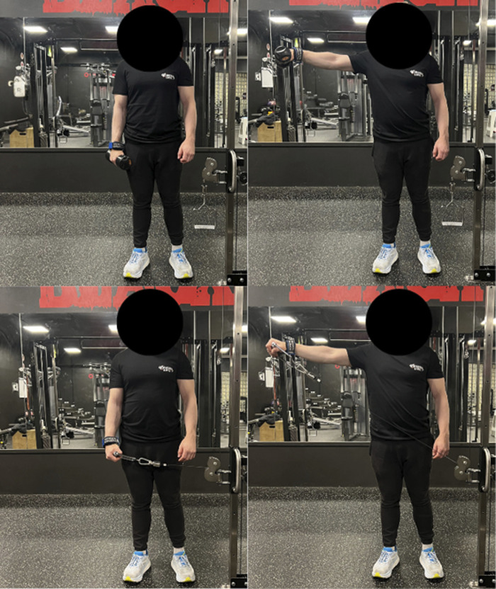
- 🖼 **FIGURE 3** — Representative ultrasound images of the lateral deltoid muscle measuring muscle thickness. The left panel shows the proximal region, and the right panel shows the distal region.
  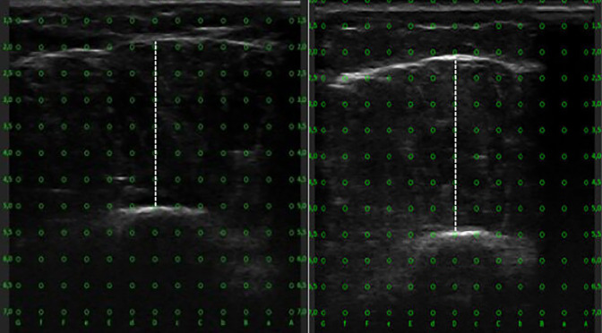
- 📊 **FIGURE 4** — Standardized mean difference estimates of change in muscle thickness during the intervention. Densities illustrate posterior density estimates of within-intervention changes standardized relative to group baseline standard deviation.
  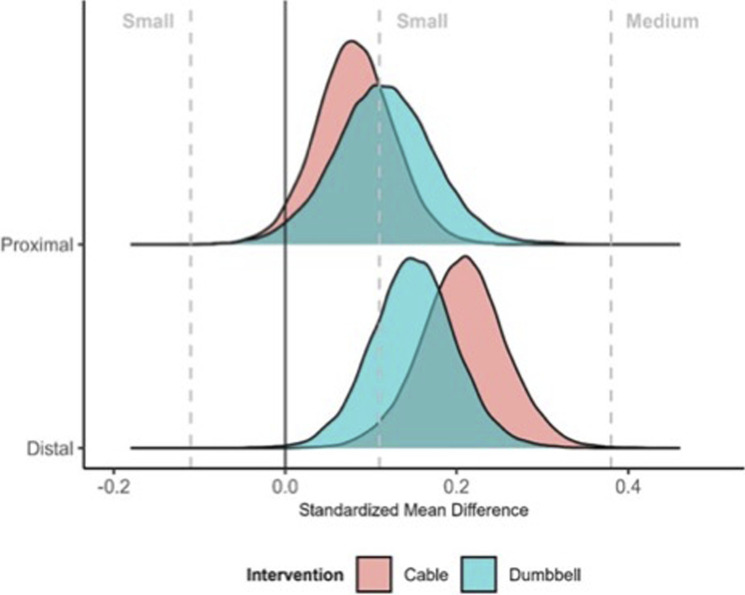
- 📊 **FIGURE 5** — Mean ± SD repetition volume lifted each resistance training session for the cable and dumbbell group in the unilateral lateral raise exercise. Black = dumbbell group. Grey = cable group.
  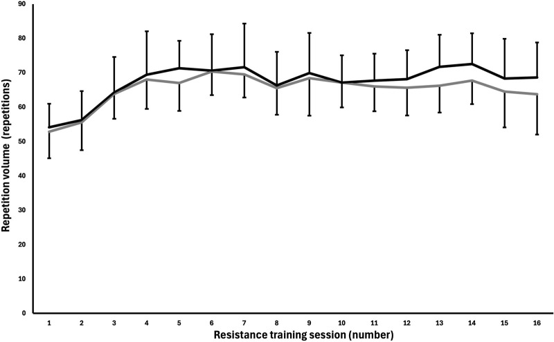

---

## [Is EMG Research Useless? How to Read Muscle "Activation" Studies](our-best-work-yet.md)

**Mitchell CJ, Churchward-Venne TA, Parise G, Bellamy L, Baker SK, Smith 2014. *Acute post-exercise myofibrillar protein synthesis is not correlated with resistance training-induced muscle hypertrophy in young men***  
[PMC3933567](https://pmc.ncbi.nlm.nih.gov/articles/PMC3933567/) · CC BY · **stored**

- 📊 **Figure 1** — Muscle volume, muscle mass, and strength changes following resistance training.The absolute increase in A) Quadriceps muscle volume determined by MRI, B) Fat free bone free mass determined by DXA, C) Leg press 1RM and D) Chest press 1RM. Each dot represents a single subject, the lines show the…
  
- 📊 **Figure 2** — Phosphorylation of anabolic signalizing proteins.The results are expressed as fold changes from rest at 1, 3 and 6) mTOR phosphorylation at Ser2448, B) Akt phosphorylation at Ser473, C) 4E-BP1 phosphorylation at Thr37/46 and D) rpS6 phosphorylation at Ser240/244. * Significantly different from rest…
  
- 📊 **Figure 3** — Relationship between muscle hypertrophy and potential correlates.A) The relationship between changes in muscle volume as measured by MRI and the Myofibrillar fractional synthetic rate (FSR) measured from 1 to 6 hours after an acute bout of resistance exercise and nutrition before the start of the…
  
- 📊 **Figure 4** — Myofibrillar Protein synthesis.FSR is calculated at rest and after an acute bout of resistance exercise and protein ingestion prior to the start of the resistance training period. The other rates were calculated from 1 to 3–6 hours after the resistance exercises. Each circle, square, and triangle…
  

---

## [19 Fitness Topics Rated Overrated or Underrated (with Dr Mike Israetel)](overrated-worst-fitness-advice.md)

**McGlynn ND, Khan TA, Wang L, Zhang R, Chiavaroli L, Au-Yeung F, Lee JJ 2022. *Association of Low- and No-Calorie Sweetened Beverages as a Replacement for Sugar-Sweetened Beverages With Body Weight and Cardiometabolic Risk: A Systematic Review and Meta-analysis***  
[PMC9907347](https://pmc.ncbi.nlm.nih.gov/articles/PMC9907347/) · CC BY · **stored**

- 🖼 **Figure 1.** — Literature Search for Randomized Clinical Trials of Low- and No-Calorie Sweetened Beverages
  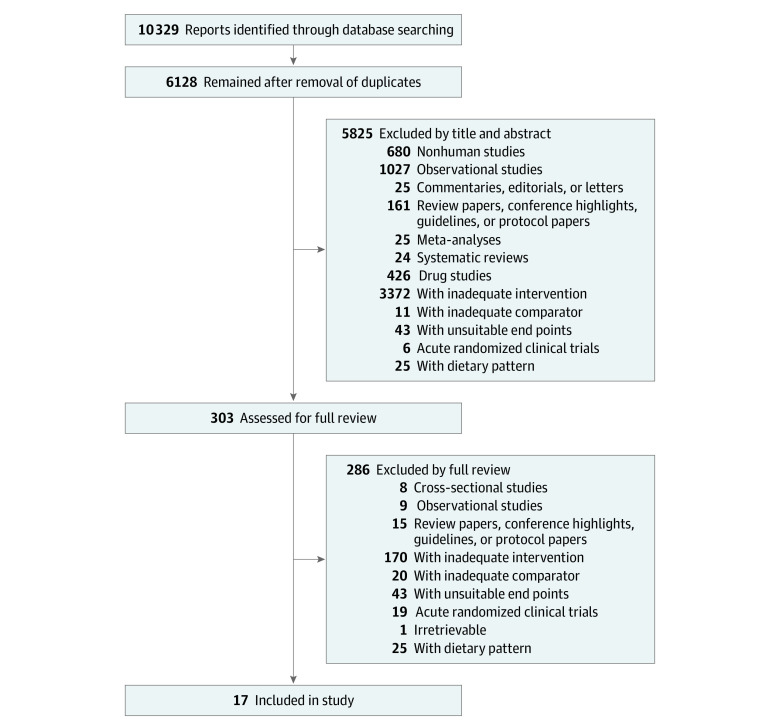
- 📊 **Figure 2.** — Substitution of Low- and No-Calorie Sweetened Beverages (LNCSBs) for Sugar-Sweetened Beverages (SSBs)Data were pooled using network random-effects models and expressed as mean differences (MDs) and 95% CIs. To display the results for outcomes on the same plot, standardized mean differences (SMDs,…
  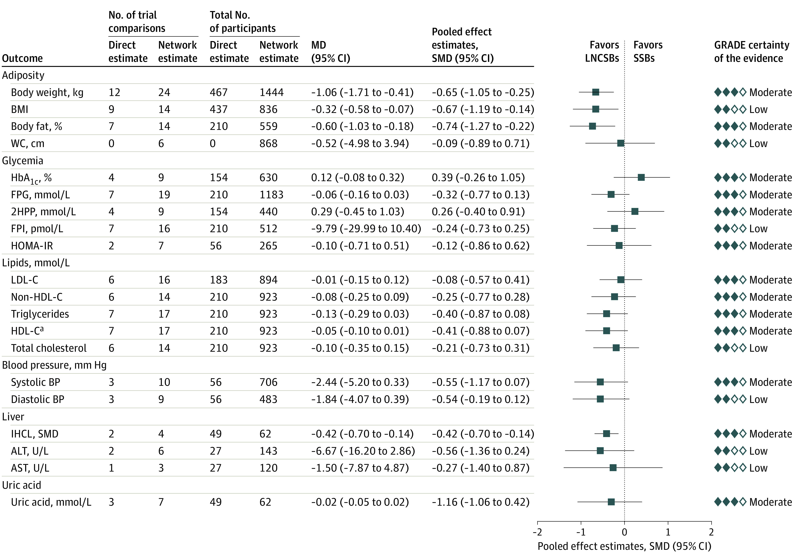
- 📊 **Figure 3.** — Substitution of Water for Sugar-Sweetened Beverages (SSBs)Data were pooled using network random-effects models and expressed as mean differences (MDs) and 95% CIs. To display the results for outcomes on the same plot, standardized mean differences (SMDs, represented by blue squares) and pseudo 95%…
  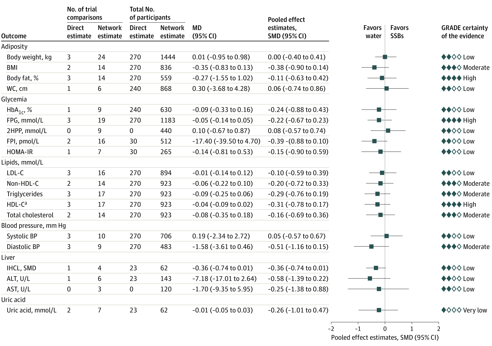
- 📊 **Figure 4.** — Substitution of Low- and No-Calorie Sweetened Beverages (LNCSBs) for WaterData were pooled using network random-effects models and expressed as mean differences (MDs) and 95% CIs. To display the results for outcomes on the same plot, standardized mean differences (SMDs, represented by blue squares)…
  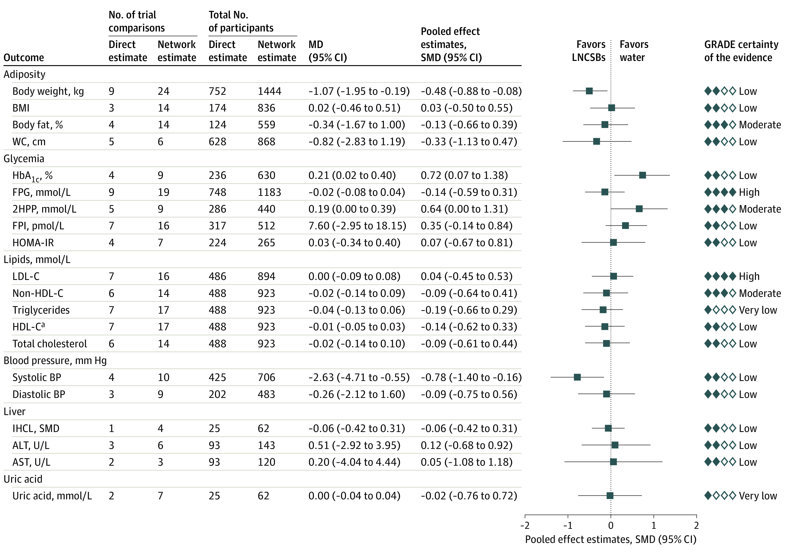

---

## [Partial vs. Full Range of Motion for Muscle Growth](partial-range-of-motion.md)

**Schoenfeld BJ, Grgic J. 2020. *Effects of range of motion on muscle development during resistance training interventions: A systematic review***  
[PMC6977096](https://pmc.ncbi.nlm.nih.gov/articles/PMC6977096/) · CC BY-NC · **stored**

- 🗺 **Figure 1.** — PRISMA flowchart.
  

---

## [The Perfect Leg Day: Six Movements for Quads, Hamstrings, Glutes and Calves](perfect-leg-day.md)

**Schoenfeld BJ, Vigotsky AD, Grgic J, Haun C, Contreras B, Delcastillo 2020. *Do the anatomical and physiological properties of a muscle determine its adaptive response to different loading protocols?***  
[PMC7186566](https://pmc.ncbi.nlm.nih.gov/articles/PMC7186566/) · CC BY · **stored**

- 🗺 **FIGURE 1** — Study timeline. Upon entering the study, all participants went through a 1‐week acclimation phase. After the acclimation phase, participants were randomized and preintervention testing was performed. This order served to prevent potential changes due to acclimation from confounding the results,…
  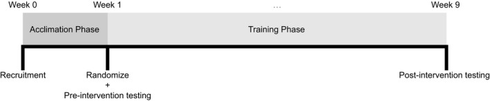
- 📊 **FIGURE 2** — Muscular outcomes. Effect of heavy and light loads on triceps surae muscle growth and plantar flexion strength. (a) Medial gastrocnemius (MG), lateral gastrocnemius (LG), and soleus (SOL) growth within (top) and between (bottom) heavy conditions. (b) Isometric strength outcomes within (left) and…
  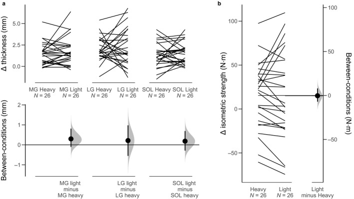

---

## [The Post-Workout Anabolic Window: How Wide It Really Is](post-workout-anabolic-window.md)

**Schoenfeld BJ, Aragon AA, Krieger JW. 2013. *The effect of protein timing on muscle strength and hypertrophy: a meta-analysis***  
[PMC3879660](https://pmc.ncbi.nlm.nih.gov/articles/PMC3879660/) · CC BY · **stored**

- 🖼 **Figure 1** — Impact of protein timing on strength by study.
  
- 🖼 **Figure 2** — Impact of protein timing on hypertrophy by study.
  
- 🖼 **Figure 3** — Impact of protein timing on hypertrophy by study, adjusted for total protein intake.
  

**Phillips SM. 2014. *A brief review of critical processes in exercise-induced muscular hypertrophy***  
[PMC4008813](https://pmc.ncbi.nlm.nih.gov/articles/PMC4008813/) · CC BY · **stored**

- 🖼 **Fig. 1** — Resistance exercise stimulates a prolonged elevation of MPS that can remain elevated for at least 48 h (dotted line) [1]. Protein ingestion at any point during this enhanced period of ‘anabolic potential’ will have an additive effect to these already elevated exercise mediated rates (solid lines)…
  
- 📊 **Fig. 2** — a The ‘leucine trigger’ concept, with data adapted from Tang et al. [6], as shown for isolated whey protein, soy protein, and casein proteins as a difference between rested and exercise values for MPS. b The speed of digestion of these proteins would be digested in the following order: whey ≥ soy ≫…
  

**Schoenfeld BJ, Aragon A, Wilborn C, Urbina SL, Hayward SE, Krieger J. 2017. *Pre- versus post-exercise protein intake has similar effects on muscular adaptations***  
[PMC5214805](https://pmc.ncbi.nlm.nih.gov/articles/PMC5214805/) · CC BY · **stored**

- 📊 **Figure 1** — Self-reported kcal intake in pre-exercise supplementation (PRE-SUPP) and post-exercise supplementation (POST-SUPP) groups.T1, Baseline; T2, Midpoint; T3, Endpoint. Data are presented as means ± SD. ∗, significantly different from T1 (P < 0.05).
  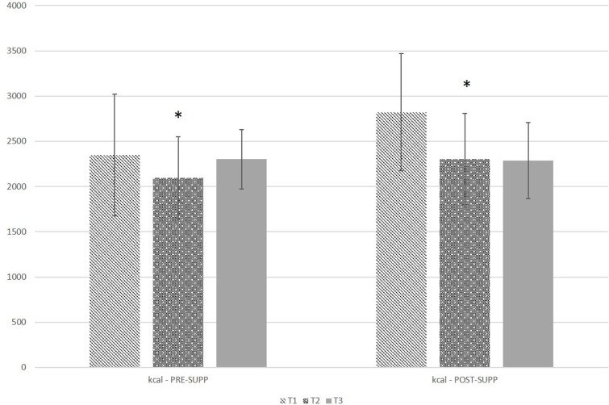
- 📊 **Figure 2** — Self-reported macronutrient intake in pre-exercise supplementation (PRE-SUPP) and post-exercise supplementation (POST-SUPP) groups.T1, Baseline; T2, Midpoint; T3, Endpoint. Data are presented as means ±SD. ∗, significantly different from T1 (P < 0.05).
  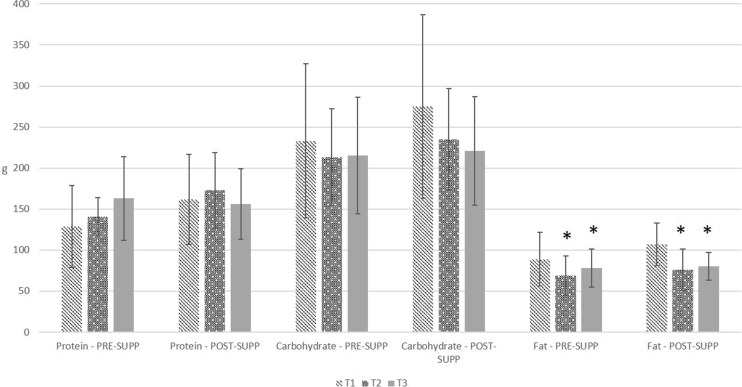
- 🖼 **Figure 3** — Biceps thickness.Individual changes in biceps thickness for PRE and POST. Values in mms. T1, Baseline; T3, Endpoint.
  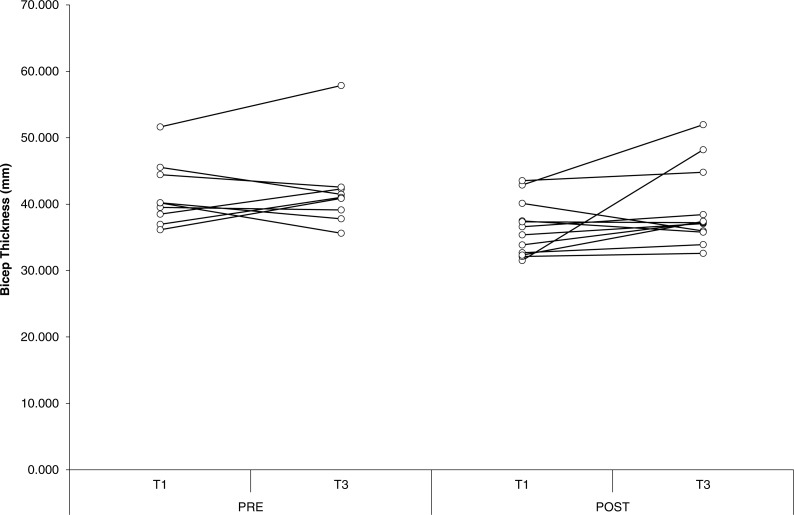
- 🖼 **Figure 4** — Medial quadriceps thickness.Individual changes in medial quadriceps thickness for PRE and POST. Values in mms. T1, Baseline; T3, Endpoint.
  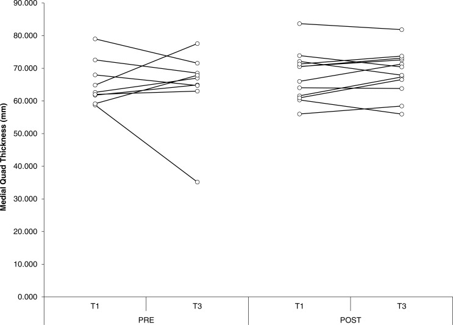
- 🖼 **Figure 5** — Lateral quadriceps thickness.Individual changes in lateral quadriceps thickness for PRE and POST. Values in mms. T1, Baseline; T3, Endpoint.
  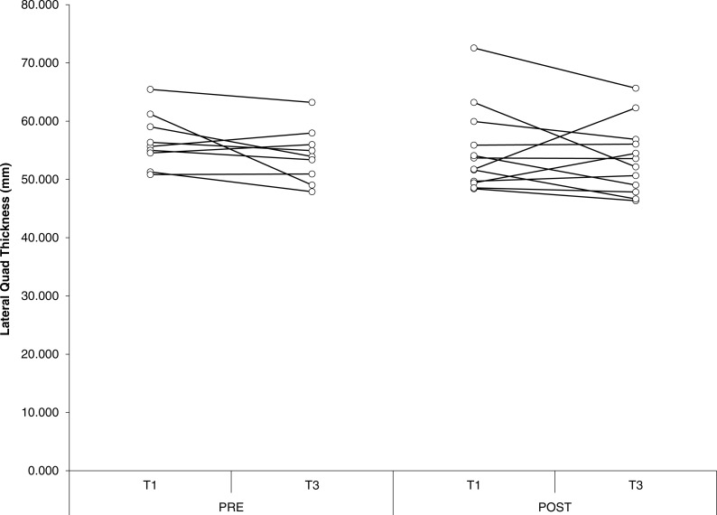

---

## [Protein for Muscle Growth: Daily Targets, Per-Meal Doses, Quality and Timing](protein-for-muscle-growth.md)

**Macnaughton LS, Wardle SL, Witard OC, McGlory C, Hamilton DL, Jeromson 2016. *The response of muscle protein synthesis following whole-body resistance exercise is greater following 40 g than 20 g of ingested whey protein***  
[PMC4985555](https://pmc.ncbi.nlm.nih.gov/articles/PMC4985555/) · CC BY · **stored**

- 🗺 **Figure 1** — Schematic diagram of infusion trial protocol.
  
- 📊 **Figure 2** — Plasma leucine (A), phenylalanine (B) and threonine (C) concentrations following ingestion of either 20 or 40 g of whey protein isolate in both the lower lean body mass (LLBM) and higher lean body mass (HLBM) groups. Data presented as means with 95% confidence intervals. *Significant difference…
  
- 📊 **Figure 3** — Muscle intracellular (A) and plasma (B) phenylalanine enrichments expressed over time during L‐ [ring‐13C6] phenylalanine infusion in both the lower lean body mass (LLBM) and higher lean body mass (HLBM) groups. Data presented as means with 95% confidence intervals. Data expressed as tracer to…
  
- 📊 **Figure 4** — Rate of phenylalanine oxidation (A) and plasma urea concentrations (B) following ingestion of either 20 or 40 g of whey protein isolate in both the lower lean body mass (LLBM) and higher lean body mass (HLBM) groups. Data presented as means with 95% confidence intervals. *Significant difference…
  
- 📊 **Figure 5** — Myofibrillar fractional synthesis rate (FSR) presented for each individual participant following ingestion of either 20 or 40 g whey protein isolate in lower lean body mass (LLBM) and higher lean body mass (HLBM) groups (A). Line represents the mean for each condition. Mean ± SD of myofibrillar FSR…
  
- 📊 **Figure 6** — P70S6K1 activity following whey protein isolate ingestion (whey protein doses combined) in both the lower lean body mass (LLBM) and higher lean body mass (HLBM) groups. Data presented as means with 95% confidence intervals. *Significant difference from 0 min; #main effect of group (P = 0.002) and…
  

**Morton RW, Murphy KT, McKellar SR, Schoenfeld BJ, Henselmans M, Helms 2018. *A systematic review, meta-analysis and meta-regression of the effect of protein supplementation on resistance training-induced gains in muscle mass and strength in healthy adults***  
[PMC5867436](https://pmc.ncbi.nlm.nih.gov/articles/PMC5867436/) · CC BY-NC · **stored**

- 🗺 **Figure 1** — PRISMA flow chart.
  
- 📊 **Figure 2** — Forest plot of the results from a random-effects meta-analysis shown as mean difference with 95% CIs on one-repetition-maximum (1 RM; kg) in untrained and trained participants. For each study, the circle represents the mean difference of the intervention effect with the horizontal line intersecting…
  
- 📊 **Figure 3** — Forest plot of the results from a random-effects meta-analysis shown as mean difference with 95% CIs on lean or fat-free mass (FFM; kg) in untrained and trained participants. For each study, the circle represents the mean difference of the intervention effect with the horizontal line intersecting…
  
- 📊 **Figure 4** — Random-effects univariate meta-regression between age and the mean difference in fat-free mass (FFM) between groups. Each circle represents a study and the size of the circle reflects the influence of that study on the model (inversely proportionate to the SE of that study). The regression…
  
- 📊 **Figure 5** — Segmental linear regression between relative total protein intake (g/kg body mass/day) and the change in fat-free mass (ΔFFM) measured by dual energy X-ray absorptiometry. Each circle represents a single group from a study. Dashed arrow indicates the break point=1.62 g protein/kg/day, p=0.079.…
  

**Joy JM, Vogel RM, Shane Broughton K, Kudla U, Kerr NY, Davison JM, Wil 2018. *Daytime and nighttime casein supplements similarly increase muscle size and strength in response to resistance training earlier in the day: a preliminary investigation***  
[PMC5952515](https://pmc.ncbi.nlm.nih.gov/articles/PMC5952515/) · CC BY · **stored**

- 📊 **Fig. 1** — Changes in Body Composition and Muscle Hypertrophy. a BF%; b CSA; c LST; d MT. All variables presented in Fig. 1 had a main effect for time (p < 0.05). Data are presented as Mean ± SD
  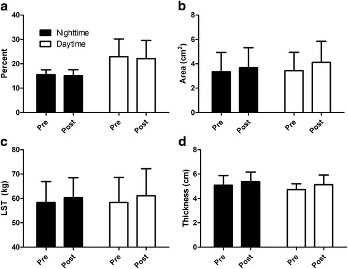
- 📊 **Fig. 2** — Weekly Averages for DOMS and RPE. a DOMS; b RPE. No significant differences were observed for the mean weekly rating of DOMS or RPE (p > 0.05). Data are presented as Mean ± SD
  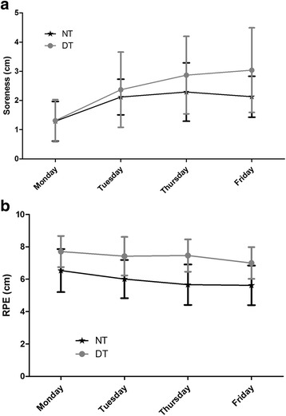

---

## [The 6-Day Push/Pull/Legs Routine: Full Week, Exercise by Exercise](push-pull-legs-routine.md)

**Maeo S, Huang M, Wu Y, Sakurai H, Kusagawa Y, Sugiyama T, Kanehisa H, 2021. *Greater Hamstrings Muscle Hypertrophy but Similar Damage Protection after Training at Long versus Short Muscle Lengths***  
[PMC7969179](https://pmc.ncbi.nlm.nih.gov/articles/PMC7969179/) · CC BY-NC-ND · **stored**

- 📊 **FIGURE 1** — Operating ranges of each hamstring muscle on the normalized force–length curve during the seated and prone knee flexion (leg curl) exercise. These were calculated using the OpenSim Lower Limb model (8,9), with the hip joint angle at 90° and 30° for the seated and prone conditions, respectively, and…
  
- 🗺 **FIGURE 2** — Flow diagram and demographic information of participants.
  
- 🖼 **FIGURE 3** — Example images for the T1-weighted MRI scans (for Seated-Leg in part 1) and T2-weighted MRI scans (for Control-Leg in part 2) at 50% of the thigh length, and a coronal localizer image. The images shown here are all for the right leg, but both legs were scanned in both part 1 and part 2.
  
- 📊 **FIGURE 4** — Changes in muscle volume for Seated-Leg and Prone-Leg after training. Data are plotted as individual raw change (Δ) values from baseline (small dots), with a group mean (larger dots) and its 95% CI (indicated by the ends of the vertical error bars) shown together. The CI and the bootstrap sampling…
  
- 📊 **FIGURE 5** — Changes in ACSA of the BFL and ST at 30% (BFLProximal, STProximal) and 70% (BFLDistal, STDistal) of the thigh length for Seated-Leg and Prone-Leg after training. Data are plotted as individual raw change (Δ) values from baseline (small dots), with a group mean (larger dots) and its 95% CI…
  
- 📊 **FIGURE 6** — Changes in T2 of each hamstring muscle at 50% of the thigh length (BFLMiddle, STMiddle, SMMiddle, BFSMiddle) at 72 h after eccentric exercise for Seated-Leg, Prone-Leg, and Control-Leg. Data are plotted as individual raw change (Δ) values from baseline (small dots), with a group mean (larger dots)…
  
- 📊 **FIGURE 7** — Changes in T2 of the BFL and ST at 30% (BFLProximal, STProximal) and 70% (BFLDistal, STDistal) of the thigh length at 72 h after eccentric exercise for Seated-Leg, Prone-Leg, and Control-Leg. Data are plotted as individual raw change (Δ) values from baseline (small dots), with a group mean (larger…
  
- 📊 **FIGURE 8** — Changes in the seated and prone leg curl 1RM at 24, 48, and 72 h after eccentric exercise for Seated-Leg, Prone-Leg, and Control-Leg. Data are plotted as individual raw change (Δ) values from baseline (small dots), with a group mean (larger dots) and its 95% CI (indicated by the ends of the…
  

---

## [Quad Exercises Ranked S–F: Squat Patterns, Machines and the Rectus Femoris Problem](quad-exercises-ranked.md)

**Kojic F, Ranisavljev I, Obradovic M, Mandic D, Pelemis V, Paloc M, Dur 2022. *Does Back Squat Exercise Lead to Regional Hypertrophy among Quadriceps Femoris Muscles?***  
[PMC9737272](https://pmc.ncbi.nlm.nih.gov/articles/PMC9737272/) · CC BY · **stored**

- 🗺 **Figure A1** — A photo of participants training squats.
  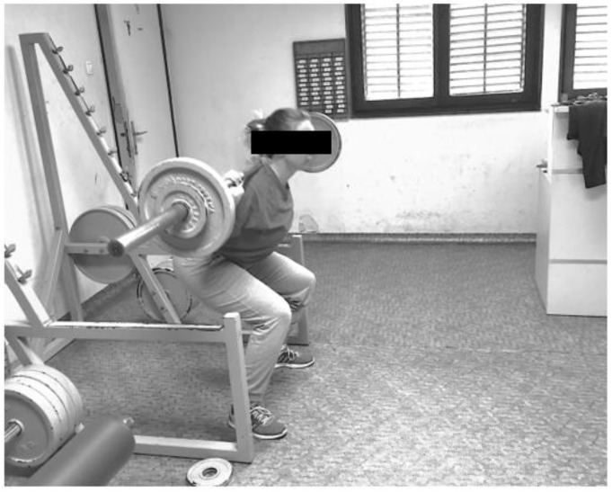
- 🗺 **Figure 1** — Flowchart of the experimental design.
  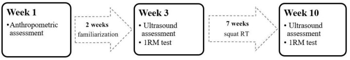
- 🖼 **Figure 2** — Individual pre-to-post changes in cross-sectional area (CSA) of rectus femoris (RF), vastus intermedius (VI), vastus medialis (VM), and vastus lateralis (VL).
  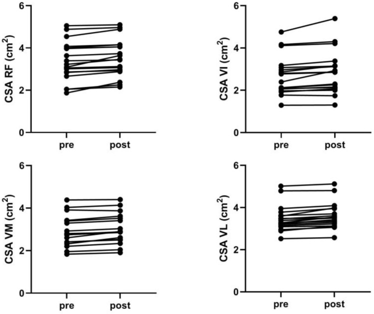
- 🖼 **Figure 3** — Relationship between relative changes (∆) in squat strength (1RM) and cross-sectional area (CSA) of vastus lateralis muscle.
  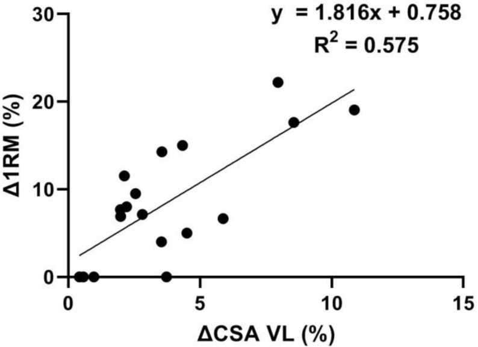

**Haugen ME, Vårvik FT, Larsen S, Haugen AS, van den Tillaar R, Bjørnsen 2023. *Effect of free-weight vs. machine-based strength training on maximal strength, hypertrophy and jump performance - a systematic review and meta-analysis***  
[PMC10426227](https://pmc.ncbi.nlm.nih.gov/articles/PMC10426227/) · CC BY · **stored**

- 🗺 **Fig. 1** — Flow chart of the PRISMA process showing the number of records collected, number of articles screened, number of articles excluded with reason, and the final number of articles included in the analysis
  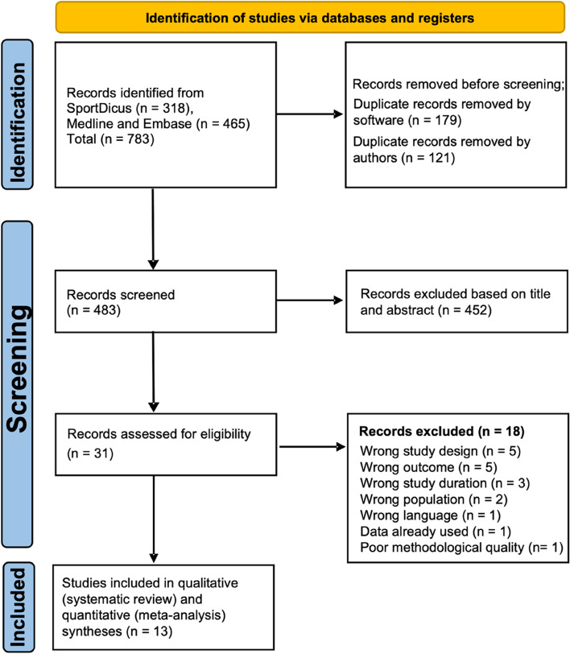
- 📊 **Fig. 2** — Forest-plot which shows the effect size changes when both groups tested machines (A), and when both groups tested free-weights (B)
  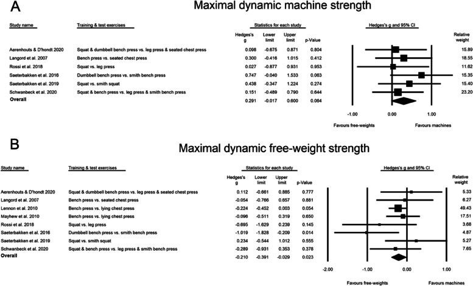
- 📊 **Fig. 3** — Forest-plot that shows the effect of free-weight training on changes in free-weight strength, versus machine-based training on the changes in machine-based strength (direct-strength-comparison-analysis), in maximal dynamic strength (A), maximal dynamic strength in the upper-body (B), maximal…
  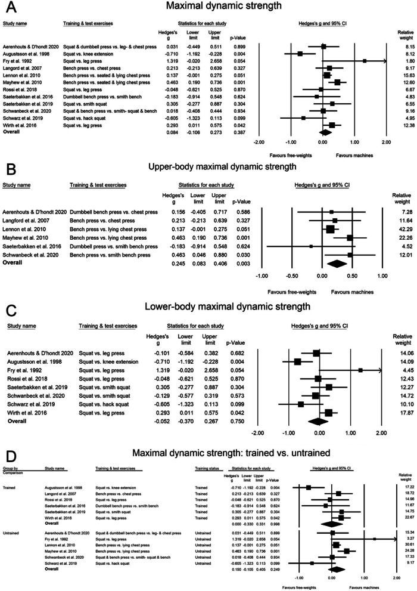
- 📊 **Fig. 4** — Forest-plot which shows the effect size changes in countermovement jump (A), isometric strength (B), and hypertrophy (C)
  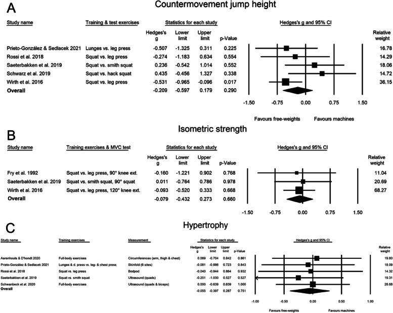
- 📊 **Fig. 5** — Shows the effect sizes (mean ± SD) of changes from pre-test to post-test in maximal strength (A), hypertrophy (B), vertical jump height (C) and isometric strength (D). Black are changes in free-weight when participants trained with free-weights and grey are changes in machine groups when…
  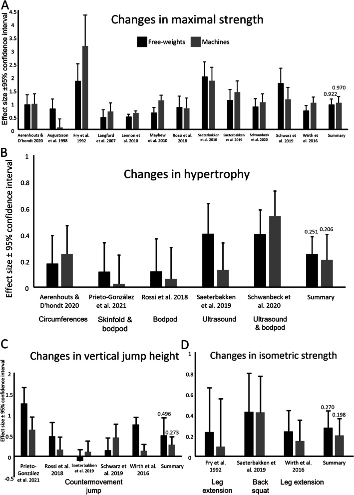

---

## [How To Rebuild Muscle And Strength After A Training Layoff](re-build-muscle-after-training-break.md)

**Seaborne RA, Strauss J, Cocks M, Shepherd S, O'Brien TD, van Someren K 2018. *Human Skeletal Muscle Possesses an Epigenetic Memory of Hypertrophy***  
[PMC5789890](https://pmc.ncbi.nlm.nih.gov/articles/PMC5789890/) · CC BY · **stored**

- 🗺 **Figure 1** — (A) Schematic representation of experimental conditions and types of analysis undertaken across the time-course. The image of a muscle represents the time point for analysis of muscle mass via (i) DEXA and strength via (ii) isometric quadriceps muscle torque using an isokinetic dynamometer. The…
  
- 📊 **Figure 2** — (A) Infinium MethylationEPIC BeadChip arrays (850 K CpG sites) identified an enhanced frequency of hypomethylated CpG sites upon reloading (n = 7). (B) Gene ontology analysis using forest plot schematics confirmed an enhanced hypomethylated profile after reloading across various (i) molecular…
  
- 🖼 **Figure 3** — (A) Representation of the DNA methylation modifications that occurred within the PI3K/AKT KEGG pathway following 7 weeks of reloading in human subjects. Signalling analysis performed on statistically differentially regulated CpG sites compared to baseline, with green indicating a hypomethylated…
  
- 🗺 **Figure 4** — (A) Heat map depicting unsupervised hierarchical clustering of the top 500 statistically differentially regulated CpG loci (columns) and conditions (baseline, loading, unloading and reloading) in previously untrained male participants (n = 8). The heat-map colours correspond to standardised…
  
- 🗺 **Figure 5** — Relative fold changes in: (A) gene expression; (B) correlation between gene expression and lower limb lean mass across experimental conditions, and; (C) schematic representation of relationship between fold changes in CpG DNA methylation (dashed black line; left y axis) and fold change in gene/mRNA…
  
- 📊 **Figure 6** — Representation and characterisation of the DNA methylation modifications that occurred within the ubiquitin mediated proteolysis pathway across all conditions of loading, unloading and reloading compared to baseline (ANOVA). Signalling analysis performed on statistically differentially regulated…
  
- 🗺 **Figure 7** — Response of the methylome after acute resistance loading stimulus compared to baseline, 7 weeks loading and 7 weeks reloading: (A) Heat map depicting unsupervised hierarchical clustering of statistically differentially regulated (P = 0.05) CpG loci following exposure to acute RE compared to…
  

---

## [Refeeds and Diet Breaks: What the Evidence Actually Supports](refeeds-and-diet-breaks.md)

**Byrne NM, Sainsbury A, King NA, Hills AP, Wood RE, Wood RE. 2018. *Intermittent energy restriction improves weight loss efficiency in obese men: the MATADOR study***  
[PMC5803575](https://pmc.ncbi.nlm.nih.gov/articles/PMC5803575/) · CC BY-NC-ND · **stored**

- 📊 **Figure 1** — Changes in body weight (kg; mean±s.e.m.) during baseline and 16 weeks of energy restriction (ER) in the continuous (CON; N=19) and intermittent (INT; N=17) groups. (a) Cumulative weight change (kg) over baseline (−4, −2, 0 weeks) and after 4, 8, 12 and 16 weeks of ER for the CON and INT groups.…
  
- 📊 **Figure 2** — Fat-free mass (FFM) and fat mass (FM) at baseline and during 16 weeks of energy restriction (ER) for the continuous (CON; N=19) and intermittent (INT; N=17) groups. (a) Fat-free mass (kg; mean±s.d.). * Differs significantly (P<0.05) from all other time points for the same intervention group. (b)…
  
- 📊 **Figure 3** — Change from baseline in resting energy expenditure (REE; kJ d−1) for the continuous (CON; N=19) and intermittent (INT; N=17) groups. Data are mean±s.e.m. (a) Change in absolute (unadjusted) REE after each 4 weeks of ER for the CON and INT groups. *Significant difference between groups; P<0.05. (b)…
  
- 📊 **Figure 4** — Weight and body composition in the subsample (CON: N=13, INT: N=15) of participants with data at all the following time points: baseline, during and end of energy restriction (ER), during and after 8 weeks of energy balance immediately post-ER-intervention, and follow-up 6 months later. (a) Weight…
  

**Campbell BI, Aguilar D, Colenso-Semple LM, Hartke K, Fleming AR, Fox C 2020. *Intermittent Energy Restriction Attenuates the Loss of Fat Free Mass in Resistance Trained Individuals. A Randomized Controlled Trial***  
[PMC7739314](https://pmc.ncbi.nlm.nih.gov/articles/PMC7739314/) · CC BY · **stored**

- 🖼 **Figure 1** — Caloric restriction during a typical week of dieting for both isocaloric diet treatments.
  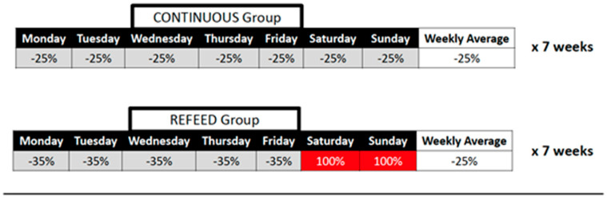
- 🖼 **Figure 2** — Individual participant changes in fat mass.
  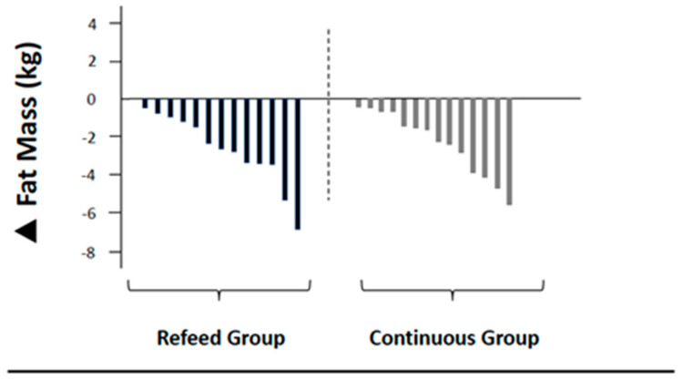
- 🖼 **Figure 3** — Individual participant changes in fat-free mass.
  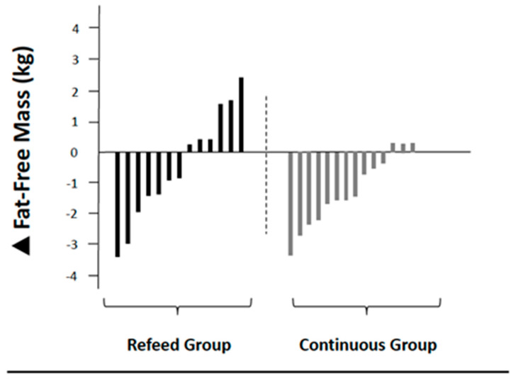

---

## [What's Really Making Us Fat? Calories, Carbs and Sugar with Stephan Guyenet](s-making-us-fat-carbs-sugar.md)

**Hall KD, Guo J. 2017. *Obesity Energetics: Body Weight Regulation and the Effects of Diet Composition***  
[PMC5568065](https://pmc.ncbi.nlm.nih.gov/articles/PMC5568065/) · NIH manuscript — text mining/fair use only · link only

- 🖼 **Figure 1** — Components of human energy expenditure and body composition in average 100-kg and 70-kg men. (A) Daily energy expenditure comprises the energy cost of digesting and processing food, called the thermic effect of food, the energy expended in physical activity, and the energy expended at rest to… ([view](https://pmc.ncbi.nlm.nih.gov/articles/PMC5568065/figure/F1/))
- 📊 **Figure 2** — Meta-analysis of controlled isocaloric feeding studies with constant dietary protein and varying ratios of carbohydrate to fat. Studies are ordered from top to bottom according to the largest difference in carbohydrate between diet comparisons. Effect size (ES), upper and lower 95% confidence… ([view](https://pmc.ncbi.nlm.nih.gov/articles/PMC5568065/figure/F2/))
- 📊 **Figure 3** — Comparison of static, settling point, and set point models of body weight regulation in a simulated 90-kg man. (A) The static model assumes that energy intake (blue) and expenditure (red) are independent quantities that do not depend on body weight, as shown by the horizontal lines in the top… ([view](https://pmc.ncbi.nlm.nih.gov/articles/PMC5568065/figure/F3/))

---

## [SARMs: What's All the Hype About?](sarms-s-all-hype-about.md)

**Bhasin S, Jasuja R. 2009. *Selective androgen receptor modulators as function promoting therapies***  
[PMC2907129](https://pmc.ncbi.nlm.nih.gov/articles/PMC2907129/) · NIH manuscript — text mining/fair use only · link only

- 🖼 **Figure 1** — Structure: Activity Relationship of Steroidal SARMsAdapted from Narayanan et al 2008 (2) and Bhasin et al 2006 (1) ([view](https://pmc.ncbi.nlm.nih.gov/articles/PMC2907129/figure/F1/))
- 🖼 **Figure 2** — Various Structural Classes of Nonsteroidal SARMsAdapted from Narayanan et al 2008 (2) and Bhasin et al 2006 (1) ([view](https://pmc.ncbi.nlm.nih.gov/articles/PMC2907129/figure/F2/))

---

## [Sam Sulek's Training, Graded Against the Evidence](science-behind-sam-sulek-s-training.md)

**Sato S, Yoshida R, Kiyono R, Yahata K, Yasaka K, Nunes JP, Nosaka K, N 2021. *Elbow Joint Angles in Elbow Flexor Unilateral Resistance Exercise Training Determine Its Effects on Muscle Strength and Thickness of Trained and Non-trained Arms***  
[PMC8489980](https://pmc.ncbi.nlm.nih.gov/articles/PMC8489980/) · CC BY · **stored**

- 📊 **FIGURE 1** — Changes (mean ± SD, individuals) in average maximum voluntary isometric contraction torque of four different angles (MVC-ISOave), concentric contraction torque at two different velocities (MVC-CONave), eccentric contraction (MVC-ECC) torque, and muscle thickness at three positions (MTave) before…
  

**Pedrosa GF, Simões MG, Figueiredo MOC, Lacerda LT, Schoenfeld BJ, Lima 2023. *Training in the Initial Range of Motion Promotes Greater Muscle Adaptations Than at Final in the Arm Curl***  
[PMC9960616](https://pmc.ncbi.nlm.nih.gov/articles/PMC9960616/) · CC BY · **stored**

- 🗺 **Figure 1** — Training protocols range of motion. (A1,A2) = starting and finishing the concentric action of INITIALROM protocol (0°–68° of elbow flexion), respectively. (B1,B2) = starting and finishing the concentric action of FINALROM protocol (68°–135° of elbow flexion), respectively.
  
- 🗺 **Figure 2** — The paired mean difference for cross-sectional area in INITIALROM and FINALROM at (a) 50% humeral length; (b) 70% humeral length; and (c) summed values of 50% and 70% humeral length [30]. The raw data are plotted on the upper axes; each paired set of observations is connected by a line. On the…
  
- 🗺 **Figure 3** — The paired mean difference for 1 repetition maximum in INITIALROM and FINALROM [30]. The raw data are plotted on the upper axes; each paired set of observations is connected by a line. On the lower axes, each paired mean difference is plotted as a bootstrap sampling distribution. Mean differences…
  

---

## [The Science of Milk: Mortality, Cancer, Acne and the Anti-Dairy Arguments](science-milk.md)

**Larsson SC, Crippa A, Orsini N, Wolk A, Michaëlsson K. 2015. *Milk Consumption and Mortality from All Causes, Cardiovascular Disease, and Cancer: A Systematic Review and Meta-Analysis***  
[PMC4586558](https://pmc.ncbi.nlm.nih.gov/articles/PMC4586558/) · CC BY · **stored**

- 🗺 **Figure 1** — Flow diagram of literature search and study selection. Studies excluded based on title and abstract included experimental studies in animals and in vitro, review articles, and other studies unrelated to milk consumption and mortality. * One article reported results from two separate cohorts and one…
  
- 📊 **Figure 2** — Dose-response association between non-fermented milk consumption and all-cause mortality in individual studies. The hazard ratios are plotted on a log scale.
  
- 📊 **Figure 3** — Dose-response association between non-fermented milk consumption and cardiovascular disease mortality in individual studies. The hazard ratios are plotted on a log scale.
  
- 📊 **Figure 4** — Dose-response association between non-fermented milk consumption and cancer mortality in individual studies. The hazard ratios are plotted on a log scale.
  

**de Goede J, Soedamah-Muthu SS, Pan A, Gijsbers L, Geleijnse JM. 2016. *Dairy Consumption and Risk of Stroke: A Systematic Review and Updated Dose-Response Meta-Analysis of Prospective Cohort Studies***  
[PMC4889169](https://pmc.ncbi.nlm.nih.gov/articles/PMC4889169/) · CC BY-NC · **stored**

- 🗺 **Figure 1** — Flow chart of literature search for meta‐analysis on dairy intake and incident stroke.
  
- 🖼 **Figure 2** — Relative risks of total stroke for an increment of 200 g of daily milk intake, by continent. Squares represent relative risks and square sizes study‐specific statistical weight; horizontal lines represent 95% CIs; diamonds represent summary relative risk estimates with 95% CIs.
  
- 📊 **Figure 3** — Ding's spaghetti plot for the nonlinear association between milk intake and total stroke (n=13). Light blue lines represent Western and brown lines East Asian studies. Circles are placed at study‐specific relative risks related to the corresponding quantity of intake. Circle areas are proportional…
  
- 📊 **Figure 4** — Funnel plots for studies of the association between milk intake and stroke risk based on dose–response slopes; Egger's test, P=0.06 (A) and funnel plot for studies in Western countries of the association between milk intake and stroke risk (B) based on dose–response slopes; Egger's test, P=0.02.
  
- 🖼 **Figure 5** — Relative risks of ischemic stroke (A), hemorrhagic stroke (B), and fatal stroke stratified by continent (C) for an increment of 200 g/day in milk intake. Squares represent study‐specific relative risk estimates (size of the square reflects the study‐specific statistical weight, ie, the inverse of…
  
- 📊 **Figure 6** — Ding's spaghetti plots for (A) the nonlinear association (P for nonlinearity=0.01, knot at 165 g/day) between milk intake and total stroke in East Asian countries (n=5). B, For the nonlinear association (P for nonlinearity=0.03; knot at 115 g/day) between milk intake and ischemic stroke (n=5). C,…
  
- 🖼 **Figure 7** — Relative risks of total stroke for an increment of 200 g/day in milk intake in Western countries, stratified for sex. Squares represent study‐specific relative risk estimates (size of the square reflects the study‐specific statistical weight, ie, the inverse of the variance); horizontal lines…
  
- 🖼 **Figure 8** — Relative risks of total stroke for an increment of 200 g/day in low‐fat milk intake (A) and high‐fat milk intake (B). Squares represent study‐specific relative risk estimates (size of the square reflects the study‐specific statistical weight, ie, the inverse of the variance); horizontal lines…
  
- 🖼 **Figure 9** — Relative risks of total stroke for an increment of 40 g/day in cheese intake. Squares represent study‐specific relative risk estimates (size of the square reflects the study‐specific statistical weight, ie, the inverse of the variance); horizontal lines represent 95% CIs; diamonds represent summary…
  
- 📊 **Figure 10** — Ding's spaghetti plot for the nonlinear association between cheese intake and total stroke (n=6). Circles are placed at the study‐specific relative risks related to the corresponding quantity of intake. The area of the circles is proportional to the study‐specific statistical weight. The solid red…
  
- 🖼 **Figure 11** — Relative risks of total stroke for an increment of 100 g/day in yogurt intake. Squares represent study‐specific relative risk estimates (size of the square reflects the study‐specific statistical weight, ie, the inverse of the variance); horizontal lines represent 95% CIs; diamonds represent…
  
- 🖼 **Figure 12** — Relative risks of total stroke for an increment of 200 g/day in fermented dairy intake (A) and fatal stroke for an increment of 200 g/day in fermented dairy intake (B). Squares represent study‐specific relative risk estimates (size of the square reflects the study‐specific statistical weight, ie,…
  
- 🖼 **Figure 13** — Relative risks of total stroke (A), ischemic stroke (B), hemorrhagic stroke (C), and fatal stroke (D) for an increment of 200 g/day in total dairy intake. Squares represent study‐specific relative risk estimates (size of the square reflects the study‐specific statistical weight, ie, the inverse of…
  
- 🖼 **Figure 14** — Relative risks of total stroke for an increment of 200 g/day in low‐fat dairy (A) and high‐fat dairy (B) intake. Squares represent study‐specific relative risk estimates (size of the square reflects the study‐specific statistical weight, ie, the inverse of the variance); horizontal lines represent…
  
- 📊 **Figure 15** — Ding's spaghetti plots for (A) the nonlinear association (P for nonlinearity=0.01; knot at 75 g/day) between low‐fat dairy intake and total stroke (n=6) and (B) the nonlinear association (P for nonlinearity=0.01; knot: 55 g/day) between high‐fat dairy intake and total stroke (n=6). Light blue lines…
  
- 🖼 **Figure 16** — Relative risks of total stroke for an increment of 10 g/day in butter intake. Squares represent study‐specific relative risk estimates (size of the square reflects the study‐specific statistical weight, ie, the inverse of the variance); horizontal lines represent 95% CIs; diamond represents summary…
  

**Thorning TK, Raben A, Tholstrup T, Soedamah-Muthu SS, Givens I, Astrup 2016. *Milk and dairy products: good or bad for human health? An assessment of the totality of scientific evidence***  
[PMC5122229](https://pmc.ncbi.nlm.nih.gov/articles/PMC5122229/) · CC BY · **stored**

- 🖼 **Fig. 1** — Overall effect/association between dairy product intake and health outcomes. ↓ favourable effect/association; ↑adverse effect/association; → no effect/association.
  

**Mullie P, Pizot C, Autier P. 2016. *Daily milk consumption and all-cause mortality, coronary heart disease and stroke: a systematic review and meta-analysis of observational cohort studies***  
[PMC5143456](https://pmc.ncbi.nlm.nih.gov/articles/PMC5143456/) · CC BY · **stored**

- 🗺 **Fig. 1** — Prisma flow chart of selections of studies included in the meta-analyses relating daily milk consumption to all-cause mortality, coronary heart disease and stroke
  
- 📊 **Fig. 2** — Relation between milk (per 200 mL/d) and all-cause mortality: dose-response meta-analyses of eleven prospective cohorts. Author names, year of publication, and the size of the association per study; the horizontal lines indicate 95% confidence intervals. The last two columns contain the actual…
  
- 📊 **Fig. 3** — Relation between milk (per 200 mL/d) and fatal and non fatal coronary heart disease: dose-response meta-analyses of nine prospective cohorts. Author names, year of publication, and the size of the association per study; the horizontal lines indicate 95% confidence intervals. The last two columns…
  
- 📊 **Fig. 4** — Relation between milk (per 200 mL/d) and fatal and non fatal stroke: dose-response meta-analyses of ten prospective cohorts. Author names, year of publication, and the size of the association per study; the horizontal lines indicate 95% confidence intervals. The last two columns contain the actual…
  

**Drouin-Chartier JP, Brassard D, Tessier-Grenier M, Côté JA, Labonté MÈ 2016. *Systematic Review of the Association between Dairy Product Consumption and Risk of Cardiovascular-Related Clinical Outcomes***  
[PMC5105032](https://pmc.ncbi.nlm.nih.gov/articles/PMC5105032/) · CC BY-NC · **stored**

- 📊 **FIGURE 1** — Forest plot of RRs from meta-analyses of prospective cohort studies on the association between dairy intake and cardiovascular disease risk, with their 95% CIs. Each symbol represents data from an individual meta-analysis.
  
- 📊 **FIGURE 2** — Forest plot of RRs from meta-analyses of prospective cohort studies on the association between dairy intake and coronary artery disease risk, with their 95% CIs. Each symbol represents data from an individual meta-analysis. Arrows indicate that the 95% CIs exceed the figure scale. R-TFA, ruminant…
  
- 📊 **FIGURE 3** — Forest plot of RRs from meta-analyses of prospective cohort studies on the association between dairy intake and the risk of stroke, with their 95% CIs. Each symbol represents data from an individual meta-analysis.
  
- 📊 **FIGURE 4** — Forest plot of RRs from meta-analyses of prospective cohort studies on the association between dairy intake and the risk of hypertension, with their 95% CIs. Each symbol represents data from an individual meta-analysis.
  
- 📊 **FIGURE 5** — Forest plot of RRs from meta-analyses of prospective cohort studies on the association between dairy intake and the risk of metabolic syndrome, with their 95% CIs. Each symbol represents data from an individual meta-analysis.
  
- 📊 **FIGURE 6** — Forest plot of RRs from meta-analyses of prospective cohort studies on the association between dairy intake and the risk of type 2 diabetes, with their 95% CIs. Each symbol represents data from an individual meta-analysis. HF, high-fat; LF, low-fat; R-TFA, ruminant trans fatty acids.
  

**Guo J, Astrup A, Lovegrove JA, Gijsbers L, Givens DI, Soedamah-Muthu S 2017. *Milk and dairy consumption and risk of cardiovascular diseases and all-cause mortality: dose-response meta-analysis of prospective cohort studies***  
[PMC5437143](https://pmc.ncbi.nlm.nih.gov/articles/PMC5437143/) · CC BY · **stored**

- 🗺 **Fig. 1** — Flowchart of meta-analysis on dairy consumption and incident CVD, CVD mortality and all-cause mortality
  
- 📊 **Fig. 2** — Relative risk of all-cause mortality for an increment of 20 g/day of fermented dairy intake. Squares represent study-specific RR. Square areas are proportional to the overall specific-study weight to the overall meta-analysis. Horizontal lines represent 95% CIs. Diamonds represent the pooled…
  
- 📊 **Fig. 3** — Relative risk of CVD for an increment of 20 g/day of fermented dairy intake. Squares represent study-specific RR. Square areas are proportional to the overall specific-study weight to the overall meta-analysis. Horizontal lines represent 95% Cis. Diamonds represent the pooled relative risk and 95%…
  
- 📊 **Fig. 4** — Relative risks of CVD for an increment of 10 g/day of cheese. Squares represent study-specific RR. Square areas are proportional to the overall specific-study weight to the overall meta-analysis. Horizontal lines represent 95% CIs. Diamonds represent the pooled relative risk and 95% Cis. By…
  

---

## [Sex Differences in Training: What Actually Changes for Women vs Men](sex-differences-in-training.md)

**Hunter SK. 2014. *Sex differences in human fatigability: mechanisms and insight to physiological responses***  
[PMC4111134](https://pmc.ncbi.nlm.nih.gov/articles/PMC4111134/) · NIH manuscript — text mining/fair use only · link only

- 📊 **Figure 1** — Sex differences in muscle fatigue for voluntary isometric contractions (A) and dynamic contractions (B)Represented are mean data from 59 studies: 43 isometric contraction studies (A) and 16 dynamic contraction studies (B) that assessed muscle fatigue in men and women for various muscle groups.… ([view](https://pmc.ncbi.nlm.nih.gov/articles/PMC4111134/figure/F1/))
- 📊 **Figure 2** — Summary of findings from 4 studies showing the influence of increased arousal on time to task failure of a fatiguing isometric contraction (20% MVC until failure) with the elbow flexor muscles in young men and women. In each study, two sessions were performed. A fatiguing contraction with no… ([view](https://pmc.ncbi.nlm.nih.gov/articles/PMC4111134/figure/F2/))
- 🖼 **Figure 3** — Potential physiological mechanisms for the sex difference in muscle fatigue(or time to task failure).The figure shows those potential mechanisms that can contribute to women being more fatigue resistant than men. The strength of a potential mechanism will vary with the task conditions so that one… ([view](https://pmc.ncbi.nlm.nih.gov/articles/PMC4111134/figure/F3/))
- 🗺 **Figure 4** — Young men (n = 9) and young women (n = 8) performed an isometric fatiguing protocol with the elbow flexor muscles. The protocol involved 6 × 22 s maximal voluntary contractions (MVC) with submaximal contractions at 60% and 80% MVC before, after and between the sustained MVCs. A. Representative… ([view](https://pmc.ncbi.nlm.nih.gov/articles/PMC4111134/figure/F4/))
- 📊 **Figure 5** — Type I fibre area (%, proportional area) of skeletal muscle histochemically analysed for myosin ATPase activity from muscle biopsy samples of vastus lateralis (VL), tibialis anterior (TA) and biceps brachii (BB) in young men (closed symbols) and women (open symbols) that were sampled in the same… ([view](https://pmc.ncbi.nlm.nih.gov/articles/PMC4111134/figure/F5/))
- 📊 **Figure 6** — Maximal rates of sarcoplasmic reticulum Ca2+ATPase activity for whole muscle homogenates (obtained via needle biopsies of the vastus lateralis) of young men (n = 27) and women (n = 31) at rest. Men are represented in the closed symbols and women in the open symbols. Data plotted as circles, are… ([view](https://pmc.ncbi.nlm.nih.gov/articles/PMC4111134/figure/F6/))

---

## [Shoulder Exercises Ranked S to F](shoulder-exercises-ranked.md)

**Kijkunasathian C, Niyomkha S, Woratanarat P, Vijittrakarnrung C. 2023. *The preferable shoulder position can isolate supraspinatus activity superior to the classic empty can test: an electromyographic study***  
[PMC10069100](https://pmc.ncbi.nlm.nih.gov/articles/PMC10069100/) · CC BY · **stored**

- 🗺 **Fig. 1** — Wireless Myon 320 Surface Electromyography System®; Schwarzenberg, Switzerland. The system consists of transmitters (A) and receivers (B). Surface electrode placement on seven muscles identified by different-colored electrodes for the anterior side (C) and posterior side (D)
  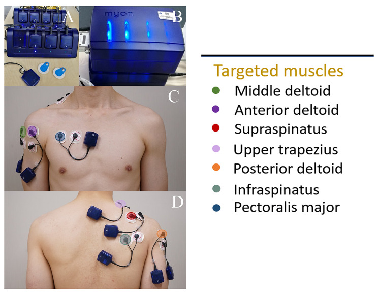
- 🖼 **Fig. 2** — Comprehensive shoulder motion tasks for 30°/60°/90° shoulder abduction (A), 0°/30°/60°/scapular plane horizontal flexion (B), and full internal/external humeral rotation (C). Example of two-plane goniometer measurement of 90° shoulder abduction, 30° horizontal flexion, and full internal humeral…
  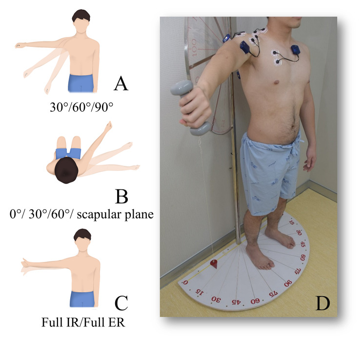
- 📊 **Fig. 3** — Comparison of the percentage of standardized weighted EMG (%sEMG) of middle deltoid between the groups graded by degree of shoulder abduction, degree of shoulder horizontal flexion, and humeral rotation. Error bars indicate the interquartile range (IQR) of the median. Black dots indicate values…
  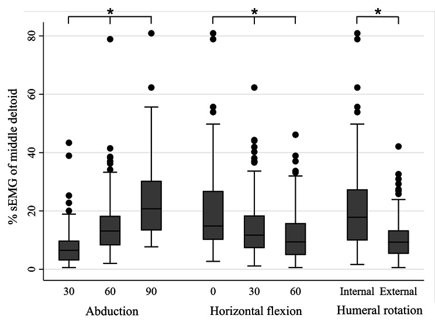
- 📊 **Fig. 4** — Comparison of the percentage of standardized weighted EMG (%sEMG) of supraspinatus between the groups graded by degree of shoulder abduction, degree of shoulder horizontal flexion, and humeral rotation. Error bars indicate the interquartile range (IQR) of the median. Black dots indicate values…
  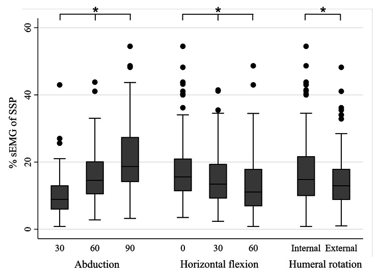
- 📊 **Fig. 5** — Comparison of the supraspinatus: middle deltoid (S:D) ratio between the groups graded by degree of shoulder abduction, degree of shoulder horizontal flexion, and humeral rotation. Error bars indicate the interquartile range (IQR) of the median. Black dots indicate values above the upper fence…
  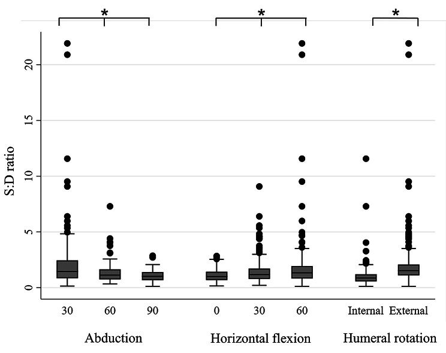

**Wolf M, Korakakis PA, Roberts MD, Plotkin DL, Franchi MV, Contreras B, 2026. *Does longer-muscle length resistance training cause greater longitudinal growth in humans? A systematic review***  
[PMC12869050](https://pmc.ncbi.nlm.nih.gov/articles/PMC12869050/) · CC BY-NC-ND · **stored**

- 🗺 **Fig. 1** — Prisma flow chart.
  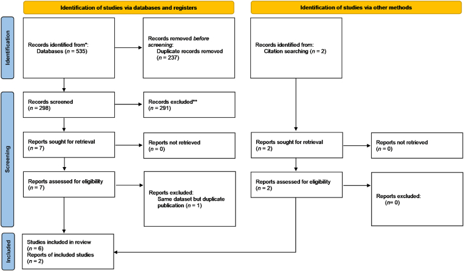
- 🖼 **Fig. 2** — A muscle fiber growing either in series or parallel.
  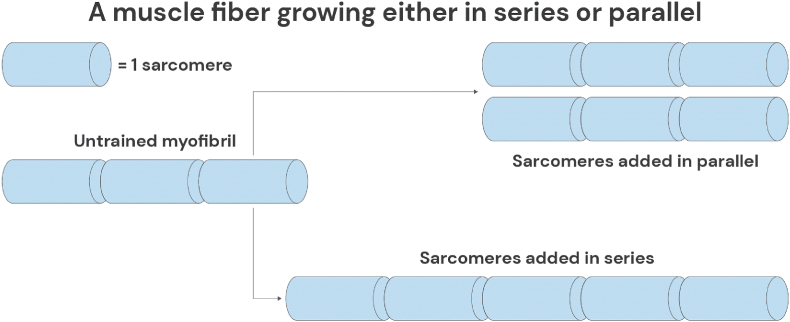
- 🖼 **Fig. 3** — Measuring muscle thickness and fascicle angle during b-mode ultrasonography.
  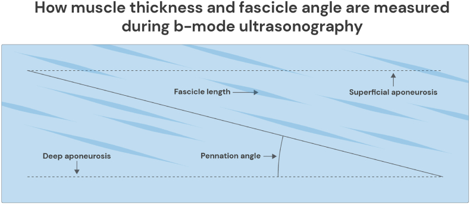

---

## [Steroids: How Well They Work and Everything Else They Do](steroids-awesome.md)

**Brennan BP, Kanayama G, Hudson JI, Pope HG. 2011. *Human growth hormone abuse in male weightlifters***  
[PMC3104052](https://pmc.ncbi.nlm.nih.gov/articles/PMC3104052/) · NIH manuscript — text mining/fair use only · link only

- 🖼 **Figure 1** — Association between anabolic-androgenic steroid use, anabolic-androgenic steroid dependence, and human growth hormone use in 231 young male weightlifters. ([view](https://pmc.ncbi.nlm.nih.gov/articles/PMC3104052/figure/F1/))

**Rasmussen JJ, Selmer C, Østergren PB, Pedersen KB, Schou M, Gustafsson 2016. *Former Abusers of Anabolic Androgenic Steroids Exhibit Decreased Testosterone Levels and Hypogonadal Symptoms Years after Cessation: A Case-Control Study***  
[PMC4988681](https://pmc.ncbi.nlm.nih.gov/articles/PMC4988681/) · CC BY · **stored**

- 🖼 **Fig 1** — Association between accumulated duration of AAS abuse (log 2 scale) and testis size in current AAS abusers (spline function) and former AAS abusers.Footnote: AAS, anabolic androgenic steroids.
  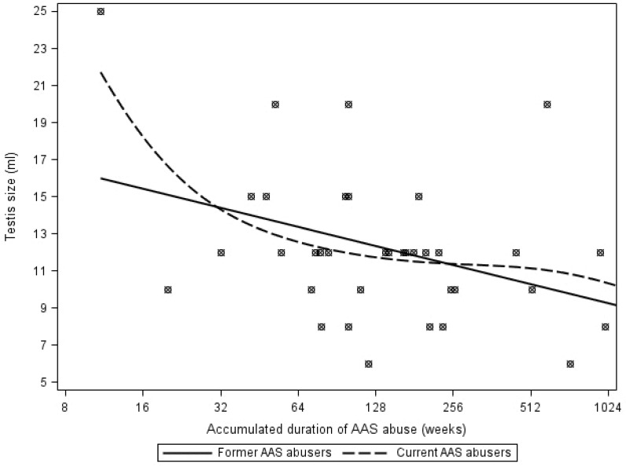
- 🖼 **Fig 2** — Association between accumulated duration of AAS abuse (log 2 scale) and plasma total testosterone levels (log 2 scale) in former AAS abusers.Footnote: AAS, anabolic androgenic steroids.
  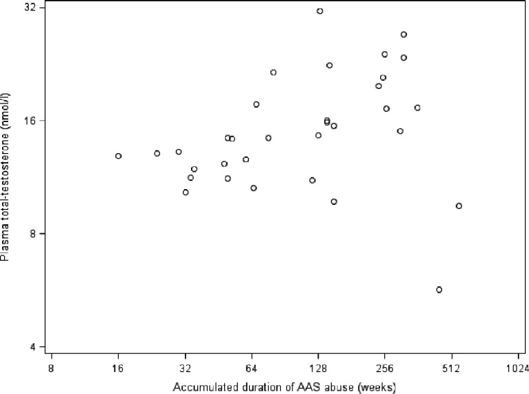
- 🖼 **Fig 3** — Association between elapsed duration since AAS cessation (log 2 scale) and plasma total testosterone levels (log 2 scale) in former AAS abusers.Footnote: AAS, anabolic androgenic steroids.
  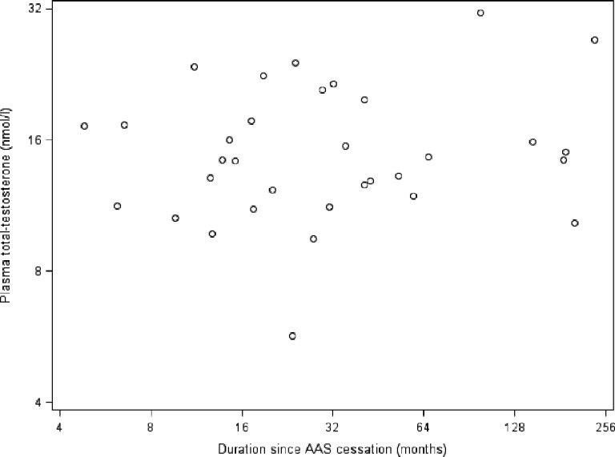
- 🖼 **Fig 4** — Association between accumulated duration of AAS abuse (log 2 scale spline function) and serum inhibin B levels in current AAS abusers.Footnote: AAS, anabolic androgenic steroids; s-, serum.
  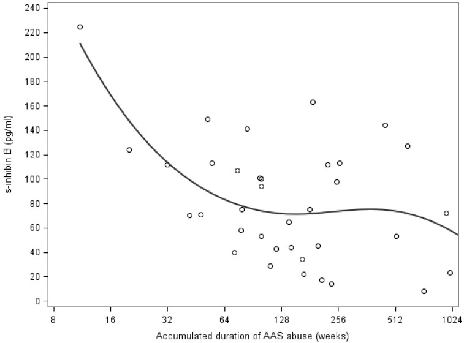
- 🖼 **Fig 5** — Association between accumulated duration of AAS abuse (log2 scale) and serum anti-Müllerian hormone levels (AMH, log2 scale) in current AAS abusers.Footnote: AAS, anabolic androgenic steroids.
  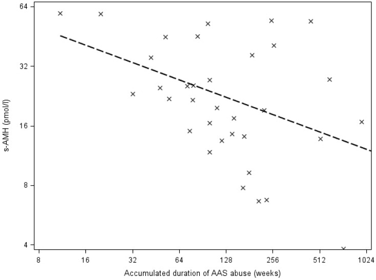
- 📊 **Fig 6** — Symptoms of depression, erectile dysfunction and decreased libido in the three groups.Footnote: T bars show standard errors. Depressive symptoms, erectile dysfunction and decreased libido were compared across the groups with trend analyses and all were statistically significant (P < 0.05). AAS,…
  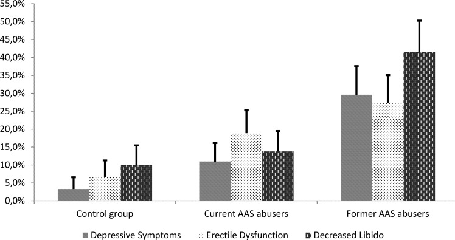

**Chilibeck PD, Kaviani M, Candow DG, Zello GA. 2017. *Effect of creatine supplementation during resistance training on lean tissue mass and muscular strength in older adults: a meta-analysis***  
[PMC5679696](https://pmc.ncbi.nlm.nih.gov/articles/PMC5679696/) · CC BY-NC · **stored**

- 📊 **Figure 1** — Forest plots for lean tissue mass (A), chest press strength (B), and leg press stress (C).Notes: Some studies presented data on men and women separately26,41 and on creatine and creatine + protein groups separately;21,22 therefore, these studies are entered twice in the meta-analysis for these…
  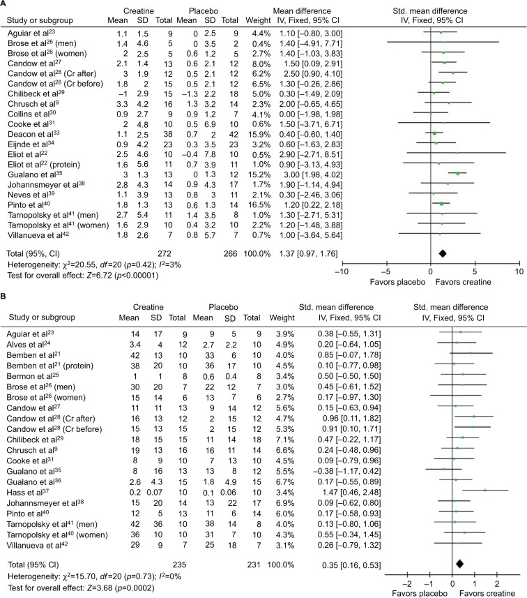
- 🖼 **Figure 2** — Potential mechanisms by which creatine supplementation leads to muscle hypertrophy.Abbreviations: IGF-1, insulin-like growth factor 1; MRFs, myogenic regulatory factors; mTOR, mammalian target of rapamycin; PCr, phosphorylcreatine; ROS, reactive oxygen species; SC, satellite cells.
  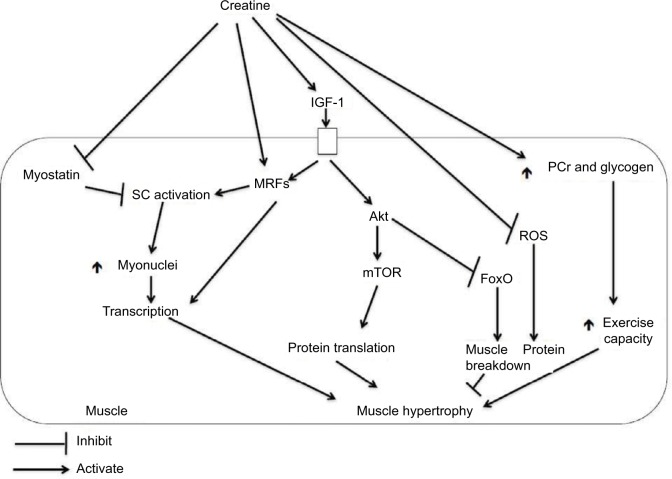
- 📊 **Figure 3** — Forest plots for phosphorylcreatine content in muscle of young and older adults for all studies (A) and for studies of only vastus lateralis (ie, studies of gastrocnemius or tibialis anterior were excluded from the analysis) (B).Notes: One study presented data on men and women separately;62…
  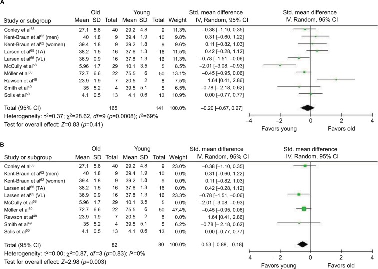

**Smit DL, Voogel AJ, den Heijer M, de Ronde W. 2021. *Anabolic Androgenic Steroids Induce Reversible Left Ventricular Hypertrophy and Cardiac Dysfunction. Echocardiography Results of the HAARLEM Study***  
[PMC9580689](https://pmc.ncbi.nlm.nih.gov/articles/PMC9580689/) · CC BY · **stored**

- 📊 **Figure 1** — Box and whisker plots of the relevant parameters measured with echocardiography before (T0) and at the end of the cycle (T1) with AAS, and after the recovery period (T2). *P < 0.01. (A) 3D LVEF (%). (B) E/A-ratio. (C) E/e'-ratio lat. (D) E/e'-ratio sept. (E) LAvol 3D (ml). (F) LAD PSLAX (mm).
  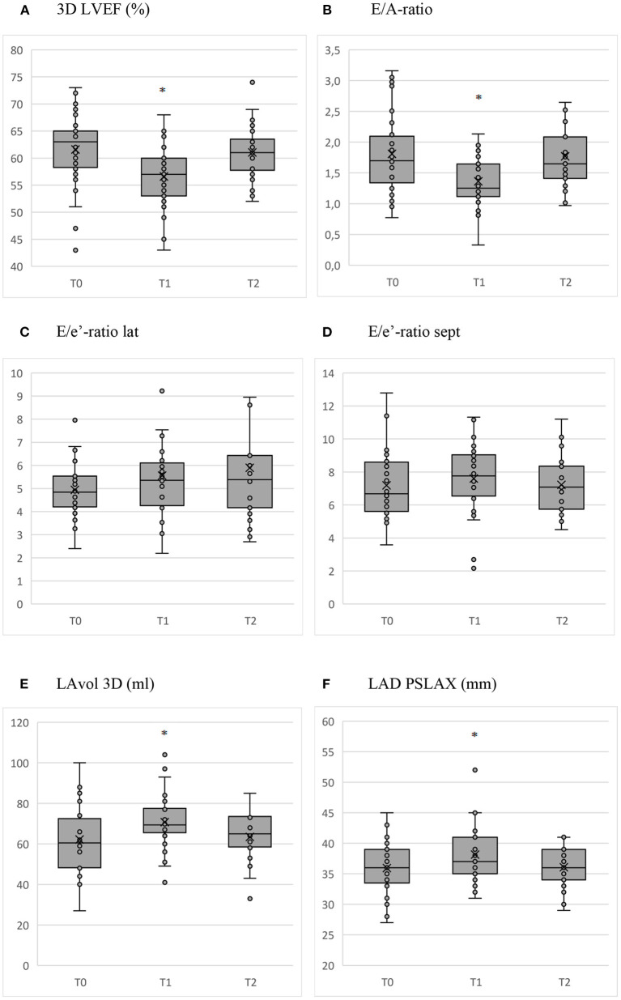

**Solanki P, Eu B, Smith J, Allan C, Lee K. 2023. *Physical, psychological and biochemical recovery from anabolic steroid-induced hypogonadism: a scoping review***  
[PMC10620455](https://pmc.ncbi.nlm.nih.gov/articles/PMC10620455/) · CC BY-NC-ND · **stored**

- 🗺 **Figure 1** — Reinitiation of GnRH pulse by KNDy neurons and its regulation. Schematic representation of the signalling pathway responsible for the generation of gonadotropin-releasing hormone (GnRH) pulses. KNDy neurons (containing the neuropeptides kisspeptin, neurokinin B (NKB) and dynorphin (Dyn) in the…
  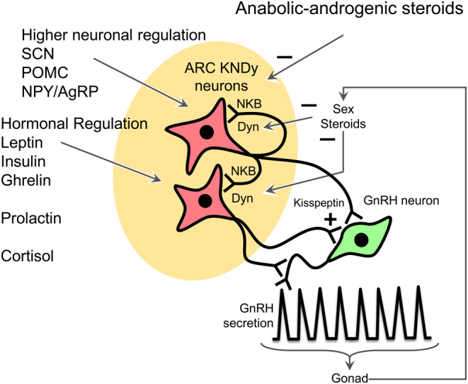

---

## [Sugar Is Not a Unique Cause of Obesity — Energy Balance Is](sugar-making-fat.md)

**Barclay AW, Brand-Miller J. 2011. *The Australian paradox: a substantial decline in sugars intake over the same timeframe that overweight and obesity have increased***  
[PMC3257688](https://pmc.ncbi.nlm.nih.gov/articles/PMC3257688/) · CC BY · **stored**

- 🖼 **Figure 1** — Prevalence of obesity (%) in (A) Australian adults, (B) Australian children, (C) adults in the United Kingdom, (D) children in the United Kingdom and (E) American adults (F) and children [18,23,24].
  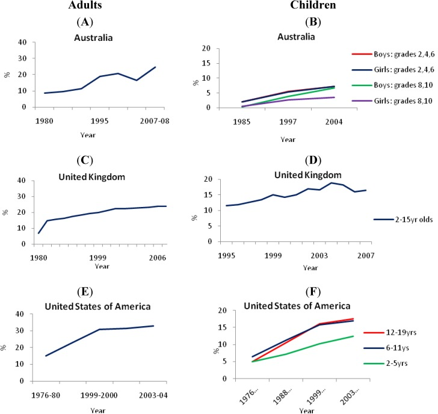
- 🖼 **Figure 2** — Intake of added sugars (kg/capita/year) in (A) Australia, (B) the United Kingdom and (C) the United States of America [25].
  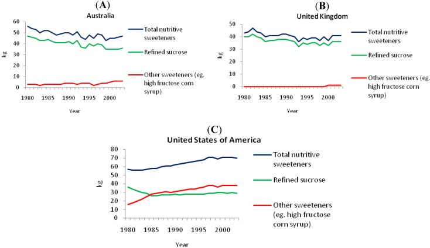
- 📊 **Figure 3** — 24 h mean intake (g) of total sugars, sugary products, confectionery and non-alcoholic beverages * by Australian adults (25-64 years) in 1983 and 1995 [19].
  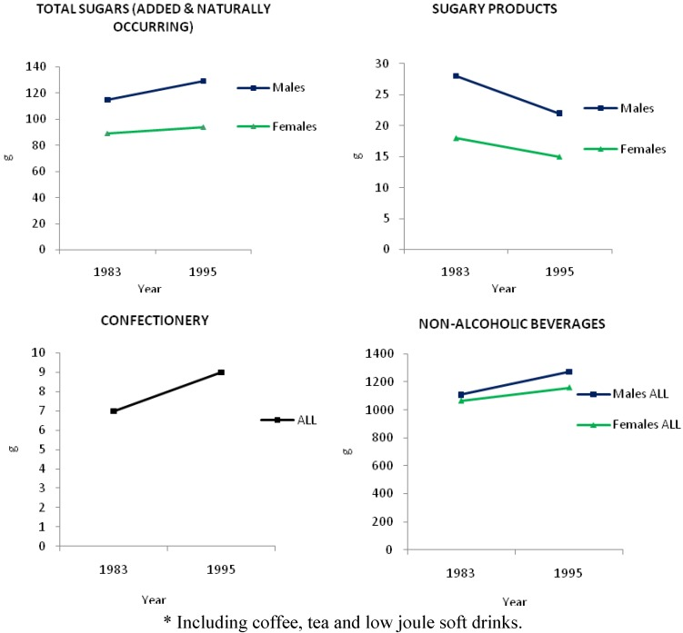
- 📊 **Figure 4** — 24 h mean intake (g) of total sugars, sugary products, confectionery and non-alcoholic beverages * by Australian children in 1985, 1995 and 2007 [5,19]. Note: the age categories used for comparison where 10-15 year old children in years 1985 and 1995, the 2007 figure is an average between intakes…
  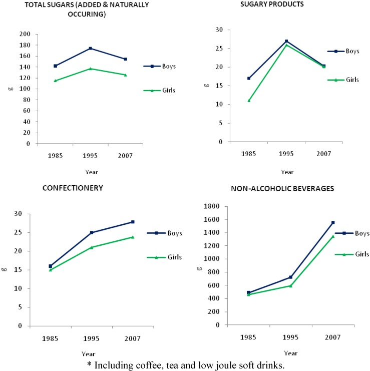
- 📊 **Figure 5** — Time trends in sales of nutritively sweetened beverages and non-nutritively sweetened beverages in grocery stores, expressed as (A) per capita volume sold in liters and as (B) a percentage of total volume sold [15,28,29,30].
  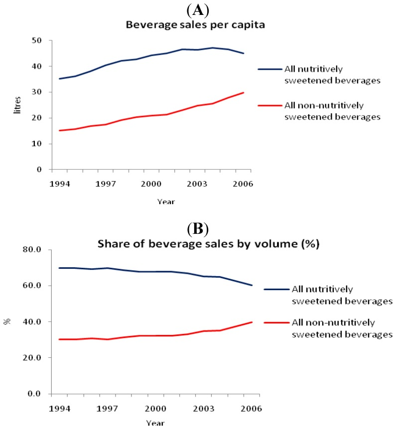
- 🖼 **Figure 6** — Annual change in contribution of nutritively-sweetened carbonated soft drinks to total added sugar in the Australian food supply [30].
  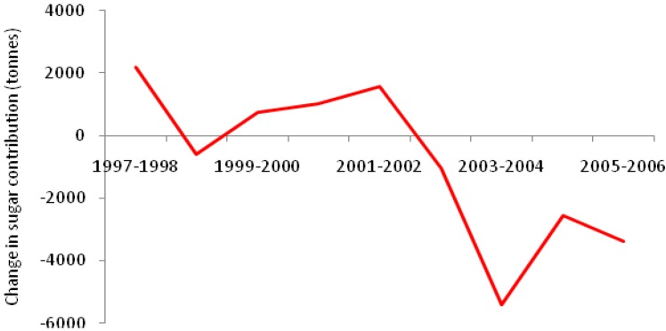
- 📊 **Figure 7** — (A) Percent consuming, (B) mean intakes and (C) median intakes of soft drinks, flavored waters and electrolyte drinks by children in 1995 and 2007, and (D) percentage of energy supplied by fruit juice in the diets of children [5,26].
  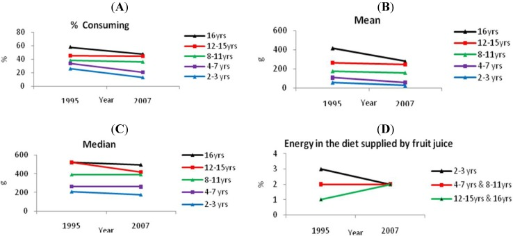

**Cozma AI, Sievenpiper JL, de Souza RJ, Chiavaroli L, Ha V, Wang DD, Mi 2012. *Effect of fructose on glycemic control in diabetes: a systematic review and meta-analysis of controlled feeding trials***  
[PMC3379616](https://pmc.ncbi.nlm.nih.gov/articles/PMC3379616/) · CC BY-NC-ND · **stored**

- 🗺 **Figure 1** — Flowchart of literature search for the effect of fructose on glycemic end points (fasting glucose, fasting insulin, and glycated blood proteins [HbA1c and glycated albumin]). Electronic searches of Cochrane Library, EMBASE and MEDLINE databases were supplemented by manual searches of the references…
  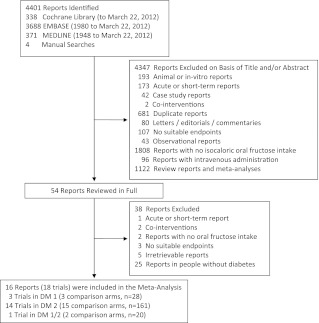
- 📊 **Figure 2** — Forest plot of controlled feeding trials investigating the effect of isocaloric exchange of fructose for other carbohydrate on (A) glycated blood proteins (HbA1c and glycated albumin), (B) fasting glucose, and (C) fasting insulin. Data are SMD for glycated blood proteins and MD for fasting glucose…
  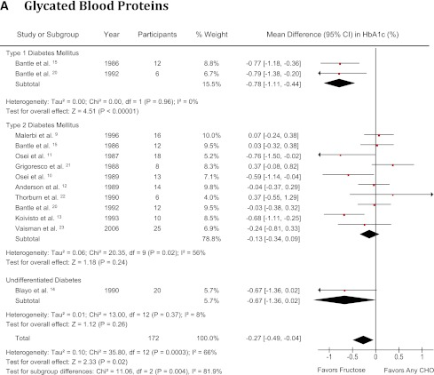

**Kaiser KA, Shikany JM, Keating KD, Allison DB. 2013. *Will reducing sugar-sweetened beverage consumption reduce obesity? Evidence supporting conjecture is strong, but evidence when testing effect is weak***  
[PMC3929296](https://pmc.ncbi.nlm.nih.gov/articles/PMC3929296/) · NIH manuscript — text mining/fair use only · link only

- 🖼 **Figure 1** — Rise in obesity rates (62) (round markers) and bottled water consumption (5) (square markers), United States.BMI = body mass index, kg/m2 ([view](https://pmc.ncbi.nlm.nih.gov/articles/PMC3929296/figure/F1/))
- 📊 **Figure 2** — Observed (30, 34, 40–42, 63) versus theoretical (64) weight gain effect of mandatory sugar-sweetened beverage (SSB) consumption.Notes: For observed values on the Y axis, weight change was determined by the change of those drinking more SSBs minus those drinking less. The X axis was determined by… ([view](https://pmc.ncbi.nlm.nih.gov/articles/PMC3929296/figure/F2/))
- 📊 **Figure 3** — Forest plot comparing studies of added sugar-sweetened beverage (SSB) consumption.Note: R square values were calculated from the overall standardized mean difference estimate (d) per the method found in (65). ([view](https://pmc.ncbi.nlm.nih.gov/articles/PMC3929296/figure/F3/))
- 📊 **Figure 4** — Forest plot comparing studies of reduced sugar-sweetened beverage (SSB) consumption; subjects in all weight categories included.Note: R square values were calculated from the overall standardized mean difference estimate (d) per the method found in (65). ([view](https://pmc.ncbi.nlm.nih.gov/articles/PMC3929296/figure/F4/))
- 📊 **Figure 5** — Forest plot comparing studies of reduced sugar sweetened beverage (SSB) consumption; only subjects overweight/obese at baseline included.Note: R square values were calculated from the overall standardized mean difference estimate (d) per the method found in (65). ([view](https://pmc.ncbi.nlm.nih.gov/articles/PMC3929296/figure/F5/))
- 📊 **Figure 6** — Comparison of weight gain attributed to consumption of sugar-sweetened beverages for one year from various sources.Note: For the Haub study, the weight change shown above is adjusted by subtracting the control group weight change.* Body Mass Index of 27.8 kg/m2 (NHANES 2010 50th percentile for both… ([view](https://pmc.ncbi.nlm.nih.gov/articles/PMC3929296/figure/F6/))

**Hall KD. 2018. *Did the Food Environment Cause the Obesity Epidemic?***  
[PMC5769871](https://pmc.ncbi.nlm.nih.gov/articles/PMC5769871/) · http://www.nature.com/authors/editorial_policies/license.html#terms · link only

- 🖼 **Figure 1** — A) Macronutrient proportions of the US food supply as determined by the United Nations Food and Agriculture (FAO) food balance sheets (http://www.fao.org/faostat/en/#data/FBS). B) Total per capita energy content and contributions of carbohydrate, fat, and protein in the US food supply as determined… ([view](https://pmc.ncbi.nlm.nih.gov/articles/PMC5769871/figure/F1/))

---

## [The Five Supplements Worth Taking: Doses, Timing and Evidence](supplements-that-work.md)

**Misner B. 2006. *Food alone may not provide sufficient micronutrients for preventing deficiency***  
[PMC2129155](https://pmc.ncbi.nlm.nih.gov/articles/PMC2129155/) · CC BY · **stored**

- 🖼 **Table 1** — Micronutrient Deficiency from Diets in 10 Men & 10 Women %
  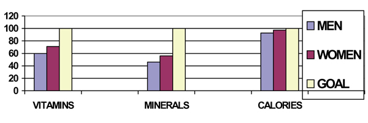

**Kanda A, Nakayama K, Sanbongi C, Nagata M, Ikegami S, Itoh H. 2016. *Effects of Whey, Caseinate, or Milk Protein Ingestion on Muscle Protein Synthesis after Exercise***  
[PMC4924180](https://pmc.ncbi.nlm.nih.gov/articles/PMC4924180/) · CC BY · **stored**

- 📊 **Figure 1** — (a) Fractional rates of protein synthesis (FSR) in rats administered test solutions with a different protein content. The values are expressed as means (n = 6~8), with the standard error shown as vertical bars. Significant time × treatment interactions (p < 0.001) were found. a, b, c Mean values…
  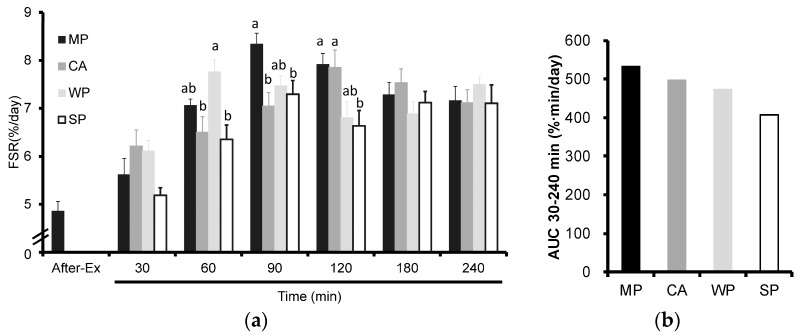
- 📊 **Figure 2** — Plasma insulin levels in rats administered test solutions with a different protein content. The values are expressed as mean ± standard error (n = 6~8). A significant time effect (p < 0.001) but no time × treatment interactions (p = 0.90) were observed. MP, milk protein concentrate; CA, caseinate;…
  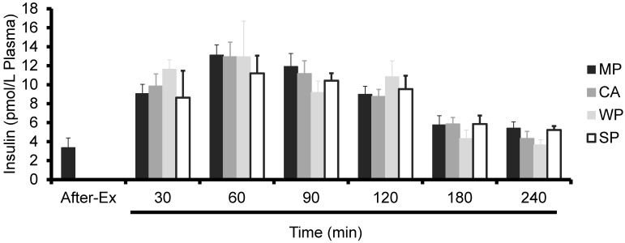
- 📊 **Figure 3** — Plasma leucine levels in rats administered test solutions with different protein content. Values are expressed as mean ± standard error (n = 6~8). Significant time × treatment interactions (p < 0.001) were observed. a, b, c Mean values with unlike letters are significantly different (p < 0.05;…
  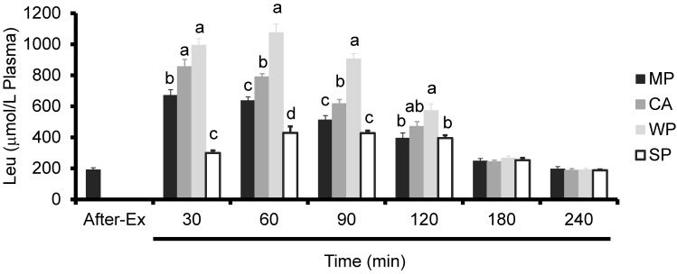
- 📊 **Figure 4** — Plasma BCAA levels in rats administered test solutions with different protein content. Values are expressed as mean ± standard error (n = 6~8). Significant time × treatment interactions (p < 0.001) were observed. a, b, c Mean values with unlike letters are significantly different (p < 0.05; Tukey’s…
  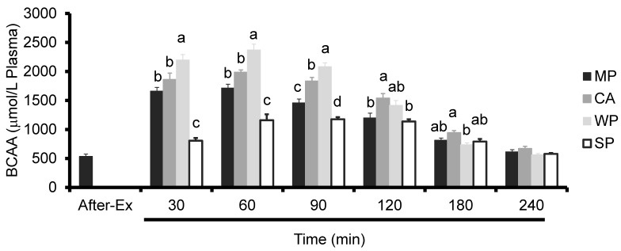
- 📊 **Figure 5** — Intramuscular leucine levels in rats administered test solutions with different protein content. Values are expressed as mean ± standard error (n = 6~8). Significant time × treatment interactions (p < 0.001) were observed. a, b, c Mean values with unlike letters are significantly different (p <…
  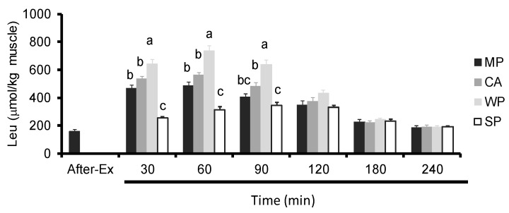
- 📊 **Figure 6** — Intramuscular BCAA levels in rats administered test solutions with different protein content. Values are expressed as mean ± standard error (n = 6~8). Significant time × treatment interactions (p < 0.001) were observed. a, b, c Mean values with unlike letters are significantly different (p < 0.05;…
  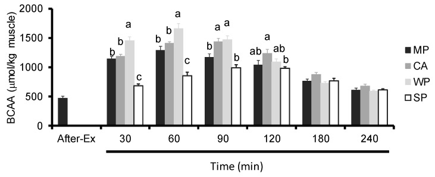
- 📊 **Figure 7** — Fractional rates of protein synthesis (FSR) following oral MP administration in rats. FSR was measured 60 min following administration of MP at doses ranging between 0 to 4.63 g protein/kg BW (100% = 3.09 g protein/kg BW). The values are expressed as means (n = 8~10), with the standard error shown…
  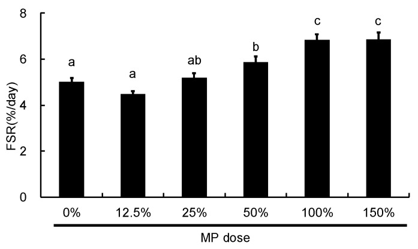
- 📊 **Figure 8** — Changes in (a) plasma Leu and (b) insulin following oral MP administration in rats. Plasma Leu and insulin were measured 60 min following administration of MP at doses ranging between 0 to 4.63 g protein/kg BW (100% = 3.09 g protein/kg BW). The values are expressed as means (n = 8~10), with the…
  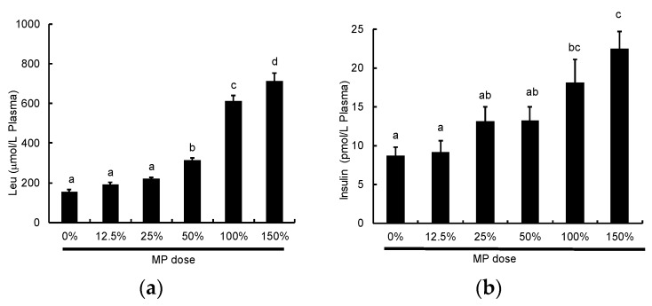
- 📊 **Figure 9** — Changes in (a) the phosphorylation state of Akt and (b) mTOR following oral MP administration in rats. Phosphorylation of Akt and mTOR was measured 60 min following administration of MP at doses ranging between 0 to 4.63 g protein/kg BW (100% = 3.09 g protein/kg BW). The values are expressed as…
  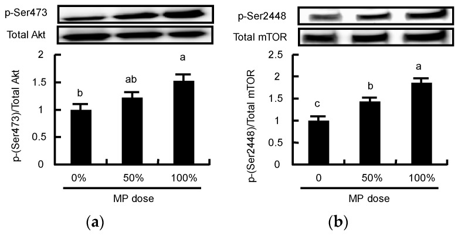

---

## [How Big Can You Get Naturally? FFMI, the Natty Limit, and Why 25 Isn't a Hard Wall](tell-if-someone-steroids.md)

**Trexler ET, Smith-Ryan AE, Blue MNM, Schumacher RM, Mayhew JL, Mann JB 2017. *Fat-Free Mass Index in NCAA Division I and II Collegiate American Football Players***  
[PMC5438288](https://pmc.ncbi.nlm.nih.gov/articles/PMC5438288/) · NIH manuscript — text mining/fair use only · link only

- 📊 **Figure 1** — (A) Raw FFMI values (kg·m−2) plotted against height. (B) FFMI values plotted against height, after using regression to adjust for height (FFMIAdj). (C) FFMI values plotted against height, after using previously published equation by Kouri et al. (20) to adjust for height (FFMIKE). Horizontal line… ([view](https://pmc.ncbi.nlm.nih.gov/articles/PMC5438288/figure/F1/))
- 📊 **Figure 2** — Differences between raw and height-adjusted FFMI values (kg·m−2) using the Kouri Equation (FFMIKE) versus linear regression (FFMIAdj). ([view](https://pmc.ncbi.nlm.nih.gov/articles/PMC5438288/figure/F2/))
- 📊 **Figure 3** — Percentile cutoffs for FFMIAdj values (kg·m−2). Individual points are plotted, with grayscale shading to indicate areas of high density (dark) and low density (light). ([view](https://pmc.ncbi.nlm.nih.gov/articles/PMC5438288/figure/F3/))
- 📊 **Figure 4** — Boxplots of FFMIAdj values (kg·m−2) by position in Division I football players (n=147). QB = quarterback; WR = wide receiver; RB = running back; TE = tight end; OL = offensive line; DL = defensive line; LB = linebacker; DB = defensive back; SP = special teams. ([view](https://pmc.ncbi.nlm.nih.gov/articles/PMC5438288/figure/F4/))

---

## [Training Arms for Growth: Biceps and Triceps Anatomy, Exercise Selection and Volume](train-arms-growth.md)

**Lehman GJ, MacMillan B, MacIntyre I, Chivers M, Fluter M. 2006. *Shoulder muscle EMG activity during push up variations on and off a Swiss ball***  
[PMC1508143](https://pmc.ncbi.nlm.nih.gov/articles/PMC1508143/) · CC BY · **stored**

- 🖼 **Figure 1** — EMG linear envelopes during a push ups with the hands on an exercise bench and a Swiss ball. EMG activity is non-normalized and is therefore in arbitrary EMG units. A bias was added to the activity of the pectoralis major, rectus abdominis and external oblique for ease of viewing to prevent overlap…
  
- 🖼 **Figure 2** — Raw EMG during three push ups with the hands on an exercise bench or a swiss ball for the triceps and pectoralis major muscle. PMBench = Pectoralis Major EMG on bench, PMBall = Pectoralis Major EMG on ball. Bias added to triceps activity for ease of viewing. Trial was 30 seconds in length.
  
- 🖼 **Figure 3** — Raw EMG for Rectus Abdominis and External Oblique muscles during three push ups with the hands on or off a Swiss ball. EO = External Oblique, RA = Rectus Abdominis.
  

---

## [Minimalist Training: The Least You Can Do and Still Grow](train-like-minimalist.md)

**Ralston GW, Kilgore L, Wyatt FB, Baker JS. 2017. *The Effect of Weekly Set Volume on Strength Gain: A Meta-Analysis***  
[PMC5684266](https://pmc.ncbi.nlm.nih.gov/articles/PMC5684266/) · CC BY · **stored**

- 🖼 **Fig. 1** — Flow of journal articles through the systematic review process
  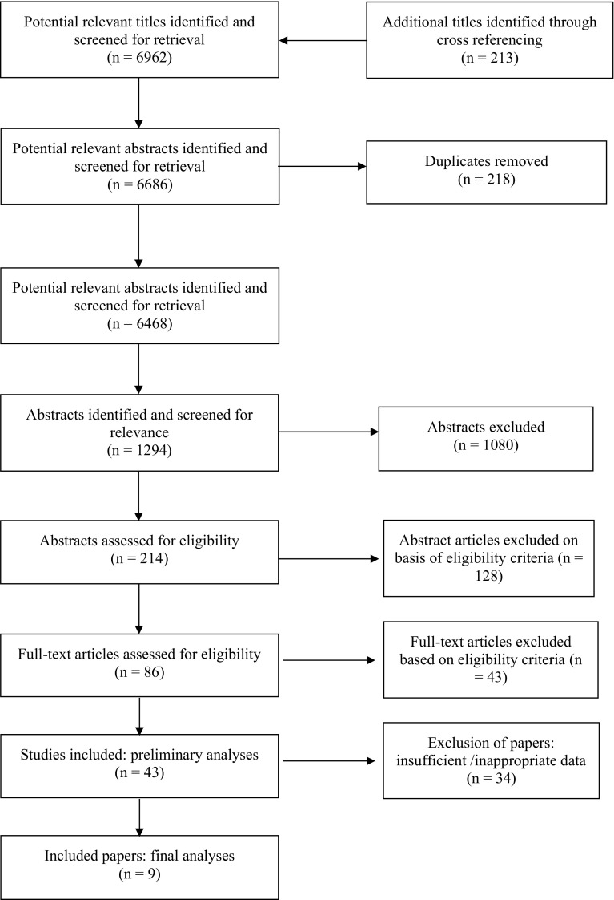
- 📊 **Fig. 2** — Galbraith plot used to examine study heterogeneity (pre- vs post-intervention strength change). Each open circle represents one pre- vs post-intervention study datum. Two pre- vs post-intervention study data of Reid [24] identified as outliers (solid filled black circles)
  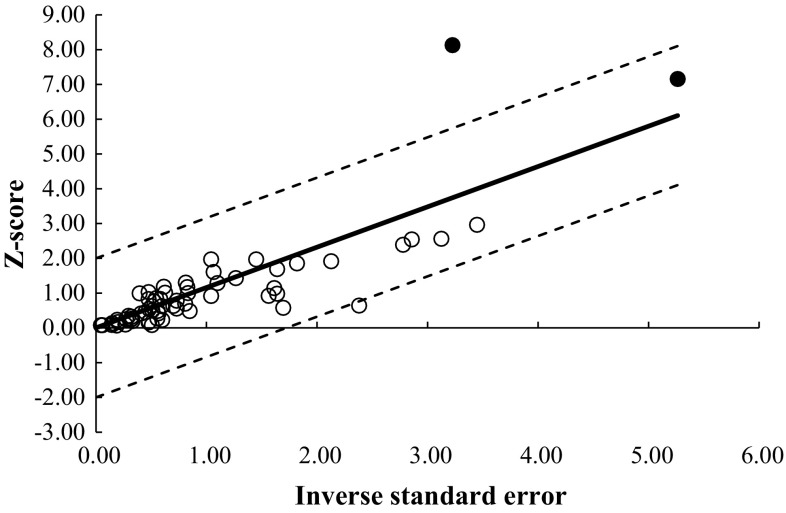
- 📊 **Fig. 3** — Galbraith plot with the removal of two pre- vs post-intervention study outliers (Reid [24]). Each open circle represents one pre- vs post-intervention study datum
  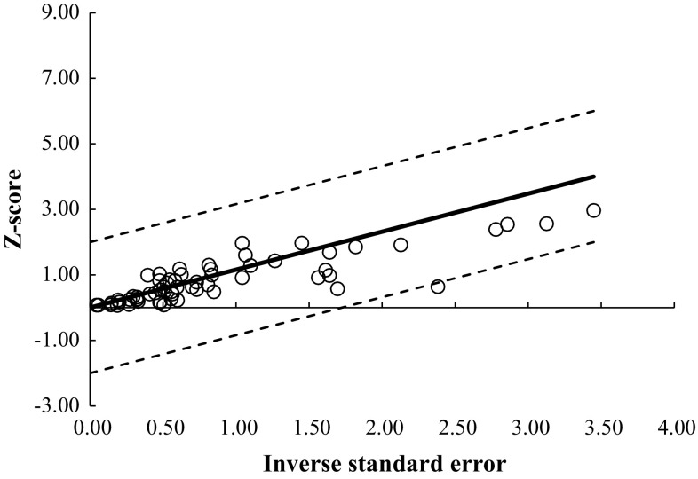
- 📊 **Fig. 4** — Funnel plot of standard error (SE) by mean difference (MD) for assessment of publication bias. Each open circle denotes a study included in the meta-analysis. The dashed vertical line represents the overall effect calculated with the random-effects model
  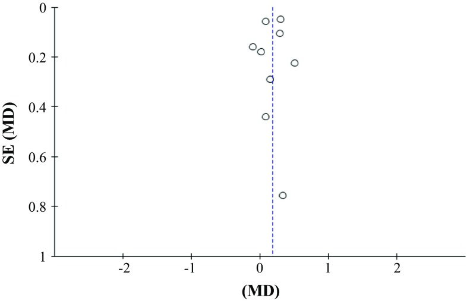
- 📊 **Fig. 5** — Forest plot of LWS vs HWS (MWS and HWS combined) on multi-joint and isolation exercise by study. The vertical line indicates the overall estimate of combined multi-joint and isolation studies mean effect size. The horizontal line indicates 95% CI, squares indicate estimates, whereas square size is…
  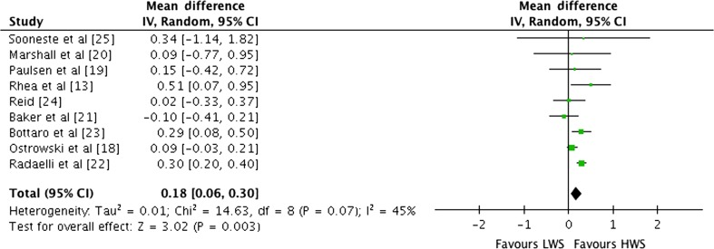
- 📊 **Fig. 6** — Forest plot of LWS vs MWS on multi-joint and isolation exercise by study. The vertical line indicates the overall estimate of combined multi-joint and isolation studies mean effect size. The horizontal line indicates 95% CI, squares indicate estimates, whereas square size is proportional to sample…
  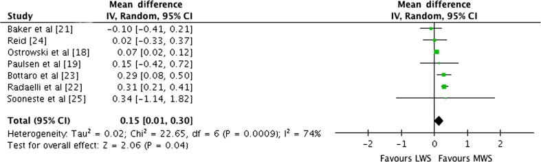
- 📊 **Fig. 7** — Forest plot of LWS vs HWS (MWS and HWS combined) on multi-joint exercises by study. The vertical dashed line indicates the overall estimate of multi-joint studies mean effect size. Horizontal lines indicate 95% CI, squares indicate estimates, whereas square size is proportional to sample size, and…
  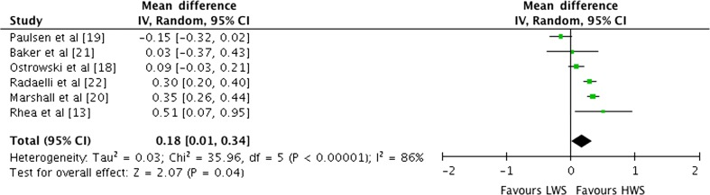
- 📊 **Fig. 8** — Forest plot of LWS vs MWS on isolation exercises by study. The vertical dashed line indicates the overall estimate of isolation studies mean effect size. Horizontal lines indicate 95% CI, squares indicate estimates, whereas square size is proportional to sample size, and rhombus indicates…
  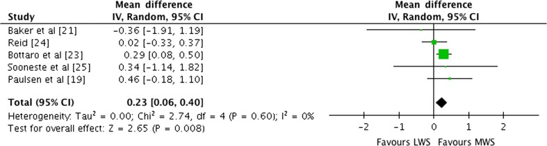
- 📊 **Fig. 9** — Forest plot of LWS vs HWS (MWS and HWS combined) on multi-joint and isolation exercise-specific 1RM by study. The vertical dashed line indicates the overall estimate of combined multi-joint and isolation studies mean effect size. Horizontal lines indicate 95% CI, squares indicate estimates, whereas…
  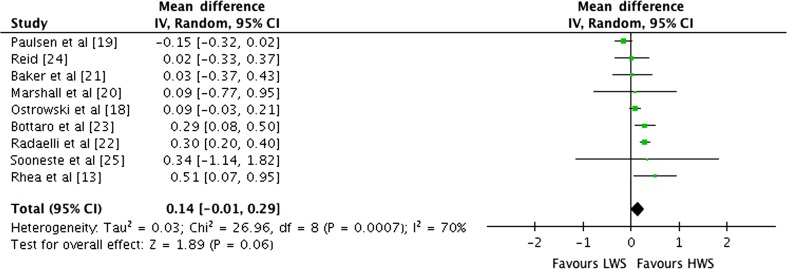

**Momma H, Kawakami R, Honda T, Sawada SS. 2022. *Muscle-strengthening activities are associated with lower risk and mortality in major non-communicable diseases: a systematic review and meta-analysis of cohort studies***  
[PMC9209691](https://pmc.ncbi.nlm.nih.gov/articles/PMC9209691/) · CC BY · **stored**

- 🗺 **Figure 1** — Flowchart of the selection of studies included in the meta-analysis.
  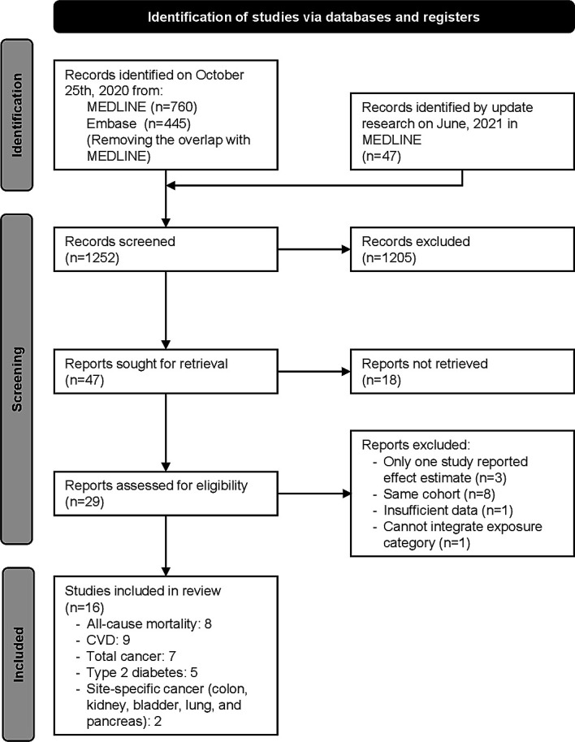
- 📊 **Figure 2** — Two-group meta-analysis of the associations between no versus any muscle-strengthening activities and all-cause mortality, cardiovascular disease (CVD), total cancer and diabetes. RR, relative risk.
  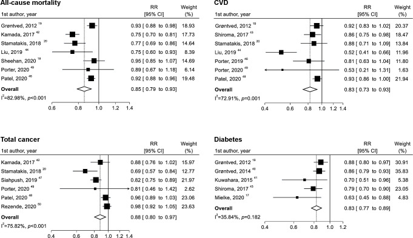
- 🖼 **Figure 3** — Linear dose–response meta-analysis of the associations between muscle-strengthening activities (per 10 min/week increase) and all-cause mortality, cardiovascular disease (CVD), total cancer and diabetes. RR, relative risk.
  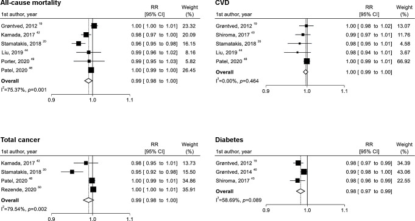
- 📊 **Figure 4** — Non-linear dose–response meta-analysis of the associations between muscle-strengthening activities and all-cause mortality, cardiovascular disease (CVD), total cancer and diabetes. Muscle-strengthening activities were modelled with restricted cubic splines in a random-effects dose–response model.…
  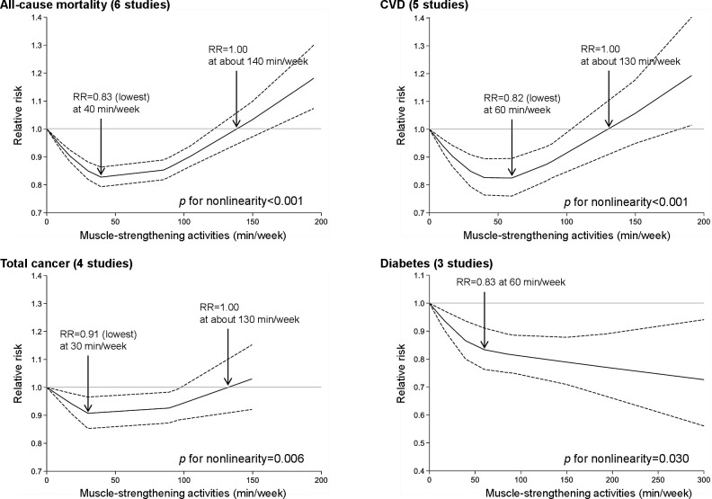
- 🖼 **Figure 5** — Meta-analysis of the joint associations of muscle-strengthening and aerobic activities with all-cause mortality, cardiovascular disease (CVD) mortality, total cancer mortality and colon cancer incidence. The definitions of groups for muscle-strengthening and aerobic activities were based on the…
  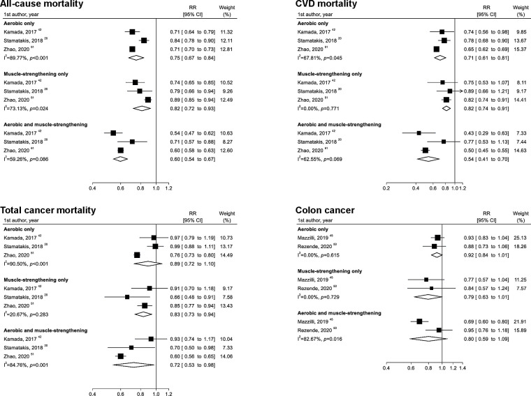

---

## [Five Principles for Training Purely for Muscle Growth](train-pure-muscle-growth.md)

**Earp JE, Angelino D, Hatfield DL, Colantuono V, Jackson ER, Morgan KD, 2023. *Differing hypertrophy patterns from open and closed kinetic chain training affect quadriceps femoris center of mass and moment of inertia***  
[PMC10043166](https://pmc.ncbi.nlm.nih.gov/articles/PMC10043166/) · CC BY · **stored**

- 🖼 **FIGURE 1** — A representative subject MRI results. Figure reports the measurements of each component of the quadriceps femoris at 33% (Proximal), 50% (Middle) and 67% (Distal) of the distance from the femoral head to the tibial tuberosity. Images are before (Pre) and after (Post) 8 weeks of closed kinetic chain…
  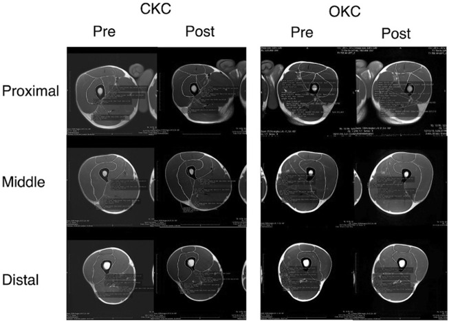
- 📊 **FIGURE 2** — Group average (n = 12) changes in quadriceps femoris volume (VOLQF) in response to 8 weeks of open (OKC) and closed-kinetic chain (CKC) exercise. Mean and standard deviation are reported. *significant differences (p ≤ 0.05) between interventions over time (interaction effect). #significant…
  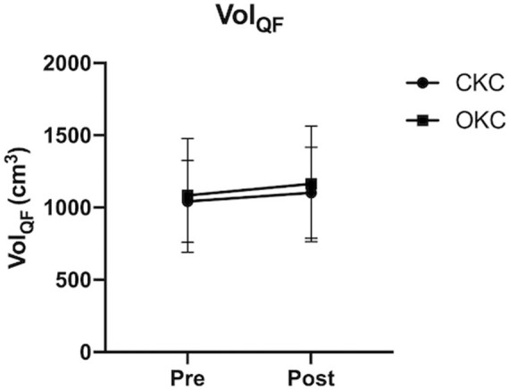
- 📊 **FIGURE 3** — Grouped (left) and individual (right) changes in quadriceps femoris center of mass location (CoMQF: top) and moment of inertia (IQF: bottom) relative to the hip, in response to 8 weeks of open (OKC) and closed-kinetic chain (CKC) exercise. Mean and standard deviation are reported with significant…
  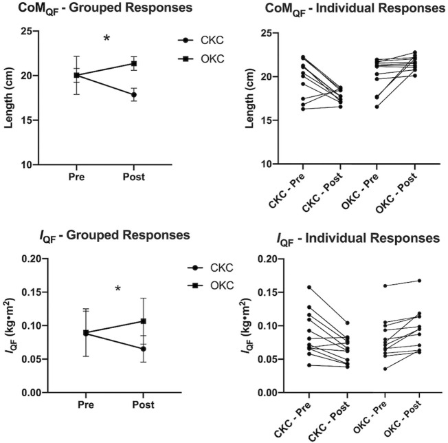
- 📊 **FIGURE 4** — Group average (n = 12) changes in deoxygenated (HHb) and oxygenated (HbO2) hemoglobin concentration and in tissue oxygenation saturation (StO2), during open-kinetic chain (OKC) and closed-kinetic chain (CKC) training sessions. * Mean and standard measurement error are reported with significant…
  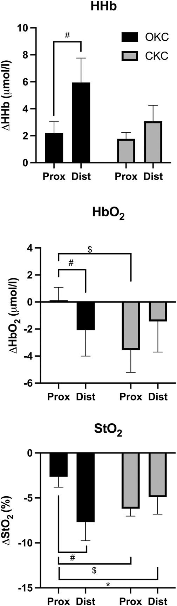
- 📊 **FIGURE 5** — Predictive value of regional differences in near-infrared spectroscopy measures [deoxygenated (HHb) and oxygenated (HbO2)] within a single bout of open (OKC) and closed-kinetic chain exercise (CKC) exercise in vastus lateralis on changes in quadriceps femoris center of mass (CoMQF) and moment of…
  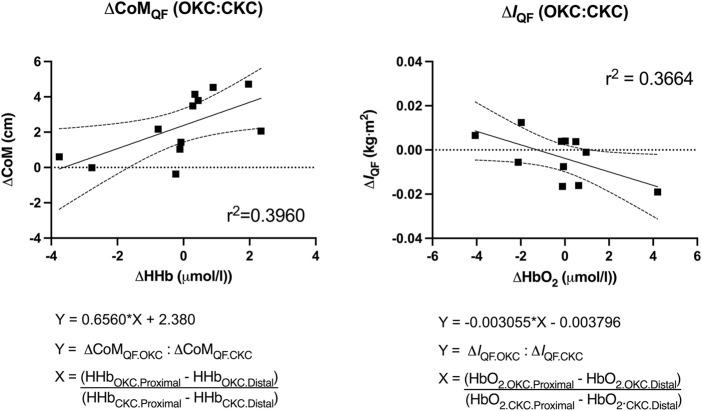

**Haugen ME, Vårvik FT, Larsen S, Haugen AS, van den Tillaar R, Bjørnsen 2023. *Effect of free-weight vs. machine-based strength training on maximal strength, hypertrophy and jump performance - a systematic review and meta-analysis***  
[PMC10426227](https://pmc.ncbi.nlm.nih.gov/articles/PMC10426227/) · CC BY · **stored**

- 🗺 **Fig. 1** — Flow chart of the PRISMA process showing the number of records collected, number of articles screened, number of articles excluded with reason, and the final number of articles included in the analysis
  
- 📊 **Fig. 2** — Forest-plot which shows the effect size changes when both groups tested machines (A), and when both groups tested free-weights (B)
  
- 📊 **Fig. 3** — Forest-plot that shows the effect of free-weight training on changes in free-weight strength, versus machine-based training on the changes in machine-based strength (direct-strength-comparison-analysis), in maximal dynamic strength (A), maximal dynamic strength in the upper-body (B), maximal…
  
- 📊 **Fig. 4** — Forest-plot which shows the effect size changes in countermovement jump (A), isometric strength (B), and hypertrophy (C)
  
- 📊 **Fig. 5** — Shows the effect sizes (mean ± SD) of changes from pre-test to post-test in maximal strength (A), hypertrophy (B), vertical jump height (C) and isometric strength (D). Black are changes in free-weight when participants trained with free-weights and grey are changes in machine groups when…
  

---

## [Should You Train When Sick?](train-when-sick.md)

**Cooper K, Martyn-St James M, Kaltenthaler E, Dickinson K, Cantrell A, 2015. *Behavioral Therapies for Management of Premature Ejaculation: A Systematic Review***  
[PMC4599555](https://pmc.ncbi.nlm.nih.gov/articles/PMC4599555/) · CC BY-NC · **stored**

- 📊 **Figure 1** — Behavioral therapies vs. waitlist: IELT and ejaculatory latency
  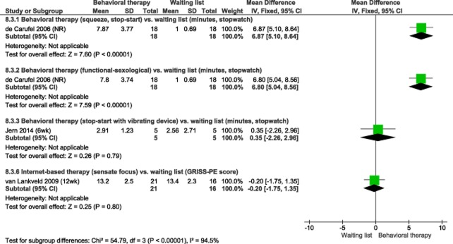
- 📊 **Figure 2** — Behavioral plus drug therapy vs. drug alone: IELT and ejaculatory latency
  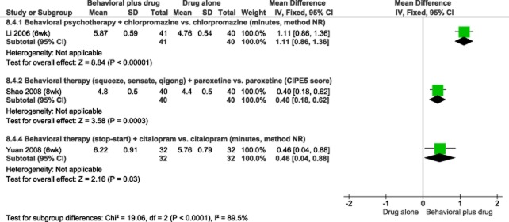
- 📊 **Figure 3** — Behavioral therapy vs. drug treatment: IELT and ejaculatory latency
  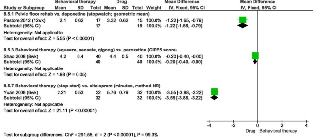

---

## [The Real Cost of Staying Shredded, and Why to Aim for the Bottom of Your Range](ugly-truth-about-getting-shredded.md)

**Halliday TM, Loenneke JP, Davy BM. 2016. *Dietary Intake, Body Composition, and Menstrual Cycle Changes during Competition Preparation and Recovery in a Drug-Free Figure Competitor: A Case Study***  
[PMC5133123](https://pmc.ncbi.nlm.nih.gov/articles/PMC5133123/) · CC BY · **stored**

- 🗺 **Figure 1** — Timeline of Study Measurements (A) PREP and (B) REC phases. PREP: Competition preparation; REC: Competition recovery; DXA: Dual-energy X-ray absorptiometry; SF: Skinfolds.
  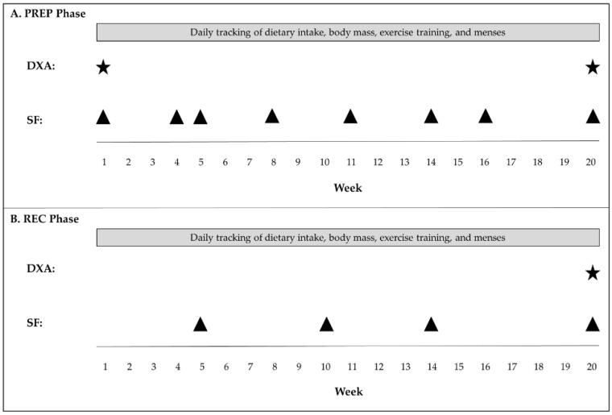
- 🖼 **Figure 2** — Changes in Energy Intake and Body Mass during Competition Preparation and Recovery. PREP: Competition preparation; REC: Competition recovery.
  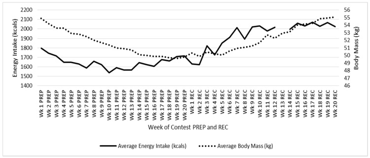
- 🖼 **Figure 3** — Total and Site-Specific Skinfold Thickness Changes. Wk: Week; PREP: Competition Preparation; REC: Competition recovery.
  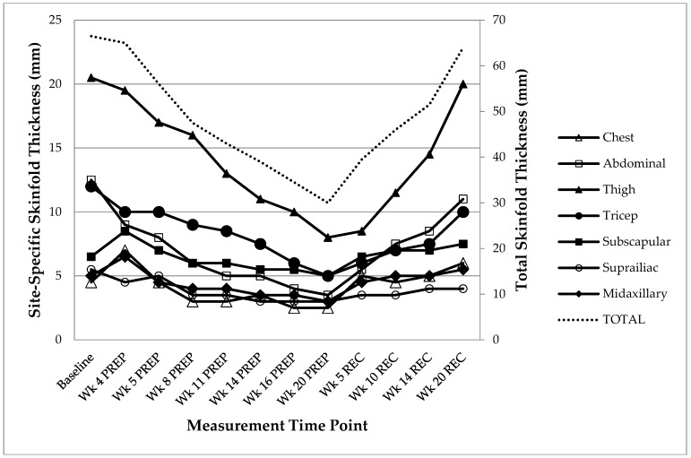

**Hulmi JJ, Isola V, Suonpää M, Järvinen NJ, Kokkonen M, Wennerström A, 2016. *The Effects of Intensive Weight Reduction on Body Composition and Serum Hormones in Female Fitness Competitors***  
[PMC5222856](https://pmc.ncbi.nlm.nih.gov/articles/PMC5222856/) · CC BY · **stored**

- 🖼 **Figure 1** — (A) The experimental design of the study. Two representative participants are shown from each group. The pre to mid time period lasted ~20 weeks during which the participants decreased their energy intake and the amount of exercise (see the Results Section), whereas the controls maintained their…
  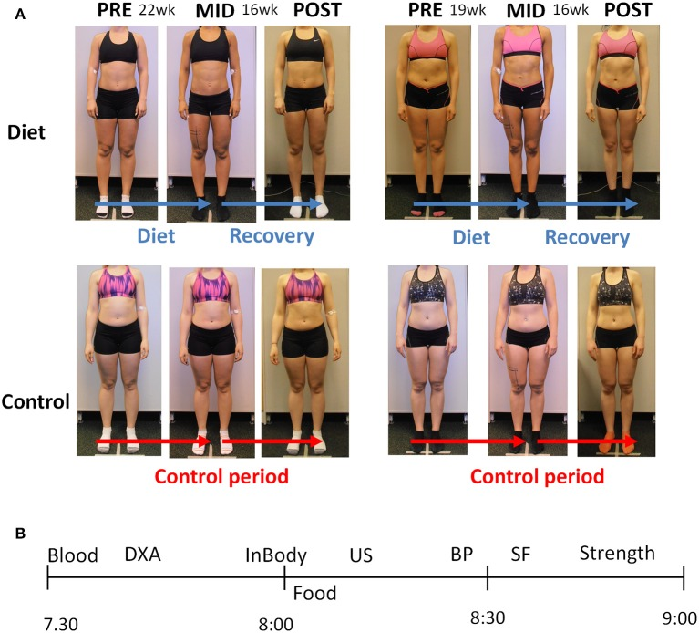
- 📊 **Figure 2** — (A,B) Subcutaneous fat thickness around Vastus lateralis (VL) and triceps brachii muscles (n = 25–27 diet and 19–20 control participants). (C,D) VL muscle cross-sectional area (CSA) and triceps brachii muscle thickness (n = 27 diet and 20 control participants). (E) Individual fat and lean mass…
  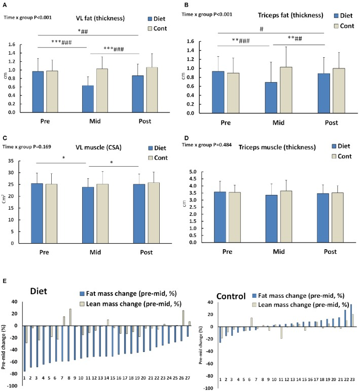
- 📊 **Figure 3** — Serum hormone concentrations at baseline (Pre), after the diet/control period (Mid) and after that during the recovery period (Post). Out of individual panels, (A) depicts leptin, (B) testosterone, (C) estradiol, (D) free T3, (E) free T4, (F) TSH, and (G) cortisol. n = 27 diet and 23 control…
  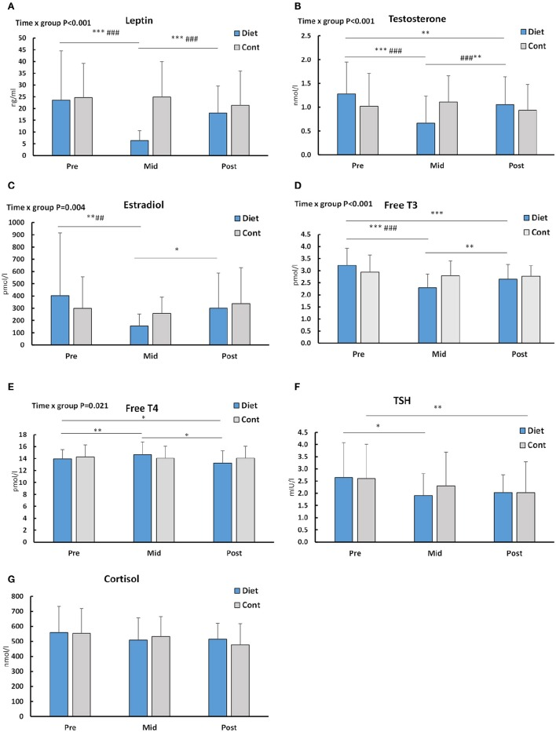
- 📊 **Figure 4** — Individual free T3 at pre, mid, and post time-points for diet and control participants. Number at the x-axis depicts participant numbers ordered based on the pre-value. The red dotted lines limit the reference values in normal-weight healthy females. n = 27 diet and 23 control participants.
  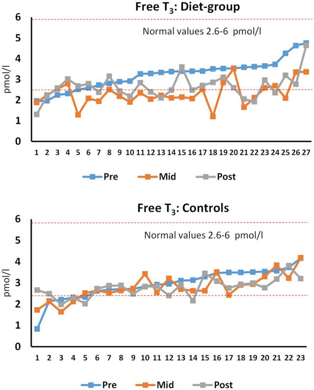

---

## [The Deck Of Cards Home Workout: Randomised 20-Minute No-Equipment Training](ultimate-20-min-home-workout-build-muscle.md)

**Baz-Valle E, Schoenfeld BJ, Torres-Unda J, Santos-Concejero J, Balsalo 2019. *The effects of exercise variation in muscle thickness, maximal strength and motivation in resistance trained men***  
[PMC6934277](https://pmc.ncbi.nlm.nih.gov/articles/PMC6934277/) · CC BY · **stored**

- 🖼 **Fig 1** — Pre and post intervention scores in muscle thickness for the EXP and CON groups.
  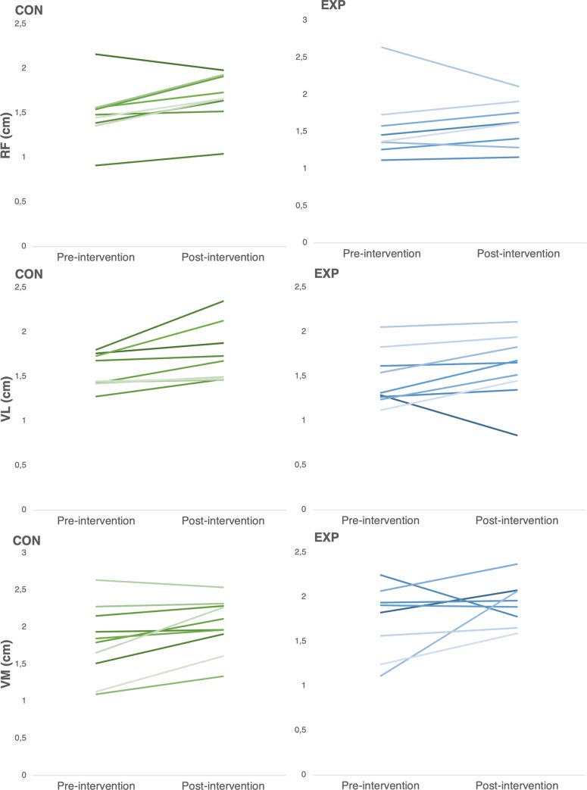

---

## [Ultimate Science-Based Leg Day (PPL Series): Full Session Breakdown](ultimate-leg-day-muscle-growth.md)

**Maeo S, Huang M, Wu Y, Sakurai H, Kusagawa Y, Sugiyama T, Kanehisa H, 2021. *Greater Hamstrings Muscle Hypertrophy but Similar Damage Protection after Training at Long versus Short Muscle Lengths***  
[PMC7969179](https://pmc.ncbi.nlm.nih.gov/articles/PMC7969179/) · CC BY-NC-ND · **stored**

- 📊 **FIGURE 1** — Operating ranges of each hamstring muscle on the normalized force–length curve during the seated and prone knee flexion (leg curl) exercise. These were calculated using the OpenSim Lower Limb model (8,9), with the hip joint angle at 90° and 30° for the seated and prone conditions, respectively, and…
  
- 🗺 **FIGURE 2** — Flow diagram and demographic information of participants.
  
- 🖼 **FIGURE 3** — Example images for the T1-weighted MRI scans (for Seated-Leg in part 1) and T2-weighted MRI scans (for Control-Leg in part 2) at 50% of the thigh length, and a coronal localizer image. The images shown here are all for the right leg, but both legs were scanned in both part 1 and part 2.
  
- 📊 **FIGURE 4** — Changes in muscle volume for Seated-Leg and Prone-Leg after training. Data are plotted as individual raw change (Δ) values from baseline (small dots), with a group mean (larger dots) and its 95% CI (indicated by the ends of the vertical error bars) shown together. The CI and the bootstrap sampling…
  
- 📊 **FIGURE 5** — Changes in ACSA of the BFL and ST at 30% (BFLProximal, STProximal) and 70% (BFLDistal, STDistal) of the thigh length for Seated-Leg and Prone-Leg after training. Data are plotted as individual raw change (Δ) values from baseline (small dots), with a group mean (larger dots) and its 95% CI…
  
- 📊 **FIGURE 6** — Changes in T2 of each hamstring muscle at 50% of the thigh length (BFLMiddle, STMiddle, SMMiddle, BFSMiddle) at 72 h after eccentric exercise for Seated-Leg, Prone-Leg, and Control-Leg. Data are plotted as individual raw change (Δ) values from baseline (small dots), with a group mean (larger dots)…
  
- 📊 **FIGURE 7** — Changes in T2 of the BFL and ST at 30% (BFLProximal, STProximal) and 70% (BFLDistal, STDistal) of the thigh length at 72 h after eccentric exercise for Seated-Leg, Prone-Leg, and Control-Leg. Data are plotted as individual raw change (Δ) values from baseline (small dots), with a group mean (larger…
  
- 📊 **FIGURE 8** — Changes in the seated and prone leg curl 1RM at 24, 48, and 72 h after eccentric exercise for Seated-Leg, Prone-Leg, and Control-Leg. Data are plotted as individual raw change (Δ) values from baseline (small dots), with a group mean (larger dots) and its 95% CI (indicated by the ends of the…
  

---

## [Ultimate Pull Workout for Back, Biceps and Rear Delts](ultimate-pull-workout-muscle-growth.md)

**Sato S, Yoshida R, Kiyono R, Yahata K, Yasaka K, Nunes JP, Nosaka K, N 2021. *Elbow Joint Angles in Elbow Flexor Unilateral Resistance Exercise Training Determine Its Effects on Muscle Strength and Thickness of Trained and Non-trained Arms***  
[PMC8489980](https://pmc.ncbi.nlm.nih.gov/articles/PMC8489980/) · CC BY · **stored**

- 📊 **FIGURE 1** — Changes (mean ± SD, individuals) in average maximum voluntary isometric contraction torque of four different angles (MVC-ISOave), concentric contraction torque at two different velocities (MVC-CONave), eccentric contraction (MVC-ECC) torque, and muscle thickness at three positions (MTave) before…
  

---

## [Sugar Follow-Up: Insulin, Addiction, Insulin Sensitivity and Fructose](was-wrong-about-sugar-insulin-addiction-fructose.md)

**Glendinning JI, Gillman J, Zamer H, Margolskee RF, Sclafani A. 2012. *The role of T1r3 and Trpm5 in carbohydrate-induced obesity in mice***  
[PMC3409339](https://pmc.ncbi.nlm.nih.gov/articles/PMC3409339/) · NIH manuscript — text mining/fair use only · link only

- 📊 **Figure 1** — Preferences of WT, Tas1r3 KO and Trpm5 KO mice for (A) 34.2% sucrose or (B) 34.2% Polycose over water during the initial 4 days of Experiment 1. The dashed line in each panel indicates 50% preference (i.e., when the mouse consumed equal quantities of the carbohydrate solution and water). We present… ([view](https://pmc.ncbi.nlm.nih.gov/articles/PMC3409339/figure/F1/))
- 📊 **Figure 2** — Comparison of how the WT (left column of panels), Tas1r3 KO (middle column of panels) and Trpm5 KO (right column of panels) mice responded to the Control (Con), Sucrose (Suc) and Polycose (Poly) diets in Experiment 1. The composition of each diet was as follows: Con (chow and water), Suc (chow,… ([view](https://pmc.ncbi.nlm.nih.gov/articles/PMC3409339/figure/F2/))
- 📊 **Figure 3** — Comparison of how the WT (left column of panels) and Tas1r3 KO (right column of panels) mice responded to the IL (chow, water and a 1% IL solution) and Suc+IL (chow, water, and a 1% IL + 34.2% sucrose solution) diets in Experiment 2. In A, we show daily caloric intake and weight gain, both of which… ([view](https://pmc.ncbi.nlm.nih.gov/articles/PMC3409339/figure/F3/))

---

## [Weight Training Does Not Stunt Growth in Kids and Teens](weight-training-stunt-growth.md)

**Faigenbaum AD, Myer GD. 2010. *Resistance training among young athletes: safety, efficacy and injury prevention effects***  
[PMC3483033](https://pmc.ncbi.nlm.nih.gov/articles/PMC3483033/) · NIH manuscript — text mining/fair use only · link only

- 🖼 **Figure 1** — Reported high school “weightlifting” (ie, resistance training) participants after the induction of Title IX (school years 1973–2005) based on the participation estimates from the High School Athletics Participation Survey conducted by the National Federation of State High School Associations.… ([view](https://pmc.ncbi.nlm.nih.gov/articles/PMC3483033/figure/F1/))
- 🖼 **Figure 2** — Estimated number of “weightlifting” (ie, resistance training) injuries presenting in US emergency rooms between the years 2002 and 2005. Reprinted from Myer et al.24 Reproduced by permission of the National Strength and Conditioning Association, Colorado Springs, Colorado, USA. ([view](https://pmc.ncbi.nlm.nih.gov/articles/PMC3483033/figure/F2/))
- 🖼 **Figure 3** — Percentage of injuries of the oldest and youngest age categories. Note that the small prevalence of leg injuries in the 8–13 years age categories provides invalidated results and should be interpreted with caution. Reprinted from Myer et al.24 Reproduced by permission of the National Strength and… ([view](https://pmc.ncbi.nlm.nih.gov/articles/PMC3483033/figure/F3/))

---

## [Long-Length Partials: The Best-Supported Intensity Technique](world-s-smartest-muscle-building-technique.md)

**Maeo S, Huang M, Wu Y, Sakurai H, Kusagawa Y, Sugiyama T, Kanehisa H, 2021. *Greater Hamstrings Muscle Hypertrophy but Similar Damage Protection after Training at Long versus Short Muscle Lengths***  
[PMC7969179](https://pmc.ncbi.nlm.nih.gov/articles/PMC7969179/) · CC BY-NC-ND · **stored**

- 📊 **FIGURE 1** — Operating ranges of each hamstring muscle on the normalized force–length curve during the seated and prone knee flexion (leg curl) exercise. These were calculated using the OpenSim Lower Limb model (8,9), with the hip joint angle at 90° and 30° for the seated and prone conditions, respectively, and…
  
- 🗺 **FIGURE 2** — Flow diagram and demographic information of participants.
  
- 🖼 **FIGURE 3** — Example images for the T1-weighted MRI scans (for Seated-Leg in part 1) and T2-weighted MRI scans (for Control-Leg in part 2) at 50% of the thigh length, and a coronal localizer image. The images shown here are all for the right leg, but both legs were scanned in both part 1 and part 2.
  
- 📊 **FIGURE 4** — Changes in muscle volume for Seated-Leg and Prone-Leg after training. Data are plotted as individual raw change (Δ) values from baseline (small dots), with a group mean (larger dots) and its 95% CI (indicated by the ends of the vertical error bars) shown together. The CI and the bootstrap sampling…
  
- 📊 **FIGURE 5** — Changes in ACSA of the BFL and ST at 30% (BFLProximal, STProximal) and 70% (BFLDistal, STDistal) of the thigh length for Seated-Leg and Prone-Leg after training. Data are plotted as individual raw change (Δ) values from baseline (small dots), with a group mean (larger dots) and its 95% CI…
  
- 📊 **FIGURE 6** — Changes in T2 of each hamstring muscle at 50% of the thigh length (BFLMiddle, STMiddle, SMMiddle, BFSMiddle) at 72 h after eccentric exercise for Seated-Leg, Prone-Leg, and Control-Leg. Data are plotted as individual raw change (Δ) values from baseline (small dots), with a group mean (larger dots)…
  
- 📊 **FIGURE 7** — Changes in T2 of the BFL and ST at 30% (BFLProximal, STProximal) and 70% (BFLDistal, STDistal) of the thigh length at 72 h after eccentric exercise for Seated-Leg, Prone-Leg, and Control-Leg. Data are plotted as individual raw change (Δ) values from baseline (small dots), with a group mean (larger…
  
- 📊 **FIGURE 8** — Changes in the seated and prone leg curl 1RM at 24, 48, and 72 h after eccentric exercise for Seated-Leg, Prone-Leg, and Control-Leg. Data are plotted as individual raw change (Δ) values from baseline (small dots), with a group mean (larger dots) and its 95% CI (indicated by the ends of the…
  

**Sato S, Yoshida R, Kiyono R, Yahata K, Yasaka K, Nunes JP, Nosaka K, N 2021. *Elbow Joint Angles in Elbow Flexor Unilateral Resistance Exercise Training Determine Its Effects on Muscle Strength and Thickness of Trained and Non-trained Arms***  
[PMC8489980](https://pmc.ncbi.nlm.nih.gov/articles/PMC8489980/) · CC BY · **stored**

- 📊 **FIGURE 1** — Changes (mean ± SD, individuals) in average maximum voluntary isometric contraction torque of four different angles (MVC-ISOave), concentric contraction torque at two different velocities (MVC-CONave), eccentric contraction (MVC-ECC) torque, and muscle thickness at three positions (MTave) before…
  

**Pedrosa GF, Simões MG, Figueiredo MOC, Lacerda LT, Schoenfeld BJ, Lima 2023. *Training in the Initial Range of Motion Promotes Greater Muscle Adaptations Than at Final in the Arm Curl***  
[PMC9960616](https://pmc.ncbi.nlm.nih.gov/articles/PMC9960616/) · CC BY · **stored**

- 🗺 **Figure 1** — Training protocols range of motion. (A1,A2) = starting and finishing the concentric action of INITIALROM protocol (0°–68° of elbow flexion), respectively. (B1,B2) = starting and finishing the concentric action of FINALROM protocol (68°–135° of elbow flexion), respectively.
  
- 🗺 **Figure 2** — The paired mean difference for cross-sectional area in INITIALROM and FINALROM at (a) 50% humeral length; (b) 70% humeral length; and (c) summed values of 50% and 70% humeral length [30]. The raw data are plotted on the upper axes; each paired set of observations is connected by a line. On the…
  
- 🗺 **Figure 3** — The paired mean difference for 1 repetition maximum in INITIALROM and FINALROM [30]. The raw data are plotted on the upper axes; each paired set of observations is connected by a line. On the lower axes, each paired mean difference is plotted as a bootstrap sampling distribution. Mean differences…
  

---

## [The Four Worst Nutrition Mistakes Lifters Make](worst-nutrition-mistakes-every-lifter-makes.md)

**Phillips SM. 2014. *A brief review of critical processes in exercise-induced muscular hypertrophy***  
[PMC4008813](https://pmc.ncbi.nlm.nih.gov/articles/PMC4008813/) · CC BY · **stored**

- 🖼 **Fig. 1** — Resistance exercise stimulates a prolonged elevation of MPS that can remain elevated for at least 48 h (dotted line) [1]. Protein ingestion at any point during this enhanced period of ‘anabolic potential’ will have an additive effect to these already elevated exercise mediated rates (solid lines)…
  
- 📊 **Fig. 2** — a The ‘leucine trigger’ concept, with data adapted from Tang et al. [6], as shown for isolated whey protein, soy protein, and casein proteins as a difference between rested and exercise values for MPS. b The speed of digestion of these proteins would be digested in the following order: whey ≥ soy ≫…
  

**Morton RW, Murphy KT, McKellar SR, Schoenfeld BJ, Henselmans M, Helms 2018. *A systematic review, meta-analysis and meta-regression of the effect of protein supplementation on resistance training-induced gains in muscle mass and strength in healthy adults***  
[PMC5867436](https://pmc.ncbi.nlm.nih.gov/articles/PMC5867436/) · CC BY-NC · **stored**

- 🗺 **Figure 1** — PRISMA flow chart.
  
- 📊 **Figure 2** — Forest plot of the results from a random-effects meta-analysis shown as mean difference with 95% CIs on one-repetition-maximum (1 RM; kg) in untrained and trained participants. For each study, the circle represents the mean difference of the intervention effect with the horizontal line intersecting…
  
- 📊 **Figure 3** — Forest plot of the results from a random-effects meta-analysis shown as mean difference with 95% CIs on lean or fat-free mass (FFM; kg) in untrained and trained participants. For each study, the circle represents the mean difference of the intervention effect with the horizontal line intersecting…
  
- 📊 **Figure 4** — Random-effects univariate meta-regression between age and the mean difference in fat-free mass (FFM) between groups. Each circle represents a study and the size of the circle reflects the influence of that study on the model (inversely proportionate to the SE of that study). The regression…
  
- 📊 **Figure 5** — Segmental linear regression between relative total protein intake (g/kg body mass/day) and the change in fat-free mass (ΔFFM) measured by dual energy X-ray absorptiometry. Each circle represents a single group from a study. Dashed arrow indicates the break point=1.62 g protein/kg/day, p=0.079.…
  

**Chilibeck PD, Kaviani M, Candow DG, Zello GA. 2017. *Effect of creatine supplementation during resistance training on lean tissue mass and muscular strength in older adults: a meta-analysis***  
[PMC5679696](https://pmc.ncbi.nlm.nih.gov/articles/PMC5679696/) · CC BY-NC · **stored**

- 📊 **Figure 1** — Forest plots for lean tissue mass (A), chest press strength (B), and leg press stress (C).Notes: Some studies presented data on men and women separately26,41 and on creatine and creatine + protein groups separately;21,22 therefore, these studies are entered twice in the meta-analysis for these…
  
- 🖼 **Figure 2** — Potential mechanisms by which creatine supplementation leads to muscle hypertrophy.Abbreviations: IGF-1, insulin-like growth factor 1; MRFs, myogenic regulatory factors; mTOR, mammalian target of rapamycin; PCr, phosphorylcreatine; ROS, reactive oxygen species; SC, satellite cells.
  
- 📊 **Figure 3** — Forest plots for phosphorylcreatine content in muscle of young and older adults for all studies (A) and for studies of only vastus lateralis (ie, studies of gastrocnemius or tibialis anterior were excluded from the analysis) (B).Notes: One study presented data on men and women separately;62…
  

**Jodra P, Lago-Rodríguez A, Sánchez-Oliver AJ, López-Samanes A, Pérez-L 2020. *Effects of caffeine supplementation on physical performance and mood dimensions in elite and trained-recreational athletes***  
[PMC6942320](https://pmc.ncbi.nlm.nih.gov/articles/PMC6942320/) · CC BY · **stored**

- 📊 **Fig. 1** — Panel a shows the scores recorded for the dimension tension. Higher tension scores were reported by elite athletes after supplementation with caffeine compared to placebo; Panel b shows the scores recorded for the dimension vigor. Scores for vigor were significantly higher after caffeine…
  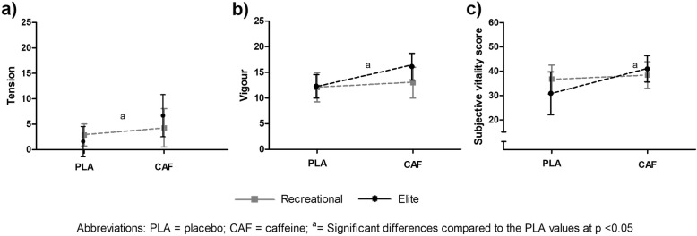

**Ribeiro AS, Nunes JP, Schoenfeld BJ, Aguiar AF, Cyrino ES. 2019. *Effects of Different Dietary Energy Intake Following Resistance Training on Muscle Mass and Body Fat in Bodybuilders: A Pilot Study***  
[PMC6942464](https://pmc.ncbi.nlm.nih.gov/articles/PMC6942464/) · CC BY-NC-ND · **stored**

- 📊 **Figure 1** — Percentage changes from pre- to post-training according to groups. G1 = higher energy intake. G2 = moderate energy intake. * p < 0.05 pre- vs post-training. # p < 0.05 G1 vs. G2. Data are presented as mean and standard deviation.
  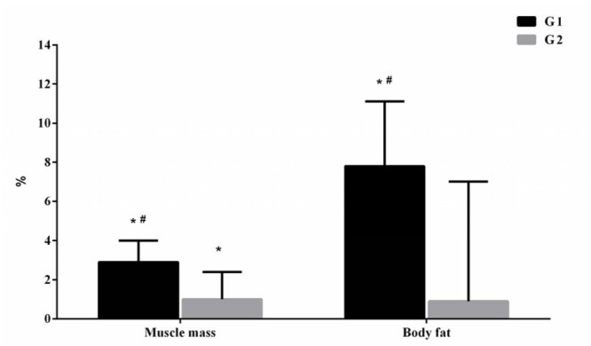
- 📊 **Figure 2** — Individual percentage changes from pre- to post-training on muscle mass (Panel A) and body fat (Panel B) according to the group. G1 = higher energy intake. G2 = moderate energy intake.
  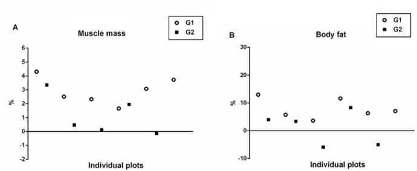

**Yasuda J, Tomita T, Arimitsu T, Fujita S. 2020. *Evenly Distributed Protein Intake over 3 Meals Augments Resistance Exercise-Induced Muscle Hypertrophy in Healthy Young Men***  
[PMC7330467](https://pmc.ncbi.nlm.nih.gov/articles/PMC7330467/) · CC BY · **stored**

- 🗺 **FIGURE 1** — Flow diagram of the 12-wk clinical trial in healthy young men with high or low relative protein intakes at breakfast. The HBR (“high breakfast”) group consumed a protein-enriched meal at breakfast to achieve a protein intake >0.24 g/kg body weight, reported as the required protein intake at all 3…
  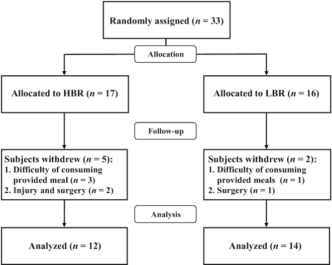
- 📊 **FIGURE 2** — Comparison of percentage change in muscle strength from baseline to week 12 (WK12) in healthy young men with high (HBR) or low (LBR) relative protein intakes at breakfast. Values are indicated as means ± SEs, n = 12 (HBR) and n = 14 (LBR). Statistical analysis was performed with an independent t…
  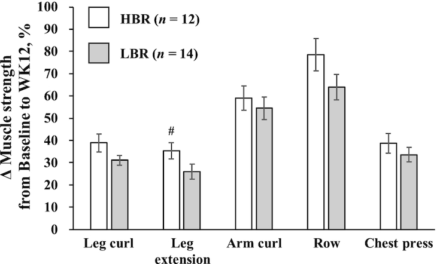
- 📊 **FIGURE 3** — Comparison of absolute change (A) and percentage change (B) in AppLTM and TotalLTM from baseline to week 12 in healthy young men with high or low relative protein intakes at breakfast. Values are indicated as means ± SEs, n = 12 (HBR) and n = 14 (LBR). Statistical analysis was performed with an…
  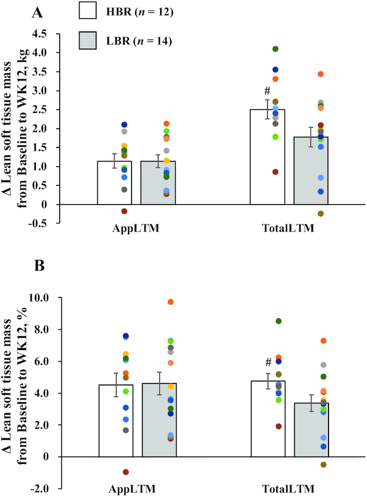

---

## [Five Popular Supplements That Don't Work for Muscle Growth](worst-supplements-everyone-takes-muscle-growth.md)

**Hobson RM, Saunders B, Ball G, Harris RC, Sale C. 2012. *Effects of β-alanine supplementation on exercise performance: a meta-analysis***  
[PMC3374095](https://pmc.ncbi.nlm.nih.gov/articles/PMC3374095/) · CC BY-NC · **stored**

- 📊 **Fig. 1** — The effect size of Pla and BA groups when subdivided by type of exercise test or measure. Light grey represents Pla groups and dark grey represents BA groups. * denotes significantly greater than Pla (P = 0.013)
  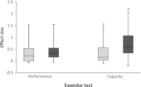
- 📊 **Fig. 2** — The effect size of Pla and BA groups when subdivided by exercise duration. Light grey represents Pla groups and dark grey represents BA groups. * denotes significantly greater than Pla (P = 0.046), *** denotes significantly greater than Pla (P = 0.001)
  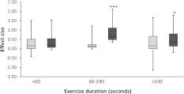
- 📊 **Fig. 3** — The difference in the median effect size of the BA and Pla groups of each study in relation to the total dose of β-alanine supplemented
  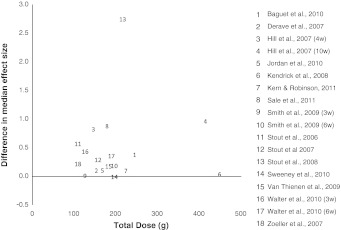

**Ambiye VR, Langade D, Dongre S, Aptikar P, Kulkarni M, Dongre A. 2013. *Clinical Evaluation of the Spermatogenic Activity of the Root Extract of Ashwagandha (Withania somnifera) in Oligospermic Males: A Pilot Study***  
[PMC3863556](https://pmc.ncbi.nlm.nih.gov/articles/PMC3863556/) · CC BY · **stored**

- 📊 **Figure 1** — Serum testosterone levels (ng/mL) in the full-spectrum Ashwagandha root extract-treated and placebo-treated study groups including oligospermic males. **P < 0.0001 as compared to baseline values on Day 0 of the study duration of 12 weeks. Values are expressed as mean ± SD.
  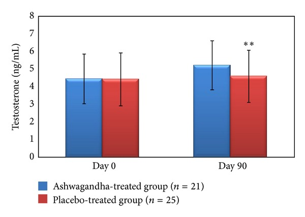
- 📊 **Figure 2** — Serum LH (mL IU/mL) in the full-spectrum Ashwagandha root extract-treated and placebo-treated study groups including oligospermic males. *P < 0.001 as compared to baseline values on Day 0 of the study duration (12 weeks). Values are expressed as mean ± SD.
  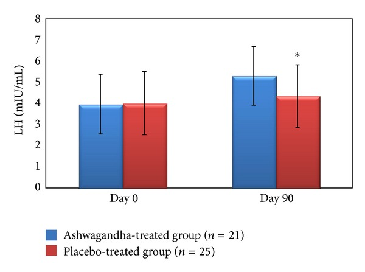
- 🖼 **Figure 3** — (a) Global Assessment Scale for Tolerability (GATE) by patients. (b) Global Assessment Scale for Tolerability (GATE) by physicians.
  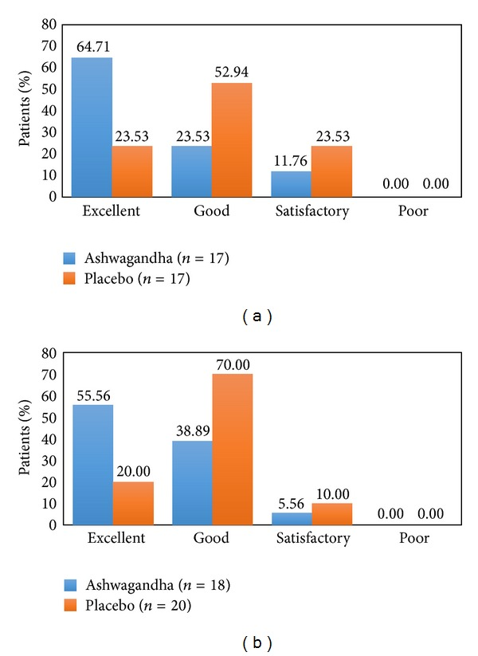

**Wankhede S, Langade D, Joshi K, Sinha SR, Bhattacharyya S. 2015. *Examining the effect of Withania somnifera supplementation on muscle strength and recovery: a randomized controlled trial***  
[PMC4658772](https://pmc.ncbi.nlm.nih.gov/articles/PMC4658772/) · CC BY · **stored**

- 🗺 **Fig. 1** — CONSORT schematic diagram
  
- 🖼 **Fig. 2** — The effect of Ashwagandha treatment in muscle strength [a bench press 1 RM, b leg extension 1RM] and muscle size in c thigh, d arm and e Chest
  
- 🖼 **Fig. 3** — The effect of Ashwagandha treatment in a serum testosterone and b serum creatine kinase level
  

**Balasubramanian A, Thirumavalavan N, Srivatsav A, Yu J, Lipshultz LI, 2019. *Testosterone Imposters: An Analysis of Popular Online Testosterone Boosting Supplements***  
[PMC6407704](https://pmc.ncbi.nlm.nih.gov/articles/PMC6407704/) · NIH manuscript — text mining/fair use only · link only

- 🖼 **Figure 1:** — Overview of Investigative Method Employed In this Study ([view](https://pmc.ncbi.nlm.nih.gov/articles/PMC6407704/figure/F1/))
- 🖼 **Figure 2:** — Breakdown of Qualitative Analysis of Amazon Reviews Using Androgen Deficiency in the Aging Male (ADAM) Questionnaire ([view](https://pmc.ncbi.nlm.nih.gov/articles/PMC6407704/figure/F2/))
- 📊 **Figure 3:** — Comparison of Androgen Deficiency in Aging Male (ADAM) Comments Between Pre and Post ReviewMeta Filter Analysis ([view](https://pmc.ncbi.nlm.nih.gov/articles/PMC6407704/figure/F3/))

**Lopresti AL, Smith SJ, Malvi H, Kodgule R. 2019. *An investigation into the stress-relieving and pharmacological actions of an ashwagandha (Withania somnifera) extract: A randomized, double-blind, placebo-controlled study***  
[PMC6750292](https://pmc.ncbi.nlm.nih.gov/articles/PMC6750292/) · CC BY · **stored**

- 🗺 **Figure 1** — Systematic illustration of study design.
  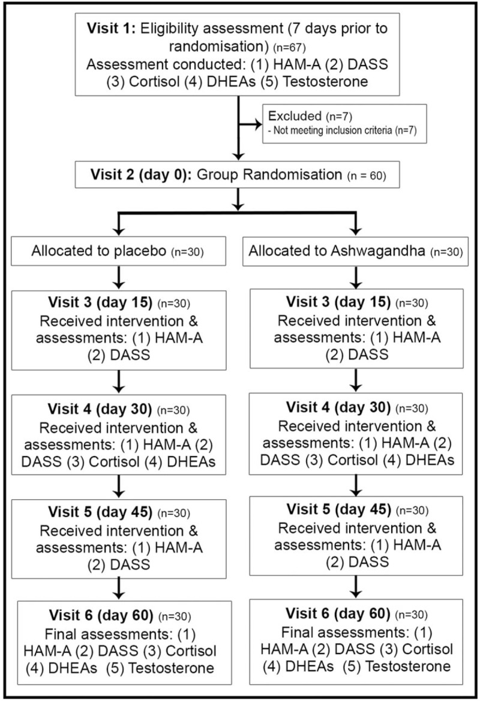
- 📊 **Figure 2** — Mean change in mood scores over time (vertical bars depict standard error bars).
  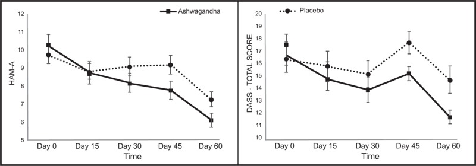
- 📊 **Figure 3** — Mean change in hormones (vertical bars depict standard error bars).
  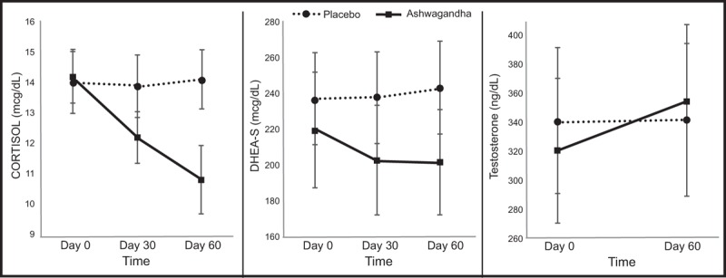

---
